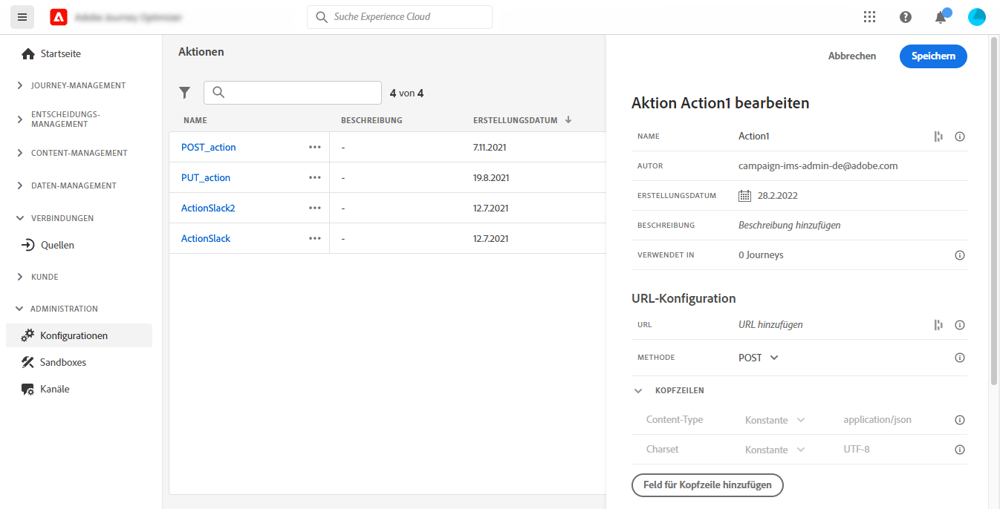
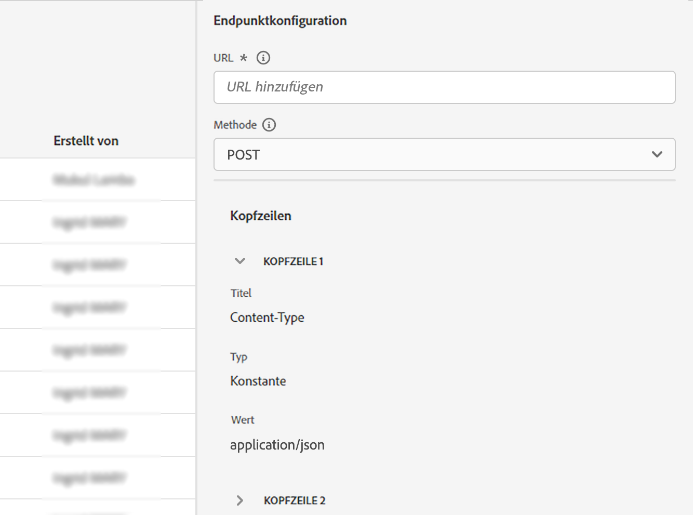
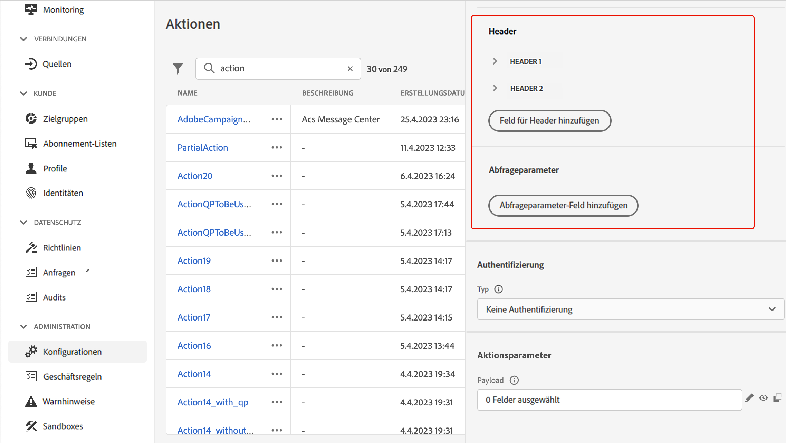
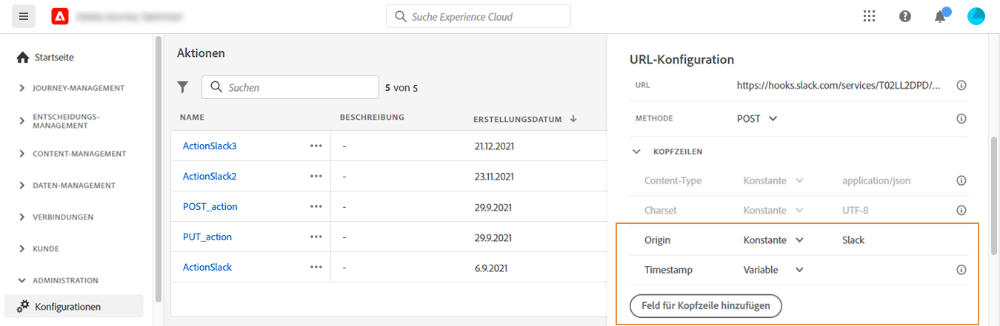
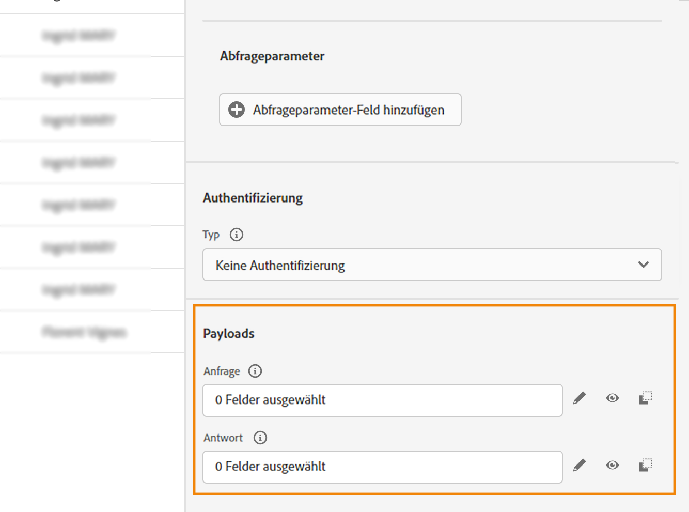
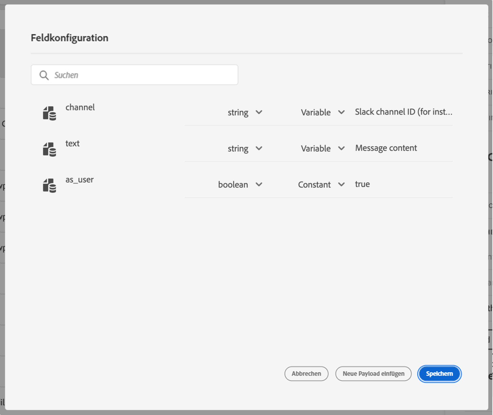

# Konfigurieren einer benutzerdefinierten Aktion {#configure-an-action}

>[!CONTEXTUALHELP]
>id="ajo_journey_action_custom_configuration"
>title="Benutzerdefinierte Aktionen"
>abstract="Wenn Sie ein Drittanbietersystem zum Nachrichtenversand verwenden oder wenn Sie möchten, dass von Journeys API-Aufrufe an ein Drittanbietersystem gesendet werden, verwenden Sie benutzerdefinierte Aktionen, um die Verbindung zwischen dem System und Ihrer Journey zu konfigurieren. Sie können mit benutzerdefinierten Aktionen beispielsweise eine Verbindung zu den folgenden Systemen herstellen: Epsilon, Slack, [Adobe Developer](https://developer.adobe.com), Firebase usw."

Wenn Sie ein Drittanbietersystem zum Nachrichtenversand verwenden oder wenn Sie möchten, dass von Journeys API-Aufrufe an ein Drittanbietersystem gesendet werden, verwenden Sie benutzerdefinierte Aktionen, um die Verbindung zwischen dem System und Ihrer Journey zu konfigurieren. Sie können mit benutzerdefinierten Aktionen beispielsweise eine Verbindung mit den folgenden Systemen herstellen: Epsilon, Slack, [Adobe Developer](https://developer.adobe.com/){target="_blank"}, Firebase usw.

Benutzerdefinierte Aktionen sind zusätzliche Aktionen, die von technischen Benutzern definiert und Marketing-Experten zur Verfügung gestellt werden. Nach der Konfiguration erscheinen sie in der linken Palette Ihrer Journey in der Kategorie **[!UICONTROL Aktion]**. Weiterführende Informationen finden Sie auf [dieser Seite](../building-journeys/about-journey-activities.md#action-activities).

## Einschränkungen{#custom-actions-limitations}

Für benutzerdefinierte Aktionen gibt es einige Einschränkungen, die auf [dieser Seite](../start/guardrails.md) aufgeführt sind.

In den Parametern für benutzerdefinierte Aktionen können Sie sowohl eine einfache Sammlung als auch eine Sammlung von Objekten übergeben. Weitere Informationen zu den Einschränkungen von Sammlungen finden Sie auf [dieser Seite](../building-journeys/collections.md#limitations).

Beachten Sie auch, dass bei den Parametern für benutzerdefinierte Aktionen ein bestimmtes Format erwartet wird (Beispiel: Zeichenfolge, Dezimalwert usw.). Sie müssen darauf achten, dass diese erwarteten Formate eingehalten werden. Weitere Informationen finden Sie in diesem [Anwendungsfall](../building-journeys/collections.md).

## Best Practices{#custom-action-enhancements-best-practices}

Stellen Sie bei der Auswahl eines mit einer benutzerdefinierten Aktion anzusprechenden Endpunkts sicher, dass:

* Dieser Endpunkt den Journey-Durchsatz unterstützen kann, indem er ihn mit Konfigurationen aus der [Drosselungs-API](../configuration/throttling.md) oder [Begrenzungs-API](../configuration/capping.md) begrenzt. Vorsicht: Eine Drosselungskonfiguration darf nicht unter 200 TPS liegen. Jeder angesprochene Endpunkt muss mindestens 200 TPS unterstützen.
* Dieser Endpunkt muss eine so niedrige Antwortzeit wie möglich haben. Abhängig von Ihrem erwarteten Durchsatz kann sich eine hohe Reaktionszeit auf den tatsächlichen Durchsatz auswirken.

Für alle benutzerdefinierten Aktionen ist ein Begrenzung von 300.000 Aufrufen über eine Minute festgelegt. Darüber hinaus wird die Standardbegrenzung pro Host und Sandbox angewendet. Wenn Sie beispielsweise in einer Sandbox zwei Endpunkte mit demselben Host haben (z. B. `https://www.adobe.com/endpoint1` und `https://www.adobe.com/endpoint2`), gilt die Begrenzung für alle Endpunkte unter dem Host adobe.com. „Endpunkt1“ und „Endpunkt2“ verwenden dieselbe Begrenzungskonfiguration. Wenn ein Endpunkt diesen Wert erreicht, wirkt sich dies auch auf den anderen Endpunkt aus.

Diese Beschränkung wurde auf der Grundlage der Kundennutzung festgelegt, um externe Endpunkte zu schützen, die von benutzerdefinierten Aktionen angesprochen werden. Sie müssen dies in Ihren zielgruppenbasierten Journeys berücksichtigen, indem Sie eine geeignete Leserate definieren (5000 Profile pro Sekunde, wenn benutzerdefinierte Aktionen verwendet werden). Bei Bedarf können Sie diese Einstellung überschreiben, indem Sie über unsere Begrenzungs- oder Drosselungs-API eine höhere Begrenzung oder Einschränkung definieren. Weitere Informationen finden Sie auf [dieser Seite](../configuration/external-systems.md).

Sie sollten öffentliche Endpunkte aus verschiedenen Gründen nicht mit benutzerdefinierten Aktionen ansprechen:

* Ohne ordnungsgemäße Begrenzung oder Einschränkung besteht das Risiko, zu viele Aufrufe an einen öffentlichen Endpunkt zu senden, der ein solches Volumen möglicherweise nicht unterstützt.
* Profildaten können über benutzerdefinierte Aktionen gesendet werden, sodass das Ansprechen eines öffentlichen Endpunkts dazu führen kann, dass personenbezogene Daten versehentlich extern freigegeben werden.
* Sie haben keine Kontrolle über die Daten, die von öffentlichen Endpunkten zurückgegeben werden. Wenn ein Endpunkt seine API ändert oder damit beginnt, falsche Informationen zu senden, werden diese in gesendeten Nachrichten zur Verfügung gestellt, was negative Auswirkungen haben könnte.

## Einverständnis und Data Governance {#privacy}

In Journey Optimizer können Sie Data Governance- und Einverständnisrichtlinien auf Ihre benutzerdefinierten Aktionen anwenden. Damit verhindern Sie, dass bestimmte Felder in Drittanbietersysteme exportiert werden, und können Kunden ausschließen, die dem Empfang von E-Mails, Push- oder SMS-Nachrichten nicht zugestimmt haben. Weitere Informationen finden Sie auf den folgenden Seiten:

* [Data Governance](../action/action-privacy.md).
* [Einverständnis](../action/action-privacy.md).

## Konfigurationsschritte {#configuration-steps}

Im Folgenden werden die wichtigsten Schritte beschrieben, die zum Konfigurieren einer benutzerdefinierten Aktion ausgeführt werden müssen:

1. Wählen Sie im Menü ADMINISTRATION die Option **[!UICONTROL Konfigurationen]**. Klicken Sie im Abschnitt **[!UICONTROL Aktionen]** auf **[!UICONTROL Verwalten]**. Klicken Sie auf **[!UICONTROL Aktion erstellen]**, um eine neue Aktion zu erstellen. Der Bereich für die Konfiguration der Aktion wird auf der rechten Seite des Bildschirms geöffnet.

   

1. Geben Sie einen Namen für die Aktion ein.

   >[!NOTE]
   >
   >Verwenden Sie keine Leerzeichen oder Sonderzeichen. Verwenden Sie nicht mehr als 30 Zeichen.

1. Fügen Sie Ihrer Aktion eine Beschreibung hinzu. Dieser Schritt ist optional.
1. Die Zahl der Journeys, die diese Aktion verwenden, wird im Feld **[!UICONTROL Verwendet in]** angezeigt. Sie können auf die Schaltfläche **[!UICONTROL Customer Journeys anzeigen]** klicken, um die Liste der Journeys anzuzeigen.
1. Definieren Sie die verschiedenen Parameter der **[!UICONTROL URL-Konfiguration]**. Weitere Informationen finden Sie auf [dieser Seite](../action/about-custom-action-configuration.md#url-configuration).
1. Konfigurieren Sie den Bereich **[!UICONTROL Authentifizierung]**. Diese Konfiguration ist mit der für Datenquellen identisch.  Weiterführende Informationen finden Sie in diesem [Abschnitt](../datasource/external-data-sources.md#custom-authentication-mode).
1. Definieren Sie die **[!UICONTROL Aktionsparameter]**. Weitere Informationen finden Sie auf [dieser Seite](../action/about-custom-action-configuration.md#define-the-message-parameters).
1. Klicken Sie auf **[!UICONTROL Speichern]**.

   Die benutzerdefinierte Aktion ist nun konfiguriert und kann in Ihren Journeys verwendet werden. Weitere Informationen finden Sie auf [dieser Seite](../building-journeys/about-journey-activities.md#action-activities).

   >[!NOTE]
   >
   >Wird eine benutzerdefinierte Aktion in einer Journey verwendet, sind die meisten Parameter schreibgeschützt. Sie können nur die Felder **[!UICONTROL Name]**, **[!UICONTROL Beschreibung]**, **[!UICONTROL URL]** und den Abschnitt **[!UICONTROL Authentifizierung]** ändern.

## Endpunktkonfiguration {#url-configuration}

Beim Konfigurieren einer benutzerdefinierten Aktion müssen Sie die folgenden **[!UICONTROL Endpunkt-Konfigurationsparameter]** definieren:

{width="70%" align="left"}

1. Geben Sie im Feld **[!UICONTROL URL]** die URL des externen Services an:

   * Wenn die URL statisch ist, geben Sie die URL in dieses Feld ein.

   * Wenn die URL einen dynamischen Pfad enthält, geben Sie nur den statischen Teil der URL ein, d. h. das Schema, den Host, den Port und optional einen statischen Teil des Pfads.

     Beispiel: `https://xxx.yyy.com/somethingstatic/`

     Sie geben den dynamischen Pfad der URL später an, wenn Sie die benutzerdefinierte Aktion zu einer Journey hinzufügen. [Weitere Informationen](../building-journeys/using-custom-actions.md).

   >[!NOTE]
   >
   >Aus Sicherheitsgründen empfehlen wir dringend, das HTTPS-Schema für die URL zu verwenden. Die Verwendung nicht öffentlicher Adobe-Adressen und die Verwendung von IP-Adressen sind nicht zulässig.
   >
   >Bei der Definition einer benutzerdefinierten Aktion sind nur die Standard-Ports zulässig: 80 für http und 443 für https.

1. Wählen Sie die **[!UICONTROL Aufrufmethode]** aus: Es kann entweder **[!UICONTROL POST]**, **[!UICONTROL GET]** oder **[!UICONTROL PUT]** sein.

   >[!NOTE]
   >
   > Die Methode **DELETE** wird nicht unterstützt. Wenn Sie eine vorhandene Ressource aktualisieren müssen, wählen Sie die Methode **PUT**.

1. Definieren Sie die Header und Abfrageparameter:

   * Klicken Sie im Abschnitt **[!UICONTROL Header]** auf **[!UICONTROL Header-Feld hinzufügen]**, um die HTTP-Header-Zeilen der Anfragenachricht zu definieren, die an den externen Service gesendet werden soll. Die Header-Felder **[!UICONTROL Content-Typ]** und **[!UICONTROL Charset]** werden standardmäßig festgelegt. Sie können diese Felder nicht ändern oder löschen.

   * Klicken Sie im Abschnitt **[!UICONTROL Abfrageparameter]** auf **[!UICONTROL Feld für Abfrageparameter hinzufügen]**, um die Parameter zu definieren, die Sie der URL hinzufügen möchten.

   

1. Geben Sie die Bezeichnung oder den Namen des Felds ein.

1. Wählen Sie einen Typ aus: **[!UICONTROL konstant]** oder **[!UICONTROL variabel]**. Wenn Sie **[!UICONTROL konstant]** gewählt haben, geben Sie den konstanten Wert ins **[!UICONTROL Wert]**-Feld ein. Wenn Sie **[!UICONTROL Variabel]** ausgewählt haben, geben Sie diese Variable an, wenn Sie die benutzerdefinierte Aktion zu einer Journey hinzufügen. [Weitere Informationen](../building-journeys/using-custom-actions.md).

   

   >[!NOTE]
   >
   >Nachdem Sie die benutzerdefinierte Aktion zu einer Journey hinzugefügt haben, können Sie ihr weiterhin Felder für Header- oder Abfrageparameter hinzufügen, wenn sich die Journey im Entwurfsstatus befindet. Wenn Sie nicht möchten, dass sich Konfigurationsänderungen auf die Journey auswirken, duplizieren Sie die benutzerdefinierte Aktion und fügen Sie die Felder zur neuen benutzerdefinierten Aktion hinzu.
   >
   >Header werden gemäß den folgenden Parsing-Regeln validiert. Weitere Informationen finden Sie in [dieser Dokumentation](https://tools.ietf.org/html/rfc7230#section-3.2.4){_blank}.

## Definieren der Payload-Parameter {#define-the-message-parameters}

1. Fügen Sie im Abschnitt **[!UICONTROL Anfrage]** ein Beispiel der JSON-Payload ein, die an den externen Service gesendet werden soll. Dieses Feld ist optional und nur für die Aufrufmethoden „POST“ und „PUT“ verfügbar.

1. Fügen Sie im Abschnitt **[!UICONTROL Reaktion]** ein Beispiel der vom Aufruf zurückgegebenen Payload ein. Dieses Feld ist optional und ist für alle Aufrufmethoden verfügbar. Ausführliche Informationen zur Verwendung von API-Aufrufantworten in benutzerdefinierten Aktionen finden Sie auf [dieser Seite](../action/action-response.md).

>[!NOTE]
>
>Die Antwortfunktion ist derzeit in der Beta-Version verfügbar.

{width="70%" align="left"}

>[!NOTE]
>
>Das Payload-Beispiel darf keine Nullwerte enthalten. Feldnamen in der Payload dürfen das Zeichen „.“ nicht enthalten. Sie können nicht mit dem Zeichen „$“ beginnen.

Sie können den Parametertyp definieren (z. B.: Zeichenfolge, Ganzzahl usw.).

Sie können außerdem angeben, ob ein Parameter eine Konstante oder eine Variable ist:

* **Konstante** bedeutet, dass der Wert des Parameters im Bereich für die Konfiguration der Aktion von einem technischen Anwender definiert wird. Der Wert bleibt über all Journeys hinweg immer gleich. Er ändert sich nicht und wird den Marketing-Fachleuten nicht angezeigt, wenn die benutzerdefinierte Aktion während der Journey verwendet wird. Er könnte beispielsweise eine ID sein, die das Drittanbietersystem erwartet. In diesem Fall ist das Feld rechts neben dem Umschalter zwischen Konstante und Variable der übergebene Wert.
* **Variable** bedeutet, dass der Wert des Parameters variiert. Marketing-Experten, die diese benutzerdefinierte Aktion in einer Journey verwenden, können den von ihnen gewünschten Wert weitergeben oder angeben, wo der Wert für diesen Parameter abgerufen werden soll (z. B. vom Ereignis oder von Adobe Experience Platform). In diesem Fall ist das Feld rechts neben dem Umschalter zwischen Konstante und Variable der Titel, den der Marketing-Experte in der Journey sieht, um diesen Parameter zu benennen.

