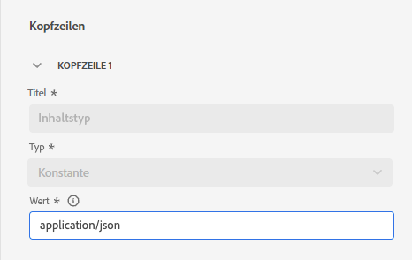
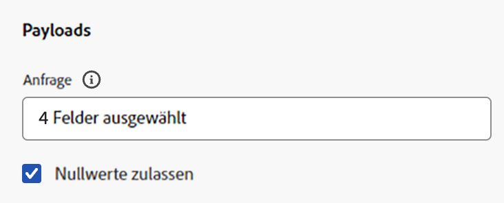

# Konfigurieren einer benutzerdefinierten Aktion {#configure-a-custom-action}

>[!CONTEXTUALHELP]
>id="ajo_journey_action_custom_configuration"
>title="Benutzerdefinierte Aktionen"
>abstract="Wenn Sie ein Drittanbietersystem zum Nachrichtenversand verwenden oder wenn Sie möchten, dass von Journeys API-Aufrufe an ein Drittanbietersystem gesendet werden, verwenden Sie benutzerdefinierte Aktionen, um die Verbindung zwischen dem System und Ihrer Journey zu konfigurieren. "

Wenn Sie ein Drittanbietersystem zum Nachrichtenversand verwenden oder wenn Sie möchten, dass von Journeys API-Aufrufe an ein Drittanbietersystem gesendet werden, verwenden Sie benutzerdefinierte Aktionen, um die Verbindung zwischen dem System und Ihrer Journey zu konfigurieren. Sie können mit benutzerdefinierten Aktionen beispielsweise eine Verbindung zu den folgenden Systemen herstellen: Epsilon, Slack, [Adobe Developer](https://developer.adobe.com){target="_blank"}, Firebase usw.

Benutzerdefinierte Aktionen sind zusätzliche Aktionen, die von technischen Benutzern definiert und Marketing-Experten zur Verfügung gestellt werden. Nach der Konfiguration erscheinen sie in der linken Palette Ihrer Journey in der Kategorie **[!UICONTROL Aktion]**. Weitere Informationen finden Sie auf [dieser Seite](../building-journeys/about-journey-activities.md#action-activities).

## Konfigurationsschritte {#configuration-steps}

Im Folgenden werden die wichtigsten Schritte beschrieben, die zum Konfigurieren einer benutzerdefinierten Aktion ausgeführt werden müssen:

1. Wählen Sie im Menü ADMINISTRATION die Option **[!UICONTROL Konfigurationen]**. Klicken Sie im Abschnitt **[!UICONTROL Aktionen]** auf **[!UICONTROL Verwalten]**. Klicken Sie auf **[!UICONTROL Aktion erstellen]**, um eine neue Aktion zu erstellen. Der Bereich für die Aktionskonfiguration wird auf der rechten Seite des Bildschirms geöffnet.

   

1. Geben Sie einen Namen für Ihre Aktion ein.

   >[!NOTE]
   >
   >Es sind nur alphanumerische Zeichen und Unterstriche zulässig. Die maximale Länge beträgt 30 Zeichen.

1. Fügen Sie Ihrer Aktion eine Beschreibung hinzu. Dieser Schritt ist optional.
1. Die Anzahl der Journeys, die diese Aktion verwenden, wird im Feld **[!UICONTROL Verwendet in]** angezeigt. Sie können auf **[!UICONTROL Customer Journeys anzeigen]** klicken, um die Liste der Journeys, die diese Aktion verwenden, anzuzeigen.
1. Definieren Sie die verschiedenen **[!UICONTROL URL-Konfigurations]**-Parameter. Weitere Informationen finden Sie auf [dieser Seite](../action/about-custom-action-configuration.md#url-configuration).
1. Konfigurieren Sie den Abschnitt **[!UICONTROL Authentifizierung]**. Diese Konfiguration entspricht der für Datenquellen. Weiterführende Informationen finden Sie in diesem [Abschnitt](../datasource/external-data-sources.md#custom-authentication-mode).
1. Definieren Sie die **[!UICONTROL Aktionsparameter]**. Weitere Informationen finden Sie auf [dieser Seite](../action/about-custom-action-configuration.md#define-the-message-parameters).
1. Klicken Sie auf **[!UICONTROL Speichern]**.

   Die Aktion ist jetzt konfiguriert und kann in Ihren Journeys verwendet werden. Weitere Informationen finden Sie auf [dieser Seite](../building-journeys/about-journey-activities.md#action-activities).

   >[!NOTE]
   >
   >Wenn eine benutzerdefinierte Aktion in einer Journey verwendet wird, sind die meisten Parameter schreibgeschützt. Sie können nur die Felder **[!UICONTROL Name]**, **[!UICONTROL Beschreibung]**, **[!UICONTROL URL]** und den Abschnitt **[!UICONTROL Authentifizierung]** ändern.

## Einschränkungen{#custom-actions-limitations}

Für benutzerdefinierte Aktionen gibt es einige Einschränkungen, die auf [dieser Seite](../start/guardrails.md) aufgeführt sind.

In den Parametern für benutzerdefinierte Aktionen können Sie sowohl eine einfache Sammlung als auch eine Sammlung von Objekten übergeben. Weitere Informationen zu den Einschränkungen von Sammlungen finden Sie auf [dieser Seite](../building-journeys/collections.md#limitations).

Beachten Sie auch, dass bei den Parametern für benutzerdefinierte Aktionen ein bestimmtes Format erwartet wird (Beispiel: Zeichenfolge, Dezimalwert usw.). Sie müssen darauf achten, dass diese erwarteten Formate eingehalten werden. Weitere Informationen finden Sie in diesem [Anwendungsfall](../building-journeys/collections.md).

Benutzerdefinierte Aktionen unterstützen das JSON-Format nur bei Verwendung von [Anfrage](../action/about-custom-action-configuration.md#define-the-message-parameters)- oder [Antwort-Payloads](../action/action-response.md).

>[!NOTE]
>
>Wenn ein Endpunkt eine Antwortzeit von mehr als 0,75 Sekunden hat, werden seine benutzerdefinierten Aktionsaufrufe über einen dedizierten, langsamen [Service für benutzerdefinierte Aktionen](../configuration/external-systems.md#response-time) anstelle des Standard-Service weitergeleitet.

## Best Practices{#custom-action-enhancements-best-practices}

Stellen Sie bei der Auswahl eines mit einer benutzerdefinierten Aktion anzusprechenden Endpunkts sicher, dass:

* Dieser Endpunkt den Journey-Durchsatz unterstützen kann, indem er ihn mit Konfigurationen aus der [Drosselungs-API](../configuration/throttling.md) oder [Begrenzungs-API](../configuration/capping.md) begrenzt. Vorsicht: Eine Drosselungskonfiguration darf nicht unter 200 TPS liegen. Jeder Zielendpunkt muss mindestens 200 TPS unterstützen. Weitere Informationen zu Journey-Verarbeitungsraten finden Sie in [diesem Abschnitt](../building-journeys/entry-management.md#journey-processing-rate).
* Dieser Endpunkt muss eine so niedrige Antwortzeit wie möglich haben. Abhängig von Ihrem erwarteten Durchsatz kann sich eine hohe Reaktionszeit auf den tatsächlichen Durchsatz auswirken.

Für alle benutzerdefinierten Aktionen ist ein Begrenzung von 300.000 Aufrufen über eine Minute festgelegt. Darüber hinaus wird die Standardbegrenzung pro Host und Sandbox angewendet. Wenn Sie beispielsweise in einer Sandbox zwei Endpunkte mit demselben Host haben (z. B. `https://www.adobe.com/endpoint1` und `https://www.adobe.com/endpoint2`), gilt die Begrenzung für alle Endpunkte unter dem Host „adobe.com“. „Endpunkt1“ und „Endpunkt2“ verwenden dieselbe Begrenzungskonfiguration. Wenn ein Endpunkt diesen Wert erreicht, wirkt sich dies auch auf den anderen Endpunkt aus.

>[!NOTE]
>
>Die Begrenzung auf 300.000 Aufrufe pro Minute wird als **gleitendes Fenster)** Sandbox und pro Endpunkt für Endpunkte mit Antwortzeiten von weniger als 0,75 Sekunden erzwungen. Das Schiebefenster kann bei jeder Millisekunde beginnen, was bedeutet, dass Begrenzungsfehler auch dann auftreten können, wenn die Rate unter 300k/min erscheint, wenn sie auf Uhrminuten ausgerichtet ist. Für Endpunkte mit Antwortzeiten von mehr als 0,75 Sekunden gilt eine separate Begrenzung von 150.000 Aufrufen pro 30 Sekunden (ebenfalls ein gleitendes Fenster). Weitere Informationen zu langsamen Endpunkten finden [&#x200B; auf dieser Seite](../configuration/external-systems.md#response-time).

Das standardmäßige Limit von 300.000 Aufrufen pro Minute gilt auf Domain-Ebene (d. h. example.com). Wenn Sie eine höhere Begrenzung benötigen, wenden Sie sich mit Nutzungsnachweisen an den Adobe-Support und bestätigen Sie den Durchsatz Ihres Endpunkts. Um eine Erhöhung der Begrenzung anzufordern, geben Sie Details zum erwarteten Aufrufvolumen und zur Endpunktkapazität an. Adobe kann die Begrenzung anpassen, wenn die Kapazitätstests zeigen, dass der Endpunkt einen höheren Durchsatz verarbeiten kann. Für Best Practices sollten Sie Journey umstrukturieren oder Warteaktivitäten implementieren, um ausgehende Aufrufe zu staffeln und Begrenzungsfehler zu vermeiden.

Dieses Limit wurde auf Grundlage der Kundennutzung festgelegt, um externe Endpunkte zu schützen, die Ziele von benutzerdefinierten Aktionen sind. Bei Bedarf können Sie diese Einstellung überschreiben, indem Sie über unsere Begrenzungs- oder Drosselungs-API eine höhere Begrenzung oder Einschränkung definieren. Weitere Informationen finden Sie auf [dieser Seite](../configuration/external-systems.md).

Sie sollten öffentliche Endpunkte aus verschiedenen Gründen nicht mit benutzerdefinierten Aktionen ansprechen:

* Ohne ordnungsgemäße Begrenzung oder Einschränkung besteht das Risiko, zu viele Aufrufe an einen öffentlichen Endpunkt zu senden, der ein solches Volumen möglicherweise nicht unterstützt.
* Profildaten können über benutzerdefinierte Aktionen gesendet werden, sodass das Ansprechen eines öffentlichen Endpunkts dazu führen kann, dass personenbezogene Daten versehentlich extern freigegeben werden.
* Sie haben keine Kontrolle über die Daten, die von öffentlichen Endpunkten zurückgegeben werden. Wenn ein Endpunkt seine API ändert oder damit beginnt, falsche Informationen zu senden, werden diese in gesendeten Nachrichten zur Verfügung gestellt, was negative Auswirkungen haben könnte.

## Einverständnis und Data Governance {#privacy}

In Journey Optimizer können Sie Data Governance- und Einverständnisrichtlinien auf Ihre benutzerdefinierten Aktionen anwenden. Damit verhindern Sie, dass bestimmte Felder in Drittanbietersysteme exportiert werden, und können Kunden ausschließen, die dem Empfang von E-Mails, Push- oder SMS-Nachrichten nicht zugestimmt haben. Weitere Informationen finden Sie auf den folgenden Seiten:

* [Data Governance](../action/action-privacy.md).
* [Einverständnis](../action/action-privacy.md).

## Endpunktkonfiguration {#url-configuration}

Beim Konfigurieren einer benutzerdefinierten Aktion müssen Sie die folgenden **[!UICONTROL Endpunkt-Konfigurationsparameter]** definieren:

{width="70%" align="left"}

1. Geben Sie im Feld **[!UICONTROL URL]** die URL des externen Services an:

   * Wenn die URL statisch ist, geben Sie die URL in dieses Feld ein.

   * Wenn die URL einen dynamischen Pfad enthält, geben Sie nur den statischen Teil der URL ein, d. h. das Schema, den Host, den Port und optional einen statischen Teil des Pfads.

     Beispiel: `https://xxx.yyy.com/somethingstatic/`

     Sie geben den dynamischen Pfad der URL später an, wenn Sie die benutzerdefinierte Aktion zu einer Journey hinzufügen. [Weitere Informationen](../building-journeys/using-custom-actions.md).

   >[!NOTE]
   >
   >Aus Sicherheitsgründen empfehlen wir dringend, das HTTPS-Schema für die URL zu verwenden. Die Verwendung nicht öffentlicher Adobe-Adressen und die Verwendung von IP-Adressen sind nicht zulässig.
   >
   >Bei der Definition einer benutzerdefinierten Aktion sind nur die Standard-Ports zulässig: 80 für http und 443 für https.

1. Wählen Sie die **[!UICONTROL Aufrufmethode]** aus: Es kann entweder **[!UICONTROL POST]**, **[!UICONTROL GET]** oder **[!UICONTROL PUT]** sein.

   >[!NOTE]
   >
   > Die Methode **DELETE** wird nicht unterstützt. Wenn Sie eine vorhandene Ressource aktualisieren müssen, wählen Sie die Methode **PUT**.

1. Verarbeiten Sie potenzielle Weiterleitungen (302 Antworten). **Benutzerdefinierte Aktionen** folgen automatisch HTTP 302-Weiterleitungen auf Basis einzelner Anfragen.

1. Definieren Sie die Header und Abfrageparameter:

   * Klicken Sie im Abschnitt **[!UICONTROL Header]** auf **[!UICONTROL Header-Feld hinzufügen]**, um die HTTP-Header-Zeilen der Anfragenachricht zu definieren, die an den externen Service gesendet werden soll. Die Header-Felder **[!UICONTROL Content-Typ]** und **[!UICONTROL Charset]** werden standardmäßig festgelegt. Sie können diese Felder nicht löschen. Es kann nur der **[!UICONTROL Content-Typ]**-Header geändert werden. Sein Wert sollte dem JSON-Format entsprechen. Dies ist der Standardwert:

   

   * Klicken Sie im Abschnitt **[!UICONTROL Abfrageparameter]** auf **[!UICONTROL Feld für Abfrageparameter hinzufügen]**, um die Parameter zu definieren, die Sie der URL hinzufügen möchten.

   

1. Geben Sie das Label oder den Namen des Felds ein.

1. Wählen Sie einen Typ aus: **[!UICONTROL konstant]** oder **[!UICONTROL variabel]**. Wenn Sie **[!UICONTROL konstant]** gewählt haben, geben Sie den konstanten Wert ins **[!UICONTROL Wert]**-Feld ein. Wenn Sie **[!UICONTROL Variabel]** ausgewählt haben, geben Sie diese Variable an, wenn Sie die benutzerdefinierte Aktion zu einer Journey hinzufügen. [Weitere Informationen](../building-journeys/using-custom-actions.md).

   

   >[!NOTE]
   >
   >Nachdem Sie die benutzerdefinierte Aktion zu einer Journey hinzugefügt haben, können Sie ihr weiterhin Felder für Header- oder Abfrageparameter hinzufügen, wenn sich die Journey im Entwurfsstatus befindet. Wenn Sie nicht möchten, dass sich Konfigurationsänderungen auf die Journey auswirken, duplizieren Sie die benutzerdefinierte Aktion und fügen Sie die Felder zur neuen benutzerdefinierten Aktion hinzu.
   >
   >Header werden gemäß den folgenden Parsing-Regeln validiert. Weitere Informationen finden Sie in [dieser Dokumentation](https://tools.ietf.org/html/rfc7230#section-3.2.4){_blank}.

## Transport Security Layer {#tls}

### TLS-Protokoll-Unterstützung {#tls-protocol-support}

Adobe Journey Optimizer unterstützt für benutzerdefinierte Aktionen standardmäßig TLS 1.3. Wenn ein Client ebenfalls TLS 1.3 unterstützt, erfolgt die Kommunikation über TLS 1.3. Andernfalls kann der TLS-Aushandlungsprozess auf TLS 1.2 zurückfallen.

### mTLS-Protokoll-Unterstützung {#mtls-protocol-support}

Sie können Mutual Transport Layer Security (mTLS) verwenden, um die Sicherheit bei ausgehenden Verbindungen zu benutzerdefinierten Aktionen von Adobe Journey Optimizer zu erhöhen. mTLS ist eine End-to-End-Sicherheitsmethode zur gegenseitigen Authentifizierung, die sicherstellt, dass beide Parteien, die Informationen austauschen, auch die sind, die sie vorgeben zu sein, bevor die Daten ausgetauscht werden. mTLS umfasst einen zusätzlichen Schritt im Vergleich zu TLS, bei dem der Server auch das Zertifikat der Kundin bzw. des Kunden anfordert und überprüft, ob es gültig ist.

Die gegenseitige TLS-Authentifizierung (mTLS) wird in benutzerdefinierten Aktionen unterstützt. Es ist keine zusätzliche Konfiguration in der benutzerdefinierten Aktion oder Journey erforderlich, um mTLS zu aktivieren, sondern dies geschieht automatisch, wenn ein mTLS-fähiger Endpunkt erkannt wird. [Weitere Informationen](https://experienceleague.adobe.com/de/docs/experience-platform/landing/governance-privacy-security/encryption#mtls-protocol-support).

## Definieren der Payload-Parameter {#define-the-message-parameters}

Sie können den Payload-Parameter wie unten beschrieben definieren:

1. Fügen Sie im Abschnitt **[!UICONTROL Anfrage]** ein Beispiel der JSON-Payload ein, die an den externen Service gesendet werden soll. Dieses Feld ist optional und nur für die Aufrufmethoden „POST“ und „PUT“ verfügbar.

   Aktivieren Sie die Option **[!UICONTROL NULL-Werte zulassen]**, um Nullwerte im externen Aufruf beizubehalten. Beachten Sie, dass das Senden von Arrays aus int, string usw. mit Null-Werten darin nicht vollständig unterstützt wird. Zum Beispiel wird das folgende Array mit den Ganzzahlen `[1, null, 2, 3]` als `[1, 2, 3]` gesendet, auch wenn diese Option aktiviert ist. Wenn ein solches Array null ist, wird es außerdem als leeres Array gesendet.

   {width="70%" align="left"}

1. Fügen Sie im Abschnitt **[!UICONTROL Reaktion]** ein Beispiel der vom Aufruf zurückgegebenen Payload ein. Dieses Feld ist optional und ist für alle Aufrufmethoden verfügbar. Ausführliche Informationen zur Verwendung von API-Aufrufantworten in benutzerdefinierten Aktionen finden Sie auf [dieser Seite](../action/action-response.md).

>[!NOTE]
>
>Feldnamen in der Payload dürfen weder einen `.` Punkt enthalten noch mit einem `$`-Zeichen beginnen.
>

Bei der Feldkonfiguration müssen Sie folgendermaßen vorgehen:

* Wählen Sie den Parametertyp aus, z. B. String, Ganzzahl usw.

* Definieren Sie einen Parameter vom Typ „Konstante“ oder „Variable“:

   * **Konstante** bedeutet, dass der Wert des Parameters im Bereich für die Konfiguration der Aktion von einem technischen Anwender definiert wird. Der Wert bleibt über all Journeys hinweg immer gleich. Er ändert sich nicht und wird den Marketing-Fachleuten nicht angezeigt, wenn sie die benutzerdefinierte Aktion während der Journey verwenden. Es kann sich beispielsweise um eine ID handeln, die das Drittanbietersystem erwartet. In diesem Fall wird der Wert für die Konstante im Feld rechts neben dem Umschalter „Konstante/Variable“ festgelegt.

   * **Variabel** bedeutet, dass der Wert des Parameters variieren kann. Marketing-Fachleute, die diese benutzerdefinierte Aktion in einer Journey verwenden, können den von ihnen gewünschten Wert weitergeben oder auch angeben, von wo der Wert für diesen Parameter abgerufen werden soll (z. B. vom Ereignis oder von Adobe Experience Platform). In diesem Fall ist das Feld rechts neben dem Umschalter zwischen Konstante und Variable das Label, das der Marketing-Experte in der Journey sieht, um diesen Parameter zu benennen.

  Für optionale Parameter aktivieren Sie die Option **[!UICONTROL Ist optional]** am Ende der Zeile. Wenn Sie diese Option aktivieren, markieren Sie den Parameter als nicht obligatorisch und überlassen es den Journey-Anwenderinnen und -Anwendern, ob sie ihn bei der Erstellung dieser benutzerdefinierten Aktion in einer Journey ausfüllen oder nicht.

>[!NOTE]
>
>Wenn Sie optionale Parameter konfigurieren und dabei Nullwerte zulassen, werden Parameter, die von Journey-Anwenderinnen und -Anwendern nicht ausgefüllt werden, als Null gesendet.
>

* [Fehlerbehebung bei benutzerdefinierten Aktionen](../action/troubleshoot-custom-action.md): Erfahren Sie, wie Sie Fehler bei einer benutzerdefinierten Aktion beheben

## Weitere Ressourcen

In den folgenden Abschnitten erfahren Sie mehr über die Konfiguration, Verwendung und Fehlerbehebung von benutzerdefinierten Aktionen:

* [Erste Schritte mit benutzerdefinierten Aktionen](../action/action.md): Erfahren Sie, was eine benutzerdefinierte Aktion ist und wie Sie damit eine Verbindung zu Ihren Drittanbietersystemen herstellen können
* [Verwenden benutzerdefinierter Aktionen](../building-journeys/using-custom-actions.md): Erfahren Sie, wie Sie benutzerdefinierte Aktionen in Ihren Journeys verwenden
* [Fehlerbehebung bei benutzerdefinierten Aktionen](../action/troubleshoot-custom-action.md): Erfahren Sie, wie Sie Fehler bei einer benutzerdefinierten Aktion beheben
* [Übergeben von Sammlungen in Parameter benutzerdefinierter Aktionen](../building-journeys/collections.md): Erfahren Sie, wie Sie eine Sammlung in Parameter benutzerdefinierter Aktionen übergeben, die zur Laufzeit dynamisch gefüllt werden

