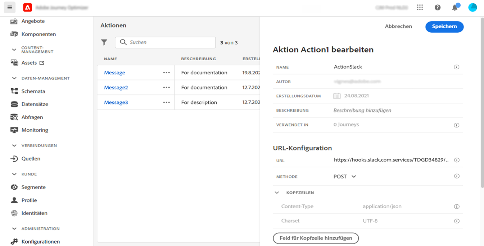
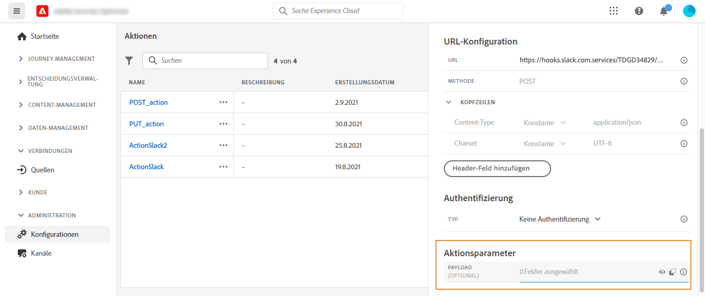
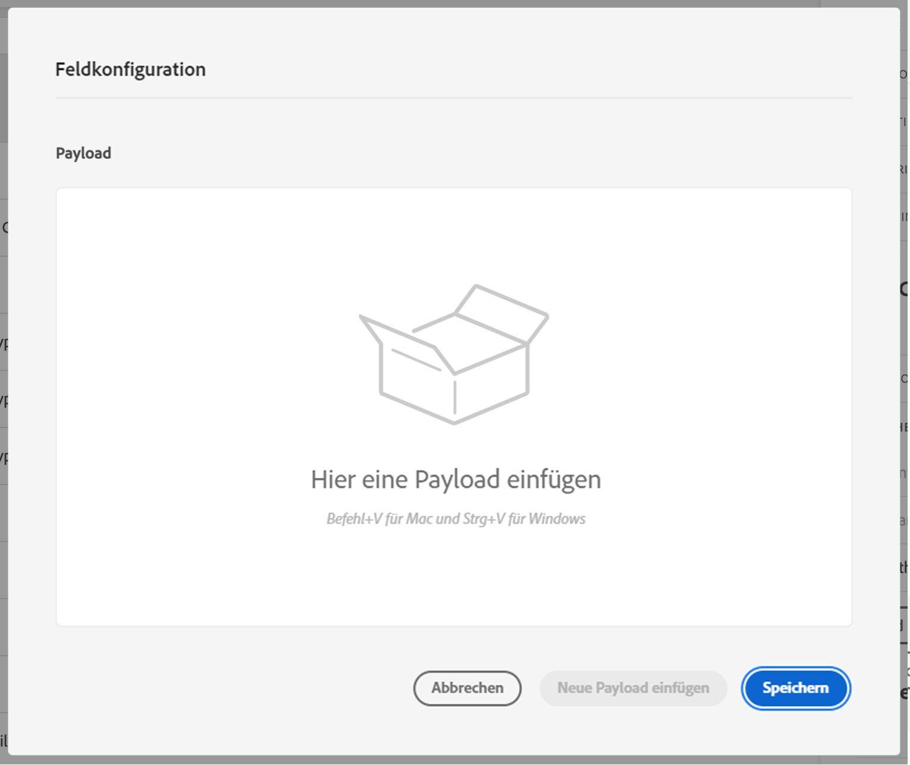

# Konfigurieren einer benutzerdefinierten Aktion {#configure-an-action}

>[!CONTEXTUALHELP]
>id="ajo_journey_action_custom_configuration"
>title="Benutzerdefinierte Aktionen"
>abstract="Wenn Sie ein Drittanbietersystem zum Nachrichtenversand verwenden oder wenn Sie möchten, dass von Journeys API-Aufrufe an ein Drittanbietersystem gesendet werden, verwenden Sie benutzerdefinierte Aktionen, um die Verbindung zwischen dem System und Ihrer Journey zu konfigurieren. Sie können mit benutzerdefinierten Aktionen beispielsweise eine Verbindung zu den folgenden Systemen herstellen: Epsilon, Slack, [Adobe Developer](https://developer.adobe.com/), Firebase usw."

Wenn Sie ein Drittanbietersystem zum Nachrichtenversand verwenden oder wenn Sie möchten, dass von Journeys API-Aufrufe an ein Drittanbietersystem gesendet werden, verwenden Sie benutzerdefinierte Aktionen, um die Verbindung zwischen dem System und Ihrer Journey zu konfigurieren. Sie können mit benutzerdefinierten Aktionen beispielsweise eine Verbindung zu den folgenden Systemen herstellen: Epsilon, Slack, [Adobe Developer](https://developer.adobe.com/){target=&quot;_blank&quot;}, Firebase usw.

Benutzerdefinierte Aktionen sind zusätzliche Aktionen, die von technischen Benutzern definiert und Marketing-Experten zur Verfügung gestellt werden. Nach der Konfiguration erscheinen sie in der linken Palette Ihrer Journey in der Kategorie **[!UICONTROL Aktion]**. Weiterführende Informationen finden Sie auf [dieser Seite](../building-journeys/about-journey-activities.md#action-activities).

## Einschränkungen{#custom-actions-limitations}

Für benutzerdefinierte Aktionen gibt es einige Einschränkungen, die auf [dieser Seite](../start/guardrails.md) aufgeführt sind.

In den Parametern für benutzerdefinierte Aktionen können Sie sowohl eine einfache Sammlung als auch eine Sammlung von Objekten übergeben. Weitere Informationen zu den Einschränkungen von Sammlungen finden Sie auf [dieser Seite](../building-journeys/collections.md#limitations).

Beachten Sie auch, dass bei den Parametern für benutzerdefinierte Aktionen ein bestimmtes Format erwartet wird (Beispiel: Zeichenfolge, Dezimalwert usw.). Sie müssen darauf achten, dass diese erwarteten Formate eingehalten werden. Weitere Informationen finden Sie in diesem [Anwendungsfall](../building-journeys/collections.md).

## Einverständnis und Data Governance {#privacy}

In Journey Optimizer können Sie Data Governance- und Einverständnisrichtlinien auf Ihre benutzerdefinierten Aktionen anwenden. Damit verhindern Sie, dass bestimmte Felder in Drittanbietersysteme exportiert werden, und können Kunden ausschließen, die dem Empfang von E-Mails, Push- oder SMS-Nachrichten nicht zugestimmt haben. Weitere Informationen finden Sie auf den folgenden Seiten:

* [Data Governance](../action/action.md).
* [Einverständnis](../action/action.md).

## Konfigurationsschritte {#configuration-steps}

Im Folgenden werden die wichtigsten Schritte beschrieben, die zum Konfigurieren einer benutzerdefinierten Aktion ausgeführt werden müssen:

1. Wählen Sie im Menü ADMINISTRATION die Option **[!UICONTROL Konfigurationen]**. Klicken Sie im Abschnitt **[!UICONTROL Aktionen]** auf **[!UICONTROL Verwalten]**. Klicken Sie auf **[!UICONTROL Aktion erstellen]**, um eine neue Aktion zu erstellen. Der Bereich für die Konfiguration der Aktion wird auf der rechten Seite des Bildschirms geöffnet.

   

1. Geben Sie einen Namen für die Aktion ein.

   >[!NOTE]
   >
   >Verwenden Sie keine Leerzeichen oder Sonderzeichen. Verwenden Sie nicht mehr als 30 Zeichen.

1. Fügen Sie Ihrer Aktion eine Beschreibung hinzu. Dieser Schritt ist optional.
1. Die Zahl der Journeys, die diese Aktion verwenden, wird im Feld **[!UICONTROL Verwendet in]** angezeigt. Sie können auf die Schaltfläche **[!UICONTROL Customer Journeys anzeigen]** klicken, um die Liste der Journeys anzuzeigen.
1. Definieren Sie die verschiedenen Parameter der **[!UICONTROL URL-Konfiguration]**. Weitere Informationen finden Sie auf [dieser Seite](../action/about-custom-action-configuration.md#url-configuration).
1. Konfigurieren Sie den Bereich **[!UICONTROL Authentifizierung]**. Diese Konfiguration ist mit der für Datenquellen identisch.  Weiterführende Informationen finden Sie in diesem [Abschnitt](../datasource/external-data-sources.md#custom-authentication-mode).
1. Definieren Sie die **[!UICONTROL Aktionsparameter]**. Weitere Informationen finden Sie auf [dieser Seite](../action/about-custom-action-configuration.md#define-the-message-parameters).
1. Klicken Sie auf **[!UICONTROL Speichern]**.

   Die benutzerdefinierte Aktion ist nun konfiguriert und kann in Ihren Journeys verwendet werden. Weitere Informationen finden Sie auf [dieser Seite](../building-journeys/about-journey-activities.md#action-activities).

   >[!NOTE]
   >
   >Wird eine benutzerdefinierte Aktion in einer Journey verwendet, sind die meisten Parameter schreibgeschützt. Sie können nur die Felder **[!UICONTROL Name]**, **[!UICONTROL Beschreibung]**, **[!UICONTROL URL]** und den Abschnitt **[!UICONTROL Authentifizierung]** ändern.

## URL-Konfiguration {#url-configuration}

Beim Konfigurieren einer benutzerdefinierten Aktion müssen Sie die folgenden **[!UICONTROL URL-Konfigurationsparameter]** definieren:

1. Geben Sie im Feld **[!UICONTROL URL]** die URL des externen Services an:

   * Wenn die URL statisch ist, geben Sie die URL in dieses Feld ein.

   * Wenn die URL einen dynamischen Pfad enthält, geben Sie nur den statischen Teil der URL ein, d. h. das Schema, den Host, den Port und optional einen statischen Teil des Pfads.

      Beispiel: `https://xxx.yyy.com/somethingstatic/`

      Sie geben den dynamischen Pfad der URL später an, wenn Sie die benutzerdefinierte Aktion zu einer Journey hinzufügen. [Weitere Informationen](../building-journeys/using-custom-actions.md).
   >[!NOTE]
   >
   >Aus Sicherheitsgründen empfehlen wir dringend, das HTTPS-Schema für die URL zu verwenden. Die Verwendung nicht öffentlicher Adobe-Adressen und die Verwendung von IP-Adressen sind nicht zulässig.
   >
   >Bei der Definition einer benutzerdefinierten Aktion sind nur die Standard-Ports zulässig: 80 für http und 443 für https.

1. Wählen Sie die **[!UICONTROL Aufrufmethode]** aus: Sie kann entweder **[!UICONTROL POST]** oder **[!UICONTROL PUT]** sein.

   >[!NOTE]
   >
   > Die Methode **DELETE** wird nicht unterstützt. Wenn Sie eine vorhandene Ressource aktualisieren müssen, wählen Sie die Methode **PUT**.

1. Definieren Sie im Abschnitt **[!UICONTROL Header]** die HTTP-Header der Anfragenachricht, die an den externen Service gesendet werden soll:
   1. Um ein Header-Feld hinzuzufügen, klicken Sie auf **[!UICONTROL Feld für Kopfzeile hinzufügen]**.
   1. Geben Sie den Schlüssel des Header-Felds ein.
   1. Um einen dynamischen Wert für das Schlüssel-Wert-Paar festzulegen, wählen Sie **[!UICONTROL Variabel]** aus. Wählen Sie andernfalls **[!UICONTROL Konstant]** aus.

      Beispielsweise können Sie für einen Zeitstempel einen dynamischen Wert festlegen.

   1. Wenn Sie **[!UICONTROL Konstant]** ausgewählt haben, geben Sie den konstanten Wert ein.

      Wenn Sie **[!UICONTROL Variabel]** ausgewählt haben, geben Sie diese Variable an, wenn Sie die benutzerdefinierte Aktion zu einer Journey hinzufügen. [Weitere Informationen](../building-journeys/using-custom-actions.md).

      

   1. Um ein Header-Feld zu löschen, zeigen Sie auf das Header-Feld und klicken Sie auf das Symbol **[!UICONTROL Löschen]**.
   Die Header-Felder **[!UICONTROL Content-Typ]** und **[!UICONTROL Charset]** werden standardmäßig festgelegt. Sie können diese Felder nicht ändern oder löschen.

   Nachdem Sie die benutzerdefinierte Aktion zu einer Journey hinzugefügt haben, können Sie ihr weiterhin Header-Felder hinzufügen, wenn sich die Journey im Entwurfsstatus befindet. Wenn Sie nicht möchten, dass die Journey von Konfigurationsänderungen betroffen ist, duplizieren Sie die benutzerdefinierte Aktion und fügen Sie die Header-Felder zur neuen benutzerdefinierten Aktion hinzu.

   >[!NOTE]
   >
   >Header werden gemäß den folgenden Parsing-Regeln validiert. Weitere Informationen finden Sie in [dieser Dokumentation](https://tools.ietf.org/html/rfc7230#section-3.2.4){_blank}.

## Definieren der Aktionsparameter {#define-the-message-parameters}

Fügen Sie im Abschnitt **[!UICONTROL Aktionsparameter]** ein Beispiel der JSON-Payload ein, die an den externen Service gesendet werden soll.

>[!NOTE]
>
>Das Payload-Beispiel darf keine Nullwerte enthalten. Feldnamen in der Payload dürfen das Zeichen „.“ nicht enthalten. Sie können nicht mit dem Zeichen „$“ beginnen.

Sie können den Parametertyp definieren (z. B.: Zeichenfolge, Ganzzahl usw.).

Sie können außerdem angeben, ob ein Parameter eine Konstante oder eine Variable ist:

* Konstante bedeutet, dass der Wert des Parameters im Bereich für die Konfiguration der Aktion von einem technischen Anwender definiert wird. Der Wert bleibt über all Journeys hinweg immer gleich. Er ändert sich nicht und wird dem Marketing-Experten nicht angezeigt, wenn die benutzerdefinierte Aktion während der Journey verwendet wird. Er könnte beispielsweise eine ID sein, die das Drittanbietersystem erwartet. In diesem Fall ist das Feld rechts neben dem Umschalter zwischen Konstante und Variable der übergebene Wert.
* Variable bedeutet, dass der Wert des Parameters variiert. Marketing-Experten, die diese benutzerdefinierte Aktion in einer Journey verwenden, können den von ihnen gewünschten Wert weitergeben oder angeben, wo der Wert für diesen Parameter abgerufen werden soll (z. B. vom Ereignis oder von Adobe Experience Platform). In diesem Fall ist das Feld rechts neben dem Umschalter zwischen Konstante und Variable der Titel, den der Marketing-Experte in der Journey sieht, um diesen Parameter zu benennen.

