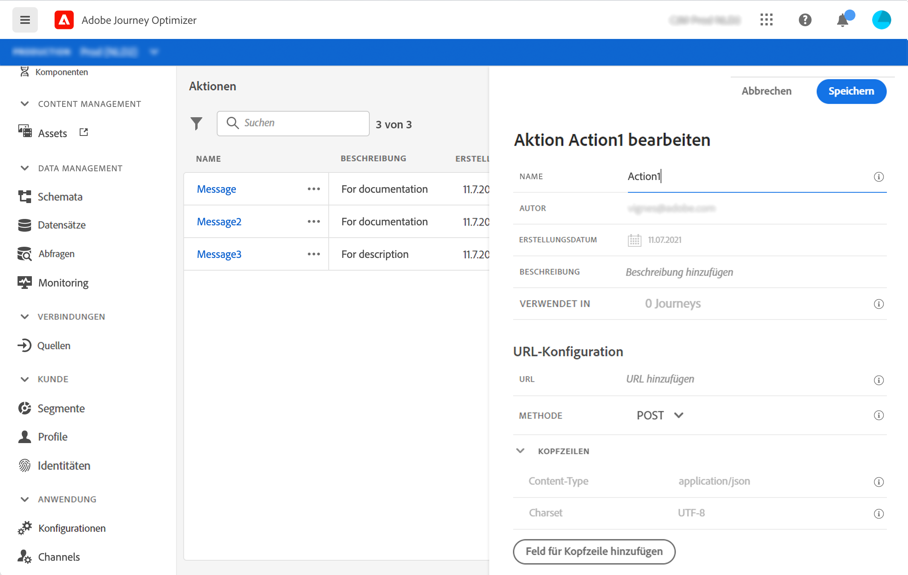
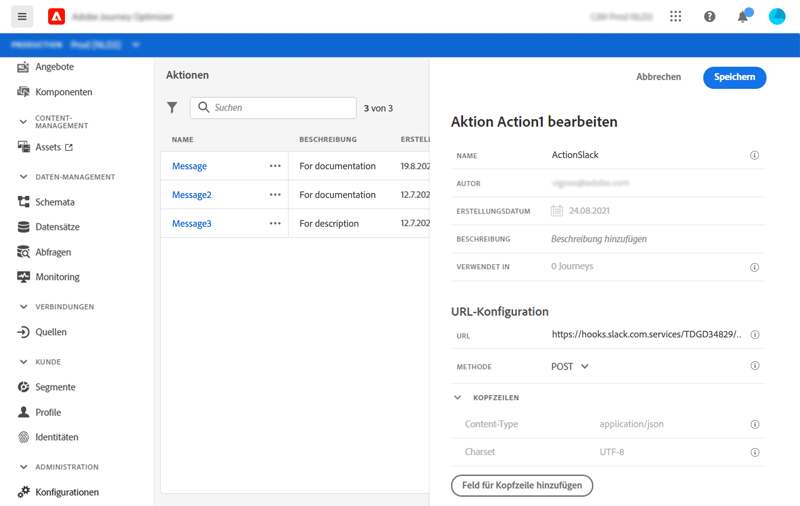
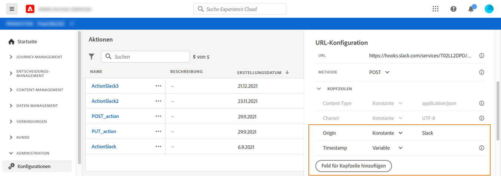
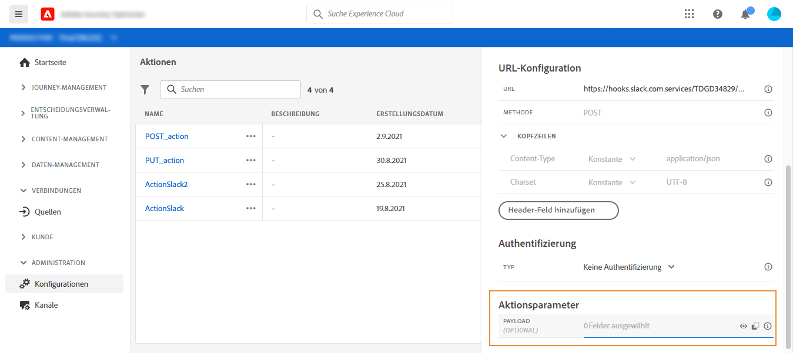
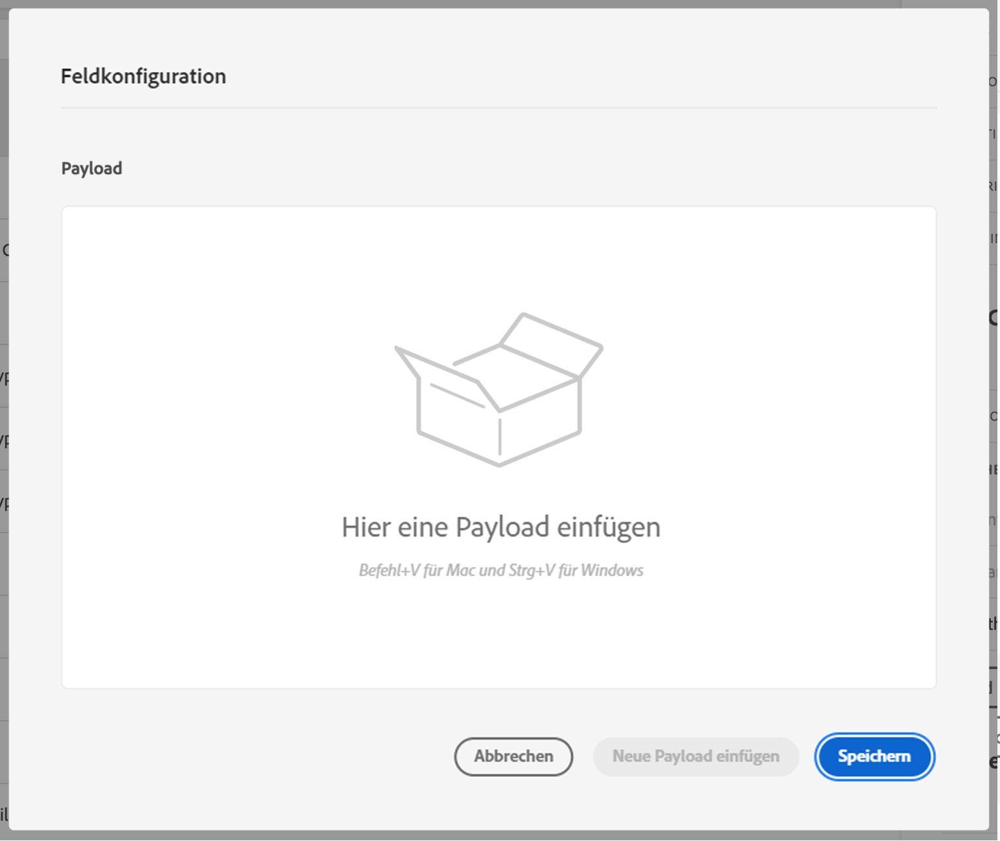
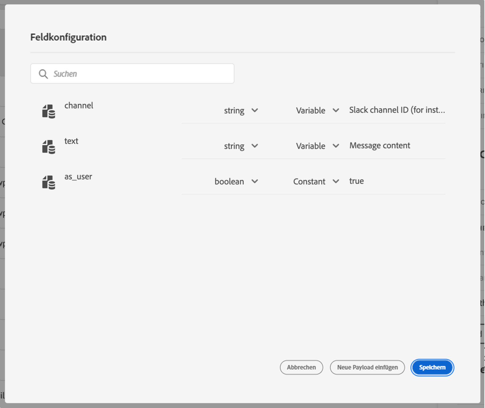

# Konfigurieren einer Aktion {#configure-an-action}

Wenn Sie zum Senden von Nachrichten ein Drittanbietersystem verwenden oder möchten, dass Journeys API-Aufrufe an ein Drittanbietersystem senden, konfigurieren Sie hier seine Verbindung zu Journeys. Die von technischen Anwendern definierte Aktion steht dann in der linken Palette Ihrer Journey in der Kategorie **[!UICONTROL Aktion]** zur Verfügung (siehe [diese Seite](../building-journeys/about-journey-activities.md#action-activities). Im Folgenden finden Sie Beispiele für Systeme, mit denen Sie über benutzerdefinierte Aktionen eine Verbindung herstellen können: Epsilon, Facebook, Adobe.io, Firebase usw.
Einschränkungen sind auf [dieser Seite](../building-journeys/limitations.md) aufgeführt.

Im Folgenden werden die wichtigsten Schritte beschrieben, die zum Konfigurieren einer benutzerdefinierten Aktion ausgeführt werden müssen:

1. Wählen Sie im Menü ADMINISTRATION die Option **[!UICONTROL Konfigurationen]**. Klicken Sie im Abschnitt **[!UICONTROL Aktionen]** auf **[!UICONTROL Verwalten]**. Klicken Sie auf **[!UICONTROL Aktion erstellen]**, um eine neue Aktion zu erstellen. Der Bereich für die Konfiguration der Aktion wird auf der rechten Seite des Bildschirms geöffnet.

   

1. Geben Sie einen Namen für die Aktion ein.

   >[!NOTE]
   >
   >Verwenden Sie keine Leerzeichen oder Sonderzeichen. Verwenden Sie nicht mehr als 30 Zeichen.

1. Fügen Sie Ihrer Aktion eine Beschreibung hinzu. Dieser Schritt ist optional.
1. Die Zahl der Journeys, die diese Aktion verwenden, wird im Feld **[!UICONTROL Verwendet in]** angezeigt. Sie können auf die Schaltfläche **[!UICONTROL Customer Journeys anzeigen]** klicken, um die Liste der Journeys anzuzeigen.
1. Definieren Sie die verschiedenen Parameter der **[!UICONTROL URL-Konfiguration]**. Weitere Informationen finden Sie auf [dieser Seite](../action/about-custom-action-configuration.md#url-configuration).
1. Konfigurieren Sie den Bereich **[!UICONTROL Authentifizierung]**. Diese Konfiguration ist mit der für Datenquellen identisch.  Weitere Informationen finden Sie in [diesem Abschnitt](../datasource/external-data-sources.md#section_wjp_nl5_nhb).
1. Definieren Sie die **[!UICONTROL Aktionsparameter]**. Weitere Informationen finden Sie auf [dieser Seite](../action/about-custom-action-configuration.md#define-the-message-parameters).
1. Klicken Sie auf **[!UICONTROL Speichern]**.

   Die benutzerdefinierte Aktion ist nun konfiguriert und kann in Ihren Journeys verwendet werden. Weitere Informationen finden Sie auf [dieser Seite](../building-journeys/about-journey-activities.md#action-activities).

   >[!NOTE]
   >
   >Wird eine benutzerdefinierte Aktion in einer Journey verwendet, sind die meisten Parameter schreibgeschützt. Sie können nur die Felder **[!UICONTROL Name]**, **[!UICONTROL Beschreibung]**, **[!UICONTROL URL]** und den Abschnitt **[!UICONTROL Authentifizierung]** ändern.

## URL-Konfiguration {#url-configuration}

Beim Konfigurieren einer benutzerdefinierten Aktion müssen Sie die folgenden **[!UICONTROL URL-Konfigurationsparameter]** definieren:

1. Geben Sie im Feld **[!UICONTROL URL]** die URL des externen Dienstes an:

   * Wenn die URL statisch ist, geben Sie die URL in dieses Feld ein.

   * Wenn die URL einen dynamischen Pfad enthält, geben Sie nur den statischen Teil der URL ein, d. h. das Schema, den Host, den Port und optional einen statischen Teil des Pfads.

      Beispiel: `https://xxx.yyy.com:8080/somethingstatic/`

      Sie geben den dynamischen Pfad der URL an, wenn Sie die benutzerdefinierte Aktion zu einer Journey hinzufügen. [Weitere Informationen](../building-journeys/using-custom-actions.md).
   >[!NOTE]
   >
   >Aus Sicherheitsgründen empfehlen wir dringend, das HTTPS-Schema für die URL zu verwenden. Die Verwendung nicht öffentlicher Adobe-Adressen und die Verwendung von IP-Adressen sind nicht zulässig.

1. Wählen Sie die **[!UICONTROL Aufrufmethode]** aus: Sie kann entweder **[!UICONTROL POST]** oder **[!UICONTROL PUT]** sein.
1. Definieren Sie im Abschnitt **[!UICONTROL Headers]** die HTTP-Header der Anforderungsnachricht, die an den externen Dienst gesendet werden soll:
   1. Um ein Header-Feld hinzuzufügen, klicken Sie auf **[!UICONTROL Header-Feld hinzufügen]**.
   1. Geben Sie den Schlüssel des Header-Felds ein.
   1. Um einen dynamischen Wert für das Schlüssel-Wert-Paar festzulegen, wählen Sie **[!UICONTROL Variable]** aus. Wählen Sie andernfalls **[!UICONTROL Konstante]** aus.

      Beispielsweise können Sie für einen Zeitstempel einen dynamischen Wert festlegen.

   1. Wenn Sie **[!UICONTROL Konstante]** ausgewählt haben, geben Sie den Konstantenwert ein.

      Wenn Sie **[!UICONTROL Variable]** ausgewählt haben, geben Sie diese Variable an, wenn Sie die benutzerdefinierte Aktion zu einer Journey hinzufügen. [Weitere Informationen](../building-journeys/using-custom-actions.md).

      

   1. Um ein Kopfzeilenfeld zu löschen, verweisen Sie auf das Kopfzeilenfeld und klicken Sie auf das Symbol **[!UICONTROL Löschen]** .
   Die Header-Felder **[!UICONTROL Content-Type]** und **[!UICONTROL Charset]** werden standardmäßig festgelegt. Sie können diese Felder nicht ändern oder löschen.

   Nachdem Sie die benutzerdefinierte Aktion zu einer Journey hinzugefügt haben, können Sie ihr weiterhin Kopfzeilenfelder hinzufügen, wenn sich die Journey im Entwurfsstatus befindet. Wenn Sie nicht möchten, dass die Journey von Konfigurationsänderungen betroffen ist, duplizieren Sie die benutzerdefinierte Aktion und fügen Sie die Kopfzeilenfelder zur neuen benutzerdefinierten Aktion hinzu.

   >[!NOTE]
   >
   >Kopfzeilen werden gemäß den Feldanalyseregeln validiert. [Weitere Informationen](https://tools.ietf.org/html/rfc7230#section-3.2.4).

## Definieren der Aktionsparameter {#define-the-message-parameters}

Fügen Sie im Abschnitt **[!UICONTROL Aktionsparameter]** ein Beispiel der JSON-Payload ein, die an den externen Service gesendet werden soll.

>[!NOTE]
>
>Feldnamen in der Payload dürfen das Zeichen „.“ nicht enthalten. Sie können nicht mit dem Zeichen „$“ beginnen.

Sie können den Parametertyp definieren (z. B.: Zeichenfolge, Ganzzahl usw.).

Sie können außerdem angeben, ob ein Parameter eine Konstante oder eine Variable ist:

* Konstante bedeutet, dass der Wert des Parameters im Bereich für die Konfiguration der Aktion von einem technischen Anwender definiert wird. Der Wert bleibt über all Journeys hinweg immer gleich. Er ändert sich nicht und wird dem Marketing-Experten nicht angezeigt, wenn die benutzerdefinierte Aktion während der Journey verwendet wird. Er könnte beispielsweise eine ID sein, die das Drittanbietersystem erwartet. In diesem Fall ist das Feld rechts neben dem Umschalter zwischen Konstante und Variable der übergebene Wert.
* Variable bedeutet, dass der Wert des Parameters variiert. Der Marketing-Experte, der diese benutzerdefinierte Aktion in einer Journey verwendet, kann den von ihm gewünschten Wert weitergeben oder angeben, wo der Wert für diesen Parameter abgerufen werden soll (z. B. vom Ereignis oder von Adobe Experience Platform usw.). In diesem Fall ist das Feld rechts neben dem Umschalter zwischen Konstante und Variable der Titel, den der Marketing-Experte in der Journey sieht, um diesen Parameter zu benennen.

