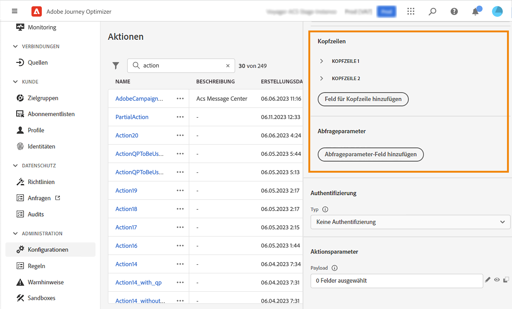

# Konfigurieren einer benutzerdefinierten Aktion {#configure-an-action}

>[!CONTEXTUALHELP]
>id="ajo_journey_action_custom_configuration"
>title="Benutzerdefinierte Aktionen"
>abstract="Wenn Sie ein Drittanbietersystem zum Nachrichtenversand verwenden oder wenn Sie möchten, dass von Journeys API-Aufrufe an ein Drittanbietersystem gesendet werden, verwenden Sie benutzerdefinierte Aktionen, um die Verbindung zwischen dem System und Ihrer Journey zu konfigurieren. Sie können mit benutzerdefinierten Aktionen beispielsweise eine Verbindung zu den folgenden Systemen herstellen: Epsilon, Slack, [Adobe Developer](https://developer.adobe.com), Firebase usw."

Wenn Sie ein Drittanbietersystem zum Nachrichtenversand verwenden oder wenn Sie möchten, dass von Journeys API-Aufrufe an ein Drittanbietersystem gesendet werden, verwenden Sie benutzerdefinierte Aktionen, um die Verbindung zwischen dem System und Ihrer Journey zu konfigurieren. Sie können mit benutzerdefinierten Aktionen beispielsweise eine Verbindung mit den folgenden Systemen herstellen: Epsilon, Slack, [Adobe Developer](https://developer.adobe.com/){target="_blank"}, Firebase usw.

Benutzerdefinierte Aktionen sind zusätzliche Aktionen, die von technischen Benutzern definiert und Marketing-Experten zur Verfügung gestellt werden. Nach der Konfiguration erscheinen sie in der linken Palette Ihrer Journey in der Kategorie **[!UICONTROL Aktion]**. Weiterführende Informationen finden Sie auf [dieser Seite](../building-journeys/about-journey-activities.md#action-activities).

## Einschränkungen{#custom-actions-limitations}

Für benutzerdefinierte Aktionen gibt es einige Einschränkungen, die auf [dieser Seite](../start/guardrails.md) aufgeführt sind.

In den Parametern für benutzerdefinierte Aktionen können Sie sowohl eine einfache Sammlung als auch eine Sammlung von Objekten übergeben. Weitere Informationen zu den Einschränkungen von Sammlungen finden Sie auf [dieser Seite](../building-journeys/collections.md#limitations).

Beachten Sie auch, dass bei den Parametern für benutzerdefinierte Aktionen ein bestimmtes Format erwartet wird (Beispiel: Zeichenfolge, Dezimalwert usw.). Sie müssen darauf achten, dass diese erwarteten Formate eingehalten werden. Weitere Informationen finden Sie in diesem [Anwendungsfall](../building-journeys/collections.md).

Benutzerdefinierte Aktionen unterstützen das JSON-Format nur bei Verwendung von [Anfrage](../action/about-custom-action-configuration.md#define-the-message-parameters)- oder [Antwort-Payloads](../action/action-response.md).

## Best Practices{#custom-action-enhancements-best-practices}

Stellen Sie bei der Auswahl eines mit einer benutzerdefinierten Aktion anzusprechenden Endpunkts sicher, dass:

* Dieser Endpunkt den Journey-Durchsatz unterstützen kann, indem er ihn mit Konfigurationen aus der [Drosselungs-API](../configuration/throttling.md) oder [Begrenzungs-API](../configuration/capping.md) begrenzt. Vorsicht: Eine Drosselungskonfiguration darf nicht unter 200 TPS liegen. Jeder angesprochene Endpunkt muss mindestens 200 TPS unterstützen.
* Dieser Endpunkt muss eine so niedrige Antwortzeit wie möglich haben. Abhängig von Ihrem erwarteten Durchsatz kann sich eine hohe Reaktionszeit auf den tatsächlichen Durchsatz auswirken.

Für alle benutzerdefinierten Aktionen ist ein Begrenzung von 300.000 Aufrufen über eine Minute festgelegt. Darüber hinaus wird die Standardbegrenzung pro Host und Sandbox angewendet. Wenn Sie beispielsweise in einer Sandbox zwei Endpunkte mit demselben Host haben (z. B. `https://www.adobe.com/endpoint1` und `https://www.adobe.com/endpoint2`), gilt die Begrenzung für alle Endpunkte unter dem Host adobe.com. „Endpunkt1“ und „Endpunkt2“ verwenden dieselbe Begrenzungskonfiguration. Wenn ein Endpunkt diesen Wert erreicht, wirkt sich dies auch auf den anderen Endpunkt aus.

Diese Beschränkung wurde auf der Grundlage der Kundennutzung festgelegt, um externe Endpunkte zu schützen, die von benutzerdefinierten Aktionen angesprochen werden. Sie müssen dies in Ihren zielgruppenbasierten Journeys berücksichtigen, indem Sie eine geeignete Leserate definieren (5000 Profile pro Sekunde, wenn benutzerdefinierte Aktionen verwendet werden). Bei Bedarf können Sie diese Einstellung überschreiben, indem Sie über unsere Begrenzungs- oder Drosselungs-API eine höhere Begrenzung oder Einschränkung definieren. Weitere Informationen finden Sie auf [dieser Seite](../configuration/external-systems.md).

Sie sollten öffentliche Endpunkte aus verschiedenen Gründen nicht mit benutzerdefinierten Aktionen ansprechen:

* Ohne ordnungsgemäße Begrenzung oder Einschränkung besteht das Risiko, zu viele Aufrufe an einen öffentlichen Endpunkt zu senden, der ein solches Volumen möglicherweise nicht unterstützt.
* Profildaten können über benutzerdefinierte Aktionen gesendet werden, sodass das Ansprechen eines öffentlichen Endpunkts dazu führen kann, dass personenbezogene Daten versehentlich extern freigegeben werden.
* Sie haben keine Kontrolle über die Daten, die von öffentlichen Endpunkten zurückgegeben werden. Wenn ein Endpunkt seine API ändert oder damit beginnt, falsche Informationen zu senden, werden diese in gesendeten Nachrichten zur Verfügung gestellt, was negative Auswirkungen haben könnte.

## Einverständnis und Data Governance {#privacy}

In Journey Optimizer können Sie Data Governance- und Einverständnisrichtlinien auf Ihre benutzerdefinierten Aktionen anwenden. Damit verhindern Sie, dass bestimmte Felder in Drittanbietersysteme exportiert werden, und können Kunden ausschließen, die dem Empfang von E-Mails, Push- oder SMS-Nachrichten nicht zugestimmt haben. Weitere Informationen finden Sie auf den folgenden Seiten:

* [Data Governance](../action/action-privacy.md).
* [Einverständnis](../action/action-privacy.md).


## Konfigurationsschritte {#configuration-steps}

Im Folgenden werden die wichtigsten Schritte beschrieben, die zum Konfigurieren einer benutzerdefinierten Aktion ausgeführt werden müssen:

1. Wählen Sie im Menü ADMINISTRATION die Option **[!UICONTROL Konfigurationen]**. Klicken Sie im Abschnitt **[!UICONTROL Aktionen]** auf **[!UICONTROL Verwalten]**. Klicken Sie auf **[!UICONTROL Aktion erstellen]**, um eine neue Aktion zu erstellen. Der Bereich für die Konfiguration der Aktion wird auf der rechten Seite des Bildschirms geöffnet.

   

1. Geben Sie einen Namen für die Aktion ein.

   >[!NOTE]
   >
   >Es sind nur alphanumerische Zeichen und Unterstriche zulässig. Die maximale Länge beträgt 30 Zeichen.

1. Fügen Sie Ihrer Aktion eine Beschreibung hinzu. Dieser Schritt ist optional.
1. Die Zahl der Journeys, die diese Aktion verwenden, wird im Feld **[!UICONTROL Verwendet in]** angezeigt. Sie können auf die Schaltfläche **[!UICONTROL Customer Journeys anzeigen]** klicken, um die Liste der Journeys anzuzeigen.
1. Definieren Sie die verschiedenen Parameter der **[!UICONTROL URL-Konfiguration]**. Weitere Informationen finden Sie auf [dieser Seite](../action/about-custom-action-configuration.md#url-configuration).
1. Konfigurieren Sie den Bereich **[!UICONTROL Authentifizierung]**. Diese Konfiguration ist mit der für Datenquellen identisch.  Weiterführende Informationen finden Sie in diesem [Abschnitt](../datasource/external-data-sources.md#custom-authentication-mode).
1. Definieren Sie die **[!UICONTROL Aktionsparameter]**. Weitere Informationen finden Sie auf [dieser Seite](../action/about-custom-action-configuration.md#define-the-message-parameters).
1. Klicken Sie auf **[!UICONTROL Speichern]**.

   Die benutzerdefinierte Aktion ist nun konfiguriert und kann in Ihren Journeys verwendet werden. Weitere Informationen finden Sie auf [dieser Seite](../building-journeys/about-journey-activities.md#action-activities).

   >[!NOTE]
   >
   >Wird eine benutzerdefinierte Aktion in einer Journey verwendet, sind die meisten Parameter schreibgeschützt. Sie können nur die Felder **[!UICONTROL Name]**, **[!UICONTROL Beschreibung]**, **[!UICONTROL URL]** und den Abschnitt **[!UICONTROL Authentifizierung]** ändern.

## Endpunktkonfiguration {#url-configuration}

Beim Konfigurieren einer benutzerdefinierten Aktion müssen Sie die folgenden **[!UICONTROL Endpunkt-Konfigurationsparameter]** definieren:

{width="70%" align="left"}

1. Geben Sie im Feld **[!UICONTROL URL]** die URL des externen Services an:

   * Wenn die URL statisch ist, geben Sie die URL in dieses Feld ein.

   * Wenn die URL einen dynamischen Pfad enthält, geben Sie nur den statischen Teil der URL ein, d. h. das Schema, den Host, den Port und optional einen statischen Teil des Pfads.

     Beispiel: `https://xxx.yyy.com/somethingstatic/`

     Sie geben den dynamischen Pfad der URL später an, wenn Sie die benutzerdefinierte Aktion zu einer Journey hinzufügen. [Weitere Informationen](../building-journeys/using-custom-actions.md).

   >[!NOTE]
   >
   >Aus Sicherheitsgründen empfehlen wir dringend, das HTTPS-Schema für die URL zu verwenden. Die Verwendung nicht öffentlicher Adobe-Adressen und die Verwendung von IP-Adressen sind nicht zulässig.
   >
   >Bei der Definition einer benutzerdefinierten Aktion sind nur die Standard-Ports zulässig: 80 für http und 443 für https.

1. Wählen Sie die **[!UICONTROL Aufrufmethode]** aus: Es kann entweder **[!UICONTROL POST]**, **[!UICONTROL GET]** oder **[!UICONTROL PUT]** sein.

   >[!NOTE]
   >
   > Die Methode **DELETE** wird nicht unterstützt. Wenn Sie eine vorhandene Ressource aktualisieren müssen, wählen Sie die Methode **PUT**.

1. Definieren Sie die Header und Abfrageparameter:

   * Klicken Sie im Abschnitt **[!UICONTROL Header]** auf **[!UICONTROL Header-Feld hinzufügen]**, um die HTTP-Header-Zeilen der Anfragenachricht zu definieren, die an den externen Service gesendet werden soll. Die Header-Felder **[!UICONTROL Content-Typ]** und **[!UICONTROL Charset]** werden standardmäßig festgelegt. Sie können diese Felder nicht löschen. Es kann nur der **[!UICONTROL Content-Typ]**-Header geändert werden. Sein Wert sollte dem JSON-Format entsprechen. Dies ist der Standardwert:

   

   * Klicken Sie im Abschnitt **[!UICONTROL Abfrageparameter]** auf **[!UICONTROL Feld für Abfrageparameter hinzufügen]**, um die Parameter zu definieren, die Sie der URL hinzufügen möchten.

   

1. Geben Sie die Bezeichnung oder den Namen des Felds ein.

1. Wählen Sie einen Typ aus: **[!UICONTROL konstant]** oder **[!UICONTROL variabel]**. Wenn Sie **[!UICONTROL konstant]** gewählt haben, geben Sie den konstanten Wert ins **[!UICONTROL Wert]**-Feld ein. Wenn Sie **[!UICONTROL Variabel]** ausgewählt haben, geben Sie diese Variable an, wenn Sie die benutzerdefinierte Aktion zu einer Journey hinzufügen. [Weitere Informationen](../building-journeys/using-custom-actions.md).

   

   >[!NOTE]
   >
   >Nachdem Sie die benutzerdefinierte Aktion zu einer Journey hinzugefügt haben, können Sie ihr weiterhin Felder für Header- oder Abfrageparameter hinzufügen, wenn sich die Journey im Entwurfsstatus befindet. Wenn Sie nicht möchten, dass sich Konfigurationsänderungen auf die Journey auswirken, duplizieren Sie die benutzerdefinierte Aktion und fügen Sie die Felder zur neuen benutzerdefinierten Aktion hinzu.
   >
   >Header werden gemäß den folgenden Parsing-Regeln validiert. Weitere Informationen finden Sie in [dieser Dokumentation](https://tools.ietf.org/html/rfc7230#section-3.2.4){_blank}.

## Definieren der Payload-Parameter {#define-the-message-parameters}

1. Fügen Sie im Abschnitt **[!UICONTROL Anfrage]** ein Beispiel der JSON-Payload ein, die an den externen Service gesendet werden soll. Dieses Feld ist optional und nur für die Aufrufmethoden „POST“ und „PUT“ verfügbar.

1. Fügen Sie im Abschnitt **[!UICONTROL Reaktion]** ein Beispiel der vom Aufruf zurückgegebenen Payload ein. Dieses Feld ist optional und ist für alle Aufrufmethoden verfügbar. Ausführliche Informationen zur Verwendung von API-Aufrufantworten in benutzerdefinierten Aktionen finden Sie auf [dieser Seite](../action/action-response.md).

>[!NOTE]
>
>Die Antwortfunktion ist derzeit in der Beta-Version verfügbar.

{width="70%" align="left"}

>[!NOTE]
>
>Das Payload-Beispiel darf keine Nullwerte enthalten. Feldnamen in der Payload dürfen das Zeichen „.“ nicht enthalten. Sie können nicht mit dem Zeichen „$“ beginnen.

Sie können den Parametertyp definieren (z. B.: Zeichenfolge, Ganzzahl usw.).

Sie können außerdem angeben, ob ein Parameter eine Konstante oder eine Variable ist:

* **Konstante** bedeutet, dass der Wert des Parameters im Bereich für die Konfiguration der Aktion von einem technischen Anwender definiert wird. Der Wert bleibt über all Journeys hinweg immer gleich. Er ändert sich nicht und wird den Marketing-Fachleuten nicht angezeigt, wenn die benutzerdefinierte Aktion während der Journey verwendet wird. Er könnte beispielsweise eine ID sein, die das Drittanbietersystem erwartet. In diesem Fall ist das Feld rechts neben dem Umschalter zwischen Konstante und Variable der übergebene Wert.
* **Variable** bedeutet, dass der Wert des Parameters variiert. Marketing-Experten, die diese benutzerdefinierte Aktion in einer Journey verwenden, können den von ihnen gewünschten Wert weitergeben oder angeben, wo der Wert für diesen Parameter abgerufen werden soll (z. B. vom Ereignis oder von Adobe Experience Platform). In diesem Fall ist das Feld rechts neben dem Umschalter zwischen Konstante und Variable der Titel, den der Marketing-Experte in der Journey sieht, um diesen Parameter zu benennen.


## Unterstützung des mTLS-Protokolls {#mtls-protocol-support}

Sie können jetzt &quot;Mutual Transport Layer Security (mTLS)&quot;verwenden, um eine verbesserte Sicherheit bei ausgehenden Verbindungen zu HTTP-API-Zielen und benutzerdefinierten Aktionen in Adobe Journey Optimizer sicherzustellen. mTLS ist eine durchgängige Sicherheitsmethode für die gegenseitige Authentifizierung, mit der sichergestellt wird, dass beide Parteien, die Informationen teilen, diejenigen sind, die sie angeblich sind, bevor Daten freigegeben werden. mTLS umfasst einen zusätzlichen Schritt im Vergleich zu TLS, bei dem der Server auch das Zertifikat des Kunden anfordert und es auf dessen Ende überprüft.

In Adobe Journey Optimizer wird mTLS zusammen mit benutzerdefinierten Aktionen verwendet. Für benutzerdefinierte Aktionen in Adobe Journey Optimizer ist keine zusätzliche Konfiguration erforderlich, um mTLS zu aktivieren. Wenn der Endpunkt für eine benutzerdefinierte Aktion mTLS-fähig ist, ruft das System das Zertifikat aus dem Adobe Experience Platform-Keystore ab und stellt es automatisch an den -Endpunkt bereit (wie für mTLS-Verbindungen erforderlich).

Wenn Sie mTLS mit diesen Adobe Journey Optimizer- und Experience Platform-HTTP-API-Ziel-Workflows verwenden möchten, muss für die Serveradresse, die Sie in die Adobe Journey Optimizer-Benutzeroberfläche für Kundenaktionen oder die Benutzeroberfläche &quot;Ziele&quot;einfügen, die TLS-Protokolle deaktiviert und nur mTLS aktiviert sein. Wenn das TLS 1.2-Protokoll an diesem Endpunkt noch aktiviert ist, wird kein Zertifikat für die Client-Authentifizierung gesendet. Um mTLS mit diesen Workflows verwenden zu können, muss der &quot;Empfangs&quot;-Server-Endpunkt ein mTLS sein. **only** aktivierter Verbindungsendpunkt.

>[!IMPORTANT]
>
>In Ihrer benutzerdefinierten Aktion oder Ihrem Journey für Adobe Journey Optimizer ist keine zusätzliche Konfiguration erforderlich, um mTLS zu aktivieren. Dieser Vorgang erfolgt automatisch, wenn ein mTLS-fähiger Endpunkt erkannt wird. Die gebräuchlichen Namen (CN) und alternativen Namen des Betreffs (SAN) für jedes Zertifikat sind in der Dokumentation als Teil des Zertifikats verfügbar und können bei Bedarf als zusätzliche Ebene der Eigentümervalidierung verwendet werden.
>
>RFC 2818, veröffentlicht im Mai 2000, stellt die Verwendung des Felds &quot;Common Name&quot;(CN) in HTTPS-Zertifikaten zur Verifizierung des Subjektnamens ein. Stattdessen wird empfohlen, die Erweiterung &quot;Subject Alternative Name&quot;(SAN) des Typs &quot;DNS-Name&quot;zu verwenden.

Wenn Sie die CN oder das SAN überprüfen möchten, um eine zusätzliche Validierung von Drittanbietern durchzuführen, können Sie die entsprechenden Zertifikate hier herunterladen:

```
Prod:
{
    "serviceName": "AJO Journeys",
    "publicCertificate": "-----BEGIN CERTIFICATE-----
MIIG9TCCBd2gAwIBAgIQBX+pDP5hB0gqDzFKyq5wLjANBgkqhkiG9w0BAQsFADBZ
MQswCQYDVQQGEwJVUzEVMBMGA1UEChMMRGlnaUNlcnQgSW5jMTMwMQYDVQQDEypE
aWdpQ2VydCBHbG9iYWwgRzIgVExTIFJTQSBTSEEyNTYgMjAyMCBDQTEwHhcNMjQw
NTA5MDAwMDAwWhcNMjUwNjA5MjM1OTU5WjB0MQswCQYDVQQGEwJVUzETMBEGA1UE
CBMKQ2FsaWZvcm5pYTERMA8GA1UEBxMIU2FuIEpvc2UxEzARBgNVBAoTCkFkb2Jl
IEluYy4xKDAmBgNVBAMTH2Fqby1qb3VybmV5cy5hZXAtbXRscy5hZG9iZS5jb20w
ggEiMA0GCSqGSIb3DQEBAQUAA4IBDwAwggEKAoIBAQDaI8HZHzbmPEgTy9O7cYmq
ZVX5283Gw7j7v4/O810jZXItBDmsSiWotvTgAT0s2oZMZZ6tGPbQB7hL+xJJ+yu2
HxFl1WzB4UGHJ+UbrL94hI930xQs0FVgSOGgIarj5HucF2ZxwHIkVHY5whrOq9t4
UxFBG0siUPQrTzV9GfA0wREElugpTbwaM8CTWwOQ9ekroOD2C5zAcLTycXFtSMiU
B4L4u38S9hGoBByzzKv9GnUMQudvt/s5zsGykZgEEYeN6IitfVO6BOD9jT94Aytx
/O3XH5w8v4KNTn+An99bXFmyg3JRUFSYZFxha8s1f6uu0XbdToQ+ao0WkE06nMmV
AgMBAAGjggOcMIIDmDAfBgNVHSMEGDAWgBR0hYDAZsffN97PvSk3qgMdvu3NFzAd
BgNVHQ4EFgQUn8OqtzccNdrsb+fbRnTHmtTZxLMwKgYDVR0RBCMwIYIfYWpvLWpv
dXJuZXlzLmFlcC1tdGxzLmFkb2JlLmNvbTA+BgNVHSAENzA1MDMGBmeBDAECAjAp
MCcGCCsGAQUFBwIBFhtodHRwOi8vd3d3LmRpZ2ljZXJ0LmNvbS9DUFMwDgYDVR0P
AQH/BAQDAgWgMB0GA1UdJQQWMBQGCCsGAQUFBwMBBggrBgEFBQcDAjCBnwYDVR0f
BIGXMIGUMEigRqBEhkJodHRwOi8vY3JsMy5kaWdpY2VydC5jb20vRGlnaUNlcnRH
bG9iYWxHMlRMU1JTQVNIQTI1NjIwMjBDQTEtMS5jcmwwSKBGoESGQmh0dHA6Ly9j
cmw0LmRpZ2ljZXJ0LmNvbS9EaWdpQ2VydEdsb2JhbEcyVExTUlNBU0hBMjU2MjAy
MENBMS0xLmNybDCBhwYIKwYBBQUHAQEEezB5MCQGCCsGAQUFBzABhhhodHRwOi8v
b2NzcC5kaWdpY2VydC5jb20wUQYIKwYBBQUHMAKGRWh0dHA6Ly9jYWNlcnRzLmRp
Z2ljZXJ0LmNvbS9EaWdpQ2VydEdsb2JhbEcyVExTUlNBU0hBMjU2MjAyMENBMS0x
LmNydDAMBgNVHRMBAf8EAjAAMIIBfwYKKwYBBAHWeQIEAgSCAW8EggFrAWkAdwBO
daMnXJoQwzhbbNTfP1LrHfDgjhuNacCx+mSxYpo53wAAAY9ecsWsAAAEAwBIMEYC
IQDQclgq89ZVlwdYBJFEIs8q4WIcZ9Siw+jb9OgCrz+wjwIhALQLnC1WyT+dHjvY
FvZjc99WkjnEwhIevj/Rz7r0EzhmAHUAfVkeEuF4KnscYWd8Xv340IdcFKBOlZ65
Ay/ZDowuebgAAAGPXnLF5AAABAMARjBEAiBy9cNT3CnmSMOdJe+JbG8f7ha1UGgN
TdDlaR9x9fKmKQIgNmGjz5AzP1evB2G1TTvVLkHfWQw0864c4F23WSV+6TsAdwDP
EVbu1S58r/OHW9lpLpvpGnFnSrAX7KwB0lt3zsw7CAAAAY9ecsYnAAAEAwBIMEYC
IQCTcB7s1xDP8Olif3jj4X8jHgVxv5C3bTvG6wDYBByfcQIhAOt8PhR6tWSLtF1V
HB8r7dns7Oth1+QT7WMonQZsP/3WMA0GCSqGSIb3DQEBCwUAA4IBAQAjTy45fbQV
aVTZ71wcIyHnkJfq/8SSc/UNT5//6AMiV6kb3YsFW1+EaQ1wPHZS0Qfjs7aIsXi5
f2TCGps8onELNpOfFfptrOCMfcYGMvV1wPCBy+kuoGY/YRZlsdNUTTzQAGztfRev
79w+XIDzioCrY+sfyUkkw+N/F7/RIjzMKjP6onSfuD+5WjqVKq9kFE0fCyJixedV
BPoPM4Cktgvc9SsK17JmLWkg+V2yH1eDzmjF3sR0/dcmoAM0qgV/CDuhIIqX2o7m
3/aQSNsPUpgBVbkz+SjEtchmw8DXW/Kro8QVulsXdbkiLTOj4JopxdOzrbKgWMwr
pIw7KKJoktDk
-----END CERTIFICATE-----
-----BEGIN CERTIFICATE-----
MIIEyDCCA7CgAwIBAgIQDPW9BitWAvR6uFAsI8zwZjANBgkqhkiG9w0BAQsFADBh
MQswCQYDVQQGEwJVUzEVMBMGA1UEChMMRGlnaUNlcnQgSW5jMRkwFwYDVQQLExB3
d3cuZGlnaWNlcnQuY29tMSAwHgYDVQQDExdEaWdpQ2VydCBHbG9iYWwgUm9vdCBH
MjAeFw0yMTAzMzAwMDAwMDBaFw0zMTAzMjkyMzU5NTlaMFkxCzAJBgNVBAYTAlVT
MRUwEwYDVQQKEwxEaWdpQ2VydCBJbmMxMzAxBgNVBAMTKkRpZ2lDZXJ0IEdsb2Jh
bCBHMiBUTFMgUlNBIFNIQTI1NiAyMDIwIENBMTCCASIwDQYJKoZIhvcNAQEBBQAD
ggEPADCCAQoCggEBAMz3EGJPprtjb+2QUlbFbSd7ehJWivH0+dbn4Y+9lavyYEEV
cNsSAPonCrVXOFt9slGTcZUOakGUWzUb+nv6u8W+JDD+Vu/E832X4xT1FE3LpxDy
FuqrIvAxIhFhaZAmunjZlx/jfWardUSVc8is/+9dCopZQ+GssjoP80j812s3wWPc
3kbW20X+fSP9kOhRBx5Ro1/tSUZUfyyIxfQTnJcVPAPooTncaQwywa8WV0yUR0J8
osicfebUTVSvQpmowQTCd5zWSOTOEeAqgJnwQ3DPP3Zr0UxJqyRewg2C/Uaoq2yT
zGJSQnWS+Jr6Xl6ysGHlHx+5fwmY6D36g39HaaECAwEAAaOCAYIwggF+MBIGA1Ud
EwEB/wQIMAYBAf8CAQAwHQYDVR0OBBYEFHSFgMBmx9833s+9KTeqAx2+7c0XMB8G
A1UdIwQYMBaAFE4iVCAYlebjbuYP+vq5Eu0GF485MA4GA1UdDwEB/wQEAwIBhjAd
BgNVHSUEFjAUBggrBgEFBQcDAQYIKwYBBQUHAwIwdgYIKwYBBQUHAQEEajBoMCQG
CCsGAQUFBzABhhhodHRwOi8vb2NzcC5kaWdpY2VydC5jb20wQAYIKwYBBQUHMAKG
NGh0dHA6Ly9jYWNlcnRzLmRpZ2ljZXJ0LmNvbS9EaWdpQ2VydEdsb2JhbFJvb3RH
Mi5jcnQwQgYDVR0fBDswOTA3oDWgM4YxaHR0cDovL2NybDMuZGlnaWNlcnQuY29t
L0RpZ2lDZXJ0R2xvYmFsUm9vdEcyLmNybDA9BgNVHSAENjA0MAsGCWCGSAGG/WwC
ATAHBgVngQwBATAIBgZngQwBAgEwCAYGZ4EMAQICMAgGBmeBDAECAzANBgkqhkiG
9w0BAQsFAAOCAQEAkPFwyyiXaZd8dP3A+iZ7U6utzWX9upwGnIrXWkOH7U1MVl+t
wcW1BSAuWdH/SvWgKtiwla3JLko716f2b4gp/DA/JIS7w7d7kwcsr4drdjPtAFVS
slme5LnQ89/nD/7d+MS5EHKBCQRfz5eeLjJ1js+aWNJXMX43AYGyZm0pGrFmCW3R
bpD0ufovARTFXFZkAdl9h6g4U5+LXUZtXMYnhIHUfoyMo5tS58aI7Dd8KvvwVVo4
chDYABPPTHPbqjc1qCmBaZx2vN4Ye5DUys/vZwP9BFohFrH/6j/f3IL16/RZkiMN
JCqVJUzKoZHm1Lesh3Sz8W2jmdv51b2EQJ8HmA==
-----END CERTIFICATE-----
-----BEGIN CERTIFICATE-----
MIIDjjCCAnagAwIBAgIQAzrx5qcRqaC7KGSxHQn65TANBgkqhkiG9w0BAQsFADBh
MQswCQYDVQQGEwJVUzEVMBMGA1UEChMMRGlnaUNlcnQgSW5jMRkwFwYDVQQLExB3
d3cuZGlnaWNlcnQuY29tMSAwHgYDVQQDExdEaWdpQ2VydCBHbG9iYWwgUm9vdCBH
MjAeFw0xMzA4MDExMjAwMDBaFw0zODAxMTUxMjAwMDBaMGExCzAJBgNVBAYTAlVT
MRUwEwYDVQQKEwxEaWdpQ2VydCBJbmMxGTAXBgNVBAsTEHd3dy5kaWdpY2VydC5j
b20xIDAeBgNVBAMTF0RpZ2lDZXJ0IEdsb2JhbCBSb290IEcyMIIBIjANBgkqhkiG
9w0BAQEFAAOCAQ8AMIIBCgKCAQEAuzfNNNx7a8myaJCtSnX/RrohCgiN9RlUyfuI
2/Ou8jqJkTx65qsGGmvPrC3oXgkkRLpimn7Wo6h+4FR1IAWsULecYxpsMNzaHxmx
1x7e/dfgy5SDN67sH0NO3Xss0r0upS/kqbitOtSZpLYl6ZtrAGCSYP9PIUkY92eQ
q2EGnI/yuum06ZIya7XzV+hdG82MHauVBJVJ8zUtluNJbd134/tJS7SsVQepj5Wz
tCO7TG1F8PapspUwtP1MVYwnSlcUfIKdzXOS0xZKBgyMUNGPHgm+F6HmIcr9g+UQ
vIOlCsRnKPZzFBQ9RnbDhxSJITRNrw9FDKZJobq7nMWxM4MphQIDAQABo0IwQDAP
BgNVHRMBAf8EBTADAQH/MA4GA1UdDwEB/wQEAwIBhjAdBgNVHQ4EFgQUTiJUIBiV
5uNu5g/6+rkS7QYXjzkwDQYJKoZIhvcNAQELBQADggEBAGBnKJRvDkhj6zHd6mcY
1Yl9PMWLSn/pvtsrF9+wX3N3KjITOYFnQoQj8kVnNeyIv/iPsGEMNKSuIEyExtv4
NeF22d+mQrvHRAiGfzZ0JFrabA0UWTW98kndth/Jsw1HKj2ZL7tcu7XUIOGZX1NG
Fdtom/DzMNU+MeKNhJ7jitralj41E6Vf8PlwUHBHQRFXGU7Aj64GxJUTFy8bJZ91
8rGOmaFvE7FBcf6IKshPECBV1/MUReXgRPTqh5Uykw7+U0b6LJ3/iyK5S9kJRaTe
pLiaWN0bfVKfjllDiIGknibVb63dDcY3fe0Dkhvld1927jyNxF1WW6LZZm6zNTfl
MrY=
-----END CERTIFICATE-----",
    "expiryDate": "2025-06-09T23:59:59Z"
}
```

