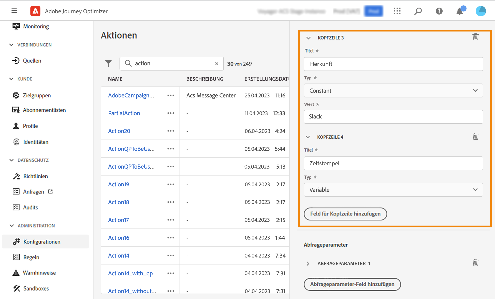
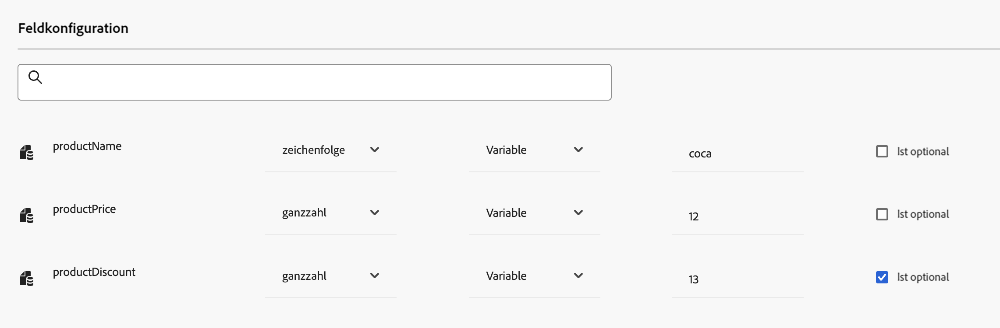

# Benutzerdefinierte Aktion konfigurieren {#configure-an-action}

>[!CONTEXTUALHELP]
>id="ajo_journey_action_custom_configuration"
>title="Benutzerdefinierte Aktionen"
>abstract="Wenn Sie zum Senden von Nachrichten ein Drittanbietersystem verwenden oder möchten, dass Journeys API-Aufrufe an ein Drittanbietersystem senden, verwenden Sie benutzerdefinierte Aktionen, um die Verbindung zu Ihrer Journey zu konfigurieren. Sie können beispielsweise mit benutzerdefinierten Aktionen eine Verbindung zu den folgenden Systemen herstellen: Epsilon, Slack, [Adobe-Entwickler](https://developer.adobe.com), Firebase usw."

Wenn Sie zum Senden von Nachrichten ein Drittanbietersystem verwenden oder möchten, dass Journeys API-Aufrufe an ein Drittanbietersystem senden, verwenden Sie benutzerdefinierte Aktionen, um die Verbindung zu Ihrer Journey zu konfigurieren. Sie können beispielsweise mit benutzerdefinierten Aktionen eine Verbindung zu den folgenden Systemen herstellen: Epsilon, Slack, [Adobe-Entwickler](https://developer.adobe.com){target=&quot;_blank&quot;}, Firebase usw.

Benutzerdefinierte Aktionen sind zusätzliche Aktionen, die von technischen Benutzern definiert und Marketing-Experten zur Verfügung gestellt werden. Nach der Konfiguration werden sie in der linken Palette Ihrer Journey im **[!UICONTROL Action]** Kategorie. Weitere Informationen finden Sie unter [diese Seite](../building-journeys/about-journey-activities.md#action-activities).

## Einschränkungen{#custom-actions-limitations}

Benutzerdefinierte Aktionen weisen einige Einschränkungen auf, die unter [diese Seite](../start/guardrails.md).

In benutzerdefinierten Aktionsparametern können Sie eine einfache Sammlung sowie eine Sammlung von Objekten übergeben. Weitere Informationen zu Sammlungsbeschränkungen in [diese Seite](../building-journeys/collections.md#limitations).

Beachten Sie außerdem, dass die Parameter für benutzerdefinierte Aktionen ein erwartetes Format aufweisen (Beispiel: Zeichenfolge, Dezimalzahl usw.). Sie müssen darauf achten, dass diese erwarteten Formate eingehalten werden. Weitere Informationen finden Sie hier . [Anwendungsfall](../building-journeys/collections.md).

## Einverständnis und Data Governance {#privacy}

In Journey Optimizer können Sie Data Governance- und Zustimmungsrichtlinien auf Ihre benutzerdefinierten Aktionen anwenden, um zu verhindern, dass bestimmte Felder in Drittanbietersysteme exportiert werden, oder Kunden ausschließen, die dem Empfang von E-Mail-, Push- oder SMS-Nachrichten nicht zugestimmt haben. Weitere Informationen finden Sie auf den folgenden Seiten:

* [Data Governance](../action/action.md).
* [Einverständnis](../action/action.md).

## Konfigurationsschritte {#configuration-steps}

Im Folgenden finden Sie die wichtigsten Schritte zum Konfigurieren einer benutzerdefinierten Aktion:

1. Wählen Sie im Menü ADMINISTRATION die Option **[!UICONTROL Configurations]**. Im  **[!UICONTROL Actions]** Abschnitt, klicken Sie auf **[!UICONTROL Manage]**. Klicken **[!UICONTROL Create Action]** , um eine neue Aktion zu erstellen. Der Konfigurationsbereich für die Aktion wird auf der rechten Seite des Bildschirms geöffnet.

   

1. Geben Sie einen Namen für die Aktion ein.

   >[!NOTE]
   >
   >Verwenden Sie keine Leerzeichen oder Sonderzeichen. Verwenden Sie nicht mehr als 30 Zeichen.

1. Fügen Sie Ihrer Aktion eine Beschreibung hinzu. Dieser Schritt ist optional.
1. Die Anzahl der Journeys, die diese Aktion verwenden, wird im **[!UICONTROL Used in]** -Feld. Sie können auf die **[!UICONTROL View journeys]** -Schaltfläche, um die Liste der Journeys anzuzeigen, die diese Aktion verwenden.
1. Definieren Sie die verschiedenen **[!UICONTROL URL Configuration]** Parameter. Siehe [diese Seite](../action/about-custom-action-configuration.md#url-configuration).
1. Konfigurieren Sie die **[!UICONTROL Authentication]** Abschnitt. Diese Konfiguration entspricht der für Datenquellen.  Siehe [diesem Abschnitt](../datasource/external-data-sources.md#custom-authentication-mode).
1. Definieren Sie die **[!UICONTROL Action parameters]**. Siehe [diese Seite](../action/about-custom-action-configuration.md#define-the-message-parameters).
1. Klicken **[!UICONTROL Save]**.

   Die benutzerdefinierte Aktion ist jetzt konfiguriert und kann in Ihren Journeys verwendet werden. Siehe [diese Seite](../building-journeys/about-journey-activities.md#action-activities).

   >[!NOTE]
   >
   >Wenn eine benutzerdefinierte Aktion in einer Journey verwendet wird, sind die meisten Parameter schreibgeschützt. Sie können die **[!UICONTROL Name]**, **[!UICONTROL Description]**, **[!UICONTROL URL]** und **[!UICONTROL Authentication]** Abschnitt.

## URL-Konfiguration {#url-configuration}

Beim Konfigurieren einer benutzerdefinierten Aktion müssen Sie Folgendes definieren **[!UICONTROL URL Configuration]** Parameter:

1. Im **[!UICONTROL URL]** Geben Sie die URL des externen Dienstes an:

   * Wenn die URL statisch ist, geben Sie die URL in dieses Feld ein.

   * Wenn die URL einen dynamischen Pfad enthält, geben Sie nur den statischen Teil der URL ein, d. h. das Schema, den Host, den Port und optional einen statischen Teil des Pfads.

      Beispiel: `https://xxx.yyy.com/somethingstatic/`

      Sie geben den dynamischen Pfad der URL an, wenn Sie die benutzerdefinierte Aktion zu einer Journey hinzufügen. [Weitere Infos](../building-journeys/using-custom-actions.md).
   >[!NOTE]
   >
   >Aus Sicherheitsgründen empfehlen wir dringend, das HTTPS-Schema für die URL zu verwenden. Die Verwendung nicht öffentlicher Adobe-Adressen und die Verwendung von IP-Adressen sind nicht zulässig.
   >
   >Beim Definieren einer benutzerdefinierten Aktion sind nur die Standardanschlüsse zulässig: 80 für http und 443 für https.

1. Auswählen des Aufrufs **[!UICONTROL Method]**: kann **[!UICONTROL POST]** oder **[!UICONTROL PUT]**.

   >[!NOTE]
   >
   > Die **DELETE** -Methode wird nicht unterstützt. Wenn Sie eine vorhandene Ressource aktualisieren müssen, wählen Sie die **PUT** -Methode.

1. Im **[!UICONTROL Headers]** definieren Sie die HTTP-Header der Anforderungsnachricht, die an den externen Dienst gesendet werden soll:
   1. Um ein Kopfzeilenfeld hinzuzufügen, klicken Sie auf **[!UICONTROL Add a header field]**.
   1. Geben Sie den Schlüssel des Header-Felds ein.
   1. Um einen dynamischen Wert für das Schlüssel-Wert-Paar festzulegen, wählen Sie **[!UICONTROL Variable]**. Andernfalls wählen Sie **[!UICONTROL Constant]**.

      Beispielsweise können Sie für einen Zeitstempel einen dynamischen Wert festlegen.

   1. Wenn Sie **[!UICONTROL Constant]** und geben Sie dann den Konstantenwert ein.

      Wenn Sie **[!UICONTROL Variable]** festgelegt ist, geben Sie diese Variable an, wenn Sie die benutzerdefinierte Aktion einer Journey hinzufügen. [Weitere Infos](../building-journeys/using-custom-actions.md).

      

   1. Um ein Kopfzeilenfeld zu löschen, zeigen Sie auf das Kopfzeilenfeld und klicken Sie auf das **[!UICONTROL Delete]** Symbol.
   Die **[!UICONTROL Content-Type]** und **[!UICONTROL Charset]** Header-Felder werden standardmäßig festgelegt. Sie können diese Felder nicht ändern oder löschen.

   Nachdem Sie die benutzerdefinierte Aktion zu einer Journey hinzugefügt haben, können Sie ihr weiterhin Kopfzeilenfelder hinzufügen, wenn sich die Journey im Entwurfsstatus befindet. Wenn Sie nicht möchten, dass die Journey von Konfigurationsänderungen betroffen ist, duplizieren Sie die benutzerdefinierte Aktion und fügen Sie die Kopfzeilenfelder zur neuen benutzerdefinierten Aktion hinzu.

   >[!NOTE]
   >
   >Kopfzeilen werden gemäß den Feldanalyseregeln validiert. Weitere Informationen finden Sie unter [diese Dokumentation](https://tools.ietf.org/html/rfc7230#section-3.2.4){_blank}.

## Definieren der Aktionsparameter {#define-the-message-parameters}

Im **[!UICONTROL Action parameters]** ein Beispiel der JSON-Payload ein, die an den externen Dienst gesendet werden soll.

>[!NOTE]
>
>Das Payload-Beispiel darf keine Nullwerte enthalten. Feldnamen in der Payload dürfen keinen &quot;.&quot;enthalten. Zeichen. Sie können nicht mit einem &quot;$&quot;-Zeichen beginnen.

Sie können den Parametertyp definieren (z. B.: Zeichenfolge, Ganzzahl usw.).

Sie können auch angeben, ob ein Parameter eine Konstante oder eine Variable ist:

* Konstante bedeutet, dass der Wert des Parameters im Aktionskonfigurationsbereich von einer technischen Person definiert wird. Der Wert ist über Journeys hinweg immer gleich. Sie ändert sich nicht und wird dem Marketing-Experten nicht angezeigt, wenn er die benutzerdefinierte Aktion in der Journey verwendet. Es kann sich beispielsweise um eine ID handeln, die das Drittanbietersystem erwartet. In diesem Fall ist das Feld rechts neben der Umschalter-Konstante/Variablen der übergebene Wert.
* Variable bedeutet, dass der Wert des Parameters variiert. Marketingexperten, die diese benutzerdefinierte Aktion in einer Journey verwenden, können den gewünschten Wert weitergeben oder angeben, wo der Wert für diesen Parameter abgerufen werden soll (z. B. vom Ereignis, von Adobe Experience Platform usw.). In diesem Fall ist das Feld rechts neben der Umschalter-Konstante/Variable das Beschriftungsfeld, das Marketing-Experten in der Journey sehen, um diesen Parameter zu benennen.

