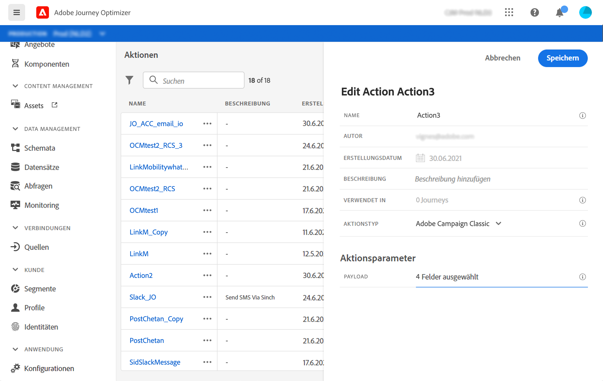

# Integrieren mit Adobe Campaign v7/v8 {#integrating-with-adobe-campaign-classic}

Diese Integration ist für Adobe Campaign Classic v7 ab Version 21.1 und Adobe Campaign v8 verfügbar. Sie ermöglicht Ihnen das Senden von E-Mails, Push-Benachrichtigungen und SMS mit der Transaktionsnachrichten-Funktion von Adobe Campaign.

Die Verbindung zwischen den Journey Optimizer- und Campaign-Instanzen wird von Adobe zur Bereitstellungszeit eingerichtet.

In diesem [Abschnitt](../building-journeys/campaign-classic-use-case.md) wird ein Anwendungsfall vollständig beschrieben.

Für jede konfigurierte Aktion ist eine Aktionsaktivität in der Journey-Designer-Palette verfügbar. Siehe diesen [Abschnitt](../building-journeys/using-adobe-campaign-classic.md).

## Wichtige Hinweise      

* Es gibt keine Drosselung der Nachrichten. Wir begrenzen die Anzahl der Nachrichten, die versendet werden können, basierend auf unserem aktuellen Campaign SLA auf 50.000/Stunde. Aus diesem Grund sollte Journey Optimizer nur in Einzelanwendungsfällen verwendet werden (einzelne Ereignisse, keine Segmente).

* Sie müssen für jede Vorlage, die Sie verwenden möchten, eine Aktion auf der Arbeitsfläche konfigurieren. Sie müssen für jede Vorlage, die Sie in Adobe Campaign verwenden möchten, in Journey Optimizer eine Aktion konfigurieren.

* Es wird empfohlen, eine dedizierte Message Center-Instanz zu verwenden, die für diese Integration gehostet wird, um zu vermeiden, dass andere Campaign-Vorgänge, die Sie vielleicht gerade ausführen, beeinträchtigt werden. Der Marketing-Server kann gehostet oder On-Premise bereitgestellt werden. Der erforderliche Build ist Release Candidate 21.1 oder höher.

* Es wird nicht überprüft, ob die Payload oder Campaign-Nachricht korrekt ist.

* Sie können keine Campaign-Aktion mit einem Segmentqualifikationsereignis verwenden.

## Voraussetzungen   

Sie müssen in Campaign eine Transaktionsnachricht und das zugehörige Ereignis erstellen und veröffentlichen. Weitere Informationen finden Sie in der [Adobe Campaign-Dokumentation](https://experienceleague.adobe.com/docs/campaign-classic/using/transactional-messaging/introduction/about-transactional-messaging.html?lang=de#transactional-messaging){target=&quot;_blank&quot;}.

Sie können Ihre JSON-Payload entsprechend den folgenden Mustern für jede Nachricht erstellen. Sie fügen diese Payload dann beim Konfigurieren der Aktion in Journey Orchestration ein (siehe unten).

Siehe folgendes Beispiel:

```
{
    "channel": "email",
    "eventType": "welcome",
    "email": "Email address",
    "ctx": {
        "firstName": "First name"
    }
}
```

* **channel**: der Kanal, der für Ihre Campaign-Transaktionsvorlage definiert ist
* **eventType**: der interne Name Ihres Campaign-Ereignisses
* **ctx**: die Variable basierend auf der Personalisierung, die Sie in Ihrer Nachricht haben

## Konfigurieren der Aktion

In Journey Optimizer müssen Sie eine Aktion pro Transaktionsnachricht konfigurieren. Führen Sie folgende Schritte aus:

1. Erstellen Sie eine neue Aktion. Siehe diesen [Abschnitt](../action/action.md).
1. Geben Sie einen Namen und eine Beschreibung ein.
1. Wählen Sie im Feld **Aktionstyp** **Adobe Campaign Classic** aus.
1. Klicken Sie in das Feld **Payload** und fügen Sie ein Beispiel der JSON-Payload ein, die der Campaign-Nachricht entspricht. Wenden Sie sich an Adobe, um diese Payload zu erhalten.
1. Stellen Sie die verschiedenen Felder auf der Journey-Arbeitsfläche je nach gewünschter Zuordnung auf statisch oder variabel ein. Bestimmte Felder, wie z. B. Kanalparameter für E-Mail-Adressen- und Personalisierungsfelder (ctx), sollten als Variablen für die Zuordnung im Kontext der Journey definiert werden.
1. Klicken Sie auf **Speichern**.




