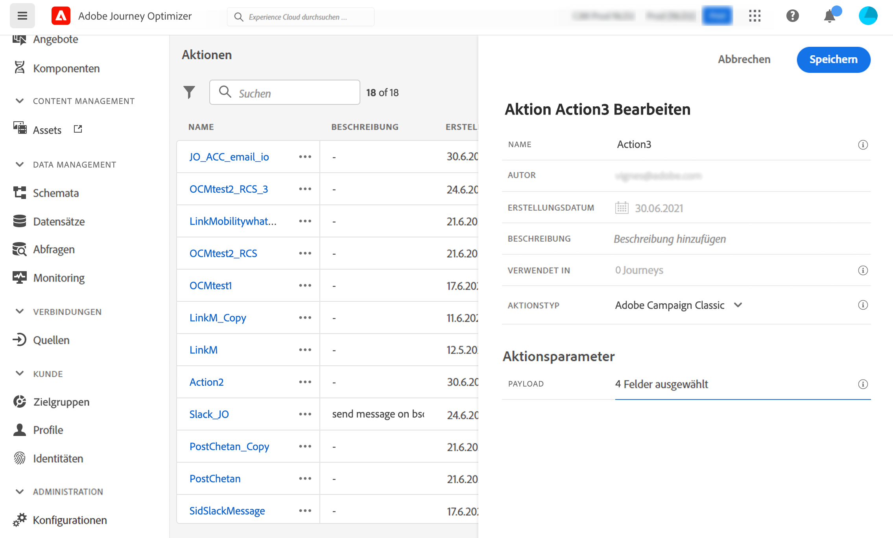

# Integrieren mit Adobe Campaign v7/v8 {#integrating-with-adobe-campaign-v7-v8}

>[!CONTEXTUALHELP]
>id="ajo_journey_action_acc"
>title="Aktionen in Adobe Campaign v7/v8"
>abstract="Diese Integration ist für Adobe Campaign v7 und v8 verfügbar. Sie ermöglicht Ihnen das Senden von E-Mails, Push-Benachrichtigungen und SMS mit der Transaktionsnachrichtenfunktion von Adobe Campaign. Die Verbindung zwischen der Journey Optimizer- und der Campaign-Instanz wird bei der Bereitstellung von Adobe hergestellt."

Für Adobe Campaign Classic v7 oder Campaign v8 ist in den Journeys eine spezifische benutzerdefinierte Aktion zum Integrieren von Adobe Journey Optimizer und Adobe Campaign verfügbar. Diese Integration ermöglicht das Senden von E-Mails, Push-Benachrichtigungen und SMS mit der Transaktionsnachrichtenfunktion von Adobe Campaign. Weitere Informationen sind in diesem [End-to-End-Anwendungsfall](../building-journeys/ajo-ac.md) verfügbar.

Für jede konfigurierte Aktion ist eine [Kampagnen-Aktionsaktivität](../building-journeys/using-adobe-campaign-v7-v8.md) in der Journey-Designer-Palette verfügbar.

## Aktivierung {#access}

Die Verbindung zwischen der Journey Optimizer- und der Adobe Campaign-Umgebung wird bei der Bereitstellung von Adobe eingerichtet. Wenn Sie die Verbindung zum Zeitpunkt der Bereitstellung noch nicht angefordert haben, können Sie die Aktivierung beim Adobe Journey Optimizer-Support anfordern. Die folgenden Details müssen angegeben werden:

>[!BEGINTABS]

>[!TAB Für Adobe Journey Optimizer]

* Organisations-ID (Adobe OrgID)
* Sandbox-Name

>[!TAB Für Adobe Campaign]

* Campaign-Server-URL
* Echtzeit-Server-URL
* Die Adobe Campaign-Version

>[!ENDTABS]


## Schutzmechanismen und Einschränkungen {#important-notes}

* Es gibt keine Drosselung von Nachrichten. Auf der Basis des aktuellen Campaign-SLA begrenzt das System die Anzahl der Nachrichten, die gesendet werden können, auf 4.000 pro 5 Minuten. Aus diesem Grund sollte Journey Optimizer nur in unitären Anwendungsfällen (einzelne Ereignisse, nicht für Zielgruppen) verwendet werden.

* Sie müssen für jede Vorlage, die verwendet werden soll, eine Aktion auf der Arbeitsfläche konfigurieren. Sie müssen für jede Vorlage, die Sie von Adobe Campaign verwenden möchten, eine Aktion in Journey Optimizer konfigurieren.

* Es wird empfohlen, ein dediziertes gehostetes Message Center oder eine Managed Services-Instanz für diese Integration zu verwenden, um zu vermeiden, dass andere Campaign-Vorgänge, die vielleicht gerade ausgeführt werden, beeinträchtigt werden. Der Marketing-Server kann gehostet oder On-Premise bereitgestellt werden.<!--The build required is 21.1 Release Candidate or greater. -->

* Es wird nicht überprüft, ob die Payload oder Campaign-Nachricht korrekt ist.

* Sie können eine Campaign-Aktion nicht mit einem Zielgruppen-Qualifizierungsereignis verwenden.

## Voraussetzungen {#prerequisites}

Sie müssen eine Transaktionsnachricht und das zugehörige Ereignis in Campaign erstellen und veröffentlichen. Weitere Informationen finden Sie in der [Dokumentation zu Adobe Campaign](https://experienceleague.adobe.com/de/docs/campaign/campaign-v8/send/real-time/transactional){target="_blank"}.

Sie können Ihre JSON-Payload entsprechend jeder Nachricht nach dem folgenden Muster aufbauen. Diese Payload muss dann beim Konfigurieren der Aktion in Journey Optimizer eingefügt werden (siehe unten).

+++ Beispiel

```json
{
    "channel": "email",
    "eventType": "welcome",
    "email": "Email address",
    "ctx": {
        "firstName": "First name"
    }
}
```

* **channel**: der für Ihre Campaign-Transaktionsvorlage definierte Kanal
* **eventType**: der interne Namen Ihres Campaign-Ereignisses
* **ctx**: die Variable basierend auf der Personalisierung in der Nachricht

+++

## Konfigurieren der Aktion {#configure-action}

In Journey Optimizer muss eine Aktion pro Transaktionsnachricht konfiguriert werden.

Gehen Sie wie folgt vor, um eine Campaign-Aktion zu erstellen:

1. Erstellen Sie eine neue Aktion. [Erfahren Sie mehr zum Erstellen benutzerdefinierter Aktionen](../action/action.md).
1. Geben Sie einen Namen und eine Beschreibung ein.
1. Wählen Sie im Feld **[!UICONTROL Aktionstyp]** die Option **[!UICONTROL Adobe Campaign Classic]** aus.
   
1. Klicken Sie in das Feld **[!UICONTROL Payload]** und fügen Sie ein Beispiel der JSON-Payload ein, die der Campaign-Nachricht entspricht. Wenden Sie sich an Adobe, um diese Payload zu erhalten.
1. Jedes Feld muss entweder als statisch oder als variabel festgelegt werden, je nachdem, ob es auf der Journey-Arbeitsfläche zugeordnet werden soll. Beispielsweise sollten Felder wie E-Mail-Kanalparameter und Personalisierungsfelder (`ctx`) normalerweise als Variablen festgelegt werden, damit sie sich innerhalb der Journey dynamisch anpassen können.
1. Klicken Sie auf **[!UICONTROL Speichern]**.

## Vorhandene Aktion aktualisieren {#update-action}

Wenn Sie eine vorhandene benutzerdefinierte Aktion von Campaign v7/v8 aktualisieren müssen, z. B. wenn sich der Echtzeit-Endpunkt (RT) nach der Ersteinrichtung ändert, führen Sie die folgenden Schritte aus:

1. Wählen Sie im Menü **[!UICONTROL Administration]** die Option **[!UICONTROL Konfigurationen]** aus und navigieren Sie dann zu **[!UICONTROL Aktionen]**.
1. Suchen Sie die Campaign-Aktion, die Sie aktualisieren möchten, und wählen Sie sie in der Liste Aktionen aus.
1. Klicken Sie **[!UICONTROL Bearbeiten]**, um die Aktionskonfiguration zu öffnen.
1. Aktualisieren Sie das Feld **[!UICONTROL URL]** mit der neuen RT-Endpunkt-URL. Stellen Sie sicher, dass das Endpunktformat korrekt und erreichbar ist.
1. Aktualisieren Sie bei Bedarf die **[!UICONTROL Payload]**-Konfiguration, um sie an Änderungen in der Transaktionsnachrichtenstruktur von Campaign anzupassen.
1. Klicken Sie **[!UICONTROL Test]**, um die Verbindung zum neuen Endpunkt zu überprüfen. Vergewissern Sie sich, dass der Test eine erfolgreiche Antwort zurückgibt, bevor Sie fortfahren.
1. Klicken Sie nach der Validierung auf **[!UICONTROL Speichern]**, um Ihre Änderungen anzuwenden.

>[!NOTE]
>
>Alle Journey, die diese Aktion verwenden, verwenden automatisch die aktualisierte Konfiguration. Wenn Sie Live-Journey haben, die diese Aktion verwenden, überwachen Sie sie nach der Aktualisierung des Endpunkts genau, um einen ordnungsgemäßen Nachrichtenversand sicherzustellen.

