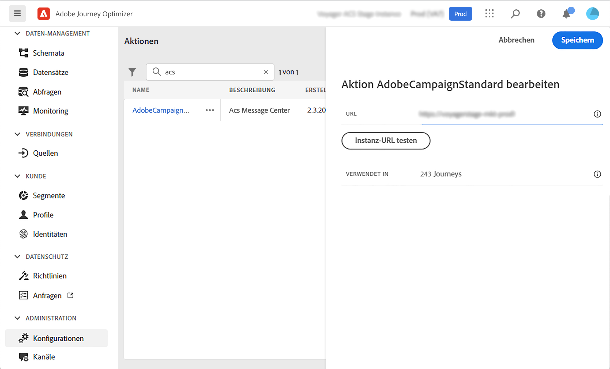
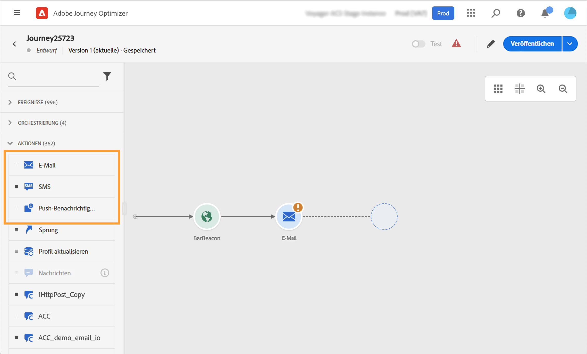

# Integration mit Adobe Campaign Standard {#using_adobe_campaign_standard}

Mit der Transaktionsnachrichten-Funktion von Adobe Campaign Standard können Sie E-Mails, Push-Benachrichtigungen und SMS senden.

Wenn Sie über Adobe Campaign Standard verfügen, ist eine integrierte Aktion verfügbar, die die Verbindung zu Adobe Campaign Standard ermöglicht.

Die Transaktionsnachricht in Campaign Standard und das zugehörige Ereignis müssen veröffentlicht werden, damit sie in Journey Optimizer verwendet werden können. Wenn das Ereignis veröffentlicht wird, die Nachricht jedoch nicht, wird sie nicht in der Benutzeroberfläche von Journey Optimizer angezeigt. Wenn die Nachricht veröffentlicht wird, das zugehörige Ereignis jedoch nicht, wird sie in der Benutzeroberfläche von Journey Optimizer angezeigt, sie kann jedoch nicht verwendet werden.

## Wichtige Hinweise {#important-notes}

* Für Adobe Campaign Standard-Aktionen wird automatisch eine Begrenzungsregel von 4.000 Aufrufen pro 5 Minuten definiert. Dies entspricht dem offiziellen Umfang von Transaktionsnachrichten in Adobe Campaign Standard. Lesen Sie mehr über Service-Level-Vereinbarungen für Transaktionsnachrichten in der [Produktbeschreibung von Adobe Campaign Standard](https://helpx.adobe.com/de/legal/product-descriptions/campaign-standard.html).

* Die Adobe Campaign Standard-Integration wird über eine dedizierte integrierte Aktion in der Aktionsliste eingerichtet. Dies muss für jede Sandbox konfiguriert werden.

* Sie können eine Campaign Standard-Aktion nicht mit den Aktivitäten „Zielgruppen-Qualifizierung“ oder „Zielgruppe lesen“ verwenden.

* Eine Journey kann nicht sowohl Nachrichten als auch Campaign Standard-Aktionen verwenden.

## Konfigurieren der Aktion {#configure-action}

Im Folgenden werden die Konfigurationsschritte beschrieben:

1. Wählen Sie **[!UICONTROL Konfigurationen]** im Menüabschnitt ADMINISTRATION aus. Klicken Sie im Abschnitt **[!UICONTROL Aktionen]** auf **[!UICONTROL Verwalten]**. Die Liste der Aktionen wird angezeigt.

1. Wählen Sie die integrierte **[!UICONTROL AdobeCampaignStandard]**-Aktion aus. Der Bereich für die Konfiguration der Aktion wird auf der rechten Seite des Bildschirms geöffnet.

   

1. Kopieren Sie die URL der Adobe Campaign Standard-Instanz und fügen Sie sie in das Feld **[!UICONTROL URL]** ein.

1. Klicken Sie auf **[!UICONTROL Instanz-URL testen]**, um die Gültigkeit der Instanz zu testen.

   >[!NOTE]
   >
   >Dieser Test bestätigt Folgendes:
   >
   >Der Host ist „.campaign.adobe.com“, „.campaign-sandbox.adobe.com“, „.campaign-demo.adobe.com“, „.ats.adobe.com“ oder „.adls.adobe.com“.
   >
   >Die URL beginnt mit https.
   >
   >Die mit dieser Adobe Campaign Standard-Instanz verknüpfte ORG ist identisch mit der ORG von Journey Optimizer.

Bei der Gestaltung Ihrer Journey stehen in der Kategorie **[!UICONTROL Aktion]** drei Aktionen zur Verfügung: **[!UICONTROL E-Mail]**, **[!UICONTROL Push]**, **[!UICONTROL SMS]** (siehe [Verwenden von Adobe Campaign-Aktionen](../building-journeys/using-adobe-campaign-standard.md)).

Sie können das Ereignis **Reaktionen** verwenden, um auf Tracking-Daten zu reagieren, die sich auf eine Campaign Standard-Nachricht beziehen, die innerhalb derselben Journey gesendet wird. Bei Push-Benachrichtigungen können Sie auf angeklickte, gesendete oder fehlgeschlagene Nachrichten reagieren. Bei SMS-Nachrichten können Sie auf gesendete oder fehlgeschlagene Nachrichten reagieren. Bei E-Mails können Sie auf angeklickte, gesendete, geöffnete oder fehlgeschlagene Nachrichten reagieren. Siehe [Reaktionsereignisse](../building-journeys/reaction-events.md).

Wenn Sie zum Senden von Nachrichten ein Drittanbietersystem verwenden, müssen Sie eine benutzerdefinierte Aktion hinzufügen und konfigurieren. Siehe [Informationen zur Konfiguration einer benutzerdefinierten Aktion](../action/about-custom-action-configuration.md).