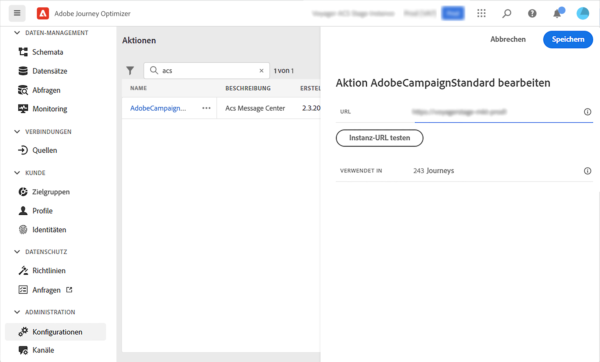

# Integration mit Adobe Campaign Standard {#using_adobe_campaign_standard}

Sie können E-Mails, Push-Benachrichtigungen und SMS mithilfe der Transaktionsnachrichten-Funktionen von Adobe Campaign Standard senden.

Wenn Sie über Adobe Campaign Standard verfügen, ist eine integrierte Aktion verfügbar, die die Verbindung zu Adobe Campaign Standard ermöglicht.

Die Transaktionsnachricht von Campaign Standard und das zugehörige Ereignis müssen veröffentlicht werden, damit sie in Journey Optimizer verwendet werden können. Wenn das Ereignis veröffentlicht wurde, die Nachricht jedoch nicht, wird sie nicht in der Benutzeroberfläche von Journey Optimizer angezeigt. Wenn die Nachricht veröffentlicht wurde, das zugehörige Ereignis jedoch nicht, wird sie in der Benutzeroberfläche von Journey Optimizer angezeigt, sie kann jedoch nicht verwendet werden.

## Wichtige Hinweise {#important-notes}

* Für Adobe Campaign Standard-Aktionen wird automatisch eine Begrenzungsregel von 4000 Aufrufen pro 5 Minuten definiert. Dies entspricht dem offiziellen Umfang der Transaktionsnachrichten in Adobe Campaign Standard. Mehr über SLAs für Transaktionsnachrichten in [Adobe Campaign Standard - Produktbeschreibung](https://helpx.adobe.com/legal/product-descriptions/campaign-standard.html).

* Die Integration von Adobe Campaign Standard erfolgt über eine dedizierte integrierte Aktion in der Aktionsliste. Dies muss für jede Sandbox konfiguriert werden.

* Sie können keine Campaign Standard-Aktion mit der Aktivität Segmentqualifizierung oder Segment lesen verwenden.

* Eine Journey kann nicht sowohl Nachrichten als auch Campaign Standard-Aktionen verwenden.

## Konfiguration der Aktion {#configure-action}

Im Folgenden finden Sie die Schritte zur Konfiguration:

1. Auswählen **[!UICONTROL Configurations]** im Menü ADMINISTRATION . Im  **[!UICONTROL Actions]** Abschnitt, klicken Sie auf **[!UICONTROL Manage]**. Die Liste der Aktionen wird angezeigt.

1. Auswählen des integrierten **[!UICONTROL AdobeCampaignStandard]** Aktion. Der Konfigurationsbereich für die Aktion wird auf der rechten Seite des Bildschirms geöffnet.

   

1. Kopieren Sie die URL Ihrer Adobe Campaign Standard-Instanz und fügen Sie sie in die **[!UICONTROL URL]** -Feld.

1. Klicken Sie auf **[!UICONTROL Test the instance URL]** , um die Gültigkeit der Instanz zu testen.

   >[!NOTE]
   >
   >Mit diesem Test wird Folgendes überprüft:
   >
   >Der Host ist &quot;.campaign.adobe.com&quot;, &quot;.campaign-sandbox.adobe.com&quot;, &quot;.campaign-demo.adobe.com&quot;, &quot;.ats.adobe.com&quot;oder &quot;.adls.adobe.com&quot;.
   >
   >Die URL beginnt mit https,
   >
   >Die mit dieser Adobe Campaign Standard-Instanz verknüpfte ORG ist mit der ORG von Journey Optimizer identisch.

Beim Entwerfen Ihrer Journey stehen im **[!UICONTROL Action]** category: **[!UICONTROL Email]**, **[!UICONTROL Push]**, **[!UICONTROL SMS]** (siehe [Verwenden von Adobe Campaign-Aktionen](../building-journeys/using-adobe-campaign-standard.md)).

Sie können eine **Reaktionen** -Ereignis verwenden, um auf Tracking-Daten zu reagieren, die sich auf eine in derselben Journey gesendete Campaign Standard-Nachricht beziehen. Bei Push-Benachrichtigungen können Sie auf angeklickte, gesendete oder fehlgeschlagene Nachrichten reagieren. Bei SMS-Nachrichten können Sie auf gesendete oder fehlgeschlagene Nachrichten reagieren. Bei E-Mails können Sie auf angeklickte, gesendete, geöffnete oder fehlgeschlagene Nachrichten reagieren. Siehe [Reaktionsereignisse](../building-journeys/reaction-events.md).

Wenn Sie zum Senden von Nachrichten ein Drittanbietersystem verwenden, müssen Sie eine benutzerdefinierte Aktion hinzufügen und konfigurieren. Siehe [Über die Konfiguration benutzerdefinierter Aktionen](../action/about-custom-action-configuration.md).
