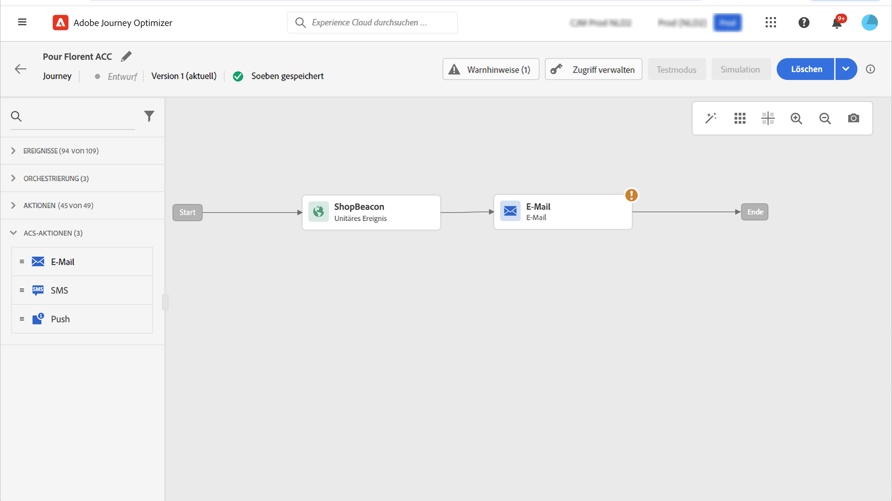

# Integration mit Adobe Campaign Standard {#using_adobe_campaign_standard}

Wenn Sie über Adobe Campaign Standard verfügen, ist eine integrierte Aktion verfügbar, um die Verbindung zu Adobe Campaign Standard zuzulassen. Mit der Transaktionsnachrichten-Funktion von Adobe Campaign Standard können Sie E-Mails, Push-Benachrichtigungen und SMS senden.

Die Transaktionsnachricht in Campaign Standard und das zugehörige Ereignis müssen veröffentlicht werden, damit sie in Journey Optimizer verwendet werden können. Wenn das Ereignis veröffentlicht wird, die Nachricht jedoch nicht, wird sie nicht in der Benutzeroberfläche von Journey Optimizer angezeigt. Wenn die Nachricht veröffentlicht wird, das zugehörige Ereignis jedoch nicht, wird sie in der Benutzeroberfläche von Journey Optimizer angezeigt, sie kann jedoch nicht verwendet werden.

## Schutzmechanismen und Einschränkungen {#important-notes}

* Für Adobe Campaign Standard-Aktionen wird automatisch eine Begrenzungsregel von 4.000 Aufrufen pro 5 Minuten definiert. Lesen Sie mehr über Service-Level-Vereinbarungen für Transaktionsnachrichten in der [Produktbeschreibung von Adobe Campaign Standard](https://helpx.adobe.com/de/legal/product-descriptions/campaign-standard.html){target="_blank"}.

* Die Adobe Campaign Standard-Integration wird über eine dedizierte integrierte Aktion in der Aktionsliste eingerichtet. Dies muss für jede Sandbox konfiguriert werden.

* Sie können eine Campaign Standard-Aktion nicht mit den Aktivitäten „Zielgruppen-Qualifizierung“ oder „Zielgruppe lesen“ verwenden.

* Eine Journey kann nicht sowohl [integrierte Kanalaktionen) ](../building-journeys/journeys-message.md) [Campaign Standard-Aktionen](../building-journeys/using-adobe-campaign-standard.md) verwenden.

## Konfigurieren der Aktion {#configure-action}

In Journey Optimizer müssen Sie eine Aktion pro Transaktionsnachricht konfigurieren.

Gehen Sie wie folgt vor, um eine Campaign Standard-Aktion zu konfigurieren:

1. Wählen **[!UICONTROL Konfigurationen]** im Menüabschnitt ADMINISTRATION aus.

1. Klicken Sie im Abschnitt **[!UICONTROL Aktionen]** auf **[!UICONTROL Verwalten]**. Die Liste der Aktionen wird angezeigt.

1. Wählen Sie die integrierte **[!UICONTROL AdobeCampaignStandard]**-Aktion aus. Der Bereich für die Aktionskonfiguration wird auf der rechten Seite des Bildschirms geöffnet.

   

1. Kopieren Sie die URL der Adobe Campaign Standard-Instanz und fügen Sie sie in das Feld **[!UICONTROL URL]** ein.

1. Klicken Sie auf **[!UICONTROL Instanz-URL testen]**, um die Gültigkeit der Instanz zu testen.

   >[!NOTE]
   >
   >Dieser Test bestätigt Folgendes:
   >
   >* Der Host ist &quot;.campaign.adobe.com“, &quot;.campaign-sandbox.adobe.com“, &quot;.campaign-demo.adobe.com“, &quot;.ats.adobe.com“ oder &quot;.adobe.com“
   >
   >* Die URL beginnt mit https
   >
   >* Die mit dieser Adobe Campaign Standard-Instanz verknüpfte Organisation ist dieselbe wie die OrganizationRG von Journey Optimizer

Sobald diese Konfiguration abgeschlossen ist, stehen in der Kategorie **[!UICONTROL Aktion]** beim Entwerfen einer Journey drei Aktionen zur Verfügung: **[!UICONTROL E-Mail]**, **[!UICONTROL Push]**, **[!UICONTROL SMS]**. [Erfahren Sie, wie Sie sie verwenden](../building-journeys/using-adobe-campaign-standard.md).

Verwenden Sie **Ereignis &quot;**&quot;, um auf Tracking-Daten zu reagieren, die sich auf eine Campaign Standard-Nachricht beziehen, die innerhalb derselben Journey gesendet wird:

* Bei Push-Benachrichtigungen können Journey auf angeklickte, gesendete oder fehlgeschlagene Nachrichten reagieren.

* Bei SMS-Nachrichten können Journey auf gesendete oder fehlgeschlagene Nachrichten reagieren.

* Bei E-Mails können Journey auf angeklickte, gesendete, geöffnete oder fehlgeschlagene Nachrichten reagieren. [Weitere Informationen zu Reaktionsereignissen](../building-journeys/reaction-events.md).

Wenn Sie zum Senden von Nachrichten ein Drittanbietersystem verwenden, müssen Sie eine benutzerdefinierte Aktion hinzufügen und konfigurieren. [Erfahren Sie mehr über die Konfiguration benutzerdefinierter Aktionen](../action/about-custom-action-configuration.md).