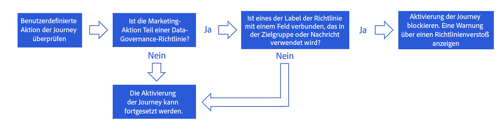
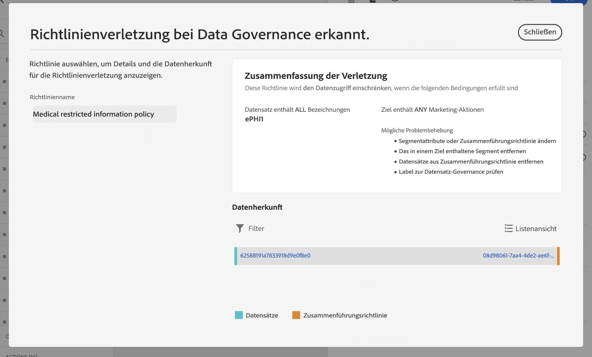

# Data Governance {#restrict-fields}

>[!CONTEXTUALHELP]
>id="ajo_data_governance_policy_violation"
>title="Verstöße gegen Data Governance-Richtlinien"
>abstract="Wenn das System ein eingeschränktes Feld in einer Journey/Kampagne oder eine benutzerdefinierte Aktion identifiziert, wird ein Fehler angezeigt, der die Veröffentlichung verhindert. Verwenden Sie das Datenherstellungsdiagramm in diesem Dialogfeld, um zu verstehen, welche anderen Konfigurationsänderungen erforderlich sind, bevor Sie Ihre Journey oder Kampagne aktivieren können."

>[!AVAILABILITY]
>
>Diese Seite enthält Informationen zu Verbesserungen, die derzeit nur für ausgewählte Kunden verfügbar sind.

## Erste Schritte mit Data Governance-Richtlinien {#gs}

Mit dem DULE-Framework (Data Usage Labeling and Enforcement)](https://experienceleague.adobe.com/docs/experience-platform/data-governance/home.html?lang=de){_blank} können Sie mit Adobe Experience Platform kanalübergreifende Data Governance-Richtlinien verwalten und durchsetzen, indem Sie Ihre Felder **beschriften und** Marketing-Aktionen **für jeden Kanal erstellen.[**

Sobald Beschriftungen und Marketing-Aktionen definiert sind, können Sie **Data Governance-Richtlinien** erstellen, die diese beiden Elemente verknüpfen. Sie können beispielsweise eine Richtlinie einrichten, die eine ePHI-Bezeichnung mit einer Marketing-Aktion &quot;E-Mail-Zielgruppenbestimmung&quot;verknüpft, um sicherzustellen, dass keine mit &quot;ePHI&quot;gekennzeichneten Felder zur Personalisierung von E-Mail-Nachrichten verwendet werden. [Erfahren Sie, wie Sie Data Governance-Richtlinien erstellen](#governance-policies)

Nachdem Sie die Governance-Richtlinien erstellt haben, können Sie die Marketing-Aktionen auf Ihre Journey/Kampagnen und benutzerdefinierten Aktionen für Journey anwenden.
[Erfahren Sie, wie Sie Marketing-Aktionen in Journey Optimizer anwenden](#apply-marketing-actions)

Beim Erstellen einer Journey oder Kampagne überprüft das System nach Auswahl einer Kanalkonfiguration oder Hinzufügen einer benutzerdefinierten Aktion, ob die Marketing-Aktion in der Konfiguration des Nachrichtenkanals oder die benutzerdefinierte Aktion Teil einer Data Governance-Richtlinie ist. In diesem Fall prüft das System, ob Felder aus der Zielgruppe oder der Nachrichtenpersonalisierung durch die Richtlinie gekennzeichnet und eingeschränkt werden. Wenn eine solche Bezeichnung erkannt wird, wird die Veröffentlichung der Journey oder Kampagne blockiert. [Erfahren Sie, wie Sie Verstöße gegen Data Governance-Richtlinien erkennen](#violation)

## Erstellen von Bezeichnungen und Marketing-Aktionen {#labels-marketing-actions}

Der erste Schritt zur Durchsetzung von Data Governance-Richtlinien besteht darin, Beschriftungen zu erstellen und sie an Felder anzuhängen, für die Sie die Nutzung einschränken möchten, sowie Marketing-Aktionen für jeden Ihrer Kanäle.

1. Klicken Sie im linken Menü unter **Datenschutz** auf **Richtlinien**.

1. Wählen Sie die Registerkarte **Bezeichnungen** und klicken Sie auf **Bezeichnung erstellen**.

1. Definieren Sie einen Namen und einen Anzeigenamen für Ihre Bezeichnung. Beispiel: _ePHI1_.

1. Klicken Sie im linken Menü unter **Daten-Management** auf **Schemata** und dann auf die Schaltfläche **Anwenden von Zugriffs- und Data Governance-Beschriftungen**. Wählen Sie Ihr Schema und Ihr Feld aus (z. B. &quot;Bluttyp&quot;) und wählen Sie die zuvor erstellte Bezeichnung _ePHI1_ in unserem Beispiel aus.

   

1. Gehen Sie zurück zum Menü **Richtlinien**, wählen Sie die Registerkarte **Marketing-Aktion** und klicken Sie auf **Marketing-Aktion erstellen**. Es wird empfohlen, für jeden Kanal eine Marketing-Aktion und für jede benutzerdefinierte Aktion eines Drittanbieters zu erstellen, die in Ihren Journey verwendet wird. Erstellen wir beispielsweise eine _Slack-Marketing-Aktion_, die für Ihre benutzerdefinierte Slack-Aktion verwendet wird.

   

## Erstellen einer Data Governance-Richtlinie {#policy}

Nachdem Bezeichnungen und Marketing-Aktionen erstellt wurden, können Sie sie mit Data Governance-Richtlinien verknüpfen. Wählen Sie dazu die Registerkarte **Durchsuchen**, klicken Sie auf **Richtlinie erstellen** und wählen Sie **Data Governance-Richtlinie** aus. Wählen Sie Ihre Bezeichnung (_ePHI1_) und Marketing-Aktion (_Slack-Marketing-Aktion_) aus.

Wenn Sie in einer Journey Ihre benutzerdefinierte Aktion für Slack verwenden, die mit der _Slack-Marketing-Aktion_ konfiguriert ist, wird die zugehörige Richtlinie genutzt.

## Anwenden von Marketing-Aktionen in Journey Optimizer {#apply-marketing-actions}

Damit Data Governance-Richtlinien in Journey Optimizer durchgesetzt werden können, müssen Sie Marketing-Aktionen auf Ihre Journey, Kampagnen oder benutzerdefinierten Aktionen anwenden.

### Anwenden von Marketing-Aktionen auf Journey und Kampagnen {#journeys-campaigns}

Nachdem Sie Governance-Richtlinien erstellt haben, müssen Sie die entsprechenden Marketing-Aktionen in Ihren Journey Optimizer **Kanalkonfigurationen** anwenden. Gehen Sie dazu wie folgt vor:

1. Rufen Sie das Menü **[!UICONTROL Kanäle]** > **[!UICONTROL Allgemeine Einstellungen]** > **[!UICONTROL Kanalkonfigurationen]** auf.

1. Öffnen Sie eine vorhandene Kanalkonfiguration oder erstellen Sie eine neue.

1. Wählen Sie im Feld **[!UICONTROL Marketing-Aktion]** die Marketing-Aktion(n) aus, die den Journey/Kampagnen, die diese Konfiguration verwenden, zugeordnet werden sollen. Alle Einverständniserklärungen und Data Governance-Richtlinien, die mit der Marketing-Aktion verknüpft sind, werden genutzt, um die Voreinstellungen Ihrer Kunden und die für sensible Felder festgelegten Einschränkungen zu respektieren. [Weitere Informationen](../action/consent.md#surface-marketing-actions)

   

1. Schließen Sie die Einrichtung der Kanalkonfiguration ab und speichern Sie sie. [Erfahren Sie, wie Sie die Kanalkonfiguration einrichten](../configuration/channel-surfaces.md).

1. Wählen Sie beim Erstellen einer Nachricht in Ihrer Journey oder Kampagne die entsprechende Kanalkonfiguration aus. Schließen Sie die Konfiguration Ihrer Journey oder Kampagne ab und speichern Sie sie.

Vor der Aktivierung der Journey oder Kampagne überprüft das System, ob die Marketing-Aktion in der ausgewählten Kanalkonfiguration Teil einer Data Governance-Richtlinie ist. In diesem Fall prüft das System, ob Felder aus der Zielgruppe oder der Nachrichtenpersonalisierung durch die Richtlinie gekennzeichnet und eingeschränkt werden.

Wenn das System ein eingeschränktes Feld identifiziert, wird ein Fehler angezeigt, der die Veröffentlichung der Journey oder der Kampagne verhindert. [Erfahren Sie, wie Sie Verstöße gegen die Governance-Richtlinien erkennen](#violation)

{zoomable="yes"}

*Analysieren von Richtlinienverstößen für Journey und Kampagnen*

### Anwenden von Marketing-Aktionen auf benutzerdefinierte Aktionen {#custom-actions}

>[!NOTE]
>
>Aktionen vom Typ Campaign v7/v8 und Campaign Standard-Journey werden nicht unterstützt.

Nehmen wir als Beispiel das Feld Bluttyp , dessen Export durch benutzerdefinierte Aktionen auf einen Drittanbieter beschränkt werden soll. Dazu müssen Sie die Marketing-Aktion auf Ihre benutzerdefinierte Aktion anwenden, dann Ihre Journey erstellen und Ihre benutzerdefinierte Aktion darin hinzufügen.

1. Klicken Sie im linken Menü unter **Administration** auf **Konfigurationen** und wählen Sie **Aktionen** aus.

1. Öffnen Sie die benutzerdefinierte Aktion „Slack“. Beim Konfigurieren einer benutzerdefinierten Aktion können zwei Felder für die Data Governance verwendet werden.

   

   * Im Feld **Kanal** können Sie den mit dieser benutzerdefinierten Aktion verbundenen Kanal auswählen. Dadurch wird das Feld **Erforderliche Marketing-Aktion** mit der standardmäßigen Marketing-Aktion für den ausgewählten Kanal vorausgefüllt. Wenn Sie **Sonstige** auswählen, wird standardmäßig keine Marketing-Aktion definiert. In unserem Beispiel wählen wir den Kanal **Sonstige**.

   * Mit der **erforderlichen Marketing-Aktion** können Sie die Marketing-Aktion für Ihre benutzerdefinierte Aktion definieren. Wenn Sie diese benutzerdefinierte Aktion beispielsweise zum Senden von E-Mails verwenden, können Sie **E-Mail-Targeting** auswählen. In unserem Beispiel wählen wir die _Slack-Marketing-Aktion_. Die mit dieser Marketing-Aktion verknüpften Governance-Richtlinien werden abgerufen und genutzt.

   Die anderen Schritte zum Konfigurieren einer benutzerdefinierten Aktion werden in [diesem Abschnitt](../action/about-custom-action-configuration.md#consent-management) ausführlicher behandelt.

1. Klicken Sie im linken Menü unter **Journey-Verwaltung** auf **Journey**.

1. Erstellen Sie Ihre Journey und fügen Sie Ihre benutzerdefinierte Aktion hinzu. Beim Hinzufügen der benutzerdefinierten Aktion zu einer Journey können Sie die Data Governance mit verschiedenen Optionen verwalten. Klicken Sie auf **Schreibgeschützte Felder anzeigen**, um alle Parameter anzuzeigen.

   

   * Der **Kanal** und die **Erforderliche Marketing-Aktion**, die bei der Konfiguration der benutzerdefinierten Aktion definiert wurden, werden oben im Bildschirm angezeigt. Sie können diese Felder nicht ändern.

   * Sie können eine **Zusätzliche Marketing-Aktion** definieren, um den Typ der benutzerdefinierten Aktion festzulegen. Auf diese Weise können Sie den Zweck der benutzerdefinierten Aktion in dieser Journey definieren. Zusätzlich zur erforderlichen Marketing-Aktion, die normalerweise kanalspezifisch ist, können Sie eine zusätzliche Marketing-Aktion definieren, die speziell für die benutzerdefinierte Aktion in dieser bestimmten Journey gilt. Beispiel: eine Workout-Kommunikation, ein Newsletter, eine Fitness-Kommunikation usw. Es gelten sowohl die erforderliche Marketing-Aktion als auch die zusätzliche Marketing-Aktion. In unserem Beispiel verwenden wir keine zusätzliche Marketing-Aktion.

Wenn eines der Felder mit der Bezeichnung _ePHI1_ (im vorliegenden Beispiel das Feld für den Bluttyp) in den Aktionsparametern erkannt wird, wird ein Fehler angezeigt, der die Veröffentlichung der Journey verhindert. [Erfahren Sie, wie Sie Verstöße gegen die Governance-Richtlinien erkennen](#violation)

{zoomable="yes"}

*Analysieren von Richtlinienverstößen für benutzerdefinierte Aktionen von Journey*

## Richtlinienverstoß erkennen {#violation}

Wenn das System ein eingeschränktes Feld in einer Journey/Kampagne oder eine benutzerdefinierte Aktion identifiziert, wird ein Fehler angezeigt, der die Veröffentlichung verhindert.

Fehler werden über die Schaltfläche **[!UICONTROL Warnhinweise]** angezeigt. Klicken Sie auf den Fehler, um detaillierte Informationen über die Verstöße gegen Data Governance-Richtlinien anzuzeigen.

Dieses Dialogfeld weist darauf hin, dass die aktuelle Journey-/Kampagnenkonfiguration eine bestehende Data Governance-Richtlinie verletzt. Verwenden Sie das Datenherstellungsdiagramm, um zu verstehen, welche anderen Konfigurationsänderungen erforderlich sind, bevor Sie Ihre Journey oder Kampagne aktivieren können.

Detaillierte Informationen finden Sie in der Dokumentation zu [Verstößen gegen Datennutzungsrichtlinien](https://experienceleague.adobe.com/en/docs/experience-platform/data-governance/enforcement/auto-enforcement#data-usage-violation){_blank}.
