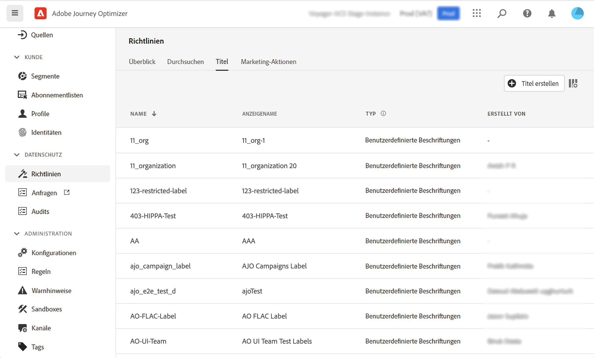
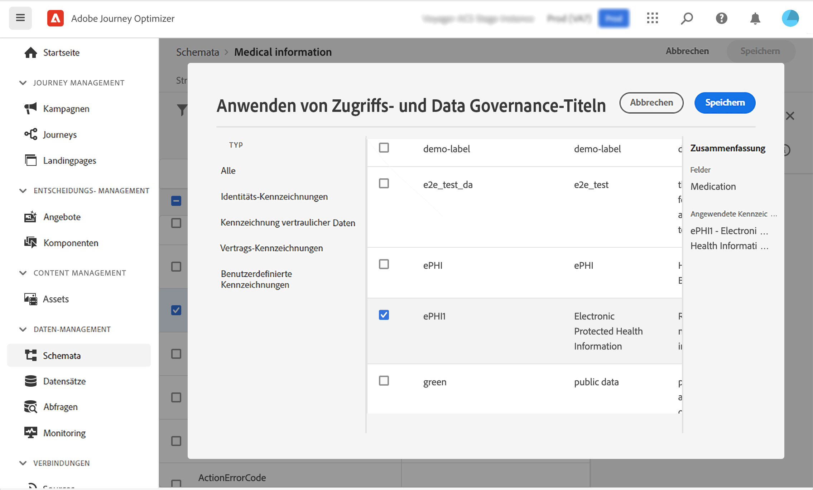
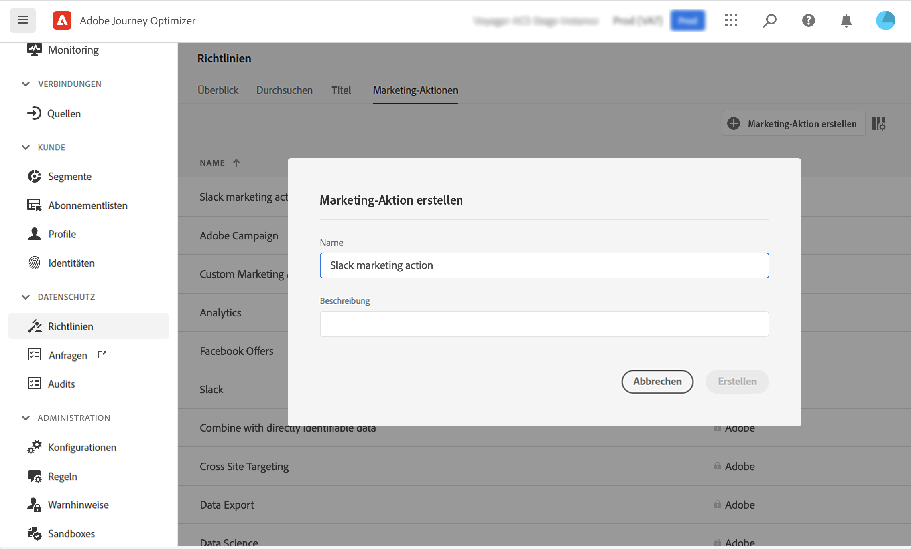
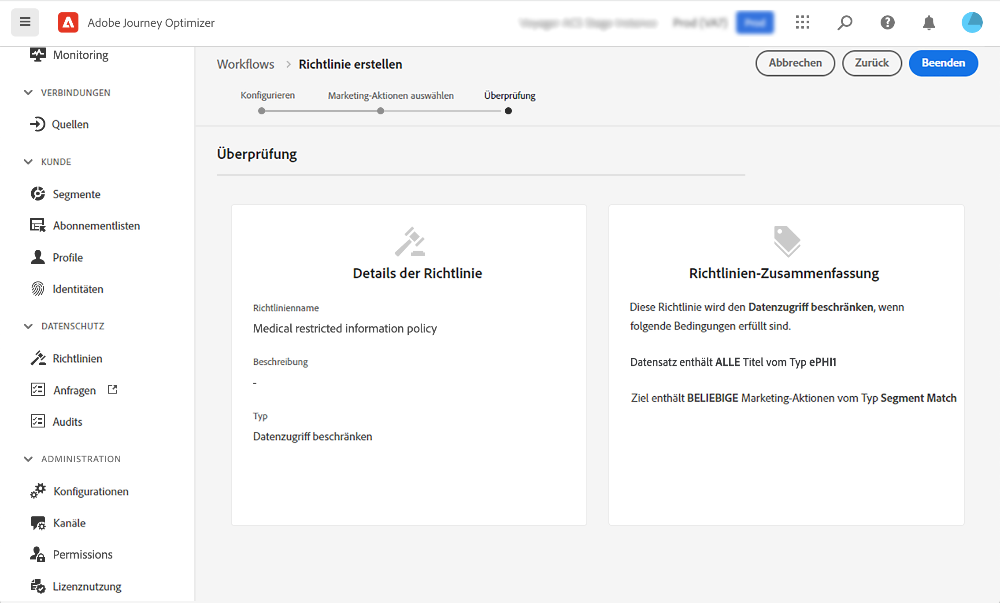
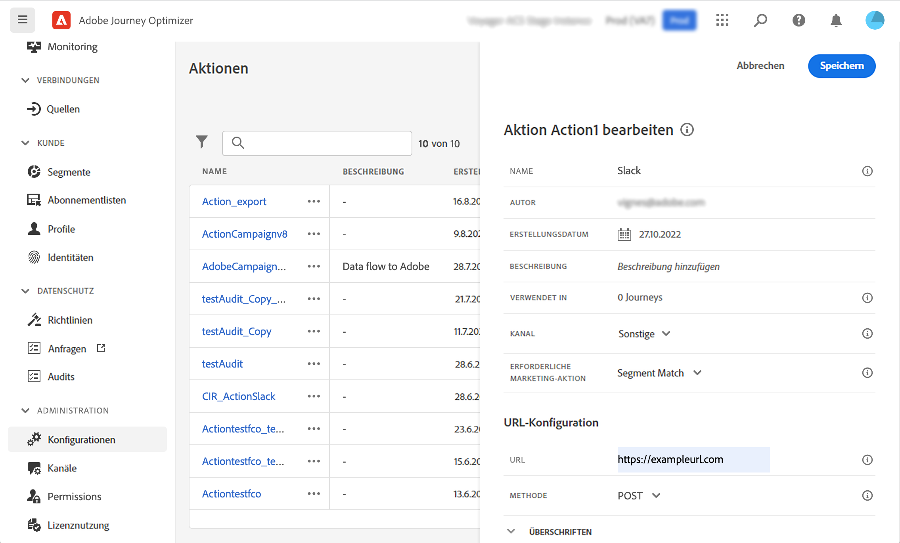
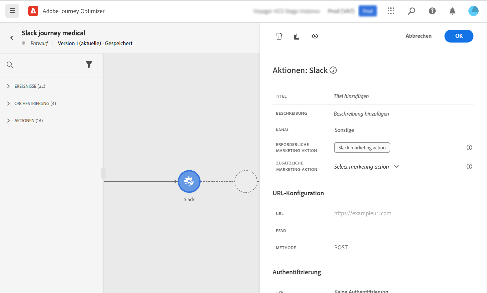
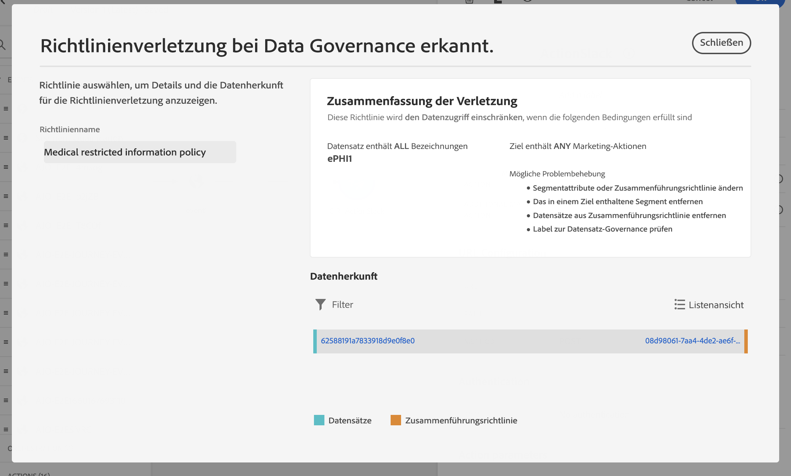

# Data Governance {#restrict-fields}

>[!IMPORTANT]
>
>Die Verwendung von Data Usage Labeling and Enforcement (DULE) ist derzeit auf ausgewählte Kundinnen und Kunden beschränkt und wird in einer zukünftigen Version für alle Umgebungen bereitgestellt.

Mit dem Governance-Framework Data Usage Labeling and Enforcement (DULE) kann Journey Optimizer jetzt Governance-Richtlinien von Adobe Experience Platform nutzen, um zu verhindern, dass sensible Felder durch benutzerdefinierte Aktionen in Drittanbieter-Systeme exportiert werden. Wenn das System in den benutzerdefinierten Aktionsparametern ein eingeschränktes Feld identifiziert, wird ein Fehler angezeigt, der die Veröffentlichung der Journey verhindert.

Adobe Experience Platform ermöglicht es Ihnen, Ihre Felder zu bezeichnen und Marketing-Aktionen für jeden Kanal zu erstellen. Anschließend definieren Sie eine Governance-Richtlinie, die mit einer Bezeichnung und einer Marketing-Aktion verknüpft ist.

In Journey Optimizer können Sie diese Richtlinien auf benutzerdefinierte Aktionen anwenden, um zu verhindern, dass bestimmte Felder in Systeme von Drittanbietern exportiert werden.

Weitere Informationen zum Data Governance-Framework und zum Arbeiten mit Bezeichnungen und Richtlinien finden Sie in der Adobe Experience Platform-Dokumentation:

* [Data Governance-Service – Übersicht](https://experienceleague.adobe.com/docs/experience-platform/data-governance/home.html?lang=de)
* [Datennutzungsbezeichnungen – Übersicht](https://experienceleague.adobe.com/docs/experience-platform/data-governance/labels/overview.html?lang=de)
* [Datennutzungsrichtlinien](https://experienceleague.adobe.com/docs/experience-platform/data-governance/policies/overview.html?lang=de)

## Wichtige Hinweise {#important-notes}

* Data Governance ist nur auf benutzerdefinierte Aktionen in Journeys anwendbar. Aktionen von Campaign Classic und Campaign Standard werden nicht unterstützt.
* Die Governance-Richtlinien gelten nur, wenn eine Marketing-Aktion (erforderlich oder zusätzlich) auf der Ebene der benutzerdefinierten Aktion festgelegt wird.

## Definieren von Governance-Richtlinien {#governance-policies}

Sie können vorhandene Bezeichnungen, Marketing-Aktionen und Richtlinien verwenden. Im Folgenden werden die wichtigsten Konfigurationsschritte zum Erstellen von neuen beschrieben:

* Fügen Sie eine Bezeichnung hinzu und wenden Sie diese auf bestimmte Felder an, die nicht in Drittanbietersysteme exportiert werden sollen, wie etwa die Blutgruppe einer Person.
* Definieren Sie eine Marketing-Aktion für jede benutzerdefinierte Aktion eines Drittanbieters, die in Ihren Journeys verwendet wird.
* Erstellen Sie eine Governance-Richtlinie und verknüpfen Sie sie mit der Bezeichnung und der Marketing-Aktion.

Weitere Informationen zum Verwalten von Richtlinien finden Sie in dieser [Dokumentation](https://experienceleague.adobe.com/docs/experience-platform/data-governance/policies/user-guide.html?lang=de#consent-policy).

Nehmen wir das Beispiel des Feldes „Blutgruppe“, das Sie als sensibel kennzeichnen und vor dem Export an Drittanbieter schützen müssen. Hierzu sind folgende Schritte notwendig:

1. Klicken Sie im linken Menü unter **Datenschutz** auf **Richtlinien**.
1. Wählen Sie die Registerkarte **Bezeichnungen** und klicken Sie auf **Bezeichnung erstellen**.
   
1. Legen Sie einen Namen und einen Anzeigenamen für die Bezeichnung fest. Beispiel: _ePHI1_.
1. Klicken Sie im linken Menü unter **Daten-Management** auf **Schemata** und dann auf die Schaltfläche **Anwenden von Zugriffs- und Data Governance-Beschriftungen**. Wählen Sie Ihr Schema und Ihr Feld (hier „Blutgruppe“) sowie die zuvor erstellte Bezeichnung, in unserem Beispiel _ePHI1_, aus.
   
1. Gehen Sie zurück zum Menü **Richtlinien**, wählen Sie die Registerkarte **Marketing-Aktion** und klicken Sie auf **Marketing-Aktion erstellen**. Es wird empfohlen, für jede benutzerdefinierte Aktion eines Drittanbieters, die in Ihren Journeys verwendet wird, eine Marketing-Aktion zu erstellen. Erstellen wir beispielsweise eine _Slack-Marketing-Aktion_, die für Ihre benutzerdefinierte Slack-Aktion verwendet wird.
   
1. Wählen Sie die Registerkarte **Durchsuchen**, klicken Sie auf **Richtlinie erstellen** und wählen Sie **Data Governance-Richtlinie**. Wählen Sie Ihre Bezeichnung (_ePHI1_) und Marketing-Aktion (_Slack-Marketing-Aktion_) aus.
   

Wenn Sie in einer Journey Ihre benutzerdefinierte Aktion für Slack verwenden, die mit der _Slack-Marketing-Aktion_ konfiguriert ist, wird die zugehörige Richtlinie genutzt.

## Konfigurieren einer benutzerdefinierten Aktion {#consent-custom-action}

Klicken Sie im linken Menü unter **Administration** auf **Konfigurationen** und wählen Sie **Aktionen**. Öffnen Sie die benutzerdefinierte Aktion „Slack“. Beim Konfigurieren einer benutzerdefinierten Aktion können zwei Felder für die Data Governance verwendet werden.

* Im Feld **Kanal** können Sie den Kanal für diese benutzerdefinierte Aktion auswählen: **E-Mail**, **SMS** oder **Push-Benachrichtigung**. Dadurch wird die **Erforderliche Marketing-Aktion** mit der standardmäßigen Marketing-Aktion für den ausgewählten Kanal vorausgefüllt. Wenn Sie **Sonstige** auswählen, wird standardmäßig keine Marketing-Aktion definiert. In unserem Beispiel wählen wir den Kanal **Sonstige**.

* Mit der **erforderlichen Marketing-Aktion** können Sie die Marketing-Aktion für Ihre benutzerdefinierte Aktion definieren. Wenn Sie diese benutzerdefinierte Aktion beispielsweise zum Senden von E-Mails verwenden, können Sie **E-Mail-Targeting** auswählen. In unserem Beispiel wählen wir die _Slack-Marketing-Aktion_. Die mit dieser Marketing-Aktion verknüpften Governance-Richtlinien werden abgerufen und genutzt.

Die anderen Schritte zum Konfigurieren einer benutzerdefinierten Aktion werden in [diesem Abschnitt](../action/about-custom-action-configuration.md#consent-management) ausführlicher behandelt.

## Erstellen der Journey {#consent-journey}

Klicken Sie im linken Menü unter **Journey-Management** auf **Journeys**. Erstellen Sie eine Journey und fügen Sie Ihre benutzerdefinierte Aktion hinzu.  Beim Hinzufügen der benutzerdefinierten Aktion zu einer Journey können Sie die Data Governance mit verschiedenen Optionen verwalten. Klicken Sie auf **Schreibgeschützte Felder anzeigen**, um alle Parameter anzuzeigen.

Der **Kanal** und die **Erforderliche Marketing-Aktion**, die bei der Konfiguration der benutzerdefinierten Aktion definiert wurden, werden oben im Bildschirm angezeigt. Sie können diese Felder nicht ändern.

Sie können eine **Zusätzliche Marketing-Aktion** definieren, um den Typ der benutzerdefinierten Aktion festzulegen. Auf diese Weise können Sie den Zweck der benutzerdefinierten Aktion in dieser Journey definieren. Zusätzlich zur erforderlichen Marketing-Aktion, die normalerweise kanalspezifisch ist, können Sie eine zusätzliche Marketing-Aktion definieren, die speziell für die benutzerdefinierte Aktion in dieser bestimmten Journey gilt. Beispiel: eine Workout-Nachricht, Newsletter, Fitness-Nachricht usw. Sowohl die erforderliche Marketing-Aktion als auch die zusätzliche Marketing-Aktion kommen zur Anwendung.

In unserem Beispiel verwenden wir keine zusätzliche Marketing-Aktion.

Wenn eines der Felder _ePHI1_ (im vorliegenden Beispiel das Feld „Blutgruppe“) in den Aktionsparametern erkannt wird, wird ein Fehler angezeigt, der die Veröffentlichung der Journey verhindert.

Die anderen Schritte zum Konfigurieren einer benutzerdefinierten Aktion in einer Journey werden in [diesem Abschnitt](../building-journeys/using-custom-actions.md) ausführlicher behandelt.
