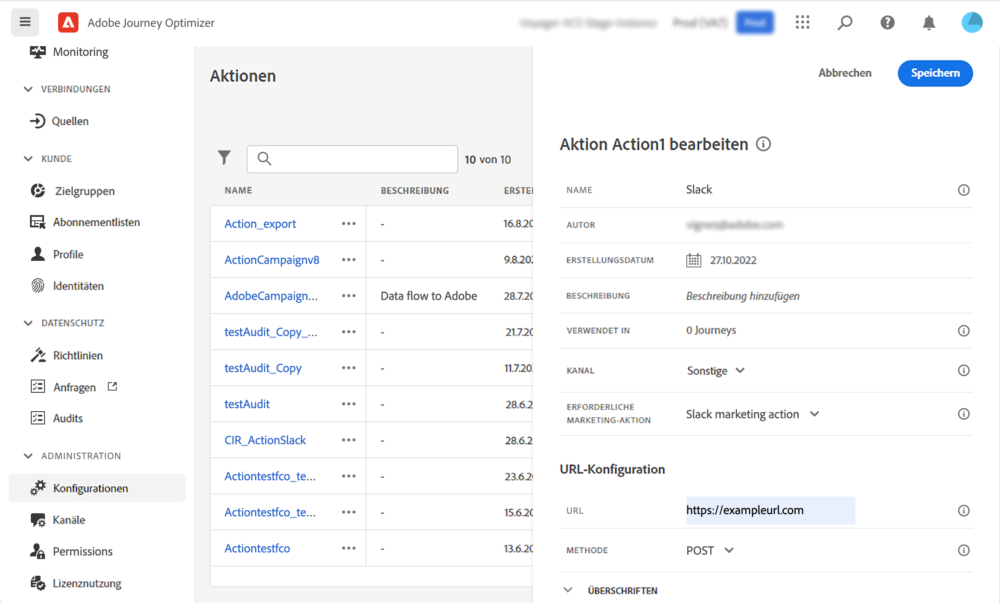
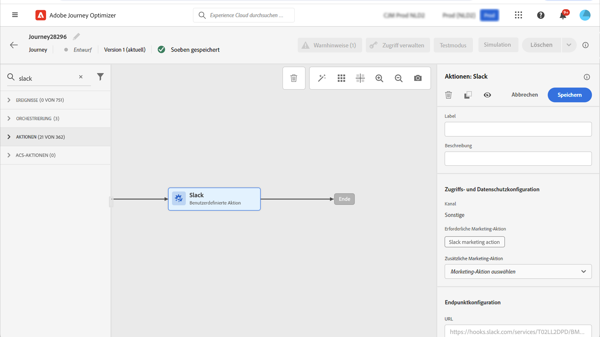

# Data Governance {#restrict-fields}

>[!CONTEXTUALHELP]
>id="ajo_data_governance_policy_violation"
>title="Verstöße gegen Data Governance-Richtlinien"
>abstract="Wenn das System ein eingeschränktes Feld in einer Journey/Kampagne oder eine benutzerdefinierte Aktion erkennt, wird ein Fehler angezeigt, der die Veröffentlichung verhindert. Das Datenherkunftsdiagramm in diesem Dialogfeld verwenden, um zu erkennen, welche anderen Konfigurationsänderungen erforderlich sind, damit die Journey oder Kampagne aktiviert werden kann."

## Erste Schritte mit Data Governance-Richtlinien {#gs}

Mit dem Governance-Framework [Data Usage Labelling and Enforcement (DULE)](https://experienceleague.adobe.com/docs/experience-platform/data-governance/home.html?lang=de){target="_blank"} ermöglicht Ihnen Adobe Experience Platform die Verwaltung und Durchsetzung kanalübergreifender Data-Governance-Richtlinien, indem Sie **Ihre Felder kennzeichnen** und **Marketing-Aktionen** für jeden Kanal erstellen.

Sobald Labels und Marketing-Aktionen definiert sind, können Sie **Data Governance-Richtlinien** erstellen, die diese beiden Elemente verknüpfen. Sie können beispielsweise eine Richtlinie einrichten, die ein ePHI-Label mit einer Marketing-Aktion „E-Mail-Targeting“ verknüpft, um sicherzustellen, dass keine mit „ePHI“ gekennzeichneten Felder zur Personalisierung von E-Mail-Nachrichten verwendet werden. [Informationen zur Erstellung von Data Governance-Richtlinien](#policy)

Nachdem Sie die Governance-Richtlinien erstellt haben, können Sie die Marketing-Aktionen auf Ihre Journeys/Kampagnen und benutzerdefinierten Journey-Aktionen anwenden.
[Informationen zur Anwendung von Marketing-Aktionen in Journey Optimizer](#apply-marketing-actions)

Beim Erstellen einer Journey oder Kampagne überprüft das System nach Auswahl einer Kanalkonfiguration oder nach Hinzufügen einer benutzerdefinierten Aktion, ob die Marketing-Aktion in der Nachrichtenkanalkonfiguration oder die benutzerdefinierte Aktion Teil einer Data Governance-Richtlinie ist. In diesem Fall prüft das System, ob Felder aus der Zielgruppe oder der Nachrichtenpersonalisierung durch die Richtlinie gekennzeichnet und eingeschränkt werden. Wenn ein solches Label erkannt wird, wird die Veröffentlichung der Journey oder Kampagne blockiert. [Informationen zur Erkennung von Verstößen gegen Data Governance-Richtlinien](#violation)

## Erstellen von Labels und Marketing-Aktionen {#labels-marketing-actions}

Der erste Schritt zur Durchsetzung von Data Governance-Richtlinien besteht darin, Labels zu erstellen und sie an Felder anzuhängen, für die Sie die Nutzung einschränken möchten, sowie Marketing-Aktionen für jeden Ihrer Kanäle zu erstellen.

1. Klicken Sie im linken Menü unter **Datenschutz** auf **Richtlinien**.

1. Wählen Sie die Registerkarte **Labels** und klicken Sie auf **Label erstellen**.

1. Legen Sie einen Namen und einen Anzeigenamen für das Label fest. Beispiel: _ePHI1_.

1. Klicken Sie im linken Menü unter **Daten-Management** auf **Schemata** und dann auf die Schaltfläche **Anwenden von Zugriffs- und Data-Governance-Labels**. Wählen Sie Ihr Schema und Ihr Feld (z. B. „Blutgruppe“) aus sowie das zuvor erstellte Label, in unserem Beispiel _ePHI1_.

   

1. Gehen Sie zurück zum Menü **Richtlinien**, wählen Sie die Registerkarte **Marketing-Aktion** und klicken Sie auf **Marketing-Aktion erstellen**. Es wird empfohlen, für jeden Kanal und jede benutzerdefinierte Aktion eines Drittanbieters, die in Ihren Journeys verwendet wird, eine Marketing-Aktion zu erstellen. Erstellen wir beispielsweise eine _Slack-Marketing-Aktion_, die für Ihre benutzerdefinierte Slack-Aktion verwendet wird.

   

## Erstellen einer Data Governance-Richtlinie {#policy}

Nachdem Labels und Marketing-Aktionen erstellt wurden, können Sie sie gemeinsam zu Data Governance-Richtlinien verknüpfen. Wählen Sie dazu die Registerkarte **Durchsuchen** aus, klicken Sie auf **Richtlinie erstellen** und wählen Sie **Data Governance-Richtlinie** aus. Wählen Sie Ihr Lanbel (_ePHI1_) und Marketing-Aktion (_Slack-Marketing-Aktion_) aus.

Wenn Sie in einer Journey Ihre benutzerdefinierte Aktion für Slack verwenden, die mit der _Slack-Marketing-Aktion_ konfiguriert ist, wird die zugehörige Richtlinie genutzt.

## Anwenden von Marketing-Aktionen in Journey Optimizer {#apply-marketing-actions}

Damit Data Governance-Richtlinien in Journey Optimizer durchgesetzt werden können, müssen Sie Marketing-Aktionen auf Ihre Journeys, Kampagnen oder benutzerdefinierten Aktionen anwenden.

### Anwenden von Marketing-Aktionen auf Journeys und Kampagnen {#journeys-campaigns}

Nachdem Sie Governance-Richtlinien erstellt haben, müssen Sie die entsprechenden Marketing-Aktionen in Ihren **Kanalkonfigurationen** in Journey Optimizer anwenden. Gehen Sie dazu wie folgt vor:

1. Greifen Sie auf das Menü **[!UICONTROL Kanäle]** > **[!UICONTROL Allgemeine Einstellungen]** > **[!UICONTROL Kanalkonfigurationen]** zu.

1. Öffnen Sie eine vorhandene Kanalkonfiguration oder erstellen Sie eine neue.

1. Wählen Sie im Feld **[!UICONTROL Marketing-Aktion]** die Marketing-Aktion(en) aus, die mit den Journeys/Kampagnen, die diese Konfiguration verwenden, verknüpft werden soll(en). Alle Einverständnis- und Data Governance-Richtlinien, die mit der Marketing-Aktion verknüpft sind, werden genutzt, um die Voreinstellungen Ihrer Kundinnen und Kunden und die für Felder mit sensiblen Daten festgelegten Einschränkungen zu respektieren. [Weitere Informationen](../action/consent.md#surface-marketing-actions)

   

1. Schließen Sie die Einrichtung der Kanalkonfiguration ab und speichern Sie sie. [Erfahren Sie, wie Sie die Kanalkonfiguration einrichten](../configuration/channel-surfaces.md).

1. Wählen Sie beim Erstellen einer Nachricht in Ihrer Journey oder Kampagne die entsprechende Kanalkonfiguration aus. Schließen Sie die Konfiguration Ihrer Journey oder Kampagne ab und speichern Sie sie.

Vor der Aktivierung der Journey oder Kampagne überprüft das System, ob die Marketing-Aktion in der ausgewählten Kanalkonfiguration Teil einer Data Governance-Richtlinie ist. In diesem Fall prüft das System, ob Felder aus der Zielgruppe oder der Nachrichtenpersonalisierung durch die Richtlinie gekennzeichnet und eingeschränkt werden.

Wenn das System ein eingeschränktes Feld identifiziert, wird ein Fehler angezeigt, der die Veröffentlichung der Journey oder der Kampagne verhindert. [Informationen zur Erkennung von Verstößen gegen Governance-Richtlinien](#violation)

{zoomable="yes"}

*Analyseschritte für Richtlinienverstößen für Journeys und Kampagnen*

### Anwenden von Marketing-Aktionen auf benutzerdefinierte Aktionen {#custom-actions}

>[!NOTE]
>
>Journey-Aktionen von Campaign v7/v8 und Campaign Standard werden nicht unterstützt.

Nehmen wir als Beispiel das Feld „Bluttyp“, dessen Export auf einen Drittanbieter durch benutzerdefinierte Aktionen beschränkt werden soll. Dazu müssen Sie die Marketing-Aktion auf Ihre benutzerdefinierte Aktion anwenden, dann Ihre Journey erstellen und Ihre benutzerdefinierte Aktion dort hinzufügen.

1. Klicken Sie im linken Menü unter **Administration** auf **Konfigurationen** und wählen Sie **Aktionen** aus.

1. Öffnen Sie die benutzerdefinierte Aktion „Slack“. Beim Konfigurieren einer benutzerdefinierten Aktion können zwei Felder für die Data Governance verwendet werden.

   

   * Im Feld **Kanal** können Sie den mit dieser benutzerdefinierten Aktion verbundenen Kanal auswählen. Dadurch wird das Feld **Erforderliche Marketing-Aktion** mit der standardmäßigen Marketing-Aktion für den ausgewählten Kanal vorausgefüllt. Wenn Sie **Sonstige** auswählen, wird standardmäßig keine Marketing-Aktion definiert. In unserem Beispiel wählen wir den Kanal **Sonstige**.

   * Mit der **erforderlichen Marketing-Aktion** können Sie die Marketing-Aktion für Ihre benutzerdefinierte Aktion definieren. Wenn Sie diese benutzerdefinierte Aktion beispielsweise zum Senden von E-Mails verwenden, können Sie **E-Mail-Targeting** auswählen. In unserem Beispiel wählen wir die _Slack-Marketing-Aktion_. Die mit dieser Marketing-Aktion verknüpften Governance-Richtlinien werden abgerufen und genutzt.

   Die anderen Schritte zum Konfigurieren einer benutzerdefinierten Aktion werden in [diesem Abschnitt](../action/about-custom-action-configuration.md#consent-management) ausführlicher behandelt.

1. Klicken Sie im linken Menü unter **Journey-Management** auf **Journeys**.

1. Erstellen Sie eine Journey und fügen Sie Ihre benutzerdefinierte Aktion hinzu. Beim Hinzufügen der benutzerdefinierten Aktion zu einer Journey können Sie die Data Governance mit verschiedenen Optionen verwalten. Klicken Sie auf **Schreibgeschützte Felder anzeigen**, um alle Parameter anzuzeigen.

   

   * Der **Kanal** und die **Erforderliche Marketing-Aktion**, die bei der Konfiguration der benutzerdefinierten Aktion definiert wurden, werden oben im Bildschirm angezeigt. Sie können diese Felder nicht ändern.

   * Sie können eine **Zusätzliche Marketing-Aktion** definieren, um den Typ der benutzerdefinierten Aktion festzulegen. Auf diese Weise können Sie den Zweck der benutzerdefinierten Aktion in dieser Journey definieren. Zusätzlich zur erforderlichen Marketing-Aktion, die normalerweise kanalspezifisch ist, können Sie eine zusätzliche Marketing-Aktion definieren, die speziell für die benutzerdefinierte Aktion in dieser bestimmten Journey gilt. Beispiel: eine Workout-Kommunikation, ein Newsletter, eine Fitness-Kommunikation usw. Sowohl die erforderliche Marketing-Aktion als auch die zusätzliche Marketing-Aktion kommen zur Anwendung. In unserem Beispiel verwenden wir keine zusätzliche Marketing-Aktion.

Wenn eines der mit _ePHI1_ gekennzeichneten Felder (im vorliegenden Beispiel das Feld „Blutgruppe“) in den Aktionsparametern erkannt wird, wird ein Fehler angezeigt, der die Veröffentlichung der Journey verhindert. [Informationen zur Erkennung von Verstößen gegen Governance-Richtlinien](#violation)

{zoomable="yes"}

*Analyseschritte für Richtlinienverstößen für Journeys und Kampagnen*

## Erkennung von Richtlinienverstößen {#violation}

Wenn das System ein eingeschränktes Feld in einer Journey/Kampagne oder eine benutzerdefinierte Aktion erkennt, wird ein Fehler angezeigt, der die Veröffentlichung verhindert.

Fehler werden über die Schaltfläche **[!UICONTROL Warnhinweise]** angezeigt. Klicken Sie auf den Fehler, um detaillierte Informationen zu den Verstößen gegen Data-Governance-Richtlinien anzuzeigen.

Dieses Dialogfeld weist darauf hin, dass die aktuelle Journey-/Kampagnenkonfiguration gegen eine bestehende Data Governance-Richtlinie verstößt. Verwenden Sie das Datenherkunftsdiagramm, um zu verstehen, welche anderen Konfigurationsänderungen erforderlich sind, bevor Sie Ihre Journey oder Kampagne aktivieren können.

Detaillierte Informationen finden Sie in der [Dokumentation zu Verstößen gegen Datennutzungsrichtlinien](https://experienceleague.adobe.com/de/docs/experience-platform/data-governance/enforcement/auto-enforcement#data-usage-violation){_blank}.
