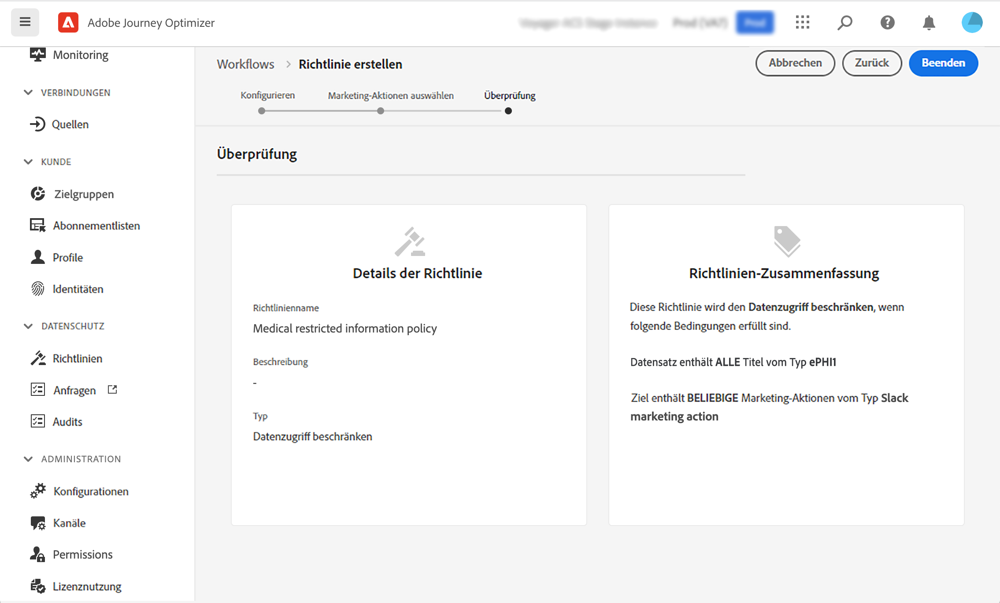

# Data Governance {#restrict-fields}

>[!IMPORTANT]
>
>Die Verwendung von DULE (Data Usage Labeling and Enforcement) ist derzeit auf ausgewählte Kunden beschränkt und wird in einer zukünftigen Version in allen Umgebungen bereitgestellt.

Mit dem Data Usage Labeling and Enforcement (DULE)-Governance-Framework kann Journey Optimizer jetzt Governance-Richtlinien von Adobe Experience Platform nutzen, um zu verhindern, dass sensible Felder durch benutzerdefinierte Aktionen in Drittanbietersysteme exportiert werden. Wenn das System in den benutzerdefinierten Aktionsparametern ein eingeschränktes Feld identifiziert, wird ein Fehler angezeigt, der die Veröffentlichung der Journey verhindert.

Mit Adobe Experience Platform können Sie Ihre Felder beschriften und Marketing-Aktionen für jeden Kanal erstellen. Anschließend definieren Sie eine Governance-Richtlinie, die mit einem Titel und einer Marketing-Aktion verknüpft ist.

In Journey Optimizer können Sie diese Richtlinien auf Ihre benutzerdefinierten Aktionen anwenden, um zu verhindern, dass bestimmte Felder in Systeme von Drittanbietern exportiert werden.

Weitere Informationen zum Data Governance-Framework und zum Arbeiten mit Bezeichnungen und Richtlinien finden Sie in der Dokumentation zu Adobe Experience Platform:

* [Übersicht über den Data Governance-Dienst](https://experienceleague.adobe.com/docs/experience-platform/data-governance/home.html)
* [Datennutzungsbezeichnungen - Übersicht](https://experienceleague.adobe.com/docs/experience-platform/data-governance/labels/overview.html?lang=en)
* [Datennutzungsrichtlinien](https://experienceleague.adobe.com/docs/experience-platform/data-governance/policies/overview.html)

## Wichtige Hinweise {#important-notes}

* Data Governance gilt nur für benutzerdefinierte Aktionen in Journeys. Aktionen von Campaign Classic und Campaign Standard werden nicht unterstützt.
* Governance-Richtlinien gelten nur, wenn eine Marketing-Aktion (erforderlich oder zusätzlich) auf der Ebene der benutzerdefinierten Aktion festgelegt wird.
* Attribute, die Teil einer Feldergruppe sind, die das vordefinierte Vereinigungsschema verwenden, werden nicht unterstützt. Diese Attribute werden in der Benutzeroberfläche ausgeblendet. Sie müssen eine weitere Feldergruppe mit einem anderen Schema erstellen.

## Definieren von Governance-Richtlinien {#governance-policies}

Sie können vorhandene Bezeichnungen, Marketing-Aktionen und Richtlinien verwenden. Im Folgenden werden die wichtigsten Konfigurationsschritte zum Erstellen neuer Schritte beschrieben:

* Fügen Sie einen Titel hinzu und wenden Sie ihn auf bestimmte Felder an, die nicht in Drittanbietersysteme exportiert werden sollen, z. B. den Bluttyp einer Person.
* Definieren Sie eine Marketing-Aktion für jede benutzerdefinierte Aktion eines Drittanbieters, die in Ihren Journeys verwendet wird.
* Erstellen Sie eine Governance-Richtlinie und verknüpfen Sie sie mit der Beschriftungs- und Marketing-Aktion.

Weiterführende Informationen zur Verwaltung von Richtlinien finden Sie in diesem Abschnitt [Dokumentation](https://experienceleague.adobe.com/docs/experience-platform/data-governance/policies/user-guide.html?lang=en#consent-policy)

Nehmen wir als Beispiel das Feld Bluttyp , das Sie als sensibel kennzeichnen und den Export auf einen Drittanbieter beschränken müssen. Im Folgenden finden Sie die verschiedenen Schritte:

1. Im linken Menü unter **Datenschutz** klicken **Richtlinien**.
   
1. Wählen Sie die **Bezeichnungen** Registerkarte und klicken Sie auf **Titel erstellen**.
   
1. Definieren Sie einen Namen und einen Anzeigenamen für diese Bezeichnung. Beispiel: _ePHI1_.
   
1. Im linken Menü unter **Data Management** klicken **Schemas** und klicken Sie auf **Anwenden von Zugriffs- und Data Governance-Beschriftungen** Schaltfläche. Wählen Sie Ihr Schema und Ihr Feld (Bluttyp) aus und wählen Sie den zuvor erstellten Titel aus. _ePHI1_ in unserem Beispiel.
   
1. Gehen Sie zurück zu **Richtlinien** auswählen, wählen Sie die **Marketing-Aktion** Registerkarte und klicken Sie auf **Marketing-Aktion erstellen**. Es wird empfohlen, für jede benutzerdefinierte Aktion eines Drittanbieters, die in Ihren Journeys verwendet wird, eine Marketing-Aktion zu erstellen. Erstellen wir beispielsweise eine _Slack-Marketing-Aktion_ die für Ihre benutzerdefinierte Aktion Slack verwendet wird.
   
1. Wählen Sie die **Durchsuchen** Registerkarte, klicken Sie auf **Richtlinie erstellen** und wählen Sie **Data Governance-Politik**. Wählen Sie Ihren Titel (_ePHI1_) und Marketing-Aktion (_Slack-Marketing-Aktion_).
   

Wenn Sie in einer Journey Ihre benutzerdefinierte Aktion &quot;Slack&quot;verwenden, die mit der _Slack-Marketing-Aktion_, wird die zugehörige Richtlinie genutzt.

## Benutzerdefinierte Aktion konfigurieren {#consent-custom-action}

Im linken Menü unter **Administration** klicken **Konfigurationen** und wählen Sie **Aktionen**. Öffnen Sie Ihre benutzerdefinierte Aktion Slack . Beim Konfigurieren einer benutzerdefinierten Aktion können zwei Felder für Data Governance verwendet werden.

* Die **Kanal** -Feld können Sie den mit dieser benutzerdefinierten Aktion verknüpften Kanal auswählen: **Email**, **SMS** oder **Push-Benachrichtigung**. Dadurch wird die **Erforderliche Marketing-Aktion** mit der standardmäßigen Marketing-Aktion für den ausgewählten Kanal. Wenn Sie **other** festgelegt ist, wird keine Marketing-Aktion standardmäßig definiert. In unserem Beispiel wählen wir den Kanal aus **other**.

* Die **Erforderliche Marketing-Aktion** ermöglicht die Definition der Marketing-Aktion im Zusammenhang mit Ihrer benutzerdefinierten Aktion. Wenn Sie diese benutzerdefinierte Aktion beispielsweise verwenden, um E-Mails mit einem Drittanbieter zu senden, können Sie **E-Mail-Targeting**. In unserem Beispiel wählen wir die _Slack-Marketing-Aktion_. Die mit dieser Marketing-Aktion verknüpften Governance-Richtlinien werden abgerufen und genutzt.

Die anderen Schritte zum Konfigurieren einer benutzerdefinierten Aktion werden im Abschnitt [diesem Abschnitt](../action/about-custom-action-configuration.md#consent-management).

## Erstellen der Journey {#consent-journey}

Im linken Menü unter **Journey-Verwaltung** klicken **Journeys**. Erstellen Sie Ihre Journey und fügen Sie Ihre benutzerdefinierte Aktion hinzu.  Beim Hinzufügen der benutzerdefinierten Aktion zu einer Journey können Sie mit verschiedenen Optionen Data Governance verwalten. Klicken Sie auf **Schreibgeschützte Felder anzeigen** , um alle Parameter anzuzeigen.

Die **Kanal** und **Erforderliche Marketing-Aktion**, die bei der Konfiguration der benutzerdefinierten Aktion definiert wurde, werden oben im Bildschirm angezeigt. Sie können diese Felder nicht ändern.

Sie können eine **Zusätzliche Marketing-Aktion** , um den Typ der benutzerdefinierten Aktion festzulegen. Auf diese Weise können Sie den Zweck der benutzerdefinierten Aktion in dieser Journey definieren. Zusätzlich zur erforderlichen Marketing-Aktion, die normalerweise für einen Kanal spezifisch ist, können Sie eine zusätzliche Marketing-Aktion definieren, die für die benutzerdefinierte Aktion in dieser bestimmten Journey spezifisch ist. Beispiel: Workout-Kommunikation, Newsletter, Fitness-Kommunikation usw. Es gelten sowohl die erforderliche Marketing-Aktion als auch die zusätzliche Marketing-Aktion.

In unserem Beispiel verwenden wir keine zusätzliche Marketing-Aktion.

Wenn eines der Felder _ePHI1_ (in unserem Beispiel das Feld Bluttyp ) in den Aktionsparametern erkannt wird, wird ein Fehler angezeigt, der die Veröffentlichung der Journey verhindert.

Die anderen Schritte zum Konfigurieren einer benutzerdefinierten Aktion in einer Journey werden im Abschnitt [diesem Abschnitt](../building-journeys/using-custom-actions.md).
