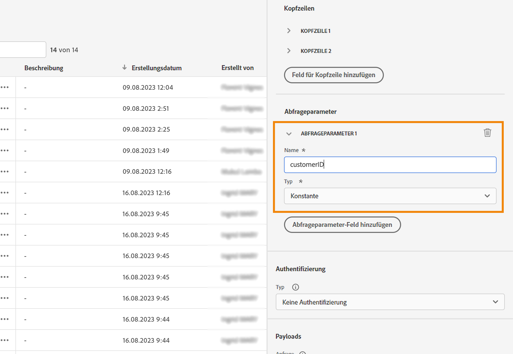

# Verwenden von API-Aufrufantworten in benutzerdefinierten Aktionen {#custom-action-enhancements}

API-Aufrufantworten können in benutzerdefinierten Aktionen genutzt und Journeys basierend auf diesen Antworten orchestriert werden.

<!--
You can now leverage API call responses in custom actions and orchestrate your journeys based on these responses.

This capability was previously only available when using data sources. You can now use it with custom actions. 
-->

## Wichtige Hinweise{#custom-action-enhancements-notes}

<!--
* Custom actions should only be used with private or internal endpoints, and used with an appropriate capping or throttling limit. See [this page](../configuration/external-systems.md). 
-->

* Skalare Arrays werden in der Antwort-Payload unterstützt:

  ```
  "dummyScalarArray": [
  "val1",
  "val2"
  ]
  ```

* Heterogene Arrays werden in der Antwort-Payload nicht unterstützt:

  ```
  "dummyRandomArray": [
  20,
  "aafw",
  false
  ]
  ```

<!--
## Best practices{#custom-action-enhancements-best-practices}

A capping limit of 5000 calls/s is defined for all custom actions. This limit has been set based on customers usage, to protect external endpoints targeted by custom actions. You need to take this into account in your audience-based journeys by defining an appropriate reading rate (5000 profiles/s when custom actions are used). If needed, you can override this setting by defining a greater capping or throttling limit through our Capping/Throttling APIs. See [this page](../configuration/external-systems.md).

You should not target public endpoints with custom actions for various reasons:

* Without proper capping or throttling, there is a risk of sending too many calls to a public endpoint that may not support such volume.
* Profile data can be sent through custom actions, so targeting a public endpoint could lead to inadvertently sharing personal information externally.
* You have no control on the data being returned by public endpoints. If an endpoint changes its API or starts sending incorrect information, those will be made available in communications sent, with potential negative impacts.
-->

<!--
## Define the custom action {#define-custom-action}

When defining the custom action, two enhancements have been made available: the addition of the GET method and the new payload response field. The other options and parameters are unchanged. See [this page](../action/about-custom-action-configuration.md).

### Endpoint configuration {#endpoint-configuration}

The **URL configuration** section has been renamed **Endpoint configuration**.

In the **Method** drop-down, you can now select **GET**.

{width="70%" align="left"}

### Payloads {#payloads-new}

The **Action parameters** section has been renamed **Payloads**. Two fields are available:

* The **Request** field: this field is only available for POST and PUT calling methods.
* The **Response** field: this is the new capability. This field as available for all calling methods.

>[!NOTE]
> 
>Both these fields are optional.

{width="70%" align="left"}
-->

## Konfigurieren der benutzerdefinierten Aktion {#config-response}

1. Erstellen Sie die benutzerdefinierte Aktion. Mehr dazu erfahren Sie auf [dieser Seite](../action/about-custom-action-configuration.md).

1. Klicken Sie in das Feld **Antwort**.

   {width="80%" align="left"}

1. Fügen Sie ein Beispiel der vom Aufruf zurückgegebenen Payload ein. Überprüfen Sie, ob die Feldtypen korrekt sind (Zeichenfolge, Ganzzahl usw.). Hier ist ein Beispiel für die Antwort-Payload, die während des Aufrufs erfasst wird. Unser lokaler Endpunkt sendet die Anzahl der Treuepunkte und den Status eines Profils.

   ```
   {
   "customerID" : "xY12hye",    
   "status":"gold",
   "points": 1290 }
   ```

   {width="80%" align="left"}

   Jedes Mal, wenn die API aufgerufen wird, ruft das System alle im Payload-Beispiel enthaltenen Felder ab.

1. Fügen Sie außerdem die customerID als Abfrageparameter hinzu.

   {width="80%" align="left"}

1. Klicken Sie auf **Speichern**.

## Nutzen der Antwort in einer Journey {#response-in-journey}

Fügen Sie die benutzerdefinierte Aktion einfach einer Journey hinzu. Anschließend können Sie die Felder der Antwort-Payload in Bedingungen, anderen Aktionen und der Nachrichtenpersonalisierung nutzen.

Sie können beispielsweise eine Bedingung hinzufügen, um die Anzahl der Treuepunkte zu überprüfen. Wenn die Person das Restaurant betritt, sendet Ihr lokaler Endpunkt einen Aufruf mit den Treueinformationen des Profils. Sie können eine Push-Benachrichtigung versenden, wenn das Profil zu den Goldkundinnen und -kunden gehört. Wenn beim Aufruf ein Fehler erkannt wird, senden Sie eine benutzerdefinierte Aktion, um die Systemadmins zu benachrichtigen.


1. Fügen Sie Ihr Ereignis und die zuvor erstellte benutzerdefinierte Treue-Aktion hinzu.

1. Ordnen Sie in der benutzerdefinierten Treue-Aktion den Abfrageparameter der Kunden-ID der Profil-ID zu. Aktivieren Sie die Option **Alternativen Pfad im Fall eines Timeouts oder Fehlers hinzufügen**.

   

1. Fügen Sie im ersten Zweig eine Bedingung hinzu und verwenden Sie den erweiterten Editor, um die Aktionsreaktionsfelder unter dem **Kontext**-Knoten zu nutzen.

   

1. Fügen Sie dann Ihre Push-Benachrichtigung hinzu und personalisieren Sie Ihre Nachricht mithilfe der Antwortfelder. In unserem Beispiel personalisieren wir den Inhalt anhand der Anzahl der Treuepunkte und des Kundenstatus. Die Aktionsreaktionsfelder sind verfügbar unter **Kontextattribute** > **Journey Orchestration** > **Aktionen**.

   

   >[!NOTE]
   >
   >Jedes Profil, das die benutzerdefinierte Aktion durchführt, löst einen Aufruf aus. Auch wenn die Antwort immer gleich ist, führt die Journey immer noch einen Aufruf pro Profil durch.

1. Fügen Sie in den Verzweigungen „Timeout“ und „Fehler“ eine Bedingung hinzu und nutzen Sie das integrierte Feld **jo_status_code**. In unserem Beispiel verwenden wir den Fehlertyp
   **http_400**. Weitere Informationen finden Sie in [diesem Abschnitt](#error-status).

   ```
   @action{ActionLoyalty.jo_status_code} == "http_400"
   ```

   

1. Fügen Sie eine benutzerdefinierte Aktion hinzu, die an Ihre Organisation gesendet wird.

   

## Testmodusprotokolle {#test-mode-logs}

Im Testmodus kann auf Statusprotokolle zugegriffen werden, die mit benutzerdefinierten Aktionsantworten verwandt sind. Wenn Sie in Ihrer Journey benutzerdefinierte Aktionen mit Antworten definiert haben, wird ein Abschnitt **actionsHistory** in diesen Protokollen angezeigt, der die vom externen Endpunkt zurückgegebene Payload anzeigt (als Antwort auf diese benutzerdefinierten Aktion). Dies kann im Hinblick auf das Debugging sehr nützlich sein.


## Fehlerstatus {#error-status}

Das Feld **jo_status_code** ist immer verfügbar, auch wenn keine Antwort-Payload definiert ist.

Hier finden Sie die möglichen Werte für dieses Feld:

* HTTP-Status-Code: http_`<HTTP API call returned code>`, zum Beispiel http_200 oder http_400
* Zeitüberschreitungsfehler: **timedout**
* Begrenzungsfehler: **capped**
* Interner Fehler: **internalError**

Ein Aktionsaufruf wird als fehlerhaft betrachtet, wenn der zurückgegebene HTTP-Code größer als 2xx ist oder wenn ein Fehler auftritt. In solchen Fällen wird die Journey an die dedizierte Verzweigung „Timeout“ oder „Fehler“ geleitet.

>[!WARNING]
>
>Nur neu erstellte benutzerdefinierte Aktionen enthalten das vordefinierte Feld **jo_status_code**. Wenn Sie sie mit einer vorhandenen benutzerdefinierten Aktion verwenden möchten, müssen Sie die Aktion aktualisieren. Beispielsweise können Sie die Beschreibung aktualisieren und speichern.

## Syntax von Ausdrücken  {#exp-syntax}

Die Syntax lautet:

```json
#@action{myAction.myField} 
```

Im Folgenden finden Sie einige Beispiele:

```json
 // action response field
 @action{<action name>.<path to the field>}
 @action{ActionLoyalty.status}
```

```json
 // action response field
 @action{<action name>.<path to the field>, defaultValue: <default value expression>}
 @action{ActionLoyalty.points, defaultValue: 0}
 @action{ActionLoyalty.points, defaultValue: @{myEvent.newPoints}}
```

Weitere Informationen zu den Feldverweisen finden Sie in [diesem Abschnitt](../building-journeys/expression/field-references.md).
