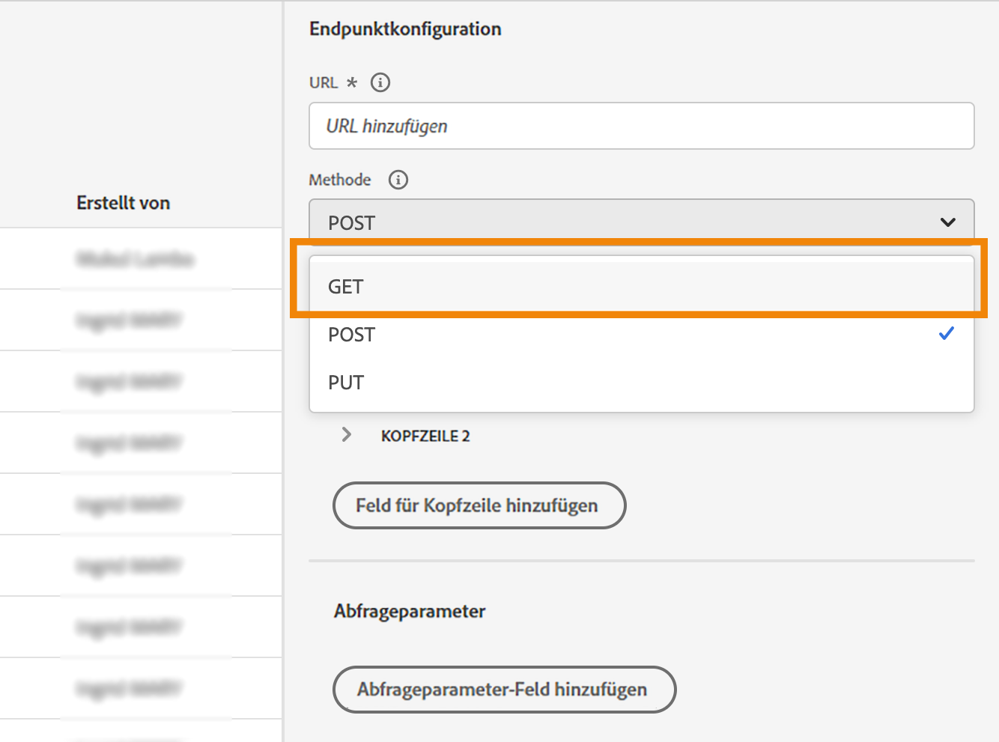

# Verbesserungen bei benutzerdefinierten Aktionen

Sie können jetzt API-Aufrufantworten in benutzerdefinierten Aktionen nutzen und Ihre Journey basierend auf diesen Antworten koordinieren.

Diese Funktion war nur bei Verwendung von Datenquellen verfügbar. Sie können sie jetzt mit benutzerdefinierten Aktionen verwenden.

>[!AVAILABILITY]
>
>Diese Funktion ist derzeit als private Beta-Version verfügbar.

## Definieren der benutzerdefinierten Aktion

Bei der Definition der benutzerdefinierten Aktion wurden zwei Verbesserungen vorgenommen: das Hinzufügen der GET-Methode und das neue Payload-Antwortfeld. Die anderen Optionen und Parameter bleiben unverändert. Weitere Informationen finden Sie auf [dieser Seite](../action/about-custom-action-configuration.md).

### Endpunktkonfiguration

Die **URL-Konfiguration** wurde umbenannt. **Endpunktkonfiguration**.

Im **Methode** in der Dropdown-Liste können Sie jetzt **GET**.

{width="70%" align="left"}

### Payloads

Die **Aktionsparameter** wurde umbenannt. **Payloads**. Es stehen zwei Felder zur Verfügung:

* Die **Anfrage** -Feld: Dieses Feld ist nur für POST- und PUT-Aufrufmethoden verfügbar.
* Die **Reaktion** -Feld: Dies ist die neue Funktion. Dieses Feld ist für alle Aufrufmethoden verfügbar.

>[!NOTE]
> 
>Beide Felder sind optional.

{width="70%" align="left"}

1. Klicken Sie in die **Reaktion** -Feld.

   {width="70%" align="left"}

1. Fügen Sie ein Beispiel der vom Aufruf zurückgegebenen Payload ein. Überprüfen Sie, ob die Feldtypen korrekt sind (Zeichenfolge, Ganzzahl usw.).

   {width="70%" align="left"}

1. Klicken Sie auf **Speichern**.

Jedes Mal, wenn die API aufgerufen wird, ruft das System alle im Payload-Beispiel enthaltenen Felder ab. Beachten Sie, dass Sie auf **Fügen Sie eine neue Payload ein** klicken können, wenn Sie die aktuell übergebene Payload ändern möchten.

Hier ist ein Beispiel für eine Antwort-Payload, die beim Aufruf eines Wetter-API-Dienstes erfasst wird:

```
{
    "coord": {
        "lon": 2.3488,
        "lat": 48.8534
    },
    "weather": [
        {
            "id": 800,
            "main": "Clear",
            "description": "clear sky",
            "icon": "01d"
        }
    ],
    "base": "stations",
    "main": {
        "temp": 29.78,
        "feels_like": 29.78,
        "temp_min": 29.92,
        "temp_max": 30.43,
        "pressure": 1016,
        "humidity": 31
    },
    "visibility": 10000,
    "wind": {
        "speed": 5.66,
        "deg": 70
    },
    "clouds": {
        "all": 0
    },
    "dt": 1686066467,
    "sys": {
        "type": 1,
        "id": 6550,
        "country": "FR",
        "sunrise": 1686023350,
        "sunset": 1686080973
    },
    "timezone": 7200,
    "id": 2988507,
    "name": "Paris",
    "cod": 200
}
```

## Nutzung der Antwort in einer Journey

Fügen Sie die benutzerdefinierte Aktion einfach einer Journey hinzu. Anschließend können Sie die Antwort-Payload-Felder in Bedingungen, anderen Aktionen und der Nachrichtenpersonalisierung nutzen.

### Bedingungen und Aktionen

Sie können beispielsweise eine Bedingung hinzufügen, um die Windgeschwindigkeit zu überprüfen. Wenn die Person in den Surfshop kommt, können Sie eine Push-Benachrichtigung senden, wenn das Wetter zu windig ist.

{width="70%" align="left"}

In der Bedingung müssen Sie den erweiterten Editor verwenden, um die Aktionsreaktionsfelder unter der **Kontext** Knoten.

{width="70%" align="left"}

Sie können auch die **jo_status** -Code, um im Falle eines Fehlers einen neuen Pfad zu erstellen.

{width="70%" align="left"}

>[!WARNING]
>
>Nur neu erstellte benutzerdefinierte Aktionen enthalten dieses Feld standardmäßig. Wenn Sie sie mit einer vorhandenen benutzerdefinierten Aktion verwenden möchten, müssen Sie die Aktion aktualisieren. Beispielsweise können Sie die Beschreibung aktualisieren und speichern.

Hier finden Sie die möglichen Werte für dieses Feld:

* HTTP-Status-Code: Beispiel: **http_200** oder **http_400**
* Zeitüberschreitungsfehler: **timedout**
* Begrenzungsfehler: **capped**
* interner Fehler: **internalError**

### Personalisierung von Nachrichten

Sie können Ihre Nachrichten mithilfe der Antwortfelder personalisieren. In unserem Beispiel personalisieren wir in der Push-Benachrichtigung den Inhalt mit dem Geschwindigkeitswert.

{width="70%" align="left"}

>[!NOTE]
>
>Der Aufruf wird nur einmal pro Profil in einer bestimmten Journey durchgeführt. Für mehrere Nachrichten werden keine neuen Aufrufe Trigger.

## Syntax von Ausdrücken

Die Syntax lautet:

```json
#@action{myAction.myField} 
```

Im Folgenden finden Sie einige Beispiele:

```json
// action response field
@action{<action name>.<path to the field>}
@action{OpenWeatherMap.main.temp}
```

```json
// action response field
@action{<action name>.<path to the field>, defaultValue: <default value expression>}
@action{OpenWeatherMap.main.temp, defaultValue: 273.15}
@action{OpenWeatherMap.main.temp, defaultValue: @{myEvent.temperature}} 
```


