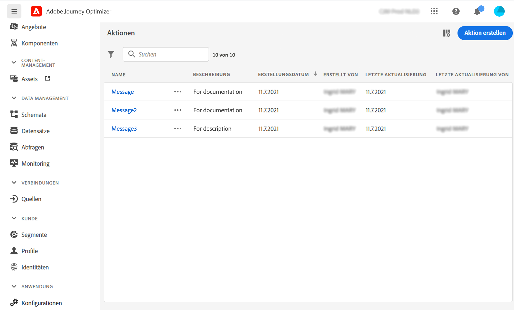

# Über Aktionen {#about_actions}

>[!CONTEXTUALHELP]
>id="ajo_journey_action_list"
>title="Über Aktionen"
>abstract="Hier definieren Sie die Verbindung zum System, das Nachrichten senden soll. Die hier definierten Aktionen stehen dann in der linken Palette Ihrer Journey in der Kategorie Aktion zur Verfügung."

Aktionen sind Verbindungen, über die Sie personalisierte Echtzeit-Erlebnisse für Kunden bereitstellen, wie Push-Benachrichtigungen, E-Mails oder andere digitale Interaktionen, die Sie in Ihrem Unternehmen verwenden.

➡️ [Funktion im Video kennenlernen](#video)

[!DNL Journey Optimizer] verfügt über eine integrierte Nachrichtenfunktion.

Wenn Sie über Adobe Campaign v7 oder v8 verfügen, ist auf Anfrage eine Integration verfügbar. Siehe [diese Seite](../action/acc-action.md).

Wenn Sie ein Drittanbietersystem verwenden, um Nachrichten wie Epsilon, Facebook, [Adobe-Entwickler](https://developer.adobe.com){target=&quot;_blank&quot;}, Firebase usw., müssen Sie eine benutzerdefinierte Aktion hinzufügen und konfigurieren. Siehe [diese Seite](../action/about-custom-action-configuration.md).

Mit benutzerdefinierten Aktionen können Sie die Verbindung eines Drittanbietersystems konfigurieren, um Nachrichten oder API-Aufrufe zu senden. Eine Aktion kann mit jedem Dienst eines beliebigen Anbieters konfiguriert werden, der über eine REST-API mit einer JSON-formatierten Payload aufgerufen werden kann.

>[!CAUTION]
>
>Die Konfiguration benutzerdefinierter Aktionen muss von einer **technischer Anwender**.

Die Aktionen sind in der linken Palette Ihrer Journey im **[!UICONTROL Action]** Kategorie. Siehe [diese Seite](../building-journeys/about-journey-activities.md#action-activities).

Um die Aktionsliste anzuzeigen oder eine neue Aktion zu konfigurieren, wählen Sie **[!UICONTROL Configurations]** im Menü ADMINISTRATION . Im  **[!UICONTROL Actions]** Abschnitt, klicken Sie auf **[!UICONTROL Manage]**. Die Liste der Aktionen wird angezeigt. Siehe [diese Seite](../start/user-interface.md) für weitere Informationen zur Benutzeroberfläche.

## Anleitungsvideo {#video}

Erfahren Sie, wie Sie benutzerdefinierte Aktionen konfigurieren.

>[!VIDEO](https://video.tv.adobe.com/v/334257?quality=12)
