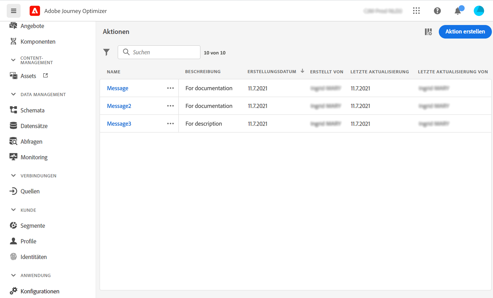

# Erste Schritte mit benutzerdefinierten Aktionen {#about_actions}

>[!CONTEXTUALHELP]
>id="ajo_journey_action_list"
>title="Benutzerdefinierte Aktionen"
>abstract="Aktionen sind Verbindungen, über die Sie Kundinnen und Kunden personalisierte Echtzeit-Erlebnisse bieten können. Dies sind z. B. Push-Benachrichtigungen, E-Mails, SMS oder andere digitale Interaktionen, die Sie in Ihrem Unternehmen verwenden."

Aktionen sind Verbindungen, über die Sie Kundinnen und Kunden personalisierte Echtzeit-Erlebnisse bieten können. Dies sind z. B. Push-Benachrichtigungen, E-Mails, SMS oder andere digitale Interaktionen, die Sie in Ihrem Unternehmen verwenden.

➡️ [Funktion im Video kennenlernen](#video)

[!DNL Journey Optimizer] verfügt über integrierte Nachrichtenfunktionen. Mit benutzerdefinierten Aktionen können Sie die Verbindung eines Drittanbietersystems konfigurieren, um Nachrichten oder API-Aufrufe zu senden. Eine Aktion kann mit jedem Dienst eines beliebigen Anbieters konfiguriert werden, der über eine REST-API mit einer JSON-formatierten Payload aufgerufen werden kann.

* Wenn Sie Adobe Campaign v7 oder v8 verwenden, ist auf Anfrage eine Integration verfügbar. Mehr dazu erfahren Sie auf [dieser Seite](../action/acc-action.md).

* Wenn Sie zum Senden von Nachrichten ein Drittanbietersystem (z. B. Epsilon, Facebook, Adobe Developer, Firebase usw.) verwenden, müssen Sie eine benutzerdefinierte Aktion erstellen und konfigurieren. Mehr dazu erfahren Sie auf [dieser Seite](../action/about-custom-action-configuration.md).

>[!CAUTION]
>
>Die Konfiguration von benutzerdefinierten Aktionen wird immer von einem **technischen Benutzenden** durchgeführt.

Benutzerdefinierte Aktionen sind zusätzliche Aktionen, die von technischen Benutzenden definiert und Marketing-Fachleuten zur Verfügung gestellt werden: Nach der Konfiguration erscheinen sie in der linken Palette Ihrer Journey in der Kategorie **[!UICONTROL Aktion]**. Weitere Informationen finden Sie auf [dieser Seite](../building-journeys/about-journey-activities.md#action-activities).

Um die Aktionsliste anzuzeigen oder eine neue Aktion zu konfigurieren, wählen Sie im Menüabschnitt ADMINISTRATION **[!UICONTROL Konfigurationen]** aus. Klicken Sie im Abschnitt **[!UICONTROL Aktionen]** auf **[!UICONTROL Verwalten]**. Die Liste der Aktionen wird angezeigt. Weitere Informationen zur Schnittstelle finden Sie auf [dieser Seite](../start/user-interface.md).

Erfahren Sie [auf dieser speziellen Seite](../action/troubleshoot-custom-action.md) wie Sie Fehler bei einer benutzerdefinierten Aktion beheben.

## Anleitungsvideo {#video}

Erfahren Sie, wie Sie benutzerdefinierte Aktionen konfigurieren können.

>[!VIDEO](https://video.tv.adobe.com/v/3428396?quality=12)

## Zusätzliche Ressourcen

In den folgenden Abschnitten erfahren Sie mehr über die Konfiguration und Verwendung Ihrer benutzerdefinierten Aktionen:

* [Konfigurieren benutzerdefinierter Aktionen](../action/about-custom-action-configuration.md): Erfahren Sie, wie Sie eine benutzerdefinierte Aktion erstellen und konfigurieren
* [Verwenden benutzerdefinierter Aktionen](../building-journeys/using-custom-actions.md): Erfahren Sie, wie Sie benutzerdefinierte Aktionen in Ihren Journeys verwenden
* [Übergeben von Sammlungen in Parameter benutzerdefinierter Aktionen](../building-journeys/collections.md): Erfahren Sie, wie Sie eine Sammlung in Parameter benutzerdefinierter Aktionen übergeben, die zur Laufzeit dynamisch gefüllt werden
* [Fehlerbehebung bei benutzerdefinierten Aktionen](../action/troubleshoot-custom-action.md): Erfahren Sie, wie Sie Fehler bei einer benutzerdefinierten Aktion beheben

