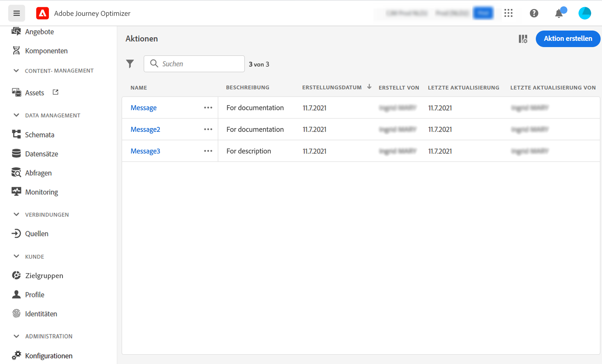

# Informationen zu Aktionen {#about_actions}

>[!CONTEXTUALHELP]
>id="ajo_journey_action_list"
>title="Informationen zu Aktionen"
>abstract="Hier definieren Sie die Verbindung zum System, das Nachrichten senden soll. Die hier definierten Aktionen stehen dann in der linken Palette Ihrer Journey in der Kategorie „Aktion“ zur Verfügung."

Aktionen sind Verbindungen, über die Sie Kunden personalisierte Echtzeit-Erlebnisse bieten können. Dies sind z. B. Push-Benachrichtigungen, E-Mails oder andere digitale Interaktionen, die Sie in Ihrem Geschäft verwenden.

➡️ [Entdecken Sie diese Funktion im Video](#video)

[!DNL Journey Optimizer] verfügt über integrierte Nachrichtenfunktionen.

Wenn Sie über Adobe Campaign v7 oder v8 verfügen, ist auf Anfrage eine Integration verfügbar. Mehr dazu erfahren Sie auf [dieser Seite](../action/acc-action.md).

Wenn Sie zum Senden von Nachrichten ein Drittanbietersystem (z. B. Epsilon, Facebook, [Adobe Developer](https://developer.adobe.com/){target="_blank"}, Firebase) verwenden, müssen Sie eine benutzerdefinierte Aktion hinzufügen und konfigurieren. Mehr dazu erfahren Sie auf [dieser Seite](../action/about-custom-action-configuration.md).

Über benutzerdefinierte Aktionen können Sie die Verbindung eines Drittanbietersystems zum Senden von Nachrichten oder API-Aufrufen konfigurieren. Eine Aktion kann mit jedem Dienst eines beliebigen Anbieters konfiguriert werden, der über eine REST-API mit einer JSON-formatierten Payload aufgerufen werden kann.

>[!CAUTION]
>
>Die Konfiguration von benutzerdefinierten Aktionen wird immer von einem **technischen Anwender** durchgeführt.

Die Aktionen stehen in der linken Palette Ihrer Journey in der Kategorie **[!UICONTROL Aktion]** zur Verfügung. Weitere Informationen finden Sie auf [dieser Seite](../building-journeys/about-journey-activities.md#action-activities).

Um die Aktionsliste anzuzeigen oder eine neue Aktion zu konfigurieren, wählen Sie im Menüabschnitt ADMINISTRATION **[!UICONTROL Konfigurationen]** aus. Klicken Sie im Abschnitt **[!UICONTROL Aktionen]** auf **[!UICONTROL Verwalten]**. Die Liste der Aktionen wird angezeigt. Weitere Informationen zur Benutzeroberfläche finden Sie auf [dieser Seite](../start/user-interface.md).

## Anleitungsvideo {#video}

Erfahren Sie, wie Sie benutzerdefinierte Aktionen konfigurieren können.

>[!VIDEO](https://video.tv.adobe.com/v/334257?quality=12)
