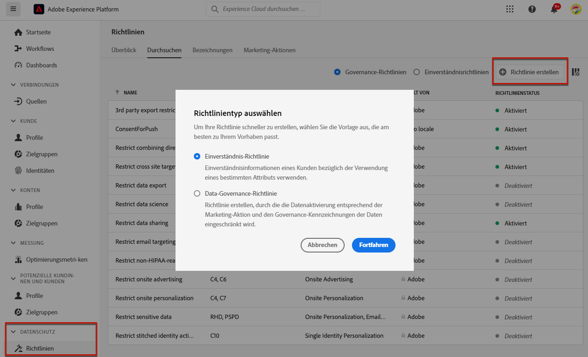
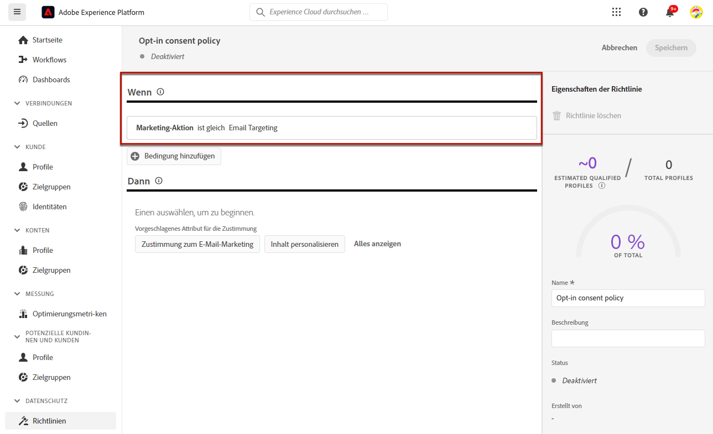
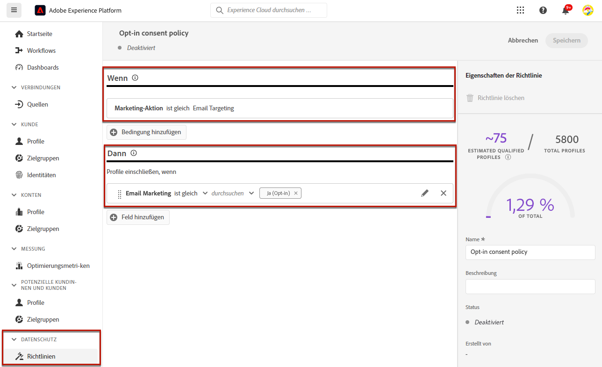
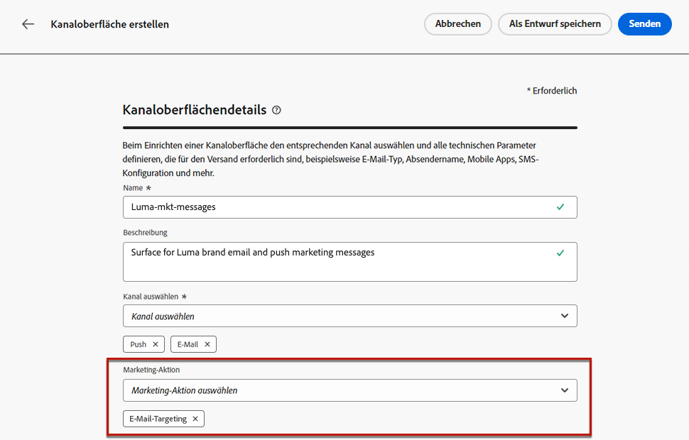

# Arbeiten mit Einverständnisrichtlinien {#consent-management}

Ihre Daten können Nutzungsbeschränkungen unterliegen, die von Ihrer Organisation oder durch gesetzliche Bestimmungen festgelegt werden. Daher müssen Sie sicherstellen, dass Ihre Datenvorgänge in Journey Optimizer mit [Datennutzungsrichtlinien](https://experienceleague.adobe.com/docs/experience-platform/data-governance/policies/overview.html?lang=de) konform sind{target="_blank"}. These policies are Adobe Experience Platform rules defining which [marketing actions](https://experienceleague.adobe.com/docs/experience-platform/data-governance/policies/overview.html?lang=de#marketing-actions){target="_blank"} Sie für Daten durchführen dürfen.

Ein Typ verfügbarer Datennutzungsrichtlinien sind **Einverständnisrichtlinien**. Mit diesen können Sie einfach Marketing-Richtlinien übernehmen und durchsetzen, um die Einverständnispräferenzen Ihrer Kundinnen und Kunden zu respektieren. [Weitere Informationen zur Durchsetzung von Richtlinien](https://experienceleague.adobe.com/docs/experience-platform/data-governance/enforcement/auto-enforcement.html?lang=de){target="_blank"}

>[!IMPORTANT]
>
>Einverständnisrichtlinien sind derzeit nur für Organisationen verfügbar, die die Zusatzangebote Adobe **Healthcare Shield** und **Privacy and Security Shield** erworben haben.

Beispielsweise können Sie [Einverständnisrichtlinien in Experience Platform erstellen](https://experienceleague.adobe.com/docs/experience-platform/data-governance/policies/user-guide.html?lang=de#consent-policy){target="_blank"}, um Kundinnen und Kunden auszuschließen, die dem Empfang von E-Mail-, Push- oder SMS-Kommunikationen nicht zugestimmt haben.

* Für die nativen ausgehenden Kanäle (E-Mail, Push-Benachrichtigung, SMS, Briefpost) lautet die Logik wie folgt:

   * Wenn sich ein Profil vom Erhalt von Nachrichten von Ihnen abgemeldet hat, wird das entsprechende Profil standardmäßig von nachfolgenden Sendungen ausgeschlossen.

   * Wenn Sie über Adobe **Healthcare Shield** oder **Privacy and Security Shield** verfügen, können Sie eine benutzerdefinierte Einverständnisrichtlinie erstellen, die die Standardlogik außer Kraft setzt. Sie können z. B. eine Richtlinie definieren, um nur E-Mail-Nachrichten an alle Personen zu senden, die sich für den Empfang angemeldet haben. Wenn keine benutzerdefinierte Richtlinie vorhanden ist, gilt die Standardrichtlinie.

  Um eine benutzerdefinierte Richtlinie anzuwenden, müssen Sie eine Marketing-Aktion in dieser Richtlinie definieren und sie mit einer Kanaloberfläche verknüpfen. [Weitere Informationen](#surface-marketing-actions)

Auf der Journey-Ebene können Sie Einverständnisrichtlinien auf Ihre benutzerdefinierten Aktionen anwenden:

* Beim **Konfigurieren einer benutzerdefinierten Aktion** können Sie einen Kanal und eine Marketing-Aktion definieren. [Weitere Informationen](#consent-custom-action)
* Beim Hinzufügen der **benutzerdefinierten Aktion in einer Journey** können Sie eine zusätzliche Marketing-Aktion definieren. [Weitere Informationen](#consent-journey)

## Verwenden von Einverständnisrichtlinien durch Kanaloberflächen {#surface-marketing-actions}

In [!DNL Journey Optimizer] wird das Einverständnis durch das [Einverständnisschema](https://experienceleague.adobe.com/docs/experience-platform/xdm/field-groups/profile/consents.html?lang=de){target="_blank"}. By default, the value for the consent field is empty and treated as consent to receive your communications. You can modify this default value while onboarding to one of the possible values listed [here](https://experienceleague.adobe.com/docs/experience-platform/xdm/data-types/consents.html?lang=de#choice-values){target="_blank"} von Experience Platform verarbeitet.

Um den Wert des Felds „Einverständnis“ zu ändern, können Sie eine benutzerdefinierte Einverständnisrichtlinie erstellen, in der Sie eine Marketing-Aktion und die Bedingungen definieren, unter denen diese Aktion ausgeführt wird. [Weitere Informationen zu Marketing-Aktionen](https://experienceleague.adobe.com/docs/experience-platform/data-governance/policies/overview.html?lang=de#marketing-actions){target="_blank"}

Wenn Sie z. B. eine Einverständnisrichtlinie erstellen möchten, um nur Profile anzusprechen, die dem Empfang von E-Mail-Nachrichten zugestimmt haben, führen Sie die folgenden Schritte aus.

1. Stellen Sie sicher, dass Ihr Unternehmen die Zusatzangebote Adobe **Healthcare Shield** oder **Privacy and Security Shield** erworben hat. [Weitere Informationen](https://experienceleague.adobe.com/docs/events/customer-data-management-voices-recordings/governance/healthcare-shield.html?lang=de){target="_blank"}

1. Erstellen Sie in Adobe Experience Platform eine benutzerdefinierte Richtlinie (über das Menü **[!UICONTROL Datenschutz]** > **[!UICONTROL Richtlinien]**). [Weitere Informationen dazu](https://experienceleague.adobe.com/docs/experience-platform/data-governance/policies/user-guide.html?lang=de#create-policy){target="_blank"}

   <!---->

1. Wählen Sie den Typ der **[!UICONTROL Einverständnisrichtlinien]** und konfigurieren Sie eine Bedingung wie folgt. [Informationen dazu, wie Sie Einverständnisrichtlinien konfigurieren](https://experienceleague.adobe.com/docs/experience-platform/data-governance/policies/user-guide.html?lang=de#consent-policy){target="_blank"}

   1. Wählen Sie unter dem Abschnitt **[!UICONTROL Wenn]** die standardmäßige Marketing-Aktion **[!UICONTROL E-Mail-Targeting]** aus.

      <!---->

      >[!NOTE]
      >
      >Die wichtigsten von Adobe nativ bereitgestellten Marketing-Aktionen finden Sie in [dieser Tabelle](https://experienceleague.adobe.com/docs/experience-platform/data-governance/policies/overview.html?lang=de#core-actions){target="_blank"}. The steps to create a custom marketing action are listed in [this section](https://experienceleague.adobe.com/docs/experience-platform/data-governance/policies/user-guide.html?lang=de#create-marketing-action){target="_blank"}.

   1. Wählen Sie aus, was passiert, wenn die Marketing-Aktion angewendet wird. Wählen Sie in diesem Beispiel **[!UICONTROL Zustimmung zum E-Mail-Marketing]**.

   

1. Speichern und [aktivieren](https://experienceleague.adobe.com/docs/experience-platform/data-governance/policies/user-guide.html?lang=de#enable){target="_blank"} Sie diese Richtlinie.

1. Erstellen Sie eine E-Mail-Oberfläche in Journey Optimizer. [Weitere Informationen](../configuration/channel-surfaces.md#create-channel-surface)

1. Wählen Sie in den Details der E-Mail-Oberfläche die Marketing-Aktion **[!UICONTROL E-Mail-Targeting]** aus.

   

Alle mit dieser Marketing-Aktion verknüpften Einverständnisrichtlinien werden automatisch verwendet, um die Voreinstellungen Ihrer Kundinnen und Kunden zu respektieren.

Daher wird in diesem Beispiel jede [E-Mail](../email/create-email.md), die diese Oberfläche in einer Kampagne oder einer Journey verwendet, nur an die Profile gesendet, die dem Empfang von E-Mails von Ihnen zugestimmt haben. Profile, die dem Empfang von E-Mail-Nachrichten nicht zugestimmt haben, werden ausgeschlossen.

## Verwenden von Einverständnisrichtlinien durch benutzerdefinierte Aktionen {#journey-custom-actions}

### Wichtige Hinweise {#important-notes}

In Journey Optimizer kann das Einverständnis auch in benutzerdefinierten Aktionen genutzt werden.  Wenn Sie es mit den integrierten Nachrichtenfunktionen verwenden möchten, müssen Sie eine Bedingungsaktivität verwenden, um Kunden in Ihrer Journey zu filtern.

Mit der Einverständnisverwaltung werden zwei Journey-Aktivitäten analysiert:

* Zielgruppe lesen: Die abgerufene Zielgruppe wird berücksichtigt.
* Benutzerdefinierte Aktion: Die Einverständnisverwaltung berücksichtigt die verwendeten Attribute ([Aktionsparameter](../action/about-custom-action-configuration.md#define-the-message-parameters)) sowie die definierte(n) Marketing-Aktion(en) (erforderliche Marketing-Aktion und zusätzliche Marketing-Aktion).
* Attribute, die Teil einer Feldergruppe sind, die das vordefinierte Vereinigungsschema verwendet, werden nicht unterstützt. Diese Attribute werden in der Benutzeroberfläche ausgeblendet. Sie müssen eine weitere Feldergruppe mit einem anderen Schema erstellen.
* Die Einverständniserklärungen gelten nur, wenn eine Marketing-Aktion (erforderlich oder zusätzlich) auf der Ebene der benutzerdefinierten Aktion festgelegt ist.

Alle anderen in einer Journey verwendeten Aktivitäten werden nicht berücksichtigt. Wenn Sie Ihre Journey mit einer Zielgruppen-Qualifizierung beginnen, wird die Zielgruppe nicht berücksichtigt.

Wenn in einer Journey ein Profil durch eine Einverständniserklärung in einer benutzerdefinierten Aktion ausgeschlossen wird, wird ihm die Nachricht nicht gesendet, aber es setzt die Journey fort. Das Profil gelangt nicht in den Pfad für Zeitüberschreitung und Fehler, wenn eine Bedingung verwendet wird.

Bevor Sie Richtlinien in einer benutzerdefinierten Aktion aktualisieren, die in einer Journey platziert wird, stellen Sie sicher, dass Ihre Journey keinen Fehler enthält.

<!--
There are two types of latency regarding the use of consent policies:

* **User latency**: the delay from the time a profile changes a consent settings to the moment it is applied in Experience Platform. This can take up to 48h. 
* **Consent policy latency**: the delay from the time a consent policy is created or updated to the moment it is applied. This can take up to 6 hours
-->

### Konfigurieren der benutzerdefinierten Aktion {#consent-custom-action}

>[!CONTEXTUALHELP]
>id="ajo_consent_required_marketing_action"
>title="Definieren einer erforderlichen Marketing-Aktion"
>abstract="Mit der „Erforderlichen Marketing-Aktion“ können Sie die Marketing-Aktion für Ihre benutzerdefinierte Aktion definieren. Wenn Sie beispielsweise diese benutzerdefinierte Aktion zum Senden von E-Mails verwenden, können Sie E-Mail-Targeting auswählen. Bei Verwendung in einer Journey werden alle mit dieser Marketing-Aktion verknüpften Einverständniserklärungen abgerufen und genutzt. Dies kann nicht in der Arbeitsfläche geändert werden."

Beim Konfigurieren einer benutzerdefinierten Aktion können zwei Felder für die Einverständnisverwaltung verwendet werden.

Im Feld **Kanal** können Sie den Kanal für diese benutzerdefinierte Aktion auswählen: **E-Mail**, **SMS** oder **Push-Benachrichtigung**. Dadurch wird das Feld **Erforderliche Marketing-Aktion** mit der standardmäßigen Marketing-Aktion für den ausgewählten Kanal vorausgefüllt. Wenn Sie **Sonstige** auswählen, wird standardmäßig keine Marketing-Aktion definiert. 

Mit der **Erforderlichen Marketing-Aktion** können Sie die Marketing-Aktion für Ihre benutzerdefinierte Aktion definieren. Wenn Sie beispielsweise diese benutzerdefinierte Aktion zum Senden von E-Mails verwenden, können Sie **E-Mail-Targeting** auswählen. Bei Verwendung in einer Journey werden alle mit dieser Marketing-Aktion verknüpften Einverständniserklärungen abgerufen und genutzt.  Es wird eine standardmäßige Marketing-Aktion ausgewählt, Sie können jedoch auf den Abwärtspfeil klicken, um alle verfügbaren Marketing-Aktionen aus der Liste auszuwählen.

Bei bestimmten wichtigen Kommunikationsarten, z. B. Transaktionsnachrichten, die zum Zurücksetzen des Passworts des Kunden gesendet werden, ist es möglicherweise nicht angeraten, eine Einverständniserklärung anzuwenden. Wählen Sie dann im Feld **Erforderliche Marketing-Aktion** **Keine** aus.

Die anderen Schritte zum Konfigurieren einer benutzerdefinierten Aktion werden in [diesem Abschnitt](../action/about-custom-action-configuration.md#consent-management) ausführlicher behandelt.

### Erstellen der Journey {#consent-journey}

>[!CONTEXTUALHELP]
>id="ajo_consent_required_marketing_action_canvas"
>title="Erforderliche Marketing-Aktion"
>abstract="Eine erforderliche Marketing-Aktion wird beim Erstellen einer benutzerdefinierten Aktion definiert. Diese erforderliche Marketing-Aktion kann nicht aus der Aktion entfernt oder geändert werden."

>[!CONTEXTUALHELP]
>id="ajo_consent_additional_marketing_action_canvas"
>title="Zusätzliche Marketing-Aktion"
>abstract="Fügen Sie zusätzlich zur erforderlichen Marketing-Aktion eine weitere Marketing-Aktion hinzu. Für beide Marketing-Aktionen werden Einverständniserklärungen erzwungen."

>[!CONTEXTUALHELP]
>id="ajo_consent_refresh_policies_canvas"
>title="Visualisieren von Einverständniserklärungen, die zur Laufzeit gelten"
>abstract="Marketing-Aktionen beinhalten Einverständniserklärungen, die Aktionsparameter und individuelle Einverständniswerte des Profils kombinieren, um Benutzer herauszufiltern. Rufen Sie die neueste Definition dieser Erklärungen ab, indem Sie auf den Button klicken, um sie zu aktualisieren."

Beim Hinzufügen der benutzerdefinierten Aktion zu einer Journey können Sie mit verschiedenen Optionen das Einverständnis verwalten. Klicken Sie auf **Schreibgeschützte Felder anzeigen**, um alle Parameter anzuzeigen.

Der **Kanal** und die **Erforderliche Marketing-Aktion**, die bei der Konfiguration der benutzerdefinierten Aktion definiert wurden, werden oben im Bildschirm angezeigt. Sie können diese Felder nicht ändern.

Sie können eine **Zusätzliche Marketing-Aktion** definieren, um den Typ der benutzerdefinierten Aktion festzulegen. Auf diese Weise können Sie den Zweck der benutzerdefinierten Aktion in dieser Journey definieren. Zusätzlich zur erforderlichen Marketing-Aktion, die normalerweise kanalspezifisch ist, können Sie eine zusätzliche Marketing-Aktion definieren, die speziell für die benutzerdefinierte Aktion in dieser bestimmten Journey gilt.  Beispiel: eine Workout-Kommunikation, ein Newsletter, eine Fitness-Kommunikation usw. Sowohl die erforderliche Marketing-Aktion als auch die zusätzliche Marketing-Aktion kommen zur Anwendung.

Klicken Sie auf **Erklärungen aktualisieren** unten im Bildschirm, um die Liste der für diese benutzerdefinierte Aktion berücksichtigten Erklärungenn zu aktualisieren und zu überprüfen. Dies dient nur zu Informationszwecken beim Erstellen einer Journey. Bei Live-Journeys werden Einverständniserklärungen automatisch alle 6 Stunden abgerufen und aktualisiert.

<!--
The following data is taken into account for consent:

* marketing actions and additional marketing actions defined in the custom action
* action parameters defined in the custom action, see this [section](../action/about-custom-action-configuration.md#define-the-message-parameters) 
* attributes used as criteria in a segment when the journey starts with a Read segment, see this [section](../building-journeys/read-audience.md) 

>[!NOTE]
>
>Please note that there can be a latency when updating the list of policies applied, refer to this [this section](../action/consent.md#important-notes).
-->

Die anderen Schritte zum Konfigurieren einer benutzerdefinierten Aktion in einem Journey werden in [diesem Abschnitt](../building-journeys/using-custom-actions.md) ausführlicher behandelt.
