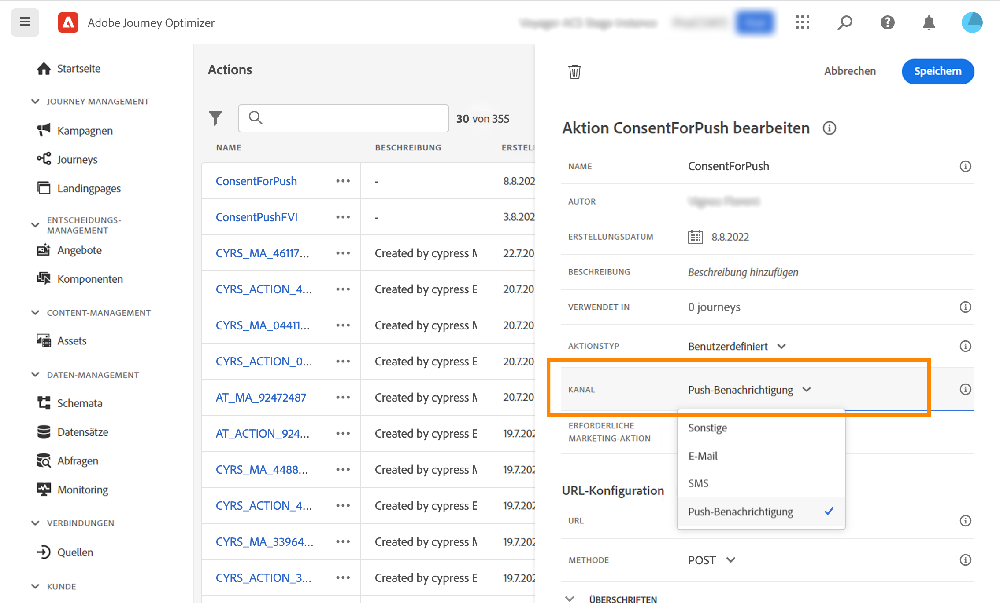

# Einverständnisverwaltung (Beta) {#consent-management}

Mit Adobe Experience Platform können Sie einfach Marketing-Richtlinien übernehmen und durchsetzen, um die Zustimmungsvoreinstellungen Ihrer Kunden zu respektieren. Einverständnisrichtlinien werden in Adobe Experience Platform definiert. Siehe [diese Dokumentation](https://experienceleague.adobe.com/docs/experience-platform/data-governance/policies/user-guide.html?lang=en#consent-policy).

In Journey Optimizer können Sie diese Zustimmungsrichtlinien auf Ihre benutzerdefinierten Aktionen anwenden. Beispielsweise können Sie Einwilligungsrichtlinien definieren, um Kunden auszuschließen, die dem Empfang von E-Mail-, Push- oder SMS-Nachrichten nicht zugestimmt haben.

>[!NOTE]
>
>Diese Funktion wird als private Beta-Version veröffentlicht. Sie steht nicht allen Journey Optimizer-Kunden zur Verfügung.

In Journey Optimizer wird die Zustimmung auf mehreren Ebenen definiert:

* when **Konfigurieren einer benutzerdefinierten Aktion** können Sie einen Kanal und eine Marketing-Aktion definieren. Weitere Informationen finden Sie in diesem [Abschnitt](../action/consent.md#consent-custom-action).
* beim Hinzufügen von **Benutzerdefinierte Aktion in einer Journey** können Sie eine zusätzliche Marketing-Aktion definieren. Weitere Informationen finden Sie in diesem [Abschnitt](../action/consent.md#consent-journey).

## Wichtige Hinweise {#important-notes}

In Journey Optimizer kann die Zustimmung in benutzerdefinierten Aktionen genutzt werden. Wenn Sie es mit den integrierten Nachrichtenfunktionen verwenden möchten, müssen Sie eine Bedingungsaktivität verwenden, um Kunden in Ihrer Journey zu filtern.

Mit der Zustimmungsverwaltung werden zwei Journey-Aktivitäten analysiert:

* Segment lesen: das abgerufene Segment berücksichtigt wird.
* Benutzerdefinierte Aktion: Die Zustimmungsverwaltung berücksichtigt die verwendeten Attribute ([Aktionsparameter](../action/about-custom-action-configuration.md#define-the-message-parameters)) sowie die definierte(n) Marketing-Aktion(n) (erforderliche Marketing-Aktion und zusätzliche Marketing-Aktion).

Alle anderen in einer Journey verwendeten Aktivitäten werden nicht berücksichtigt. Wenn Sie Ihre Journey mit einer Segmentqualifikation starten, wird das Segment nicht berücksichtigt.

Wenn in einer Journey ein Profil durch eine Zustimmungsrichtlinie in einer benutzerdefinierten Aktion ausgeschlossen wird, wird ihm die Nachricht nicht gesendet, aber er führt die Journey fort. Bei Verwendung einer Bedingung wird das Profil nicht zum Pfad für Zeitüberschreitung und Fehler weitergeleitet.

Bevor Sie Richtlinien in einer benutzerdefinierten Aktion aktualisieren, die in einer Journey platziert wird, stellen Sie sicher, dass Ihr Journey keinen Fehler enthält.

<!--
There are two types of latency regarding the use of consent policies:

* **User latency**: the delay from the time a profile changes a consent settings to the moment it is applied in Experience Platform. This can take up to 48h. 
* **Consent policy latency**: the delay from the time a consent policy is created or updated to the moment it is applied. This can take up to 6 hours
-->

## Benutzerdefinierte Aktion konfigurieren {#consent-custom-action}

>[!CONTEXTUALHELP]
>id="ajo_consent_required_marketing_action_admin"
>title="Definieren einer erforderlichen Marketing-Aktion"
>abstract="Mit der Option &quot;Erforderliche Marketing-Aktion&quot;können Sie die Marketing-Aktion für Ihre benutzerdefinierte Aktion definieren. Wenn Sie beispielsweise diese benutzerdefinierte Aktion zum Senden von E-Mails verwenden, können Sie &quot;E-Mail-Targeting&quot;auswählen. Bei Verwendung in einer Journey werden alle mit dieser Marketing-Aktion verknüpften Zustimmungsrichtlinien abgerufen und genutzt. Dies kann nicht in der Arbeitsfläche geändert werden."

Beim Konfigurieren einer benutzerdefinierten Aktion können zwei Felder für die Zustimmungsverwaltung verwendet werden.

Die **Kanal** -Feld können Sie den mit dieser benutzerdefinierten Aktion verknüpften Kanal auswählen: **Email**, **SMS** oder **Push-Benachrichtigung**. Dadurch wird die **Erforderliche Marketing-Aktion** mit der standardmäßigen Marketing-Aktion für den ausgewählten Kanal. Wenn Sie **other** festgelegt ist, wird keine Marketing-Aktion standardmäßig definiert.

Die **Erforderliche Marketing-Aktion** ermöglicht die Definition der Marketing-Aktion im Zusammenhang mit Ihrer benutzerdefinierten Aktion. Wenn Sie diese benutzerdefinierte Aktion beispielsweise zum Senden von E-Mails verwenden, können Sie **E-Mail-Targeting**. Bei Verwendung in einer Journey werden alle mit dieser Marketing-Aktion verknüpften Zustimmungsrichtlinien abgerufen und genutzt. Es wird eine standardmäßige Marketing-Aktion ausgewählt, Sie können jedoch auf den Abwärtspfeil klicken, um alle verfügbaren Marketing-Aktionen aus der Liste auszuwählen.

Bei bestimmten wichtigen Kommunikationsarten, z. B. Transaktionsnachrichten, die zum Zurücksetzen des Passworts des Kunden gesendet werden, ist es möglicherweise nicht empfehlenswert, eine Zustimmungsrichtlinie anzuwenden. Wählen Sie dann **Keines** im **Erforderliche Marketing-Aktion** -Feld.

Die anderen Schritte zum Konfigurieren einer benutzerdefinierten Aktion werden im Abschnitt [diesem Abschnitt](../action/about-custom-action-configuration.md#consent-management).

### Erstellen der Journey {#consent-journey}

>[!CONTEXTUALHELP]
>id="ajo_consent_required_marketing_action_canvas"
>title="Erforderliche Marketing-Aktion"
>abstract="Eine erforderliche Marketing-Aktion wird beim Erstellen einer benutzerdefinierten Aktion definiert. Diese erforderliche Marketing-Aktion kann nicht aus der Aktion entfernt oder geändert werden."

>[!CONTEXTUALHELP]
>id="ajo_consent_additional_marketing_action_canvas"
>title="Zusätzliche Marketing-Aktion"
>abstract="Fügen Sie zusätzlich zur erforderlichen Marketing-Aktion eine weitere Marketing-Aktion hinzu. Einverständnisrichtlinien für beide Marketing-Aktionen werden erzwungen."

>[!CONTEXTUALHELP]
>id="ajo_consent_refresh_policies_canvas"
>title="Einverständnisrichtlinien visualisieren, die zur Laufzeit gelten"
>abstract="Marketing-Aktionen beinhalten Zustimmungsrichtlinien, die Aktionsparameter und individuelle Profilzustimmungswerte kombinieren, um Benutzer herauszufiltern. Rufen Sie die neueste Definition dieser Richtlinien ab, indem Sie auf die Schaltfläche klicken, um sie zu aktualisieren."

Beim Hinzufügen der benutzerdefinierten Aktion zu einer Journey können Sie mit verschiedenen Optionen die Zustimmung verwalten. Klicken Sie auf **Schreibgeschützte Felder anzeigen** , um alle Parameter anzuzeigen.

Die **Kanal** und **Erforderliche Marketing-Aktion**, die bei der Konfiguration der benutzerdefinierten Aktion definiert wurde, werden oben im Bildschirm angezeigt. Sie können diese Felder nicht ändern.

Sie können eine **Zusätzliche Marketing-Aktion** , um den Typ der benutzerdefinierten Aktion festzulegen. Auf diese Weise können Sie den Zweck der benutzerdefinierten Aktion in dieser Journey definieren. Zusätzlich zur erforderlichen Marketing-Aktion, die normalerweise kanalspezifisch ist, können Sie eine zusätzliche Marketing-Aktion definieren, die speziell für die benutzerdefinierte Aktion auf dieser bestimmten Journey gilt. Beispiel: Workout-Kommunikation, Newsletter, Fitness-Kommunikation usw. Es gelten sowohl die erforderliche Marketing-Aktion als auch die zusätzliche Marketing-Aktion.

Klicken Sie auf **Richtlinien aktualisieren** unten im Bildschirm, um die Liste der Richtlinien zu aktualisieren und zu überprüfen, die für diese benutzerdefinierte Aktion berücksichtigt wurden. Dies dient nur zu Informationszwecken beim Erstellen einer Journey. Bei Live-Journey werden Einwilligungsrichtlinien automatisch alle 6 Stunden abgerufen und aktualisiert.

<!--
The following data is taken into account for consent:

* marketing actions and additional marketing actions defined in the custom action
* action parameters defined in the custom action, see this [section](../action/about-custom-action-configuration.md#define-the-message-parameters) 
* attributes used as criteria in a segment when the journey starts with a Read segment, see this [section](../building-journeys/read-segment.md) 

>[!NOTE]
>
>Please note that there can be a latency when updating the list of policies applied, refer to this [this section](../action/consent.md#important-notes).
-->

Die anderen Schritte zum Konfigurieren einer benutzerdefinierten Aktion in einem Journey werden im Abschnitt [diesem Abschnitt](../building-journeys/using-custom-actions.md).
