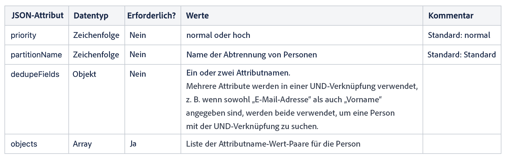

# Integrieren mit Marketo Engage {#integrating-with-marketo-engage}

Verbinden Sie sich mit einer Journey der nahtlosen Datenintegration mit Marketo Engage. Diese spezifische benutzerdefinierte Aktion in Journey Optimizer unterstützt die Erfassung von zwei Schlüsseldatentypen:

* Personen (Profile): Marketo wandelt Profile in umsetzbare Einblicke um.
* Benutzerdefinierte Objekte: Passen Sie Ihre Daten mit benutzerdefinierten Objekten (z. B. Produkten) für einen personalisierten Marketing-Ansatz an.

## Voraussetzungen {#prerequisites}

* Die Kundeninstanz von Marketo Engage muss IMS-fähig sein.
* Marketo Engage-Instanz und AEP-/AJO-Instanz müssen sich in derselben IMS-Organisation befinden. +link
* Der Kunde muss über MktoSync: Zugriff auf den Erfassungsdienst verfügen (HINWEIS ZUM HINZUFÜGEN HIER + Link).

## Konfigurieren der Aktion {#configure-marketo-action}

* Navigieren Sie zu Administration > Konfigurationen > Aktionen und klicken Sie auf Verwalten .
* Klicken Sie in der Liste Aktionen auf Aktion erstellen . Weitere Informationen zur Erstellung einer benutzerdefinierten Aktion finden Sie hier (+link).
* Geben Sie den Namen und die Beschreibung ein und wählen Sie Adobe Marketo Engage als Aktionstyp aus.


* Klicken Sie für Ihre **Anfrage** - und **Antwort** -Payloads auf Payload bearbeiten .
* Erstellen Sie für beide Ihre Payload und fügen Sie sie in das dedizierte Popup ein.


* Inspect und Konfigurieren von Payload-Werten
Hinweis: Um Werte dynamisch zu übergeben, ändern Sie für jedes Feld **Konstante** in **Variable**.


* Klicken Sie im Fenster Feldkonfiguration auf **Speichern** und dann für Ihre benutzerdefinierte Aktion auf **Speichern** .

Sie können jetzt Ihre benutzerdefinierte Aktion auf Ihrer dedizierten Arbeitsfläche verwenden.


## Payload-Syntax {#payload-syntax}

### Person



### CustomObject


**Payload-Beispiel für Person**

```json
{
   "munchkinID": "388-KKG-245",  
   "person": {
    "priority": "normal",
    "partitionName": "XYZ",
    "dedupeFields": {
      "field1": "email",
      "field2": "firstName"
    },
    "objects": [
      {
        "email": "Email address",
        "firstName": "First name",
        "lastName": "Last name"
      }
    ]
  }
}
```

**Payload-Beispiel für benutzerdefiniertes Objekt**

```json
{
  "munchkinID": "388-KKG-245", 
  "customObject": {
    "priority": "normal",
    "objectName": "products",
    "objects": [
      {
        "email": "Email Address",
        "productName": "Product Name",
        "productQty": "Product Quantity",
        "priceTotal": "Price Total"
      }
    ]
  }
}
```


## Verwenden der Aktion {#engage-using}

* Ziehen Sie die benutzerdefinierte Aktion auf die Journey-Arbeitsfläche. (Siehe Verwendung einer benutzerdefinierten Aktion/eines Links)
* Klicken Sie in den Anforderungsparametern für jeden Parameter mit dynamischen Werten, die Sie in der Payload konfiguriert haben, auf Bearbeiten .


