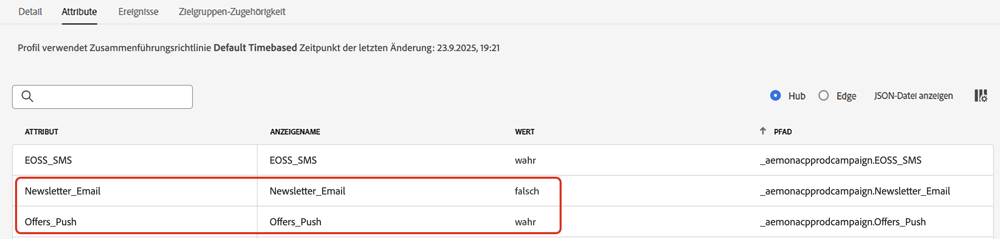
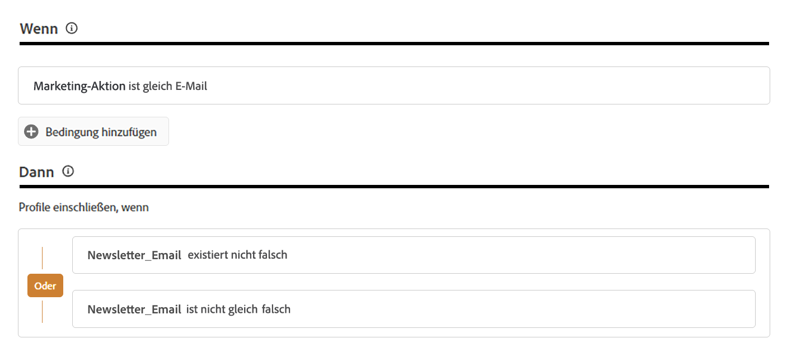

# Verwalten der Voreinstellungen von Kundinnen und Kunden {#preference-center}

>[!AVAILABILITY]
>
>Diese Funktion ist derzeit nur für Organisationen verfügbar, die die Adobe-Add-ons **Healthcare Shield** und **Privacy and Security Shield** erworben haben.

In einem modernen Ökosystem der Marketing-Automatisierung interagieren Marken mit Kundinnen und Kunden über verschiedene Touchpoints hinweg und sehen sich dem Risiko irrelevanter oder übermäßiger Kommunikation ausgesetzt, was zu abgebrochener Interaktion, Spam-Beschwerden und Compliance-Risiken führt. Aus diesem Grund müssen sie die Voreinstellungen ihrer Kundinnen und Kunden verwalten, um Echtzeiterkenntnisse zu ihrer Zielgruppe zu erhalten und personalisierte, respektvolle Kommunikation bereitzustellen.

Mit [!DNL Adobe Journey Optimizer] können Sie durch die Verwendung [Einverständnisrichtlinien](consent.md) die Vorlieben Ihrer Kunden berücksichtigen<!-- in terms of **channels** and **topics**-->. Dadurch wird sichergestellt, dass [!DNL Journey Optimizer] Kundinnen und Kunden nur basierend auf deren Entscheidungen anspricht<!-- their preferred channels and on the subscription topics--> und gleichzeitig ihr Einverständnis respektiert.

Es gibt folgende Möglichkeiten zum Verwalten der Voreinstellungen von Benutzenden mit [!DNL Journey Optimizer]:

* Rufen Sie die Zustimmung Ihrer Kundinnen und Kunden zum Opt-in/Opt-out für einen nativen Outbound-Kanal ab. Beispielsweise können Sie eine Einverständnisrichtlinie in [!DNL Experience Platform] erstellen, um Kundinnen und Kunden auszuschließen, die dem Empfang von Nachrichten für einen bestimmten Kanal nicht zugestimmt haben. Wenden Sie diese Einverständnisrichtlinie dann mithilfe einer E-Mail-Kanal-Konfiguration in [!DNL Journey Optimizer] an. [Weitere Informationen](consent.md#surface-marketing-actions)

  >[!NOTE]
  >
  >Die unterstützten Kanäle sind E-Mail, Push, SMS und In-App.<!--To check-->

* Fragen Sie Ihre Kundinnen und Kunden, welche Themen sie abonnieren möchten (z. B. welche Art von Nachrichten sie akzeptieren und welche nicht). [Weitere Informationen](#manage-preferences)

>[!IMPORTANT]
>
>Das Einverständnis hat Vorrang vor den Voreinstellungen. Wenn beispielsweise der bevorzugte Kanal einer Person E-Mail ist und diese Person dem Empfang eines Newsletters zugestimmt hat<!-- they are interested in yoga-->, sie sich jedoch vom Empfang von Nachrichten von Ihnen abgemeldet hat, können Sie dieser Person keinen E-Mail-Newsletter senden<!-- on yoga-->.

## Aufzeichnen und Berücksichtigen von Voreinstellungen {#manage-preferences}

Mit Einverständnisrichtlinien können Sie in [!DNL Journey Optimizer] die Voreinstellungen Ihrer Kundinnen und Kunden zentral verwalten. Auf diese Weise können Sie sicherstellen, dass Sie Kundinnen und Kunden nur auf der Grundlage der von ihnen ausgewählten Themen ansprechen und dabei ihre Einverständnisentscheidungen respektieren. Gehen Sie dazu wie folgt vor.

Angenommen, Sie möchten Ihre Kundinnen und Kunden anhand ihrer Kommunikationsvoreinstellungen über mehrere Abonnementthemen hinweg (*Newsletter*, *Angebote* und *Einführungen neuer Produkte*) durch Journeys und Kampagnen ansprechen.

1. Definieren Sie Voreinstellungsattribute mit dem booleschen Operator auf Profilebene<!--how??-->. Sie können beispielsweise Folgendes angeben:

   * *Newsletter_Email*: Boolescher Wert (wahr/falsch)
   * *Offers_Push*: Boolescher Wert (wahr/falsch)
   * *Einführungen neuer Produkte*: Boolescher Wert (wahr/falsch)

   Diese Attribute werden im Schema eines profilaktivierten [Datensatzes](../data/get-started-datasets.md) erfasst und dem [einheitlichem Kundenprofil](../audience/get-started-profiles.md) zugeordnet.

   >[!NOTE]
   >
   >Kundeneinverständnis und Kontaktvoreinstellungen sind komplexe Themen. Weitere Informationen dazu, wie Einverständnis- und Kontextvoreinstellungen in [!DNL Experience Platform] erfasst, verarbeitet und gefiltert werden können, finden Sie in folgenden Dokumenten:
   >
   >* Weitere Informationen zu den Schemafeldgruppen, die zum Erfassen von Einverständnisdaten erforderlich sind, finden Sie auf [dieser Seite](https://experienceleague.adobe.com/de/docs/experience-platform/landing/governance-privacy-security/consent/adobe/overview){target="_blank"}. Es wird beschrieben, wie Sie die von Ihren Kundinnen und Kunden erfassten Einverständnisdaten verarbeiten und in Ihre gespeicherten Kundenprofile integrieren können.
   >* Weitere Informationen zur Feldergruppe zu Einverständnis und Voreinstellungen finden Sie auf [dieser Seite](https://experienceleague.adobe.com/de/docs/experience-platform/xdm/field-groups/profile/consents#ingest){target="_blank"}.
   >* Die Schritte, mit denen Sie benutzerdefinierte Voreinstellungsfelder zum Schema hinzufügen, finden Sie in [diesem Abschnitt](https://experienceleague.adobe.com/de/docs/experience-platform/landing/governance-privacy-security/consent/adobe/dataset#custom-consent){target="_blank"}.

1. Erstellen Sie eine Seite, um die Voreinstellungen Ihrer Kundinnen und Kunden zu erfassen. Verwenden Sie eine der folgenden Methoden:

   * Erstellen Sie eine Web-Seite, um die Voreinstellungen Ihrer Kundinnen und Kunden mithilfe des [Adobe Experience Platform Web SDK](https://experienceleague.adobe.com/de/docs/experience-platform/web-sdk/home){target="_blank"} aufzuzeichnen.

   * Verwenden Sie eine [Landingpage](../landing-pages/create-lp.md) in [!DNL Journey Optimizer], die Formulare enthält, um die Voreinstellungen Ihrer Kundinnen und Kunden mithilfe von Profildaten zu erfassen.  [Weitere Informationen zu Formularen](../landing-pages/lp-forms.md) <!--Forms not released/announced yet - TBC-->

     >[!NOTE]
     >
     >Stellen Sie sicher, dass die Domain der verwendeten Landingpage zur übergeordneten Marke und nicht zu einer Untermarke gehört. Die erfassten Voreinstellungen werden in den Profildaten gespeichert, die auf Ebene der übergeordneten Marke gespeichert sind.

1. Auf dieser Seite können Kundinnen und Kunden ihre Voreinstellungen aktualisieren (z. B. themenbezogene Abonnements), indem sie Kontrollkästchen aktivieren oder deaktivieren.

   Jede Aktion löst ein Einverständnisereignis aus, das für die entsprechenden Profilattribute gespeichert wird (`true` für Opt-in, `false` für Opt-out), indem die Daten in das profilaktivierte Datensatzschema aufgenommen werden<!-- that contains the corresponding preference fields-->.

   <!--Record your users' preferences through the web page or landing page that you created. The data is saved against the corresponding profile, meaning that the preference data is ingested into a Profile-enabled dataset whose schema contains consent/preference fields.-->

   Eine Person <!--whose email address is john.black@lumamail.com--> hat beispielsweise dem Empfang von Push-Angeboten zugestimmt, möchte jedoch keine E-Mail-Newsletter erhalten. Das entsprechende Profil wird folgendermaßen aktualisiert:

   {width=80%}

<!--The corresponding profile dataset is updated as follows:

|Attribute = Email id | Attribute = Offers_Push | Attribute = Newsletters_Email |
|---------|----------|---------|
| john.black@lumamail.com | Y | N |-->

    >[!NOTE]
    >
    >Die eingehenden Einverständnisereignisse werden in das Kundenprofil aufgenommen, sodass Echtzeit-Aktualisierungen gewährleistet sind. Jedes Profil spiegelt die neuesten Auswahlmöglichkeiten in den Abonnementvoreinstellungen wider.

1. Erstellen Sie in Adobe Experience Platform eine benutzerdefinierte Richtlinie (über das Menü **[!UICONTROL Datenschutz]** > **[!UICONTROL Richtlinien]**). [Weitere Informationen](https://experienceleague.adobe.com/docs/experience-platform/data-governance/policies/user-guide.html?lang=de#create-policy){target="_blank"}

   >[!AVAILABILITY]
   >
   >Einverständnisrichtlinien sind derzeit nur für Organisationen verfügbar, die die Adobe-Add-ons **Healthcare Shield** und **Privacy and Security Shield** erworben haben. [Informationen zu Entscheidungsrichtlinien](consent.md)

   Um Einverständnisrichtlinien verwenden zu können, müssen in den Profildaten Voreinstellungsattribute vorhanden sein. Daher müssen Sie diese Attribute auf Profilebene definieren (wie in Schritt 1 beschrieben).

1. Wählen Sie den Typ der **[!UICONTROL Einverständnisrichtlinien]** und konfigurieren Sie eine Bedingung wie folgt. [Informationen zum Konfigurieren von Einverständnisrichtlinien](https://experienceleague.adobe.com/docs/experience-platform/data-governance/policies/user-guide.html?lang=de#consent-policy){target="_blank"}

<!--Consent policies are comprised of two logical components:

* **If**: The condition that will trigger the policy check, based on a certain marketing action (email, SMS, push, custom action, etc.) being performed, the presence of certain data usage labels, or a combination of the two.

* **Then**: The consent attribute must be present for a profile to be included in the action that triggered the policy. More than one field can also be selected.-->

    Um beispielsweise Nachrichten nur an Kundinnen und Kunden zu senden, die sich nicht gegen den Empfang von E-Mail-Newslettern entschieden haben, erstellen Sie eine benutzerdefinierte Richtlinie und definieren Sie die folgende Bedingung:
    
    * Wenn **[!UICONTROL Marketing action]** gleich **[!UICONTROL Email]**
    
    * Dann **[!UICONTROL Newsletter_Email]** nicht vorhanden **[!UICONTROL false]** Oder **[!UICONTROL Newsletter_Email]** nicht gleich **[!UICONTROL false]**
    
    {width=80%}
    
    >[!TIP]
    >
    >Der profilaktivierte Datensatz muss das Profilattribut **[!UICONTROL Newsletter_Email]** mit dem Wert „true“ enthalten (wie in Schritt 1 beschrieben).

1. Nachdem Sie die Einverständnisrichtlinie erstellt haben, nutzen Sie sie in [!DNL Journey Optimizer] mithilfe von [Kanalkonfigurationen](consent.md#surface-marketing-actions) oder [benutzerdefinierten Journey-Aktionen](consent.md#journey-custom-actions).

1. Jetzt können Sie diese Kanalkonfigurationen oder benutzerdefinierten Aktionen in Ihren Journeys und Kampagnen verwenden, um sicherzustellen, dass die Voreinstellungen Ihrer <!--targeted--> Kundinnen und Kunden berücksichtigt werden.
