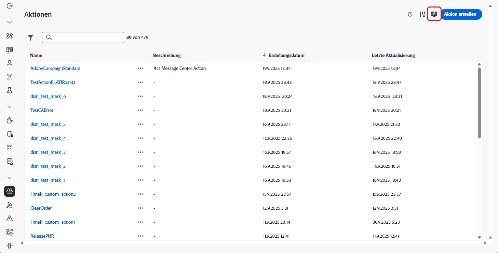
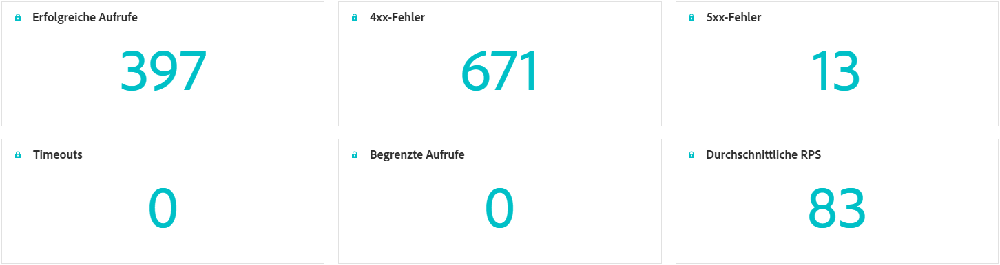
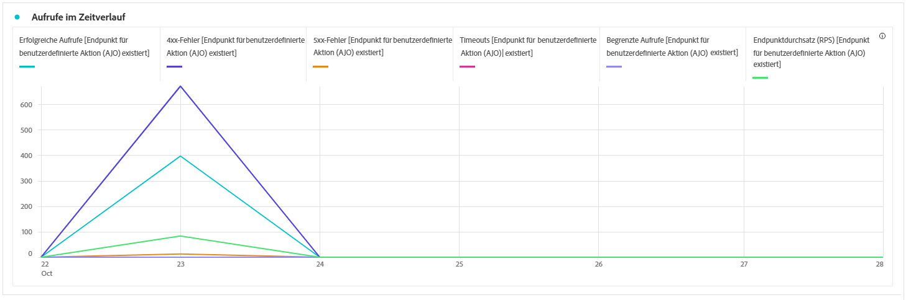
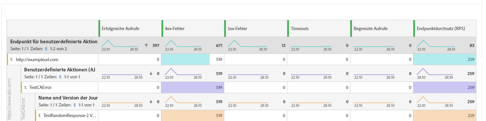

# Überwachen benutzerdefinierter Aktionen {#reporting}

>[!CONTEXTUALHELP]
>id="ajo_campaigns_custom_actions_monitor"
>title="Überwachen benutzerdefinierter Aktionen"
>abstract="Auf der Reporting-Seite **[!UICONTROL Benutzerdefinierte Aktion]** können Sie die Leistung und Zuverlässigkeit von API-Aufrufen nachverfolgen, die Ihre Journeys an Drittanbietersysteme senden."

>[!AVAILABILITY]
>
>Reporting für benutzerdefinierte Aktionen ist derzeit nur für eine Reihe bestimmter Organisationen verfügbar (eingeschränkte Verfügbarkeit). 

Auf der Reporting-Seite **[!UICONTROL Benutzerdefinierte Aktion]** können Sie die Zuverlässigkeit und Leistung von API-Aufrufen von Ihren Journeys an Drittanbietersysteme überwachen. Diese Berichte helfen Ihnen dabei, Integrationsprobleme, Latenzengpässe oder Drosselungs-/Begrenzungs-Limits, die sich auf den Versand auswirken können, schnell zu identifizieren.

Die Reporting-Seite „Benutzerdefinierte Aktion“ funktioniert wie andere Berichte für die gesamte Zeit in Journey Optimizer. Weitere Informationen zu den Dashboard-Funktionen finden Sie [in dieser Dokumentation](../reports/report-cja-manage.md).

Um auf die Reporting-Seite **[!UICONTROL Benutzerdefinierte Aktion]** zuzugreifen, klicken Sie auf der Startseite **[!UICONTROL Aktionen]** auf .

➡️ [Weitere Informationen zur Konfiguration benutzerdefinierter Aktionen](../action/about-custom-action-configuration.md)

Zusätzlich zur Reporting-Seite **[!UICONTROL Benutzerdefinierte Aktion]** können Sie **[!DNL Adobe Experience Platform Query Service]** verwenden, um Abfragen für Berichte zu Leistungsmetriken benutzerdefinierter Aktionen zu erstellen. Weitere Anwendungsbeispiele finden Sie in [diesem Abschnitt](../reports/query-examples.md).

## KPIs {#kpis}

Die Key Performance Indicators (KPIs) für **[!UICONTROL benutzerdefinierte Aktionen]** dienen als zentralisiertes Dashboard, das einen konsolidierten Überblick über den Betriebsstatus und die Zuverlässigkeit der Aufrufe Ihrer benutzerdefinierten Aktionen bietet. Mit diesen Metriken können Sie die Leistung bewerten, Engpässe identifizieren und stabile Integrationen mit externen Systemen sicherstellen.

+++ Weitere Informationen zu KPIs für benutzerdefinierte Aktionen

* **[!UICONTROL Erfolgreiche Aufrufe]**: Gesamtzahl der HTTP-Aufrufe, die eine gültige Antwort ohne Fehler zurückgegeben haben.

* **[!UICONTROL 4xx/5xx-Fehler]**: Anzahl fehlgeschlagener Aufrufe aufgrund von Client-seitigen (4xx) oder Server-seitigen (5xx) Fehlern, wobei Konfigurationsprobleme oder Endpunktfehler hervorgehoben werden.

* **[!UICONTROL Timeouts]**: Anzahl der Aufrufe, die fehlgeschlagen sind, weil sie die maximale Antwortzeit überschritten haben. Dies hilft bei der Ermittlung von Latenz- oder Leistungsproblemen mit externen Endpunkten.

* **[!UICONTROL Begrenzte Aufrufe]**: Anzahl der Aufrufe, die aufgrund von Begrenzungen blockiert wurden, um sicherzustellen, dass nachgelagerte Systeme nicht überlastet werden.

* **[!UICONTROL Durchschnittliche RPS]**: Anzahl der Anfragen pro Sekunde, die von der benutzerdefinierten Aktion über den ausgewählten Zeitraum verarbeitet wurden.

+++

## Aufrufe im Zeitverlauf {#calls}

Das Diagramm **[!UICONTROL Aufrufe im Zeitverlauf]** zeigt den KPI-Trend der HTTP-Aufrufe über im Bericht ausgewählten Zeitraum an. Die Granularität der Zeitreihe hängt vom ausgewählten Zeitbereich ab. Beispiel:

* Bei einem siebentägigen Bericht zeigt jeder Datenpunkt die KPIs für einen Tag an.
* Wenn Sie einen Zeitraum von 1 Tag auswählen, zeigt das Diagramm die KPIs pro Stunde an.
* Wenn Sie einen Zeitbereich von 1 Stunde auswählen, zeigt das Diagramm die KPIs pro Minute an.

➡️[Eine Beschreibung der Metriken für HTTP-Aufrufe finden Sie im Abschnitt zu KPIs](#kpis)

## Aufschlüsselung der Aufrufe {#breakdown}

Die Tabelle **[!UICONTROL Aufschlüsselung der Aufrufe]** bietet eine hierarchische Aufschlüsselung der HTTP-Aufrufmetriken, von den Gesamtmetriken pro Endpunkt auf der obersten Ebene über die Metriken pro benutzerdefinierter Aktion bei Verwendung jedes Endpunkts bis hin zu den Journeys, die auf der untersten Ebene auf ihnen basieren.

➡️[Eine Beschreibung der Metriken für HTTP-Aufrufe finden Sie im Abschnitt zu KPIs](#kpis)

