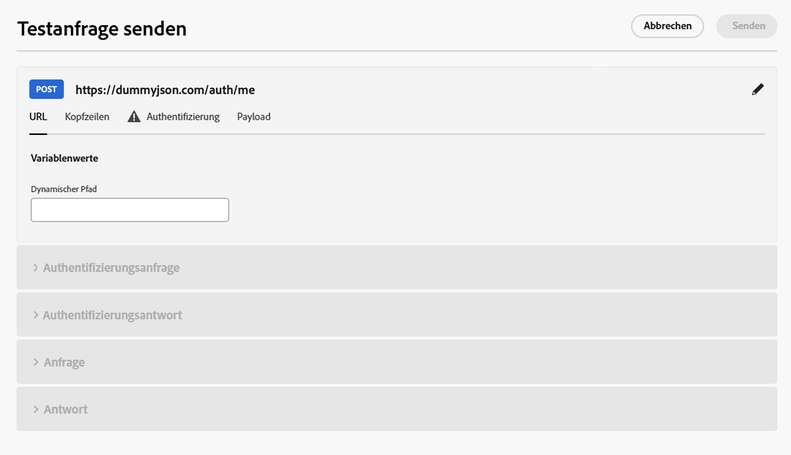
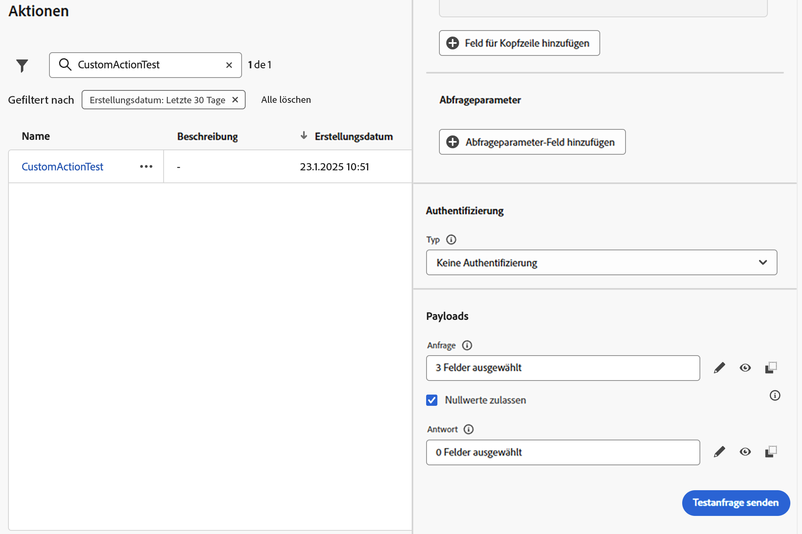

# Fehlerbehebung bei benutzerdefinierten Aktionen {#troubleshoot-a-custom-action}

Sie können Ihre benutzerdefinierten Aktionen testen, indem Sie API-Aufrufe aus dem Abschnitt „Administration“ der Benutzeroberfläche von Journey Optimizer senden. Mit dieser Funktion können Sie Fehler bei benutzerdefinierten Aktionen beheben, bevor oder nachdem diese in einer Journey verwendet werden.

Verwenden Sie als Admin die Funktion **[!UICONTROL Testanfrage senden]**, um die Konfigurationen der benutzerdefinierten Aktion zu validieren, indem Sie echte API-Aufrufe direkt von Adobe Journey Optimizer aus durchführen. Durch diese Funktion wird sichergestellt, dass Anfragestruktur, Header, Authentifizierung und Payload korrekt formatiert sind, bevor sie in einer Journey verwendet werden.

{width="70%" align="left"}

Indem Sie diese Funktion verwenden, wird der Test- und Validierungsprozess optimiert, sodass benutzerdefinierte Aktionen in Live-Journeys ordnungsgemäß funktionieren.

>[!NOTE]
>
>Wenn für Ihr Unternehmen der IP (Ausgangs)-Proxy aktiviert ist, wird **[!UICONTROL Aufruf „Testanfrage senden]** umgangen. Um das Proxy-Routing zu bestätigen, führen Sie einen Test oder eine Live-Journey aus. Erfahren Sie mehr über den IP (Egress)-Proxy und die Aktivierung in [Integration mit externen Systemen](../configuration/external-systems.md#faq).

## Voraussetzungen {#troubleshoot-custom-action-prereq}

Um die Funktion **[!UICONTROL Testanfrage senden]** verwenden zu können, muss eine **benutzerdefinierte Aktion** mit einer URL, Headern und Authentifizierungseinstellungen vorkonfiguriert werden.

Damit Admins diese Funktion verwenden können, sind die folgenden Berechtigungen erforderlich:

* Benutzerinnen und Benutzer müssen über die Berechtigung **[!DNL Manage journeys events, data sources and actions]** verfügen.
* Diese Berechtigung ist in der Rolle *Journey-Administratoren* enthalten.
* Die Berechtigung **[!DNL View journeys events]** allein reicht nicht aus.

Weitere Informationen zu Journey-Berechtigungen finden Sie in [diesem Abschnitt](../administration/high-low-permissions.md#journey-capability).

## Verwendung der Funktion „Testanfrage senden“ {#troubleshoot-custom-action-use}

Gehen Sie wie folgt vor, um eine benutzerdefinierte Aktion zu testen:

1. Navigieren Sie zum Bildschirm **Aktionskonfiguration** und wählen Sie eine benutzerdefinierte Aktion aus.
1. Klicken Sie auf die Schaltfläche **[!UICONTROL Testanfrage senden]** unten am Bildschirm „Aktionskonfiguration“.
   {width="70%" align="left"}
1. Im Popup-Fenster können Sie Anfrageparameter angeben:

   * Wenn die **benutzerdefinierte Aktionsmethode GET ist**, ist keine Payload erforderlich.
   * Wenn die **benutzerdefinierte Aktionsmethode POST ist**, müssen Sie eine JSON-Payload angeben.

     >[!NOTE]
     >
     >Adobe Journey Optimizer löst einen Fehler aus, wenn die Struktur dieser JSON falsch ist, aber nicht, wenn keine Übereinstimmung mit einem Datentyp vorliegt. Beispielsweise tritt kein Fehler auf, wenn ein ganzzahliger Parameter dort verwendet wird, wo es eine Zeichenfolge sein sollte.

   * Wenn die Authentifizierung definiert ist, werden Sie aufgefordert, Authentifizierungsdetails einzugeben.

1. Klicken Sie auf **Senden**, um die Anfrage auszuführen.
1. Die Antwort der API, einschließlich Header und Status-Codes, wird in der Benutzeroberfläche angezeigt.

## Authentifizierungsverarbeitung {#troubleshoot-custom-action-auth}

Wenn eine benutzerdefinierte Aktion eine Authentifizierung enthält, verlangt Adobe Journey Optimizer, dass die Benutzerin bzw. der Benutzer Authentifizierungsdetails für jede Testanfrage eingibt:

* **Einfache Authentifizierung:** Die Benutzerin bzw. der Benutzer muss das *Kennwort* eingeben.
* **API-Schlüsselauthentifizierung:** Die Benutzerin bzw. der Benutzer muss den *Wert* des API-Schlüssels eingeben.
* **Benutzerdefinierte Authentifizierung:** Die Benutzerin bzw. der Benutzer muss die Authentifizierungsparameter im *bodyParam* der Anfrage angeben. In diesem Fall werden zwei Abschnitte hinzugefügt: **Authentifizierungsanfrage** und **Authentifizierungsantwort**.

## Wichtigste Vorteile {#troubleshoot-custom-action-benefits}

Als Journey Optimizer-Admin können Sie auch externe Tools (z. B. Postman) verwenden, um die benutzerdefinierten Aktionen zu testen. Die wichtigsten Vorteile der produktinternen Fehlerbehebungsfunktion im Vergleich zu einem externen Test sind unten aufgeführt:

* Die Testanfrage wird von **AJO Journey** ausgeführt, was bedeutet:

   * Die exakte Anfragestruktur (einschließlich der für Adobe Journey Optimizer spezifischen Header) wird verwendet.
   * Die Quell-IP und -Header stimmen mit denen überein, die in Live-Journeys verwendet werden.

* Die Funktion **[!UICONTROL Testanfrage senden]** kann zur Fehlerbehebung von **Live-Journeys** verwendet werden, da die benutzerdefinierte Aktion bereits bereitgestellt ist.

* Durch diese produktinterne Testfunktion entfällt die Notwendigkeit, Konfigurationsdetails manuell zwischen Tools zu kopieren, wodurch das Fehlerrisiko reduziert wird.

## Fehlerbehebung {#troubleshoot-custom-action-check}

Wenn die Anfrage fehlschlägt, können Sie Folgendes überprüfen:

* Die im Test eingegebenen Anmeldeinformationen.
* Die Anfragemethode (GET vs. POST) und die entsprechende Payload.
* Der API-Endpunkt und die Header, die in der benutzerdefinierten Aktion definiert sind.
* Verwenden Sie die Antwortdaten, um potenzielle Fehlkonfigurationen zu identifizieren.

## Verwerfen-Ereignisse und Leerlauf-Timeouts handhaben {#handling-discard-events-and-idle-timeouts}

Wenn eine benutzerdefinierte Aktion auf einem Journey ein Ereignis zum Starten einer **zweiten Journey** Trigger, stellen Sie sicher, dass sich die zweite Journey in einem gültigen Zustand befindet und das Ereignis erkannt wird. Wenn das Ereignis die Einstiegsbedingungen der zweiten Journey nicht erfüllt, kann das Ereignis **verworfen** und in Protokollen mit Codes wie `notSuitableInitialEvent` angezeigt werden. Leerlaufzeitüberschreitungen können auftreten, wenn die zweite Journey nicht bereit ist, was zu Verwerfungsereignissen in den Protokollen führt.

**Häufige Ursachen:**

* **Ereignisqualifizierung nicht erfüllt** - Die zweite Journey verwendet ein regelbasiertes Ereignis mit einer Qualifizierungsbedingung (ein erforderliches Feld darf beispielsweise nicht leer sein, z. B. `isNotEmpty` für ein bestimmtes Feld). Wenn die Ereignis-Payload diese Bedingung nicht erfüllt (z. B. wenn das Feld leer ist oder fehlt), wird das Ereignis **empfangen, aber verworfen** und die zweite Journey wird nicht ausgelöst. Dies ist das erwartete Verhalten. Die Dokumentation und die Protokolle bestätigen, dass das Ereignis verworfen wird und das Journey für dieses Profil nicht ausgelöst wird, wenn die Qualifizierungsbedingung nicht erfüllt ist. Stellen Sie sicher, dass die von der benutzerdefinierten Aktion gesendete Payload alle Felder und Werte enthält, die für die zweite Journey-Ereigniskonfiguration erforderlich sind. Erfahren Sie, wie [regelbasierte Ereignisse konfigurieren](../event/about-creating.md) und [Fehlerbehebung beim Ereignisempfang](../building-journeys/troubleshooting-execution.md#checking-if-people-enter-the-journey) bei der Journey-Ausführung durchführen.

* **Zweite Journey nicht bereit** - Zeitüberschreitungen im Leerlauf können auftreten, wenn die zweite Journey noch nicht aktiv ist (z. B. nicht im Testmodus oder nicht live) oder wenn eine Zeitlücke zwischen der benutzerdefinierten Aktionsauslösung und der zweiten Journey, die bereit zum Empfang ist, besteht. Stellen Sie sicher, dass der Ziel-Journey veröffentlicht wird oder sich im Testmodus befindet, bevor die benutzerdefinierte Aktion ausgelöst wird.

* **Diagnose von Verwerfungsereignissen** - Wenn Verwerfungsereignisse in Protokollen angezeigt werden, überprüfen Sie die Journey-Protokolle und Splunk-Traces, um zu bestätigen, ob das Ereignis empfangen, aber aufgrund von Qualifizierung (Payload entsprach nicht der Regel) oder Timing verworfen wurde. Stellen Sie sicher, dass das Startdatum und die Konfiguration der zweiten Journey korrekt sind und dass sich die Journey im aktiven Datumsfenster befindet.

Um zu vermeiden, dass Ereignisse verworfen werden, wenn Journey über benutzerdefinierte Aktionen verkettet werden, überprüfen Sie die Ereignis-Payload anhand der Ereignisregel der zweiten Journey und bestätigen Sie, dass die Ziel-Journey live oder im Testmodus und innerhalb ihres aktiven Datumsfensters ist.

## Weitere Ressourcen

In den folgenden Abschnitten erfahren Sie mehr über die Konfiguration und Verwendung Ihrer benutzerdefinierten Aktionen:

* [Erste Schritte mit benutzerdefinierten Aktionen](../action/action.md): Erfahren Sie, was eine benutzerdefinierte Aktion ist und wie Sie damit eine Verbindung zu Ihren Drittanbietersystemen herstellen können
* [Konfigurieren benutzerdefinierter Aktionen](../action/about-custom-action-configuration.md): Erfahren Sie, wie Sie eine benutzerdefinierte Aktion erstellen und konfigurieren
* [Verwenden benutzerdefinierter Aktionen](../building-journeys/using-custom-actions.md): Erfahren Sie, wie Sie benutzerdefinierte Aktionen in Ihren Journeys verwenden
* [Übergeben von Sammlungen in Parameter benutzerdefinierter Aktionen](../building-journeys/collections.md): Erfahren Sie, wie Sie eine Sammlung in Parameter benutzerdefinierter Aktionen übergeben, die zur Laufzeit dynamisch gefüllt werden

