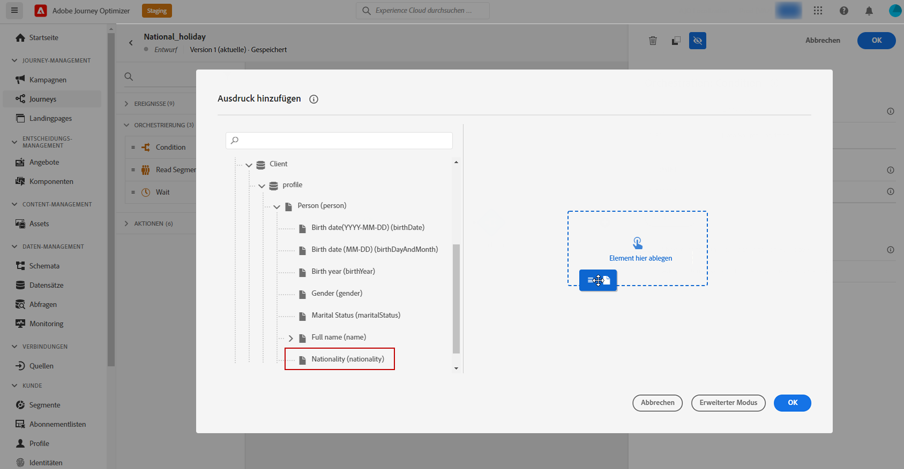

# Attributbasierte Zugriffssteuerung {#attribute-based-access}

>[!IMPORTANT]
>
>Die Verwendung der attributbasierten Zugriffssteuerung ist derzeit nur für ausgewählte Benutzer verfügbar. Wenn Sie diese Funktion nutzen möchten, wenden Sie sich an Ihren Adobe-Kundenbetreuer.

Mit der attributbasierten Zugriffssteuerung (ABAC) können Sie Berechtigungen definieren, um den Datenzugriff für bestimmte Teams oder Benutzergruppen zu verwalten. Sie dient dem Schutz sensibler digitaler Assets vor unbefugten Benutzern und ermöglicht so einen weiteren Schutz personenbezogener Daten.

In Adobe Journey Optimizer können Sie mit ABAC Daten schützen und spezifischen Zugriff auf bestimmte Feldelemente gewähren, darunter Experience-Datenmodell (XDM)-Schemas, Profilattribute und Segmente.

<!--For a more detailed list of the terminology used with ABAC, refer to Adobe Experience Platform documentation.-->

In diesem Beispiel möchten wir dem Schemafeld **Staatsangehörigkeit** einen Titel hinzufügen, um nicht autorisierte Benutzer an der Verwendung zu hindern. Damit dies funktioniert, gehen Sie wie folgt vor:

1. Weisen Sie dem Schemafeld **Staatsangehörigkeit** in Adobe Experience Platform einen **[!UICONTROL Titel]** zu.

2. Erstellen Sie eine neue **[!UICONTROL Rolle]** und weisen Sie ihr den entsprechenden **[!UICONTROL Titel]** zu, damit Benutzer auf das Schemafeld zugreifen und es verwenden können.

3. Verwenden Sie das **[!UICONTROL Schemafeld]** in Adobe Journey Optimizer.

## Zuweisen von Titeln zu einem Objekt in Adobe Experience Platform {#assign-label}

>[!WARNING]
>
>Die falsche Verwendung von Titeln kann den Zugang zu Personen unterbrechen und zu Richtlinienverstößen führen.

**[!UICONTROL Titel]** können verwendet werden, um bestimmte Funktionsbereiche mithilfe der attributbasierten Zugriffssteuerung zuzuweisen.
In diesem Beispiel möchten wir den Zugriff auf das Feld **Staatsangehörigkeit** einschränken. Auf dieses Feld können nur Benutzer mit dem entsprechenden **[!UICONTROL Titel]** in ihrer **[!UICONTROL Rolle]** zugreifen.

Beachten Sie, dass Sie **[!UICONTROL Titel]** auch zu **[!UICONTROL Schemas]**, **[!UICONTROL Datensätzen]** und **[!UICONTROL Segmenten]** hinzufügen können.

1. Erstellen Sie Ihr **[!UICONTROL Schema]**. Weitere Informationen hierzu finden Sie in [dieser Dokumentation](https://experienceleague.adobe.com/docs/experience-platform/xdm/schema/composition.html?lang=de).

   

1. Im neu erstellten **[!UICONTROL Schema]** fügen wir zunächst die Feldergruppe **[!UICONTROL Demografische Details]** hinzu, die das Feld **Staatsangehörigkeit** enthält.

   

1. Überprüfen Sie auf der Registerkarte **[!UICONTROL Titel]** den Namen des eingeschränkten Feldes, hier **Staatsangehörigkeit**. Wählen Sie dann im Menü des rechten Fensterbereichs die Option **[!UICONTROL Bearbeiten von Governance-Titeln]**.

   

1. Wählen Sie die entsprechenden **[!UICONTROL Titel]** aus. In diesem Fall können die C2-Daten nicht an einen Drittanbieter exportiert werden. Eine detaillierte Liste der verfügbaren Titel finden Sie auf [dieser Seite](https://experienceleague.adobe.com/docs/experience-platform/data-governance/labels/reference.html?lang=de#contract-labels).

   

1. Personalisieren Sie Ihr Schema bei Bedarf weiter und aktivieren Sie es dann. Die detaillierten Schritte zum Aktivieren Ihres Schemas finden Sie auf dieser [Seite](https://experienceleague.adobe.com/docs/experience-platform/xdm/ui/resources/schemas.html?lang=de#profile).

Das Feld Ihres Schemas ist nun nur noch für Benutzer sichtbar, die Teil eines Rollensets mit dem Titel „C2“ sind, und kann nur von diesen verwendet werden.
Beachten Sie, dass der **[!UICONTROL Titel]** automatisch auf das Feld **Staatsangehörigkeit** in jedem erstellten Schema angewendet wird, wenn Sie Ihrem **[!UICONTROL Feldnamen]** einen **[!UICONTROL Titel]** zuweisen.

## Erstellen einer Rolle und Zuweisen von Titeln {#assign-role}

**[!UICONTROL Rollen]** sind eine Gruppe von Benutzern, die innerhalb Ihrer Organisation dieselben Berechtigungen, Titel und Sandboxes verwenden. Jeder Benutzer, der einer **[!UICONTROL Rolle]** angehört, hat die Berechtigung für die Adobe-Programme und -Services, die im Produkt enthalten sind.
Sie können auch eigene **[!UICONTROL Rollen]** erstellen, wenn Sie den Zugriff Ihrer Benutzer auf bestimmte Funktionen oder Objekte in der Benutzeroberfläche präziser definieren möchten.

Wir möchten ausgewählten Benutzern nun Zugriff auf das Feld **Staatsangehörigkeit** mit dem Titel „C2“ gewähren. Dazu müssen wir eine neue **[!UICONTROL Rolle]** mit einer bestimmten Gruppe von Benutzern erstellen und ihnen den Titel „C2“ zuweisen, was ihnen erlaubt, die Details zur **Staatsangehörigkeit** in einer **[!UICONTROL Nachricht]** oder **[!UICONTROL Journey]** zu verwenden.

1. Wählen Sie aus dem [!DNL Permissions]-Produkt im Menü des linken Fensterbereichs die Option **[!UICONTROL Rolle]** und klicken Sie auf **[!UICONTROL Rolle erstellen]**. Beachten Sie, dass Sie auch **[!UICONTROL Titel]** zu integrierten Rollen hinzufügen können.

   

1. Fügen Sie hier einen **[!UICONTROL Namen]** und eine **[!UICONTROL Beschreibung]** zu Ihrer neuen **[!UICONTROL Rolle]** hinzu, hier: Eingeschränkte Rolle „Demografisch“.

1. Wählen Sie Ihre **[!UICONTROL Sandbox]** aus der Dropdown-Liste.

   

1. Klicken Sie im Menü **[!UICONTROL Ressourcen]** auf **[!UICONTROL Adobe Experience Platform]**, um die verschiedenen Funktionen zu öffnen. Hier wählen Sie **[!UICONTROL Nachrichten]** aus.

   

1. Wählen Sie aus der Dropdown-Liste die **[!UICONTROL Berechtigungen]** aus, die mit der ausgewählten Funktion verknüpft sind, z. B. **[!UICONTROL Anzeigen von Nachrichten]** oder **[!UICONTROL Veröffentlichen von Journeys]**.

   

1. Nach dem Speichern der neu erstellten **[!UICONTROL Rolle]** klicken Sie auf **[!UICONTROL Eigenschaften]**, um den Zugriff auf Ihre Rolle weiter zu konfigurieren.

   

1. Klicken Sie auf der Registerkarte **[!UICONTROL Benutzer]** auf **[!UICONTROL Benutzer hinzufügen]**.

   

1. Klicken Sie auf der Registerkarte **[!UICONTROL Titel]** auf **[!UICONTROL Titel hinzufügen]**.

   

1. Wählen Sie den **[!UICONTROL Titel]** aus, den Sie Ihrer Rolle hinzufügen möchten, und klicken Sie auf **[!UICONTROL Speichern]**. In diesem Beispiel gewähren wir den Benutzern den Titel „C2“, damit sie Zugriff auf das zuvor eingeschränkte Feld des Schemas haben.

   

Die Benutzer in der **Eingeschränkten Rolle „Demografisch“** haben nun Zugriff auf die Objekte mit dem Titel „C2“.

## Zugriff auf Objekte mit Titeln in Adobe Journey Optimizer {#attribute-access-ajo}

Nachdem wir den Namen unseres Feldes **Staatsangehörigkeit** in einem neuen Schema und unserer neuen Rolle angegeben haben, können wir nun die Auswirkungen dieser Einschränkung in Adobe Journey Optimizer sehen.
In unserem Beispiel erstellt ein erster Benutzer X mit Zugriff auf Objekte mit dem Titel „C2“ eine Journey mit einer Bedingung, die auf den eingeschränkten **[!UICONTROL Feldnamen]** abzielt. Ein zweiter Benutzer Y ohne Zugriff auf Objekte mit dem Titel „C2“ muss dann die Journey veröffentlichen.

1. In Adobe Journey Optimizer müssen Sie zunächst die **[!UICONTROL Datenquelle]** mit Ihrem neuen Schema konfigurieren.

   

1. Fügen Sie eine neue **[!UICONTROL Feldergruppe]** Ihres neu erstellten **[!UICONTROL Schemas]** zur integrierten **[!UICONTROL Datenquelle]** hinzu. Sie können auch eine neue externe **[!UICONTROLDDatenquelle]** und zugehörige **[!UICONTROL Feldergruppen]** erstellen.

   

1. Nach Auswahl des zuvor erstellten **[!UICONTROL Schemas]** klicken Sie in der Kategorie **[!UICONTROL Felder]** auf **[!UICONTROL Bearbeiten]**.

   

1. Wählen Sie den **[!UICONTROL Feldnamen]** aus, den Sie ansprechen möchten. Hier wählen wir das eingeschränkte Feld **Staatsangehörigkeit**.

   

1. Erstellen Sie dann eine Journey, die Benutzern mit einer bestimmten Staatsangehörigkeit eine Nachricht sendet. Fügen Sie ein **[!UICONTROL Ereignis]** und dann eine **[!UICONTROL Bedingung]** hinzu.

   

1. Wählen Sie das eingeschränkte Feld **Staatsangehörigkeit** aus, um mit der Erstellung Ihres Ausdrucks zu beginnen.

   

1. Bearbeiten Sie Ihre **[!UICONTROL Bedingung]**, um eine bestimmte Population mit eingeschränktem Feld **Staatsangehörigkeit** anzusprechen.

   

1. Personalisieren Sie Ihre Journey nach Bedarf, hier fügen wir eine Aktion **[!UICONTROL Nachricht]** hinzu.

   

Wenn Benutzer Y ohne Zugriff auf Objekte mit dem Titel „C2“ auf diese Journey oder auf Meldungen mit diesem eingeschränkten Feld zugreifen muss, geschieht folgendes:

* Benutzer Y kann den eingeschränkten Feldnamen nicht verwenden, da er nicht sichtbar ist.

* Benutzer Y kann den Ausdruck mit dem eingeschränkten Feldnamen im erweiterten Modus nicht bearbeiten. Der folgende Fehler wird angezeigt `The expression is invalid. Field is no longer available or you don't have enough permission to see it`.

* Benutzer Y kann den Ausdruck löschen.

* Benutzer Y kann die Journey oder Nachricht nicht testen.

* Benutzer Y kann die Journey oder Nachricht nicht veröffentlichen.
