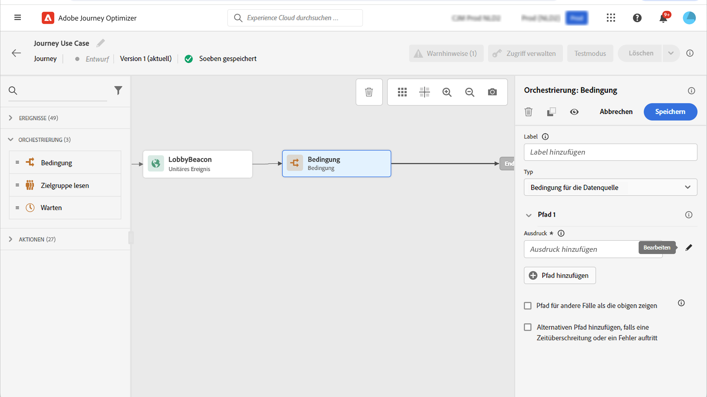

# Attributbasierte Zugriffssteuerung {#attribute-based-access}

>[!IMPORTANT]
>
>Die Verwendung der attributbasierten Zugriffskontrolle ist derzeit auf ausgewählte Kunden beschränkt und wird in einer zukünftigen Version für alle Umgebungen bereitgestellt.

Mit der attributbasierten Zugriffskontrolle (ABAC) können Sie Berechtigungen definieren, um den Datenzugriff für bestimmte Teams oder Benutzergruppen zu verwalten. Sie dient dem Schutz sensibler digitaler Assets vor unbefugten Nutzern, die einen weiteren Schutz personenbezogener Daten ermöglichen.

In Adobe Journey Optimizer können Sie mit ABAC Daten schützen und spezifischen Zugriff auf bestimmte Feldelemente gewähren, darunter Experience-Datenmodell (XDM)-Schemas, Profilattribute und Segmente.

Eine detailliertere Liste der mit ABAC verwendeten Begriffe finden Sie unter [Dokumentation zu Adobe Experience Platform](https://experienceleague.adobe.com/docs/experience-platform/access-control/abac/overview.html).

In diesem Beispiel möchten wir der **Staatsangehörigkeit** Schemafeld, um nicht autorisierte Benutzer an der Verwendung zu hindern. Gehen Sie wie folgt vor:

1. Erstellen Sie eine neue  **[!UICONTROL Role]** und weisen Sie ihm die entsprechende  **[!UICONTROL Label]** , damit Benutzer auf das Schemafeld zugreifen und es verwenden können.

1. Zuweisen einer  **[!UICONTROL Label]** der **Staatsangehörigkeit** Schemafeld in Adobe Experience Platform.

1. Verwenden Sie die  **[!UICONTROL Schema field]** in Adobe Journey Optimizer.

Beachten Sie Folgendes: **[!UICONTROL Roles]**, **[!UICONTROL Policies]** und **[!UICONTROL Products]** kann auch mit der attributbasierten Zugriffssteuerungs-API aufgerufen werden. Weitere Informationen hierzu finden Sie in diesem Abschnitt [Dokumentation](https://experienceleague.adobe.com/docs/experience-platform/access-control/abac/abac-api/overview.html).

## Rollen erstellen und Beschriftungen zuweisen {#assign-role}

>[!IMPORTANT]
>
>Bevor Sie Berechtigungen für eine Rolle verwalten, müssen Sie zunächst eine Richtlinie erstellen. Weitere Informationen hierzu finden Sie unter [Dokumentation zu Adobe Experience Platform](https://experienceleague.adobe.com/docs/experience-platform/access-control/abac/permissions-ui/policies.html).

**[!UICONTROL Roles]** sind eine Gruppe von Benutzern, die innerhalb Ihres Unternehmens dieselben Berechtigungen, Bezeichnungen und Sandboxes verwenden. Jeder Benutzer, der zu einer **[!UICONTROL Role]** mit den im Produkt enthaltenen Adobe-Apps und -Services berechtigt ist.
Sie können auch Ihre eigenen **[!UICONTROL Roles]** , wenn Sie den Zugriff Ihrer Benutzer auf bestimmte Funktionen oder Objekte in der Benutzeroberfläche optimieren möchten.

Wir möchten ausgewählten Benutzern nun Zugriff auf die **Staatsangehörigkeit** Feld mit der Bezeichnung C2. Dazu müssen wir eine neue **[!UICONTROL Role]** mit einer bestimmten Benutzergruppe versehen und ihnen die Bezeichnung C2 zuweisen, sodass sie die **Staatsangehörigkeit** Details in **[!UICONTROL Journey]**.

1. Aus dem [!DNL Permissions] Produkt auswählen **[!UICONTROL Role]** Klicken Sie im Menü im linken Fensterbereich auf **[!UICONTROL Create role]**. Beachten Sie, dass Sie auch **[!UICONTROL Label]** zu integrierten Rollen.

   

1. Hinzufügen einer **[!UICONTROL Name]** und **[!UICONTROL Description]** in der neuen **[!UICONTROL Role]**, hier: Eingeschränkte Rolle demografisch.

1. Wählen Sie aus der Dropdown-Liste Ihre **[!UICONTROL Sandbox]**.

   

1. Aus dem **[!UICONTROL Resources]** Menü, klicken Sie **[!UICONTROL Adobe Experience Platform]** um die verschiedenen Funktionen zu öffnen. Hier wählen wir **[!UICONTROL Journeys]**.

   

1. Wählen Sie aus der Dropdown-Liste die **[!UICONTROL Permissions]** mit der ausgewählten Funktion verknüpft sind, z. B. **[!UICONTROL View journeys]** oder **[!UICONTROL Publish journeys]**.

   

1. Nach dem Speichern der neu erstellten **[!UICONTROL Role]** klicken **[!UICONTROL Properties]** um den Zugriff auf Ihre Rolle weiter zu konfigurieren.

   

1. Aus dem **[!UICONTROL Users]** Registerkarte, klicken Sie auf **[!UICONTROL Add users]**.

   

1. Aus dem **[!UICONTROL Labels]** Registerkarte, wählen Sie **[!UICONTROL Add label]**.

   

1. Wählen Sie die **[!UICONTROL Labels]** Sie möchten Ihre Rolle erweitern, und klicken Sie auf **[!UICONTROL Save]**. In diesem Beispiel wird die Bezeichnung C2 für Benutzer zugewiesen, die Zugriff auf das Feld des zuvor eingeschränkten Schemas haben.

   

Die Benutzer in der **Eingeschränkte demografische Rolle** -Rolle haben nun Zugriff auf die C2-beschrifteten Objekte.

## Zuweisen von Beschriftungen zu einem Objekt in Adobe Experience Platform {#assign-label}

>[!WARNING]
>
>Eine falsche Beschriftung kann den Zugriff auf Personen unterbrechen und Richtlinienverletzungen auslösen.

**[!UICONTROL Labels]** kann verwendet werden, um bestimmte Funktionsbereiche mithilfe der attributbasierten Zugriffskontrolle zuzuweisen.
In diesem Beispiel möchten wir den Zugriff auf **Staatsangehörigkeit** -Feld. Auf dieses Feld können nur Benutzer mit dem entsprechenden **[!UICONTROL Label]** zu  **[!UICONTROL Role]**.

Beachten Sie, dass Sie auch  **[!UICONTROL Label]** nach  **[!UICONTROL Schema]**,  **[!UICONTROL Datasets]** und  **[!UICONTROL Segments]**.

1. Erstellen Sie Ihre **[!UICONTROL Schema]**. Weitere Informationen hierzu finden Sie unter [diese Dokumentation](https://experienceleague.adobe.com/docs/experience-platform/xdm/schema/composition.html?lang=en).

   

1. Im neu erstellten **[!UICONTROL Schema]**, fügen wir zunächst die **[!UICONTROL Demographic details]** Feldergruppe, die die **Staatsangehörigkeit** -Feld.

   

1. Aus dem **[!UICONTROL Labels]** Registerkarte, den beschränkten Feldnamen überprüfen, hier **Staatsangehörigkeit**. Wählen Sie dann im Menü im rechten Fensterbereich die Option **[!UICONTROL Edit governance labels]**.

   

1. Wählen Sie die entsprechenden **[!UICONTROL Label]**, in diesem Fall können die C2 - Daten nicht an einen Drittanbieter exportiert werden. Eine detaillierte Liste der verfügbaren Bezeichnungen finden Sie unter [diese Seite](https://experienceleague.adobe.com/docs/experience-platform/data-governance/labels/reference.html#contract-labels).

   

1. Personalisieren Sie Ihr Schema bei Bedarf weiter und aktivieren Sie es. Die detaillierten Schritte zum Aktivieren Ihres Schemas finden Sie in diesem Abschnitt [page](https://experienceleague.adobe.com/docs/experience-platform/xdm/ui/resources/schemas.html#profile).

Das Feld Ihres Schemas ist jetzt nur noch sichtbar und kann nur von Benutzern verwendet werden, die Teil eines Rollensatzes mit der Bezeichnung C2 sind.
Durch Anwendung einer **[!UICONTROL Label]** auf **[!UICONTROL Field name]**, beachten Sie, dass **[!UICONTROL Label]** wird automatisch auf die **Staatsangehörigkeit** in jedem erstellten Schema.

## Zugriff auf gekennzeichnete Objekte in Adobe Journey Optimizer {#attribute-access-ajo}

Nach der Beschriftung **Staatsangehörigkeit** -Feldnamen in einem neuen Schema und unserer neuen Rolle können wir nun die Auswirkungen dieser Beschränkung in Adobe Journey Optimizer sehen.
Beispiel: Ein erster Benutzer X mit Zugriff auf Objekte mit der Bezeichnung C2 erstellt eine Journey mit einer Bedingung, die auf die eingeschränkten **[!UICONTROL Field name]**. Ein zweiter Benutzer Y ohne Zugriff auf Objekte mit der Bezeichnung C2 muss dann die Journey veröffentlichen.

1. In Adobe Journey Optimizer müssen Sie zunächst die **[!UICONTROL Data source]** mit Ihrem neuen Schema.

   

1. Hinzufügen neuer **[!UICONTROL Field group]** der neu erstellten **[!UICONTROL Schema]** zum integrierten **[!UICONTROL Data source]**. Sie können auch eine neue externe **[!UICONTROL data source]** und zugehörige **[!UICONTROL Field groups]**.

   

1. Nach Auswahl der zuvor erstellten **[!UICONTROL Schema]** klicken **[!UICONTROL Edit]** von **[!UICONTROL Fields]** Kategorie.

   

1. Wählen Sie die **[!UICONTROL Field name]** Zielgruppe. Hier wählen wir die eingeschränkten **Staatsangehörigkeit** -Feld.

   

1. Erstellen Sie dann eine Journey, die eine E-Mail an Benutzer mit einer bestimmten Nationalität sendet. Hinzufügen einer **[!UICONTROL Event]** dann **[!UICONTROL Condition]**.

   

1. Auswählen der Einschränkungen **Staatsangehörigkeit** -Feld, um mit der Erstellung Ihres Ausdrucks zu beginnen.

   

1. Bearbeiten Sie Ihre **[!UICONTROL Condition]** , um eine bestimmte Population mit eingeschränkten **Staatsangehörigkeit** -Feld.

   

1. Personalisieren Sie Ihre Journey nach Bedarf. Hier fügen wir eine **[!UICONTROL Email]** Aktion.

   

Wenn Benutzer Y ohne Zugriff auf die C2-Beschriftungsobjekte auf diese Journey mit diesem eingeschränkten Feld zugreifen muss:

* Benutzer Y kann den eingeschränkten Feldnamen nicht verwenden, da er nicht sichtbar ist.

* Benutzer Y kann den Ausdruck im erweiterten Modus nicht mit dem eingeschränkten Feldnamen bearbeiten. Der folgende Fehler wird angezeigt `The expression is invalid. Field is no longer available or you don't have enough permission to see it`.

* Benutzer Y kann den Ausdruck löschen.

* Benutzer Y kann die Journey nicht testen.

* Benutzer Y kann die Journey nicht veröffentlichen.
