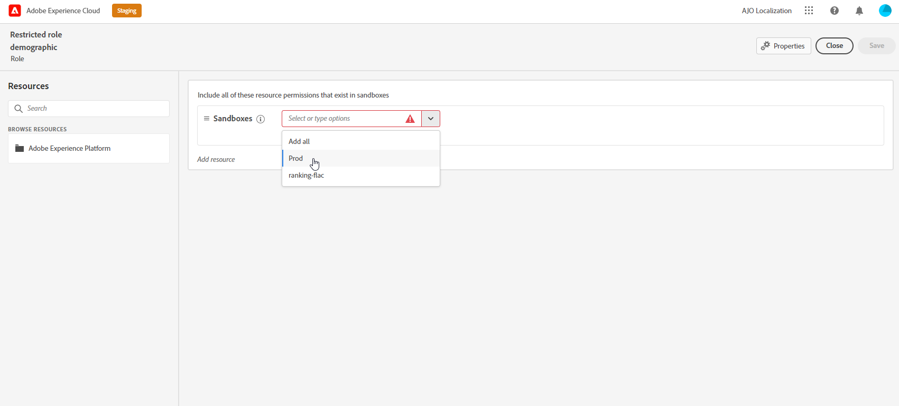

# Attributbasierte Zugriffssteuerung {#attribute-based-access}

>[!IMPORTANT]
>
>Die Verwendung der attributbasierten Zugriffskontrolle ist derzeit nur für ausgewählte Benutzer in der frühen Zugriffszeit verfügbar. Wenn Sie diese Funktion nutzen möchten, wenden Sie sich an Ihren Adobe-Kundenbetreuer.

Mit der attributbasierten Zugriffskontrolle (ABAC) können Sie Berechtigungen definieren, um den Datenzugriff für bestimmte Teams oder Benutzergruppen zu verwalten. Sie dient dem Schutz sensibler digitaler Assets vor unbefugten Nutzern, die einen weiteren Schutz personenbezogener Daten ermöglichen.

In Adobe Journey Optimizer können Sie mit ABAC Daten schützen und spezifischen Zugriff auf bestimmte Feldelemente gewähren, darunter Experience-Datenmodell (XDM)-Schemas, Profilattribute und Segmente.

<!--For a more detailed list of the terminology used with ABAC, refer to Adobe Experience Platform documentation.-->

In diesem Beispiel möchten wir der **Staatsangehörigkeit** Schemafeld, um nicht autorisierte Benutzer an der Verwendung zu hindern. Gehen Sie wie folgt vor:

1. Zuweisen einer  **[!UICONTROL Titel]** der **Staatsangehörigkeit** Schemafeld in Adobe Experience Platform.

2. Erstellen Sie eine neue  **[!UICONTROL Rolle]** und weisen Sie ihm die entsprechende  **[!UICONTROL Titel]** , damit Benutzer auf das Schemafeld zugreifen und es verwenden können.

3. Verwenden Sie die  **[!UICONTROL Schemafeld]** in Adobe Journey Optimizer.

## Zuweisen von Beschriftungen zu einem Objekt in Adobe Experience Platform {#assign-label}

>[!WARNING]
>
>Eine falsche Beschriftungsverwendung kann den Zugriff auf Personen und Verstöße gegen Trigger-Richtlinien unterbrechen.

**[!UICONTROL Bezeichnungen]** kann verwendet werden, um bestimmte Funktionsbereiche mithilfe der attributbasierten Zugriffskontrolle zuzuweisen.
In diesem Beispiel möchten wir den Zugriff auf **Staatsangehörigkeit** -Feld. Auf dieses Feld können nur Benutzer mit dem entsprechenden **[!UICONTROL Titel]** zu  **[!UICONTROL Rolle]**.

Beachten Sie, dass Sie auch  **[!UICONTROL Titel]** nach  **[!UICONTROL Schema]**,  **[!UICONTROL Datensätze]** und  **[!UICONTROL Segmente]**.

1. Erstellen Sie Ihre **[!UICONTROL Schema]**. Weitere Informationen hierzu finden Sie unter [diese Dokumentation](https://experienceleague.adobe.com/docs/experience-platform/xdm/schema/composition.html?lang=de).

   

1. Im neu erstellten **[!UICONTROL Schema]**, fügen wir zunächst die **[!UICONTROL Demografische Details]** Feldergruppe, die die **Staatsangehörigkeit** -Feld.

   

1. Aus dem **[!UICONTROL Bezeichnungen]** Registerkarte, den beschränkten Feldnamen überprüfen, hier **Staatsangehörigkeit**. Wählen Sie dann im Menü im rechten Fensterbereich die Option **[!UICONTROL Bearbeiten von Governance-Titeln]**.

   

1. Wählen Sie die entsprechenden **[!UICONTROL Titel]**, in diesem Fall können die C2 - Daten nicht an einen Drittanbieter exportiert werden. Eine detaillierte Liste der verfügbaren Bezeichnungen finden Sie unter [diese Seite](https://experienceleague.adobe.com/docs/experience-platform/data-governance/labels/reference.html#contract-labels).

   

1. Personalisieren Sie Ihr Schema bei Bedarf weiter und aktivieren Sie es. Die detaillierten Schritte zum Aktivieren Ihres Schemas finden Sie in diesem Abschnitt [page](https://experienceleague.adobe.com/docs/experience-platform/xdm/ui/resources/schemas.html#profile).

Das Feld Ihres Schemas ist jetzt nur noch sichtbar und kann nur von Benutzern verwendet werden, die Teil eines Rollensatzes mit der Bezeichnung C2 sind.
Durch Anwendung einer **[!UICONTROL Titel]** auf **[!UICONTROL Feldname]**, beachten Sie, dass **[!UICONTROL Titel]** wird automatisch auf die **Staatsangehörigkeit** in jedem erstellten Schema.

## Rollen erstellen und Beschriftungen zuweisen {#assign-role}

**[!UICONTROL Rollen]** sind eine Gruppe von Benutzern, die innerhalb Ihres Unternehmens dieselben Berechtigungen, Bezeichnungen und Sandboxes verwenden. Jeder Benutzer, der zu einer **[!UICONTROL Rolle]** mit den im Produkt enthaltenen Adobe-Apps und -Services berechtigt ist.
Sie können auch Ihre eigenen **[!UICONTROL Rollen]** , wenn Sie den Zugriff Ihrer Benutzer auf bestimmte Funktionen oder Objekte in der Benutzeroberfläche optimieren möchten.

Wir möchten ausgewählten Benutzern nun Zugriff auf die **Staatsangehörigkeit** Feld mit der Bezeichnung C2. Dazu müssen wir eine neue **[!UICONTROL Rolle]** mit einer bestimmten Benutzergruppe versehen und ihnen die Bezeichnung C2 zuweisen, sodass sie die **Staatsangehörigkeit** Details in **[!UICONTROL Nachricht]** oder **[!UICONTROL Journey]**.

1. Aus dem [!DNL Permissions] Produkt auswählen **[!UICONTROL Rolle]** Klicken Sie im Menü im linken Fensterbereich auf **[!UICONTROL Rolle erstellen]**. Beachten Sie, dass Sie auch **[!UICONTROL Titel]** zu integrierten Rollen.

   

1. Hinzufügen einer **[!UICONTROL Name]** und **[!UICONTROL Beschreibung]** in der neuen **[!UICONTROL Rolle]**, hier: Eingeschränkte Rolle demografisch.

1. Wählen Sie aus der Dropdown-Liste Ihre **[!UICONTROL Sandbox]**.

   

1. Aus dem **[!UICONTROL Ressourcen]** Menü, klicken Sie **[!UICONTROL Adobe Experience Platform]** um die verschiedenen Funktionen zu öffnen. Hier wählen wir **[!UICONTROL Nachrichten]**.

   

1. Wählen Sie aus der Dropdown-Liste die **[!UICONTROL Berechtigungen]** mit der ausgewählten Funktion verknüpft sind, z. B. **[!UICONTROL Anzeigen von Nachrichten]** oder **[!UICONTROL Journey veröffentlichen]**.

   

1. Nach dem Speichern der neu erstellten **[!UICONTROL Rolle]** klicken **[!UICONTROL Eigenschaften]** um den Zugriff auf Ihre Rolle weiter zu konfigurieren.

   

1. Aus dem **[!UICONTROL Benutzer]** Registerkarte, klicken Sie auf **[!UICONTROL Benutzer hinzufügen]**.

   

1. Aus dem **[!UICONTROL Bezeichnungen]** Registerkarte, wählen Sie **[!UICONTROL Bezeichnung hinzufügen]**.

   

1. Wählen Sie die **[!UICONTROL Bezeichnungen]** Sie möchten Ihre Rolle erweitern, und klicken Sie auf **[!UICONTROL Speichern]**. In diesem Beispiel wird die Bezeichnung C2 für Benutzer zugewiesen, die Zugriff auf das Feld des zuvor eingeschränkten Schemas haben.

   

Die Benutzer in der **Eingeschränkte demografische Rolle** -Rolle haben nun Zugriff auf die C2-beschrifteten Objekte.

## Zugriff auf gekennzeichnete Objekte in Adobe Journey Optimizer {#attribute-access-ajo}

Nach der Beschriftung **Staatsangehörigkeit** -Feldnamen in einem neuen Schema und unserer neuen Rolle können wir nun die Auswirkungen dieser Beschränkung in Adobe Journey Optimizer sehen.
Für unser Beispiel erstellt ein erster Benutzer X mit Zugriff auf Objekte mit der Bezeichnung C2 eine Journey mit einer Bedingung, die auf die eingeschränkten **[!UICONTROL Feldname]**. Ein zweiter Benutzer Y ohne Zugriff auf Objekte mit der Bezeichnung C2 muss dann die Journey veröffentlichen.

1. In Adobe Journey Optimizer müssen Sie zunächst die **[!UICONTROL Datenquelle]** mit Ihrem neuen Schema.

   

1. Hinzufügen neuer **[!UICONTROL Feldergruppe]** der neu erstellten **[!UICONTROL Schema]** zum integrierten **[!UICONTROL Datenquelle]**. Sie können auch eine neue externe **[!UICONTROLDDatenquelle]** und zugehörige **[!UICONTROL Feldergruppen]**.

   

1. Nach Auswahl der zuvor erstellten **[!UICONTROL Schema]** klicken **[!UICONTROL Bearbeiten]** von **[!UICONTROL Felder]** Kategorie.

   

1. Wählen Sie die **[!UICONTROL Feldname]** Zielgruppe. Hier wählen wir die eingeschränkten **Staatsangehörigkeit** -Feld.

   

1. Erstellen Sie dann eine Journey, die Benutzern mit einer bestimmten Nationalität eine Nachricht sendet. Hinzufügen einer **[!UICONTROL Ereignis]** dann **[!UICONTROL Bedingung]**.

   

1. Auswählen der Einschränkungen **Staatsangehörigkeit** -Feld, um mit der Erstellung Ihres Ausdrucks zu beginnen.

   

1. Bearbeiten Sie Ihre **[!UICONTROL Bedingung]** , um eine bestimmte Population mit eingeschränkten **Staatsangehörigkeit** -Feld.

   

1. Personalisieren Sie Ihre Journey nach Bedarf, hier fügen wir eine **[!UICONTROL Nachricht]** Aktion.

   

Wenn Benutzer Y ohne Zugriff auf die C2-Beschriftungsobjekte auf diese Journey oder auf Meldungen mit diesem eingeschränkten Feld zugreifen muss:

* Benutzer Y kann den eingeschränkten Feldnamen nicht verwenden, da er nicht sichtbar ist.

* Benutzer Y kann den Ausdruck im erweiterten Modus nicht mit dem eingeschränkten Feldnamen bearbeiten. Der folgende Fehler wird angezeigt `The expression is invalid. Field is no longer available or you don't have enough permission to see it`.

* Benutzer Y kann den Ausdruck löschen.

* Benutzer Y kann die Journey oder Nachricht nicht testen.

* Benutzer Y kann die Journey oder Nachricht nicht veröffentlichen.

