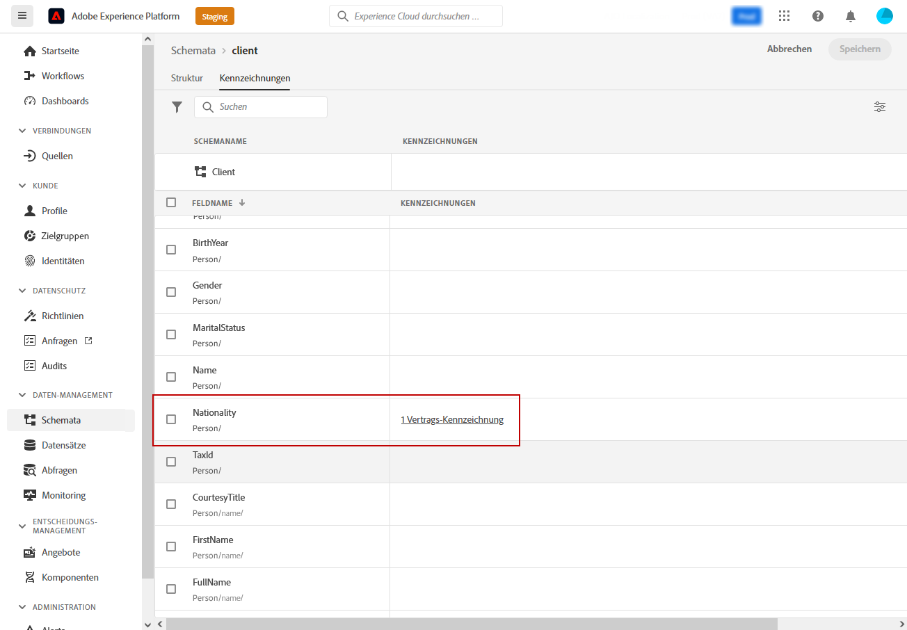
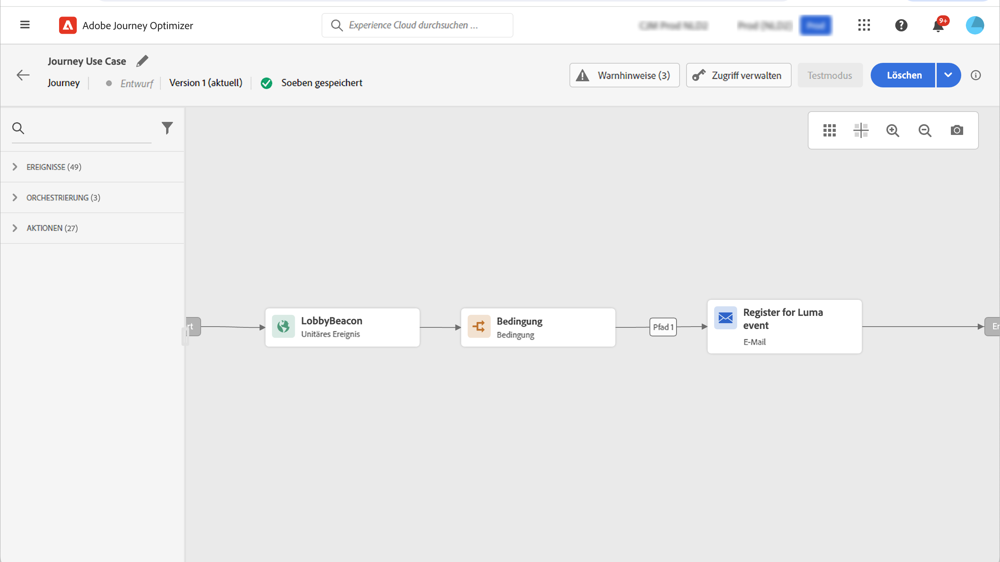

# Attributbasierte Zugriffssteuerung {#attribute-based-access}

Mit der Funktion der attributbasierten Zugriffssteuerung können Berechtigungen definiert werden, um den Datenzugriff für bestimmte Teams oder Gruppen von Benutzenden zu verwalten. Dies dient dem Schutz sensibler digitaler Assets vor unbefugten Benutzenden und ermöglicht so einen weiteren Schutz personenbezogener Daten.

Verwenden Sie die attributbasierte Zuriffssteuerung in Adobe Journey Optimizer, um Daten zu schützen und spezifischen Zugriff auf bestimmte Feldelemente zu gewähren, darunter Experience-Datenmodell(XDM)-Schemata, Profilattribute und Zielgruppen.

Eine detailliertere Liste der bei der attributbasierten Zugriffssteuerung verwendeten Begriffe ist in der [Dokumentation zu Adobe Experience Platform](https://experienceleague.adobe.com/docs/experience-platform/access-control/abac/overview.html?lang=de){target="_blank"} verfügbar.

In diesem Beispiel wird dem Schemafeld **Staatsangehörigkeit** ein Label hinzugefügt, um nicht autorisierte Benutzende an der Verwendung zu hindern. Damit dies funktioniert, müssen die folgenden Schritte ausgeführt werden:

1. Erstellen Sie eine neue **[!UICONTROL Rolle]** und weisen Sie ihr das entsprechenden **[!UICONTROL Label]** zu, damit Benutzer auf das Schemafeld zugreifen und es verwenden können.

1. Weisen Sie dem Schemafeld **Staatsangehörigkeit** in Adobe Experience Platform ein **[!UICONTROL Label]** zu.

1. Verwenden Sie das **[!UICONTROL Schemafeld]** in Adobe Journey Optimizer.

Beachten Sie, dass der Zugriff auf **[!UICONTROL Rollen]**, **[!UICONTROL Richtlinien]** und **[!UICONTROL Produkte]** auch über das attributbasierte Zugriffssteuerungs-API möglich ist. Weitere Informationen sind in dieser [Dokumentation](https://experienceleague.adobe.com/docs/experience-platform/access-control/abac/abac-api/overview.html?lang=de){target="_blank"} verfügbar.

## Erstellen einer Rolle und Zuweisen von Labels {#assign-role}

>[!IMPORTANT]
>
>>Vor dem Verwalten von Berechtigungen für eine Rolle muss eine Richtlinie erstellt werden. Weitere Informationen sind in der [Dokumentation zu Adobe Experience Platform](https://experienceleague.adobe.com/docs/experience-platform/access-control/abac/permissions-ui/policies.html?lang=de){target="_blank"} verfügbar.

**[!UICONTROL Rollen]** sind eine Gruppe von Benutzenden, die innerhalb Ihrer Organisation dieselben Berechtigungen, Labels und Sandboxes verwenden. Alle Benutzenden, die einer **[!UICONTROL Rolle]** angehören, haben die Berechtigung für die Adobe-Anwendungen und -Dienste, die im Produkt enthalten sind. Eigene **[!UICONTROL Rollen]** können erstellt werden, wenn der Zugriff der Benutzenden auf bestimmte Funktionen oder Objekte in der Oberfläche präziser definiert werden soll.

Um ausgewählten Benutzenden Zugriff auf das Feld **Staatsangehörigkeit** mit der Bezeichnung „C2“ zu gewähren, muss eine neue **[!UICONTROL Rolle]** mit bestimmten Benutzenden erstellt werden, der das Label „C2“ zugewiesen wird. Dies ermöglicht den Benutzenden die Verwendung der **Staatsangehörigkeits**-Details in einer **[!UICONTROL Journey]**.

1. Wählen Sie aus dem [!DNL Permissions]-Produkt im Menü des linken Fensterbereichs die Option **[!UICONTROL Rolle]** und klicken Sie auf **[!UICONTROL Rolle erstellen]**. Beachten Sie, dass Sie auch **[!UICONTROL Labels]** zu integrierten Rollen hinzufügen können.

   

1. Fügen Sie hier einen **[!UICONTROL Namen]** und eine **[!UICONTROL Beschreibung]** zu Ihrer neuen **[!UICONTROL Rolle]** hinzu, hier: Eingeschränkte Rolle „Demografisch“.

1. Wählen Sie Ihre **[!UICONTROL Sandbox]** aus der Dropdown-Liste.

   

1. Klicken Sie im Menü **[!UICONTROL Ressourcen]** auf **[!UICONTROL Adobe Experience Platform]**, um die verschiedenen Funktionen zu öffnen. Hier wählen wir **[!UICONTROL Journeys]** aus.

   

1. Wählen Sie aus der Dropdown-Liste die **[!UICONTROL Berechtigungen]** aus, die mit der ausgewählten Funktion verknüpft sind, z. B. **[!UICONTROL Anzeigen von Journeys]** oder **[!UICONTROL Veröffentlichen von Journeys]**.

   

1. Nach dem Speichern der neu erstellten **[!UICONTROL Rolle]** klicken Sie auf **[!UICONTROL Eigenschaften]**, um den Zugriff auf Ihre Rolle weiter zu konfigurieren.

   

1. Klicken Sie auf der Registerkarte **[!UICONTROL Benutzer]** auf **[!UICONTROL Benutzer hinzufügen]**.

   

1. Klicken Sie auf der Registerkarte **[!UICONTROL Labels]** auf **[!UICONTROL Label hinzufügen]**.

   

1. Wählen Sie das **[!UICONTROL Label]** aus, das Sie Ihrer Rolle hinzufügen möchten, und klicken Sie auf **[!UICONTROL Speichern]**. In diesem Beispiel wird den Benutzenden das Label „C2“ gewährt, damit sie Zugriff auf das zuvor eingeschränkte Feld des Schemas haben.

   

Die Benutzenden in der **Eingeschränkten Rolle „Demografisch“** haben nun Zugriff auf die Objekte mit dem Label „C2“.

## Zuweisen von Labels zu einem Objekt in Adobe Experience Platform {#assign-label}

>[!WARNING]
>
>Die falsche Verwendung von Labels kann den Zugriff für Personen unterbrechen und zu Richtlinienverstößen führen.

**[!UICONTROL Labels]** können verwendet werden, um bestimmte Funktionsbereiche mithilfe der attributbasierten Zugriffssteuerung zuzuweisen. In diesem Beispiel ist der Zugriff auf das Feld **Staatsangehörigkeit** eingeschränkt. Auf dieses Feld können nur Benutzende mit dem entsprechenden **[!UICONTROL Label]** in ihrer **[!UICONTROL Rolle]** zugreifen.

Beachten Sie, dass Sie **[!UICONTROL Label]** auch zu **[!UICONTROL Schemata]**, **[!UICONTROL Datensätzen]** und **[!UICONTROL Zielgruppen]** hinzufügen können.

1. Erstellen Sie Ihr **[!UICONTROL Schema]**. Weitere Informationen sind in dieser [Dokumentation](https://experienceleague.adobe.com/docs/experience-platform/xdm/schema/composition.html?lang=de){target="_blank"} verfügbar.

   

1. Im neu erstellten **[!UICONTROL Schema]** fügen wir zunächst die Feldergruppe **[!UICONTROL Demografische Details]** hinzu, die das Feld **Staatsangehörigkeit** enthält.

   

1. Überprüfen Sie auf der Registerkarte **[!UICONTROL Label]** den Namen des eingeschränkten Feldes, hier **Staatsangehörigkeit**. Wählen Sie dann im Menü des rechten Fensterbereichs die Option **[!UICONTROL Bearbeiten von Governance-Titeln]**.

   

1. Wählen Sie die entsprechenden **[!UICONTROL Labels]** aus. In diesem Fall können die C2-Daten nicht an einen Drittanbieter exportiert werden. Eine detaillierte Liste der verfügbaren Labels finden Sie auf [dieser Seite](https://experienceleague.adobe.com/docs/experience-platform/data-governance/labels/reference.html?lang=de#contract-labels){target="_blank"}.

   

1. Das Schema kann bei Bedarf weiter personalisiert und dann aktiviert werden. Die detaillierten Schritte zum Aktivieren des Schemas befinden sich auf dieser [Seite](https://experienceleague.adobe.com/docs/experience-platform/xdm/ui/resources/schemas.html?lang=de#profile){target="_blank"}.

Das Feld des Schemas ist nun nur noch für Benutzende sichtbar und verwendbar, die Teil eines Rollensatzes mit dem Label „C2“ sind. Beim Anwenden eines **[!UICONTROL Labels]** auf den **[!UICONTROL Feldnamen]**, wird das **[!UICONTROL Label]** automatisch auf das Feld **Staatsangehörigkeits** in jedem erstellten Schema angewendet.

## Zugriff auf Objekte mit Labels in Adobe Journey Optimizer {#attribute-access-ajo}

Nachdem der Feldname **Staatsangehörigkeit** in einem neuen Schema und einer neuen Rolle gekennzeichnet wurde, kann die Auswirkung dieser Einschränkung in Adobe Journey Optimizer beobachtet werden. In diesem Beispiel:

* Die bzw. der Benutzende X, die bzw. der Zugriff auf Objekte mit dem Label „C2“ hat, erstellt eine Journey mit einer Bedingung, die auf den eingeschränkten **[!UICONTROL Feldnamen]** abzielt.
* Eine zweite Benutzende bzw. ein zweiter Benutzender Y ohne Zugriff auf Objekte mit dem Label „C2“ versucht, die Journey zu veröffentlichen.

1. In Adobe Journey Optimizer muss zunächst die **[!UICONTROL Datenquelle]** mit dem neuen Schema konfiguriert werden.

   

1. Fügen Sie eine neue **[!UICONTROL Feldergruppe]** Ihres neu erstellten **[!UICONTROL Schemas]** zur integrierten **[!UICONTROL Datenquelle]** hinzu. Sie können auch eine neue externe **[!UICONTROL Datenquelle]** und zugehörige **[!UICONTROL Feldergruppen]** erstellen.

   

1. Nach Auswahl des zuvor erstellten **[!UICONTROL Schemas]** klicken Sie in der Kategorie **[!UICONTROL Felder]** auf **[!UICONTROL Bearbeiten]**.

   

1. Wählen Sie den **[!UICONTROL Feldnamen]** aus, den Sie ansprechen möchten. Hier wählen wir das eingeschränkte Feld **Staatsangehörigkeit**.

   

1. Erstellen Sie eine Journey, die Benutzenden mit einer bestimmten Staatsangehörigkeit eine E-Mail sendet. Fügen Sie ein **[!UICONTROL Ereignis]** und dann eine **[!UICONTROL Bedingung]** hinzu.

   

1. Wählen Sie das eingeschränkte Feld **Staatsangehörigkeit** aus, um mit der Erstellung Ihres Ausdrucks zu beginnen.

   

1. Bearbeiten Sie Ihre **[!UICONTROL Bedingung]**, um eine bestimmte Population mit eingeschränktem Feld **Staatsangehörigkeit** anzusprechen.

   

1. Personalisieren Sie Ihre Journey nach Bedarf. Hier fügen wir die Aktion **[!UICONTROL E-Mail]** hinzu.

   

Wenn die bzw. der Benutzende Y ohne Zugriff auf Objekte mit dem Label „C2“ auf diese Journey mit dem eingeschränkten Feld zugreifen muss, geschieht Folgendes:

* Die bzw. der Benutzende Y kann den eingeschränkten Feldnamen nicht verwenden, da er nicht sichtbar ist.
* Die bzw. der Benutzende Y kann den Ausdruck mit dem eingeschränkten Feldnamen im erweiterten Modus nicht bearbeiten. Der folgende Fehler wird angezeigt: `The expression is invalid. Field is no longer available or you do not have enough permission to see it`.
* Die bzw. der Benutzende Y kann den Ausdruck löschen.
* Die bzw. der Benutzende Y kann die Journey nicht testen.
* Die bzw. der Benutzende Y kann die Journey nicht veröffentlichen.