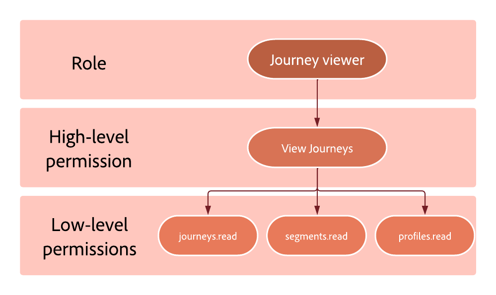

# Berechtigungsebenen {#high-low-permissions}

Jedes Produktprofil besteht aus Berechtigungen, die Benutzern den Zugriff auf die verschiedenen Funktionen ermöglichen.
Sie können in zwei Typen unterteilt werden:

* **Berechtigung auf hoher Ebene**: stellt die verschiedenen Berechtigungen dar, die zugewiesen werden können **[!UICONTROL Product profile]** im [!DNL Admin console], z. B. **[!DNL Publish journeys]** und **[!DNL Manage subdomains delegation]**. Berechtigungen auf hoher Ebene umfassen Berechtigungen auf niedriger Ebene.

* **Berechtigung auf niedriger Ebene**: stellt die verschiedenen Berechtigungen dar, die von der Berechtigung auf hoher Ebene stammen.

Beispiel: die **[!DNL Journey administrator]** dem Produktprofil wird die **[!DNL Manage journeys]** Berechtigung. Aus dieser Berechtigung resultieren die Berechtigungen auf niedriger Ebene, die es dem Journey-Administrator ermöglichen, Journeys zu schreiben, zu lesen und zu löschen.

## Journey-Funktion {#journey-capability}

### [!DNL Manage journeys] Berechtigung {#manage-journeys}

Die **[!DNL Manage journeys]** Mit einer allgemeinen Berechtigung können Benutzer neue Journeys erstellen und bearbeiten/löschen sowie auf die Objekte zugreifen, die in der Journey-Arbeitsfläche zum Erstellen des Journey-Flusses verwendet werden.

Sie umfasst die folgenden Berechtigungen auf niedriger Ebene:

* Journey Optimizer-spezifisch:

   * journeys.read
   * journeys.write
   * journeys.delete
   * messages.read

* Adobe Experience Platform-spezifisch:

   * segments.read
   * profiles.read
   * datasets.read
   * schemas.read

### [!DNL Publish journeys] Berechtigung {#publish-journeys}

Die **[!DNL Publish journeys]** Mit einer allgemeinen Berechtigung können Benutzer Journeys veröffentlichen.

Sie umfasst die folgenden Berechtigungen auf niedriger Ebene:

* Journey Optimizer-spezifisch:
   * journeys.publish
   * journeys.read

### [!DNL View journeys] Berechtigung {#view-journeys}

Die **[!DNL View journeys]** Mit einer allgemeinen Berechtigung können Benutzer Journeys durchsuchen und anzeigen.

Sie umfasst die folgenden Berechtigungen auf niedriger Ebene:

* Journey Optimizer-spezifisch:
   * journeys.read

* Adobe Experience Platform-spezifisch:
   * segments.read
   * profiles.read

### [!DNL Manage journeys events, data sources and actions] Berechtigung {#manage-journeys-events}

Die **[!DNL Manage journeys events, data sources and actions]** Mit Berechtigungen auf hoher Ebene können Benutzer Ereignis- und Datenkonfigurationen konfigurieren.

Sie umfasst die folgenden Berechtigungen auf niedriger Ebene:

* Journey Optimizer-spezifisch:
   * journeys_events.read
   * journeys_events.write
   * journeys_events.delete
   * journeys_data_sources.read
   * journeys_data_sources.write
   * journeys_data_sources.delete
   * journeys_actions.read
   * journeys_actions.write
   * journeys_actions.delete

* Adobe Experience Platform-spezifisch:
   * schemas.read
   * datasets.read
   * identity_namespace.read

### [!DNL View journeys events, data sources and actions] Berechtigung {#view-journeys-event}

Die **[!DNL View journeys events, data sources and actions]** Mit einer allgemeinen Berechtigung können Benutzer Ereignisse und Daten im Journey-Fluss verwenden.

Sie umfasst die folgenden Berechtigungen auf niedriger Ebene:

* Journey Optimizer-spezifisch:
   * journeys_events.read
   * journeys_data_sources.read
   * journeys_actions.read

* Adobe Experience Platform-spezifisch:
   * schemas.read
   * datasets.read
   * identity_namespace.read

### [!DNL View journeys report] Berechtigung {#view-journeys-report}

Die **[!DNL View journeys report]** Mit allgemeinen Berechtigungen können Benutzer schreibgeschützte Journey-Berichte erstellen.

Sie umfasst die folgenden Berechtigungen auf niedriger Ebene:

* Journey Optimizer-spezifisch:
   * journeys_report.read
   * messages_report.read

* Adobe Experience Platform-spezifisch:
   * datasets.read
   * queries.read
   * queries.write
   * queries.delete

## Entscheidungsverwaltungsfunktionen {#decisions-permissions}

### [!DNL Manage decisions] Berechtigung {#manage-decisioning}

Die **[!DNL Manage decisions]** Berechtigung auf hoher Ebene ermöglicht Benutzern das Erstellen neuer und Bearbeiten/Löschen vorhandener **[!DNL Activity entities]** und verwalten die Objekte, die in diesen Aktivitäten für die Entscheidungsfindung verwendet werden.

Sie umfasst die folgenden Berechtigungen auf niedriger Ebene:

* Spezifisches Entscheidungsmanagement:
   * activities.read
   * activities.write
   * activities.delete
   * offers.read
   * offers.write
   * offers.delete
   * placements.read
   * placements.write
   * placements.delete
   * ranking_strategy.read

* Adobe Experience Platform-spezifisch:
   * datasets.read
   * datasets.write
   * datasets.delete
   * schemas.read
   * profile.read
   * segments.read

### [!DNL View decisions] Berechtigung {#view-decisions}

Die **[!DNL View decisions]** -Berechtigung auf hoher Ebene ermöglicht es Benutzern, eine vorhandene Aktivität und verwandte Geschäftsobjekte zu verwenden, um Entscheidungen zu treffen.

Sie umfasst die folgenden Berechtigungen auf niedriger Ebene:

* Spezifisches Entscheidungsmanagement:
   * activities.read
   * offers.read
   * placements.read
   * ranking_strategy.read

* Adobe Experience Platform-spezifisch:
   * schemas.read
   * segment.read
   * datasets.read
   * datasets.write
   * datasets.delete

### [!DNL Publish offers decisioning] Berechtigung {#publish-decisions}

Die **[!DNL Publish offers decisioning]** -Berechtigung auf hoher Ebene ermöglicht Benutzern den Zugriff auf die Genehmigung/Aufhebung der Genehmigung von Angebotsaktivitäten.

Sie umfasst die folgenden Berechtigungen auf niedriger Ebene:

* Spezifisches Entscheidungsmanagement:
   * offer_activity.read
   * offers.read
   * offers.write
   * offers.delete
   * placements.read
   * placements.write
   * placements.delete
   * ranking_strategy.read

* Adobe Experience Platform-spezifisch:
   * schemas.read
   * segment.read
   * datasets.read
   * profiles.read

### [!DNL Manage ranking strategies] Berechtigung {#manage-ranking-strategies}

Die **[!DNL Manage ranking strategies]** Mit allgemeinen Berechtigungen können Benutzer Rangstrategien lesen, erstellen, bearbeiten und löschen.

Sie umfasst die folgenden Berechtigungen auf niedriger Ebene:

* Spezifisches Entscheidungsmanagement:
   * ranking_strategy.read
   * ranking_strategy.write
   * ranking_strategy.delete
   * activities.read
   * offers.read
   * placements.read

## Administrationsfunktionen {#administration-permissions}

### [!DNL Manage subdomains delegation] Berechtigung {#manage-subdomain}

Die **[!DNL Manage subdomains delegation]** Mit einer allgemeinen Berechtigung können Benutzer Subdomain-Delegationen erstellen, bearbeiten und löschen (einschließlich IP-Pool).

Sie umfasst die folgenden Berechtigungen auf niedriger Ebene:

* subdomains_delegation.read
* subdomains_delegation.write
* subdomains_delegation.delete

### [!DNL Manage PTR records] Berechtigung {#manage-ptr}

Die **[!DNL Manage PTR records]** Mit allgemeinen Berechtigungen können Benutzer PTR-Einträge lesen und bearbeiten, die basierend auf der Subdomain konfiguriert wurden.

Sie umfasst die folgenden Berechtigungen auf niedriger Ebene:

* PTR_records.read
* PTR_records.write
* subdomains_delegation.read

### [!DNL View PTR records] Berechtigung {#view-ptr}

Die **[!DNL View PTR records]** Mit einer allgemeinen Berechtigung können Benutzer PTR-Datensätze anzeigen, die basierend auf der Subdomain konfiguriert wurden.

Sie umfasst die folgenden Berechtigungen auf niedriger Ebene:

* PTR_records.read
* subdomains_delegation.read

### [!DNL Manage IP pools] Berechtigung {#manage-ip-pools}

Die **[!DNL Manage IP pools]** Mit Berechtigung auf hoher Ebene können Benutzer die Affinitätsdefinition erstellen, bearbeiten und löschen.

Sie umfasst die folgenden Berechtigungen auf niedriger Ebene:

* IP_pools.read
* IP_pools.write
* IP_pools.delete

<!--
### [!DNL Manage messages general settings] permission {#manage-message-settings}

The **[!DNL Manage messages general settings]** high-level permission allows users to create, edit and delete global settings at the sandbox level.

It includes the following low-level permissions: 

* Journey Optimizer specific: 
  * messages_general_settings.read
  * messages_general_settings.write
  * messages_general_settings.delete
* Adobe Experience Platform specific:
  * schemas.read

### [!DNL View messages general settings] permission {#view-message-settings}

The **[!DNL View messages general settings]** high-level permission allows users to view messages general settings such as the execution address.

It includes the following low-level permissions:

* Journey Optimizer specific: 
  * messages_general_settings.read
* Adobe Experience Platform specific: 
  * schemas.read
-->

### [!DNL Manage channel surface] Berechtigung {#manage-channel-surface}

Die **[!DNL Manage channel surface]** Mit Berechtigung auf hoher Ebene können Benutzer Kanaloberflächen auf Kanalebene auf Sandbox-Ebene erstellen, bearbeiten und löschen.

Sie umfasst die folgenden Berechtigungen auf niedriger Ebene:

* Journey Optimizer-spezifisch:
   * messages_presets.read
   * messages_presets.write
   * messages_presets.delete
   * subdomains_delegation.read
   * IP_pools.read
   * mobile_setting.read (aus Adobe Experience Platform Launch)

### [!DNL View channel surface] Berechtigung {#view-channel-surface}

Die **[!DNL View channel surface]** Mit Berechtigungen auf hoher Ebene können Benutzer Kanaloberflächen anzeigen, um zu erfahren, welche Kanaloberflächen verwendet werden sollen.

Sie umfasst die folgenden Berechtigungen auf niedriger Ebene:

* messages_presets.read
* subdomains_delegation.read
* IP_pools.read
* mobile_setting.read (aus der Adobe Experience Platform-Datenerfassung)

### [!DNL Manage suppression] Berechtigung {#manage-suppression}

Die **[!DNL Manage suppression]** Mit einer allgemeinen Berechtigung können Benutzer die Anzahl der Bounces definieren, bevor eine E-Mail-Adresse zur Unterdrückungsliste hinzugefügt wird, sowie Einträge zur Unterdrückungsliste hinzufügen und daraus löschen.

Sie umfasst die folgenden Berechtigungen auf niedriger Ebene:

* suppression_rules.read
* suppression_rules.write
* suppression_rules.delete
* suppression_list.write
* suppression_list.delete

### [!DNL View suppression list] Berechtigung {#view-suppression-list}

Die **[!DNL View suppression list]** -Berechtigung auf hoher Ebene ermöglicht es Benutzern, den Inhalt und die Einstellungen der Unterdrückungsliste anzuzeigen.

Sie umfasst die folgenden Berechtigungen auf niedriger Ebene:

* Journey Optimizer-spezifisch:
   * suppression_list.view

* Adobe Experience Platform-spezifisch:
   * profiles.read
   * datasets.read

### [!DNL Export suppression list] Berechtigung {#export-suppression-list}

Die **[!DNL Export suppression list]** -Berechtigung auf hoher Ebene ermöglicht es Benutzern, die Unterdrückungsliste als CSV-Datei herunterzuladen.

Sie umfasst die folgenden Berechtigungen auf niedriger Ebene:

* Journey Optimizer-spezifisch:
   * suppression_list.export

* Adobe Experience Platform-spezifisch:
   * profiles.read
   * datasets.read

### [!DNL Manage landing page settings] Berechtigung {#manage-landing-page-settings}

Die **[!DNL Manage landing page settings]** Mit allgemeinen Berechtigungen können Benutzer Landingpage-Subdomains und Vorgabeneinstellungen lesen, erstellen und bearbeiten.

Sie umfasst die folgenden Berechtigungen auf niedriger Ebene:

* Journey Optimizer-spezifisch:
   * landing_page_subdomain.read
   * landing_page_subdomain.write
   * landing_page_subdomain.delete
   * landing_page_preset.read
   * landing_page_preset.write
   * landing_page_preset.delete

### [!DNL Manage frequency rules] Berechtigung {#manage-frequency-rules}

Die **[!DNL Manage frequency rules]** Mit Berechtigungen auf hoher Ebene können Benutzer Frequenzregeln lesen, erstellen, bearbeiten, löschen und aktivieren/deaktivieren.

Sie umfasst die folgenden Berechtigungen auf niedriger Ebene:

* Journey Optimizer-spezifisch:
   * frequency_rules.read
   * frequency_rules.write
   * frequency_rules.delete

### [!DNL View frequency rules] Berechtigung {#view-frequency-rules}

Die **[!DNL View frequency rules]** Mit Berechtigungen auf hoher Ebene können Benutzer Frequenzregeln anzeigen.

Sie umfasst die folgenden Berechtigungen auf niedriger Ebene:

* Journey Optimizer-spezifisch:
   * frequency_rules.read
