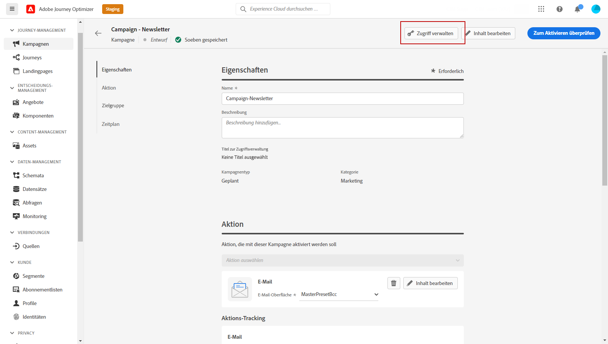
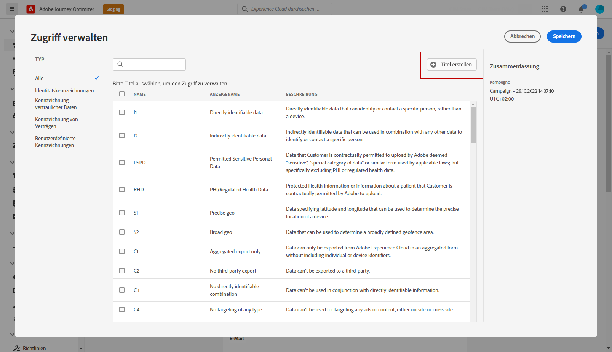
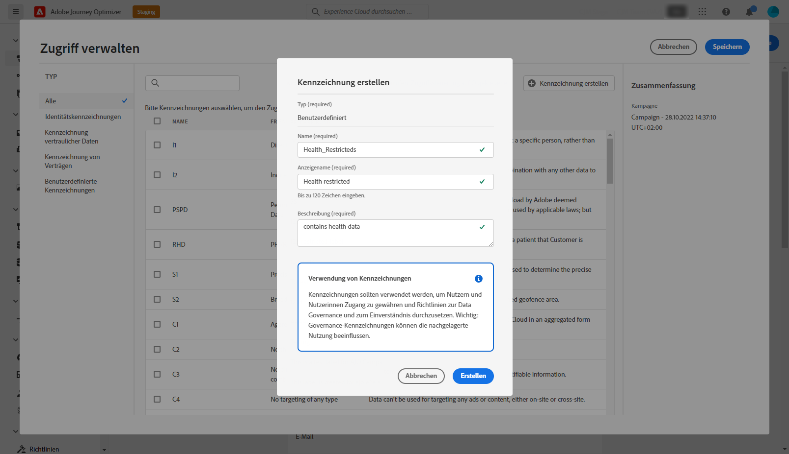
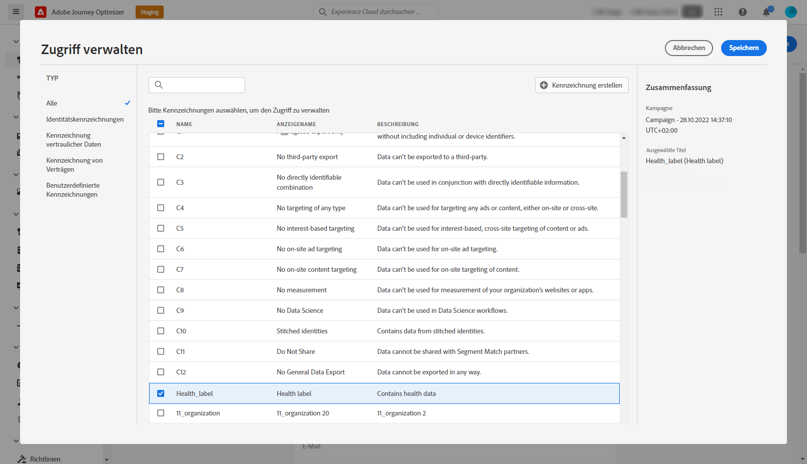

# Zugriffssteuerung auf Objektebene {#object-level-access}

>[!CONTEXTUALHELP]
>id="ajo_olac_manage_access"
>title="Zugriffssteuerung auf Objektebene"
>abstract="Wenn Sie Kennzeichnungen anwenden, auf die Sie keinen Zugriff haben, wird Ihr Zugriff auf dieses Objekt widerrufen."

Mit der Zugriffssteuerung auf Objektebene (OLAC) können Sie Berechtigungen zum Verwalten des Datenzugriffs für eine Auswahl von Objekten definieren:

* Journey
* Campaign
* Vorlage
* Fragment
* Landingpage
* Angebot
* Statische Angebotssammlung
* Angebotsentscheidung

Sie dient dem Schutz sensibler digitaler Assets vor unbefugten Benutzenden und ermöglicht so einen weiteren Schutz personenbezogener Daten.

In Adobe Journey Optimizer können Sie mit OLAC Daten schützen und spezifischen Zugriff auf bestimmte Objekte gewähren.

## Erstellen von Bezeichnungen {#create-assign-labels}

>[!IMPORTANT]
>
>Um Bezeichnungen erstellen zu können, müssen Sie Teil einer Rolle mit der Berechtigung **[!UICONTROL Verwalten von Nutzungsbezeichnungen]** sein.

Mit **[!UICONTROL Bezeichnungen]** können Sie Datensätze und Felder entsprechend den für diese Daten geltenden Nutzungsrichtlinien kategorisieren. **[!UICONTROL Beschriftungen]** können jederzeit angewendet werden, was eine flexible Handhabung der Daten ermöglicht.

Sie können Bezeichnungen im Produkt [!DNL Permissions] erstellen. Weitere Informationen hierzu finden Sie auf [dieser Seite](https://experienceleague.adobe.com/docs/experience-platform/access-control/abac/permissions-ui/labels.html?lang=de).

**[!UICONTROL Bezeichnungen]** können auch direkt in Journey Optimizer erstellt werden:

1. Klicken Sie in einem Objekt in Adobe Journey Optimizer auf die Schaltfläche **[!UICONTROL Zugriff verwalten]**, wie hier an einer neu erstellten **[!UICONTROL Kampagne]** gezeigt.

   

1. Klicken Sie im Fenster **[!UICONTROL Zugriff verwalten]** auf **[!UICONTROL Bezeichnung erstellen]**.

   

1. Konfigurieren Sie die Bezeichnung. Geben Sie dazu Folgendes an:
   * **[!UICONTROL Name]**
   * **[!UICONTROL Anzeigename]**
   * **[!UICONTROL Beschreibung]**

   

1. Klicken Sie auf **[!UICONTROL Erstellen]**, um Ihre **[!UICONTROL Bezeichnung]** zu speichern.

Ihre neu erstellte **[!UICONTROL Bezeichnung]** ist jetzt in der Liste verfügbar. Bei Bedarf können Sie sie im Produkt [!DNL Permissions] ändern.

## Zuweisen von Bezeichnungen {#assign-labels}

>[!IMPORTANT]
>
>Um Bezeichnungen zuweisen zu können, müssen Sie Teil einer Rolle mit der Berechtigung „Verwalten“ sein, d. h. [!DNL Manage journeys], [!DNL Manage Campaigns] oder [!DNL Manage decisions]. Ohne diese Berechtigung wird die Schaltfläche **[!UICONTROL Zugriff verwalten]** ausgegraut.

So weisen Sie Ihren Objekten in Journey Optimizer benutzerdefinierte oder Core-Bezeichnungen für die Datennutzung zu:

1. Klicken Sie in einem Objekt in Adobe Journey Optimizer auf die Schaltfläche **[!UICONTROL Zugriff verwalten]**, wie hier an einer neu erstellten **[!UICONTROL Kampagne]** gezeigt.

   

1. Wählen Sie im Fenster **[!UICONTROL Zugriff verwalten]** Ihre benutzerdefinierte(n) oder Core-Bezeichnungen(en) für die Datennutzung aus, um den Zugriff auf dieses Objekt zu verwalten.

   Weitere Informationen zu Core-Bezeichnungen für die Nutzungsdaten finden Sie auf [dieser Seite](https://experienceleague.adobe.com/docs/experience-platform/data-governance/labels/reference.html?lang=de).

   

1. Klicken Sie auf **[!UICONTROL Speichern]**, um diese Beschränkung für die Bezeichnung anzuwenden.

Um Zugriff auf dieses Objekt zu erhalten, muss die spezifische **[!UICONTROL Bezeichnung]** in den **[!UICONTROL Rollen]** der Benutzenden enthalten sein.
Beispiel: Eine Benutzerin mit der Bezeichnung C1 hat nur Zugriff auf Objekte mit der Bezeichnung C1 oder ohne Bezeichnung.

Weitere Informationen zur Zuweisung von **[!UICONTROL Bezeichnungen]** zu **[!UICONTROL Rollen]** finden Sie auf [dieser Seite](https://experienceleague.adobe.com/docs/experience-platform/access-control/abac/permissions-ui/permissions.html?lang=de#manage-labels-for-a-role).