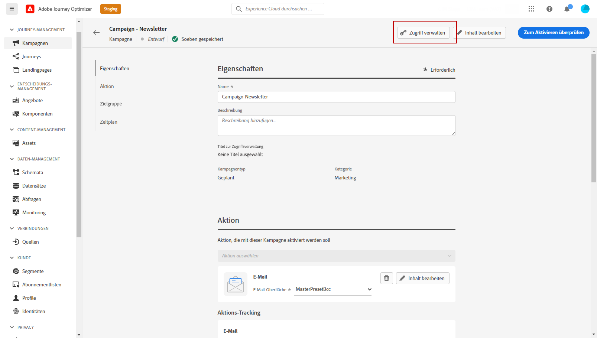
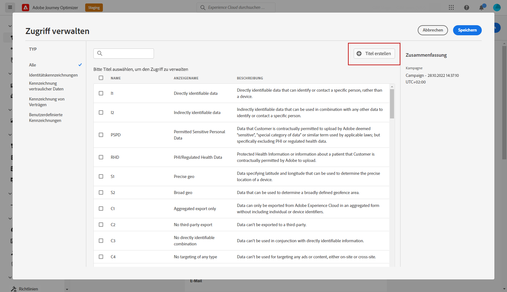
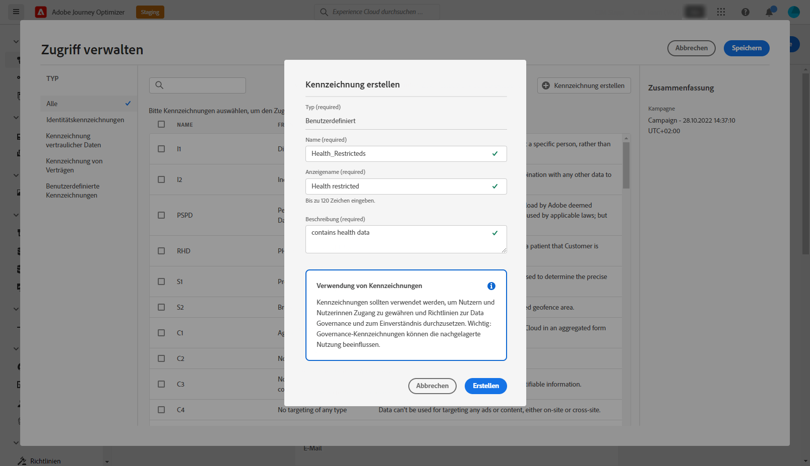
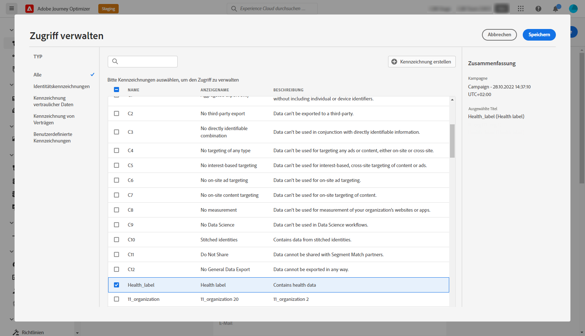

# Zugriffssteuerung auf Objektebene {#object-level-access}

>[!BEGINSHADEBOX]

**Auf dieser Seite** Verwenden Sie die Zugriffssteuerung auf Objektebene, um einzelne Objekte wie Journey, Kampagnen und Angebote mit Zugriffskennzeichnungen einzuschränken, damit Sie vertrauliche Inhalte und personenbezogene Daten auf autorisierte Benutzende beschränken können.

>[!ENDSHADEBOX]

>[!CONTEXTUALHELP]
>id="ajo_olac_manage_access"
>title="Labels zur Zugriffsverwaltung"
>abstract="Der Zugriff auf ein Objekt kann anhand von Zugriffs-Labels eingeschränkt werden. Dieser Ansatz schützt sensible digitale Assets vor unbefugten Nutzern und sorgt für einen weiteren Schutz personenbezogener Daten. **Es muss sichergestellt sein, dass Sie nur Labels ausgewählt werden, für die eine Berechtigung besteht.**"

Der Zugriff auf ein Objekt kann anhand von Zugriffs-Labels eingeschränkt werden. Dieser Ansatz schützt sensible digitale Assets vor unbefugten Nutzern und sorgt für einen weiteren Schutz personenbezogener Daten.

Mit der Funktion „Zugriffssteuerung auf Objektebene (OLAC)“ können die Berechtigungen zum Verwalten des Datenzugriffs für eine Auswahl von Objekten definiert werden:

* Journey
* Campaign
* Vorlage
* Fragment
* Landingpage
* Angebot
* Statische Angebotssammlung
* Angebotsentscheidung
* Kanalkonfiguration
* IP-Aufwärmplan

## Voraussetzungen {#prereq-labels}

Um [Labels erstellen](#create-labels) zu können, müssen Sie über eine Rolle mit der Berechtigung zum **[!UICONTROL Verwalten von Nutzungs-Labels]** verfügen.

Um [Labels zuweisen](#assign-labels) zu können, müssen Sie über eine Rolle mit der Berechtigung zum **Verwalten** verfügen, d. h. [!DNL Manage journeys], [!DNL Manage Campaigns] oder [!DNL Manage decisions]. Ohne diese Berechtigung ist die Schaltfläche **[!UICONTROL Zugriff verwalten]** ausgegraut.

Weitere Informationen zu Berechtigungen finden Sie in [diesem Abschnitt](../administration/permissions.md).

## Erstellen von Labels {#create-labels}

Mit **[!UICONTROL Labels]** können Sie Datensätze und Felder entsprechend den für diese Daten geltenden Nutzungsrichtlinien kategorisieren. **[!UICONTROL Labels]** können jederzeit angewendet werden, was eine flexible Steuerung der Daten ermöglicht.

Verwenden Sie Labels, um Zugriff für Benutzende bereitzustellen sowie Data Governance- und Einverständnisrichtlinien durchzusetzen. Diese Governance-Labels können sich auf den nachgelagerten Verbrauch auswirken.

Sie können Labels im Produkt [!DNL Permissions] erstellen. Weitere Informationen sind in der [Dokumentation zu Adobe Experience Platform](https://experienceleague.adobe.com/docs/experience-platform/access-control/abac/permissions-ui/labels.html?lang=de){target="_blank"} verfügbar.

Sie können **[!UICONTROL Labels]** auch direkt in Journey Optimizer erstellen. Gehen Sie wie folgt vor, um ein Label zu erzeugen:

1. Klicken Sie in einem Objekt in Adobe Journey Optimizer wie z. B einer neu erstellten **[!UICONTROL Kampagne]** auf die Schaltfläche **[!UICONTROL Zugriff verwalten]**.

   

1. Klicken Sie im Fenster **[!UICONTROL Zugriff verwalten]** auf **[!UICONTROL Label erstellen]**.

   

1. Konfigurieren Sie das Label. Sie müssen Folgendes angeben:

   * **[!UICONTROL Name]**
   * **[!UICONTROL Anzeigename]**
   * **[!UICONTROL Beschreibung]**

   

1. Klicken Sie auf **[!UICONTROL Erstellen]**, um Ihr **[!UICONTROL Label]** zu speichern.

Ihr neu erstelltes **[!UICONTROL Label]** ist jetzt in der Liste verfügbar. Bei Bedarf können Sie sie im Produkt [!DNL Permissions] ändern.

## Zuweisen von Labels {#assign-labels}

So weisen Sie Ihren Objekten in Journey Optimizer benutzerdefinierte oder Labels zur grundlegenden Datennutzung zu:

1. Klicken Sie in einem Objekt in Adobe Journey Optimizer wie z. B einer neu erstellten **[!UICONTROL Kampagne]** auf die Schaltfläche **[!UICONTROL Zugriff verwalten]**.

   

1. Wählen Sie im Fenster **[!UICONTROL Zugriff verwalten]** Ihre benutzerdefinierten oder Core-Labels für die Datennutzung aus, um den Zugriff auf dieses Objekt zu verwalten.

   Weitere Informationen zu Core-Labels für die Nutzungsdaten finden Sie auf [dieser Seite](https://experienceleague.adobe.com/docs/experience-platform/data-governance/labels/reference.html?lang=de){target="_blank"}.

   

1. Klicken Sie auf **[!UICONTROL Speichern]**, um diese Beschränkung für das Label anzuwenden.

Auf dieses Objekt können nur Benutzende mit dem spezifischen **[!UICONTROL Label]** in ihren **[!UICONTROL Rollen]** zugreifen. Beispiel: Eine Benutzerin oder ein Benutzer mit dem Label „C1“ hat nur Zugriff auf Objekte mit dem Label „C1“ oder Objekte ohne Label.

Weitere Informationen zur Zuweisung von **[!UICONTROL Labels]** zu einer **[!UICONTROL Rolle]** sind auf [dieser Seite](https://experienceleague.adobe.com/docs/experience-platform/access-control/abac/permissions-ui/permissions.html?lang=de#manage-labels-for-a-role){target="_blank"} verfügbar.

+++ KI-Wissensreferenz

Dieser Abschnitt enthält strukturiertes Wissen zur Unterstützung von Interpretation, Abrufen und Antworten auf Fragen zu diesem Thema.

Zum vollständigen Verständnis sollten diese Informationen mit der Dokumentation auf dieser Seite kombiniert werden. Keine der beiden Quellen ist für Einzelpersonen gedacht. Die Seite beschreibt die Funktion, während dieser Abschnitt zusätzlichen Kontext bietet, der dabei hilft, Begriffe, Absichten, Anwendbarkeit und Begrenzungen zu unterscheiden.

* Mit der **TL;DR:** Zugriffssteuerung auf Objektebene (OLAC) können Sie Zugriffsbeschriftungen auf bestimmte Journey Optimizer-Objekte wie Journeys, Kampagnen und Angebote anwenden, sodass nur Benutzende, deren Rolle die entsprechende Beschriftung enthält, diese Objekte anzeigen oder mit ihnen interagieren können.

**intents:**

* Erstellen Sie eine benutzerdefinierte Zugriffsbeschriftung direkt in Journey Optimizer oder über das Produkt Zugriffsberechtigungen .
* Zuweisen von Zugriffskennzeichnungen zu Journey Optimizer-Objekten (Journey, Kampagnen, Angebote usw.)
* Schränken Sie sensible Inhalte auf autorisierte Benutzer ein
* Erfahren Sie, welche Berechtigungen zum Erstellen und Zuweisen von Kennzeichnungen erforderlich sind

**Glossar:**

* **OLAC (Object Level Access Control)**: Eine Funktion zur Definition von Berechtigungen zum Verwalten des Datenzugriffs für eine Auswahl bestimmter Journey Optimizer-Objekte *produktspezifisch)*
* **Label**: Ein auf ein Objekt angewendetes Tag, um es anhand der Nutzungsrichtlinie zu kategorisieren und den Zugriff basierend auf der Rollenmitgliedschaft *produktspezifisch) einzuschränken*
* **Zugriff verwalten**: Die Schaltfläche oder Benutzeroberfläche, die in unterstützten Journey Optimizer-Objekten zum Erstellen und Zuweisen von Zugriffskennzeichnungen verfügbar ist *(produktspezifisch)*
* **Core-Datennutzungskennzeichnungen**: Vordefinierte Kennzeichnungen, die von Adobe Experience Platform bereitgestellt werden, im Gegensatz zu benutzerdefinierten Kennzeichnungen, die von der Organisation erstellt werden *(produktspezifisch)*

**Leitplanken:**

* Zum Erstellen von Kennzeichnungen ist die **Verwalten von**) erforderlich (Voraussetzung)
* Zum Zuweisen von Kennzeichnungen ist eine **Verwalten**-Berechtigung für den Objekttyp erforderlich (z. B. Journey verwalten, Kampagnen verwalten oder Entscheidungen verwalten). Ohne diese ist die Schaltfläche **Zugriff verwalten** ausgegraut (Voraussetzung)
* Unterstützte Objekte für OLAC-Kennzeichnungen: Journey, Kampagne, Vorlage, Fragment, Landingpage, Angebot, Statische Angebotssammlung, Angebotsentscheidung, Kanalkonfiguration, IP-Aufwärmplan

**Terminologie:**

* Kanonischer Name: Zugriffssteuerung auf Objektebene — Akronym: OLAC — Varianten: objektbasierte Zugriffssteuerung, objektbasierte Zugriffsverwaltung
* Nicht verwechseln: OLAC (beschränkt den Zugriff auf bestimmte AJO-Objekte wie Journey und Kampagnen mithilfe von Kennzeichnungen) ≠ ABAC (attributbasiert, wendet Kennzeichnungsrichtlinien auf Schemafelder, Datensätze und Zielgruppen auf Plattformebene an)
* Verwechseln Sie nicht: „Core-Datennutzungskennzeichnungen“ (vordefinierte Kennzeichnungen aus Adobe Experience Platform) ≠ „benutzerdefinierte Kennzeichnungen“ (von der Organisation erstellte Kennzeichnungen)

**FAQ:**

* **F: Kann ich eine Kennzeichnung direkt in Journey Optimizer erstellen, ohne zum Produkt „Berechtigungen“ zu wechseln?** — Ja. Verwenden Sie das Fenster Zugriff verwalten für ein beliebiges unterstütztes Objekt und klicken Sie auf Bezeichnung erstellen .
* **F: Welche Objekttypen unterstützen OLAC-Kennzeichnungen?** - Journey, Kampagne, Vorlage, Fragment, Landingpage, Angebot, statische Angebotssammlung, Angebotsentscheidung, Kanalkonfiguration und IP-Aufwärmplan.
* **F: Welche Berechtigung wird benötigt, um einer Journey einen Titel zuzuweisen?** — Berechtigung Journey verwalten; ohne die Berechtigung Verwalten ist die Schaltfläche Zugriff verwalten ausgegraut.
* **F: Wenn ein Benutzer nur die C1-Kennzeichnung in seiner Rolle hat, auf welche Objekte kann er zugreifen?** — Nur mit C1 gekennzeichnete oder nicht gekennzeichnete Objekte.

+++
<!-- ai-accordion-version: 1 | source-hash: 4e9b2577 -->
