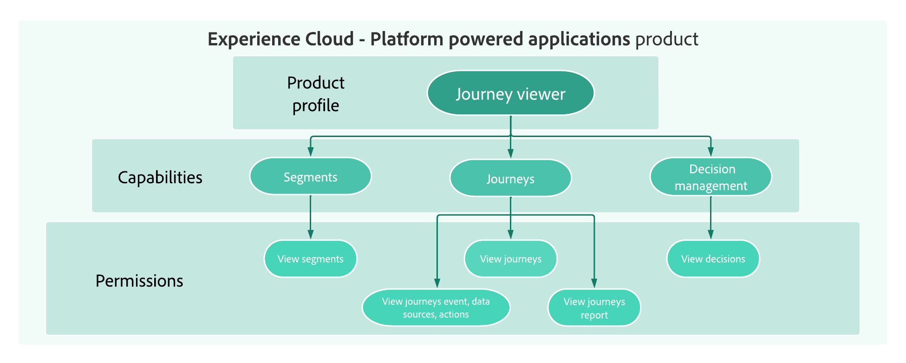

# Erste Schritte in der Benutzerverwaltung {#permissions-overview}

[!DNL Journey Optimizer] ermöglicht die Definition und Verwaltung von Berechtigungen, die den verschiedenen Benutzern erteilt werden können. Berechtigungen sind eine Reihe von Rechten und Einschränkungen, die den Zugriff auf produktinterne Funktionen zulassen oder verweigern.

➡️ [Weitere Informationen zur Zugriffskontrolle in Adobe Journey Optimizer finden Sie in diesem Video.](#video)

Die Benutzerverwaltung in [!DNL Journey Optimizer] basiert auf drei Konzepten:

* **[!UICONTROL Rolle]**: Eine Reihe von Einzelrechten, die Benutzern den Zugriff auf bestimmte Funktionen oder Objekte in der Benutzeroberfläche ermöglichen. Siehe Abschnitt [Vordefinierte Rollen](ootb-product-profiles.md) Abschnitt.

* **[!UICONTROL Berechtigungen]**: Einzelberechtigungen, mit denen Sie die den **[!UICONTROL Rollen]**. Jede Berechtigung wird unter Ressourcen erfasst, z. B. Journey oder Angebote, die die verschiedenen Funktionen oder Objekte in [!DNL Journey Optimizer]. Siehe Abschnitt [Berechtigungsebenen](high-low-permissions.md).

* **[!UICONTROL Sandbox]**: Virtuelle Sandboxes, die Instanzen in separate, isolierte virtuelle Umgebungen unterteilen. Siehe [Verwenden von Sandboxes](sandboxes.md).

Jedes Konzept kann von **[!UICONTROL Produktadministratoren]** verwaltet werden, die Zugriff auf die Admin Console haben. [Erfahren Sie mehr über die Adobe Admin Console](https://helpx.adobe.com/de/enterprise/managing/user-guide.html).

## Anleitungsvideo{#video}

Erfahren Sie mehr über das Zugriffskontrollsystem und benutzerdefinierte Probleme in Adobe Journey Optimizer. Erfahren Sie, wie Sie Rollen und Berechtigungen verwalten und Benutzer hinzufügen und verwalten können.

>[!VIDEO](https://video.tv.adobe.com/v/333998?quality=12)