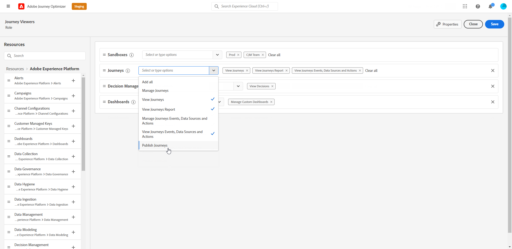

# Verwalten von Benutzenden und Produkten {#manage-permissions}

>[!IMPORTANT]
>
> Die einzelnen im Folgenden beschriebenen Verfahren können nur von **[!UICONTROL Produkt]**- oder **[!UICONTROL System]**-Admins durchgeführt werden.

**[!UICONTROL Rollen]** beziehen sich auf eine Sammlung von Benutzenden mit denselben Berechtigungen und Sandboxes. Mit diesen Rollen können Sie den Zugriff und die Berechtigungen für verschiedene Benutzergruppen in Ihrer Organisation einfach verwalten.

Mit [!DNL Journey Optimizer] können Sie aus einer Reihe bereits vorhandener **[!UICONTROL Rollen]** wählen, die über jeweils unterschiedliche Berechtigungen verfügen und die Sie Benutzenden zuweisen können. Weitere Informationen zu den verfügbaren **[!UICONTROL Rollen]** finden Sie auf dieser [Seite](ootb-product-profiles.md).

Wenn Benutzende zu einer **[!UICONTROL Rolle]** gehören, erhalten sie Zugriff auf die im Produkt enthaltenen Adobe-Apps und -Services.

Wenn die bereits vorhandenen Rollen nicht den spezifischen Anforderungen Ihrer Organisation entsprechen, können Sie auch benutzerdefinierte **[!UICONTROL Rollen]** erstellen, um eine Feinabstimmung für den Zugriff auf bestimmte Funktionen oder Objekte in der Benutzeroberfläche vorzunehmen. Auf diese Weise können Sie sicherstellen, dass Benutzende nur Zugriff auf die Ressourcen und Tools haben, die sie jeweils für eine effiziente Durchführung ihrer Aufgaben benötigen.

## Zuweisen einer Rolle {#assigning-role}

Sie können festlegen, ob Benutzenden eine vorkonfigurierte oder eine benutzerdefinierte **[!UICONTROL Rolle]** zugewiesen wird.

Die Liste aller vorkonfigurierten Rollen mit zugewiesenen Berechtigungen finden Sie im Abschnitt [Integrierte Rollen](ootb-product-profiles.md).

So weisen Sie eine **[!UICONTROL Rolle]** zu:

1. Um Benutzenden eine Rolle im Produkt [!DNL Permissions] zuzuweisen, navigieren Sie zur Registerkarte **[!UICONTROL Rollen]** und wählen Sie die gewünschte Rolle aus.

   

1. Klicken Sie auf der Registerkarte **[!UICONTROL Benutzer]** auf **[!UICONTROL Benutzer hinzufügen]**.

   

1. Geben Sie den Namen oder die E-Mail-Adresse der jeweiligen Person ein oder wählen Sie sie aus der Liste aus und klicken Sie auf **[!UICONTROL Speichern]**.

   Wenn der Benutzer vorher noch nicht in der [!DNL Admin Console] erstellt wurde, lesen Sie die [Dokumentation zum Hinzufügen von Benutzern](https://experienceleague.adobe.com/docs/experience-platform/access-control/ui/users.html?lang=de).

   

Ihre Benutzenden sollten dann eine E-Mail mit einer Umleitung zu Ihrer Instanz erhalten.

Weiterführende Informationen zur Benutzerverwaltung finden Sie in der [Dokumentation zur Zugriffssteuerung](https://experienceleague.adobe.com/docs/experience-platform/access-control/home.html?lang=de).

Beim Zugriff auf die Instanz wird Ihren Benutzenden je nach den in der **[!UICONTROL Rolle]** zugewiesenen Berechtigungen eine bestimmte Ansicht angezeigt. Wenn die Person nicht den richtigen Zugriff auf eine Funktion hat, wird die folgende Meldung angezeigt:

`You don't have permission to access this feature. Permission needed: XX.`

## Bearbeiten einer vorhandenen Rolle {#edit-product-profile}

Für vorkonfigurierte oder benutzerdefinierte **[!UICONTROL Rollen]** können Sie jederzeit Berechtigungen hinzufügen oder löschen.

In diesem Beispiel sollen **[!UICONTROL Berechtigungen]** im Zusammenhang mit der Ressource **[!UICONTROL Journeys]** für Benutzende hinzugefügt werden, die der **[!UICONTROL Rolle]** „Journey-Viewer“ zugewiesen sind. Diese Benutzenden können dann Journeys veröffentlichen.

Beachten Sie, dass sich die Änderung einer vorkonfigurierten oder benutzerdefinierten **[!UICONTROL Rolle]** auf alle Benutzenden auswirkt, die dieser **[!UICONTROL Rolle]** zugewiesen sind.

1. Um Benutzenden eine Rolle im Produkt [!DNL Permissions] zuzuweisen, navigieren Sie zur Registerkarte **[!UICONTROL Rollen]** und wählen Sie die gewünschte Rolle aus (hier die **[!UICONTROL Rolle]** „Journey-Viewer“).
   

1. Klicken Sie im Dashboard **[!UICONTROL Rolle]** auf **[!UICONTROL Bearbeiten]**.

   

1. Im Menü **[!UICONTROL Ressourcen]** wird die Liste der Ressourcen angezeigt, die für das Produkt **[!UICONTROL Experience Cloud – von Platform unterstützte Anwendungen]** gelten. Legen Sie Ressourcen per Drag-and-drop ab, um Berechtigungen zuzuweisen.

   Wählen Sie nun aus dem Ressourcen-Dropdown **[!UICONTROL Journey]** die **[!UICONTROL Berechtigung]** zum Veröffentlichen von Journeys.

   

1. Klicken Sie bei Bedarf unter **[!UICONTROL Eingeschlossene Berechtigungsobjekte]** auf das X-Symbol, um Berechtigungen oder Ressourcen für die Rolle zu entfernen.

1. Klicken Sie abschließend auf **[!UICONTROL Speichern]**.

Gegebenenfalls können Sie auch eine neue Rolle mit bestimmten Berechtigungen erstellen. Weiterführende Informationen hierzu finden Sie unter [Erstellen einer neuen Rolle](#create-product-profile).

## Erstellen einer neuen Rolle {#create-product-profile}

[!DNL Journey Optimizer] ermöglicht es Ihnen, eigene **[!UICONTROL Rollen]** zu erstellen und Ihren Benutzenden eine Reihe von Berechtigungen und Sandboxes zuzuweisen. Mit **[!UICONTROL Rollen]** können Sie Zugriff auf bestimmte Funktionen oder Objekte in der Benutzeroberfläche zulassen oder verweigern.

Weitere Informationen zum Erstellen und Verwalten von Sandboxes finden Sie in der [Dokumentation zu Adobe Experience Platform](https://experienceleague.adobe.com/docs/experience-platform/sandbox/ui/user-guide.html?lang=de){target="_blank"}.

In diesem Beispiel soll eine Rolle mit dem Namen **Journeys nur lesen** erstellt werden, in dem wir Leseberechtigungen für die Journey-Funktion erteilen. Benutzende können nur auf Journeys zugreifen und diese anzeigen, können aber nicht auf andere Funktionen wie **[!DNL  Decision management]** oder [!DNL Journey Optimizer] zugreifen.

So erstellen Sie die **[!UICONTROL Rolle]** **Journeys nur lesen**:

1. Um Benutzenden eine Rolle im Produkt [!DNL Permissions] zuzuweisen, navigieren Sie zur Registerkarte **[!UICONTROL Rollen]** und klicken Sie auf **[!UICONTROL Rolle erstellen]**.

   

1. Fügen Sie einen **[!UICONTROL Namen]** und eine **[!UICONTROL Beschreibung]** für Ihre neue **[!UICONTROL Rolle]** hinzu. Klicken Sie anschließend auf **[!UICONTROL Bestätigen]**.

   

1. Wählen Sie im Ressourcen-Dropdown **[!UICONTROL Sandbox]** die Sandboxes aus, die Ihrer **[!UICONTROL Rolle]** zugewiesen werden sollen. [Erfahren Sie mehr über Sandboxes](sandboxes.md)

   

1. Sie können zwischen verschiedenen Ressourcen wie **[!DNL Journeys]**, **[!DNL Segments]** oder **[!DNL Decision management]** wählen, die in [!DNL Journey Optimizer] im Menü links verfügbar sind.

   Wählen Sie hier die Ressource **[!UICONTROL Journeys]** aus.

   

1. Wählen Sie im Dropdown-Menü **[!UICONTROL Journeys]** die Berechtigungen aus, die Ihrer **[!UICONTROL Rolle]** zugewiesen werden sollen.

   Wählen Sie hier **[!DNL View journeys]**, **[!DNL View journeys report]** und **[!DNL View journeys event, data sources, actions]** aus.

   

1. Klicken Sie abschließend auf **[!UICONTROL Speichern]**.

Ihre **[!UICONTROL Rolle]** wurde nun erstellt und konfiguriert. Jetzt müssen Sie sie den Benutzenden zuweisen.

Weitere Informationen zum Erstellen und Verwalten von Rollen finden Sie in der [Admin Console-Dokumentation](https://experienceleague.adobe.com/docs/experience-platform/access-control/abac/permissions-ui/roles.html?lang=de).
