# Verwalten von Benutzenden und Rollen {#manage-permissions}

>[!BEGINSHADEBOX]

**Auf dieser Seite** Im Produkt „Berechtigungen“ können Sie Rollen zuweisen, bearbeiten und erstellen, sodass Sie jedem Benutzer genau den Zugriff gewähren, den er für seine Arbeit in Journey Optimizer benötigt.

>[!ENDSHADEBOX]

**[!UICONTROL Rollen]** beziehen sich auf eine Sammlung von Benutzenden mit denselben Berechtigungen und Sandboxes. Mit diesen Rollen können Sie den Zugriff und die Berechtigungen für verschiedene Benutzergruppen in Ihrer Organisation einfach verwalten.

In [!DNL Journey Optimizer] besteht die Möglichkeit, aus einer Reihe bereits vorhandener **[!UICONTROL Rollen]** zu wählen, die über jeweils unterschiedliche Berechtigungen verfügen und die Benutzenden zugewiesen werden können. Weitere Informationen zu den verfügbaren **[!UICONTROL Rollen]** finden Sie auf dieser [Seite](ootb-product-profiles.md).

Wenn Benutzende zu einer **[!UICONTROL Rolle]** gehören, erhalten sie Zugriff auf die im Produkt enthaltenen Adobe-Anwendungen und -Dienste.

Wenn die bereits vorhandenen Rollen nicht den spezifischen Anforderungen Ihrer Organisation entsprechen, können Sie auch benutzerdefinierte **[!UICONTROL Rollen]** erstellen, um eine Feinabstimmung für den Zugriff auf bestimmte Funktionen oder Objekte in der Benutzeroberfläche vorzunehmen. Auf diese Weise kann sichergestellt werden, dass Benutzende nur Zugriff auf die Ressourcen und Tools haben, die sie jeweils für eine effiziente Durchführung ihrer Aufgaben benötigen.

>[!IMPORTANT]
>
>Die im Folgenden beschriebenen Schritte und Verfahren können nur von **[!UICONTROL Produkt]**- oder **[!UICONTROL System]**-Administrierenden durchgeführt werden.

## Zuweisen einer Rolle {#assigning-role}

Sie können Benutzenden eine vorkonfigurierte oder eine benutzerdefinierte **[!UICONTROL Rolle]** zuweisen.

Die Liste aller vorkonfigurierten Rollen mit zugewiesenen Berechtigungen ist im Abschnitt [Integrierte Rollen](ootb-product-profiles.md) verfügbar.

So weisen Sie eine **[!UICONTROL Rolle]** zu:

1. Um Benutzenden eine Rolle im Produkt [!DNL Permissions] zuzuweisen, navigieren Sie zur Registerkarte **[!UICONTROL Rollen]** und wählen Sie die gewünschte Rolle aus.

   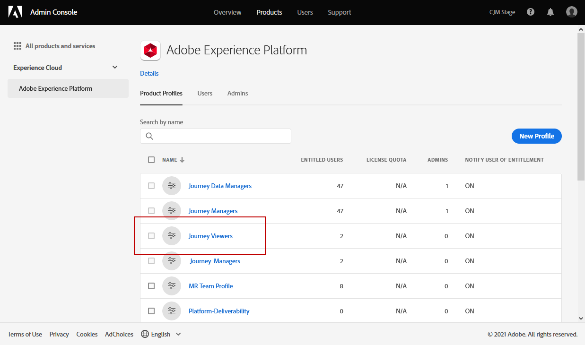

1. Klicken Sie auf der Registerkarte **[!UICONTROL Benutzer]** auf **[!UICONTROL Benutzer hinzufügen]**.

   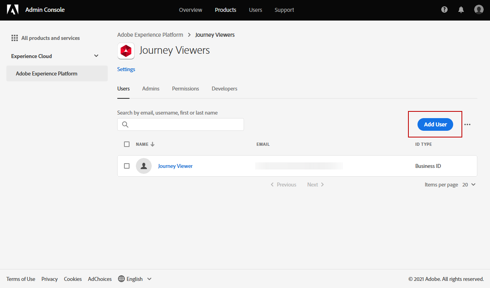

1. Geben Sie Name oder E-Mail-Adresse der jeweiligen Benutzenden ein oder wählen Sie die Person aus der Liste aus und klicken Sie auf **[!UICONTROL Speichern]**.

   Wenn Benutzende vorher noch nicht in der [!DNL Admin Console] erstellt wurden, lesen Sie die [Dokumentation zum Hinzufügen von Benutzern](https://experienceleague.adobe.com/docs/experience-platform/access-control/ui/users.html?lang=de){target="_blank"}.

   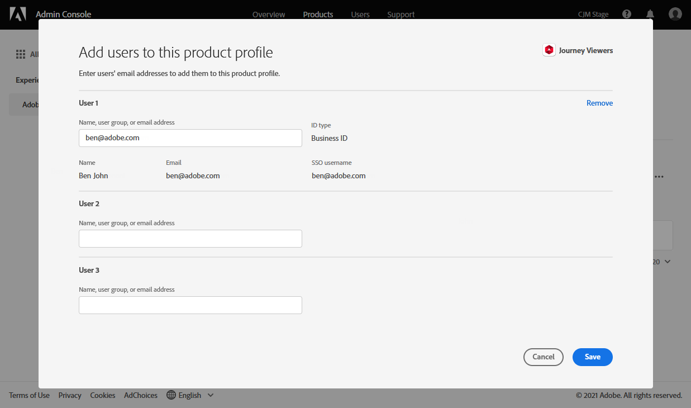

Die Benutzenden erhalten eine E-Mail, in der sie auf die Instanz umgeleitet werden.

Weiterführende Informationen zur Verwaltung von Benutzenden sind in der [Dokumentation zur Zugriffssteuerung](https://experienceleague.adobe.com/docs/experience-platform/access-control/home.html?lang=de){target="_blank"} verfügbar.

Beim Zugriff auf die Instanz wird den Benutzenden je nach den in der **[!UICONTROL Rolle]** zugewiesenen Berechtigungen eine bestimmte Ansicht angezeigt. Wenn Benutzende nicht den richtigen Zugriff auf eine Funktion haben, wird die folgende Meldung angezeigt:

`You do not have permission to access this feature. Permission needed: XX.`

## Bearbeiten einer vorhandenen Rolle {#edit-product-profile}

Für native oder benutzerdefinierte **[!UICONTROL Rollen]** können Berechtigungen jederzeit hinzugefügt oder gelöscht werden.

In Beispiel unten sollen **[!UICONTROL Berechtigungen]** im Zusammenhang mit der Ressource **[!UICONTROL Journeys]** für Benutzende hinzugefügt werden, die der **[!UICONTROL Rolle]** „Journey-Betrachterin bzw. Journey-Betrachter“ zugewiesen sind. Diese Benutzenden können dann Journeys veröffentlichen.

>[!IMPORTANT]
>
>Änderungen an einer integrierten oder benutzerdefinierten Rolle wirken sich auf alle Benutzenden aus, die dieser Rolle zugewiesen sind.

1. Um Benutzenden eine Rolle im Produkt [!DNL Permissions] zuzuweisen, navigieren Sie zur Registerkarte **[!UICONTROL Rollen]** und wählen Sie die gewünschte Rolle aus (hier die **[!UICONTROL Rolle]** „Journey-Betrachterin bzw. Journey-Betrachter“).
   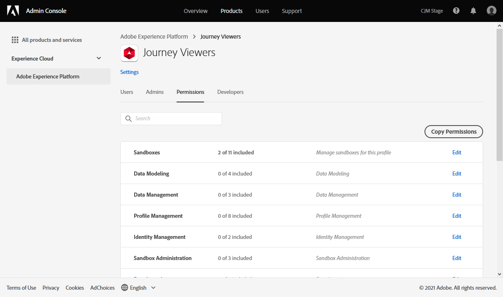

1. Klicken Sie im Dashboard **[!UICONTROL Rolle]** auf **[!UICONTROL Bearbeiten]**.

   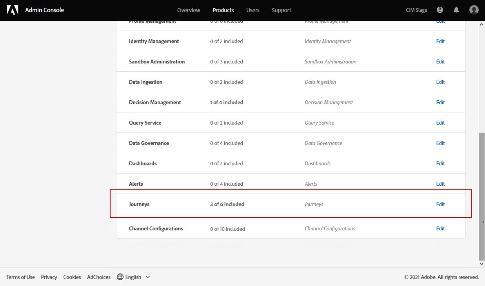

1. Im Menü **[!UICONTROL Ressourcen]** wird die Liste der Ressourcen angezeigt, die für das Produkt **[!UICONTROL Experience Cloud – von Platform unterstützte Anwendungen]** gelten. Legen Sie Ressourcen per Drag-and-drop ab, um Berechtigungen zuzuweisen.

   Wählen Sie nun aus dem Ressourcen-Dropdown **[!UICONTROL Journey]** die **[!UICONTROL Berechtigung]** zum Veröffentlichen von Journeys.

   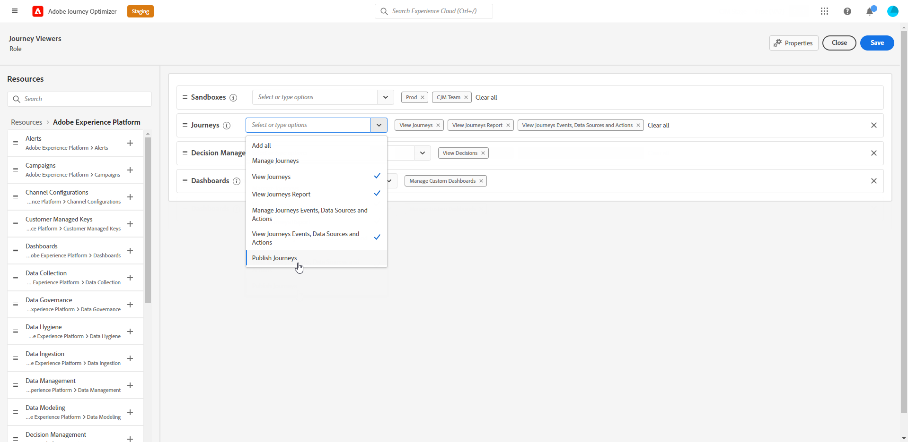

1. Klicken Sie bei Bedarf unter **[!UICONTROL Eingeschlossene Berechtigungseinträge]** auf das X-Symbol, um Berechtigungen oder Ressourcen für die Rolle zu entfernen.

1. Klicken Sie abschließend auf **[!UICONTROL Speichern]**.

Gegebenenfalls kann auch eine neue Rolle mit bestimmten Berechtigungen erstellt werden.

## Erstellen einer neuen Rolle {#create-product-profile}

[!DNL Journey Optimizer] ermöglicht es Ihnen, eigene **[!UICONTROL Rollen]** zu erstellen und Ihren Benutzenden eine Reihe von Berechtigungen und Sandboxes zuzuweisen. Mit **[!UICONTROL Rollen]** können Sie Zugriff auf bestimmte Funktionen oder Objekte in der Benutzeroberfläche zulassen oder verweigern.

Weitere Informationen zum Erstellen und Verwalten von Sandboxes finden Sie in der [Dokumentation zu Adobe Experience Platform](https://experienceleague.adobe.com/docs/experience-platform/sandbox/ui/user-guide.html?lang=de){target="_blank"}.

In diesem Beispiel soll eine Rolle mit dem Namen **Journeys nur lesen** erstellt werden, in der Leseberechtigungen für die Journey-Funktion erteilt werden. Benutzende können nur auf Journeys zugreifen und diese anzeigen, können aber nicht auf andere Funktionen wie **[!DNL Decision management]** oder [!DNL Journey Optimizer] zugreifen.

So erstellen Sie die **[!UICONTROL Rolle]** **Journeys nur lesen**:

1. Um Benutzenden eine Rolle im Produkt [!DNL Permissions] zuzuweisen, navigieren Sie zur Registerkarte **[!UICONTROL Rollen]** und klicken Sie auf **[!UICONTROL Rolle erstellen]**.

   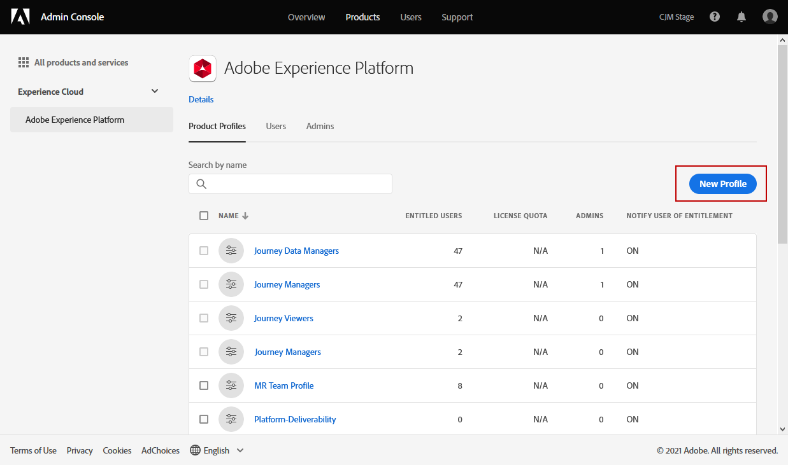

1. Fügen Sie einen **[!UICONTROL Namen]** und eine **[!UICONTROL Beschreibung]** für Ihre neue **[!UICONTROL Rolle]** hinzu. Klicken Sie anschließend auf **[!UICONTROL Bestätigen]**.

   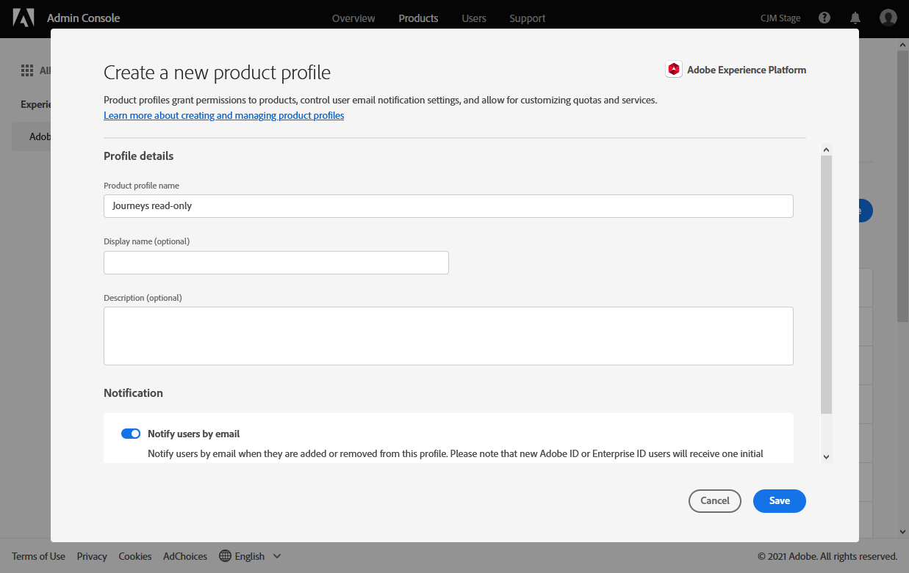

1. Wählen Sie im Ressourcen-Dropdown **[!UICONTROL Sandbox]** die Sandboxes aus, die Ihrer **[!UICONTROL Rolle]** zugewiesen werden sollen. [Erfahren Sie mehr über Sandboxes](sandboxes.md)

   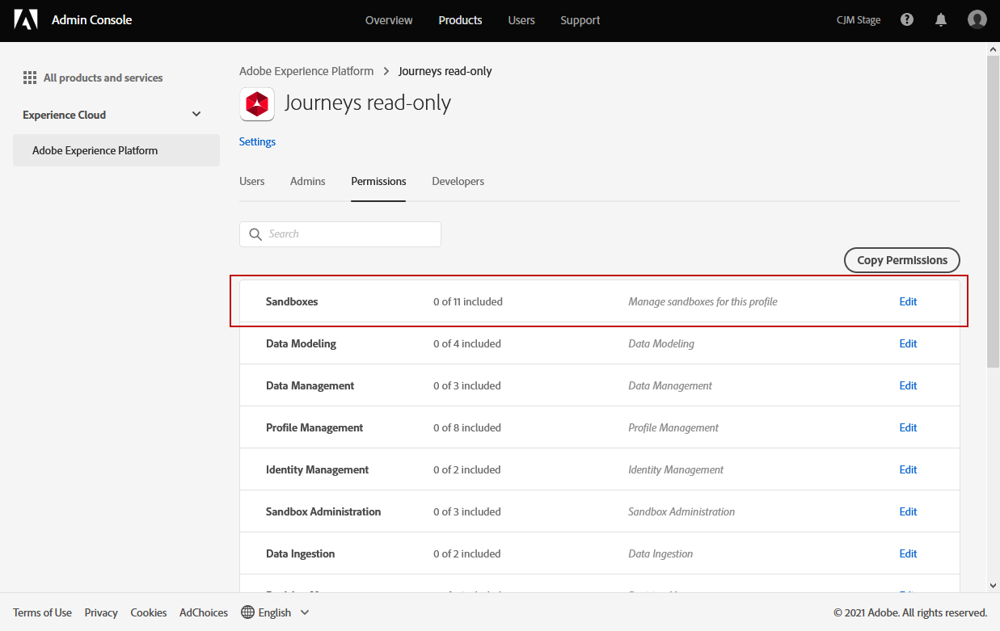

1. Wählen Sie zwischen verschiedenen Ressourcen wie **[!DNL Journeys]**, **[!DNL Segments]** oder **[!DNL Decision management]** aus, die in [!DNL Journey Optimizer] im Menü links verfügbar sind.

   Wählen Sie hier die Ressource **[!UICONTROL Journeys]** aus.

   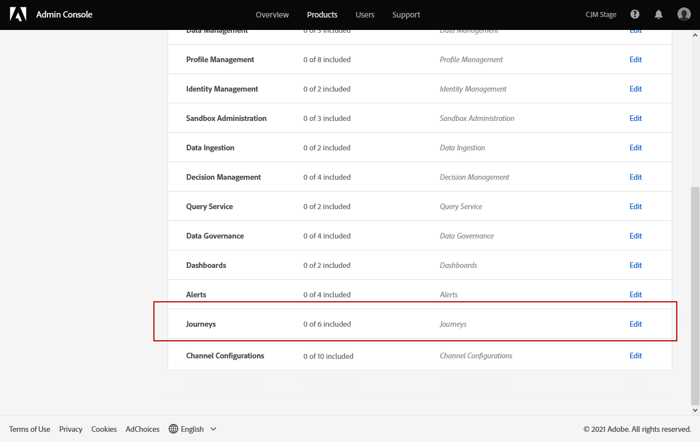

1. Wählen Sie im Dropdown-Menü **[!UICONTROL Journeys]** die Berechtigungen aus, die Ihrer **[!UICONTROL Rolle]** zugewiesen werden sollen.

   Wählen Sie hier **[!DNL View journeys]**, **[!DNL View journeys report]** und **[!DNL View journeys event, data sources, actions]** aus.

   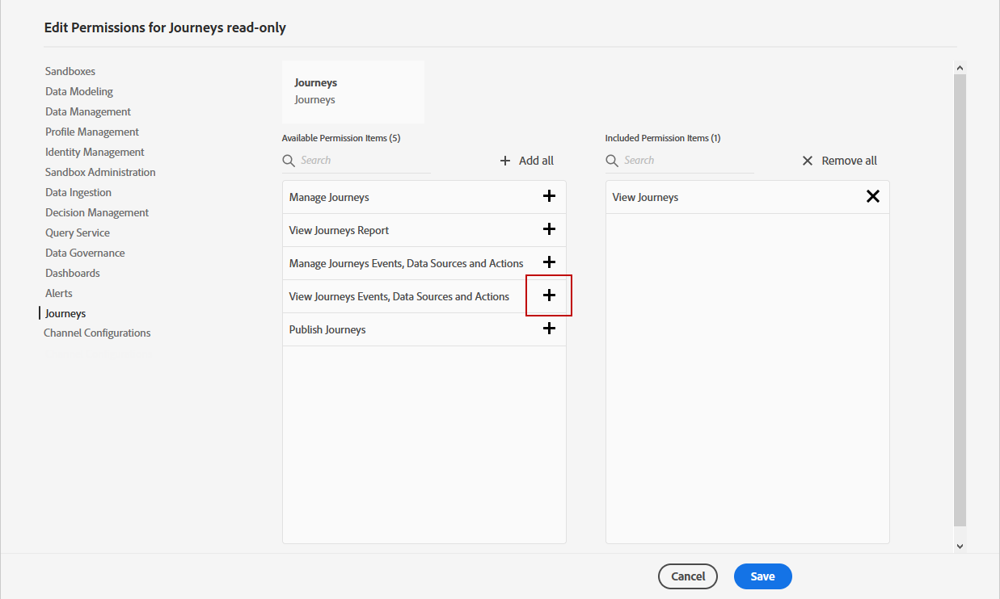

1. Klicken Sie abschließend auf **[!UICONTROL Speichern]**.

Ihre **[!UICONTROL Rolle]** wurde nun erstellt und konfiguriert. Jetzt müssen Sie sie den Benutzenden zuweisen.

Weitere Informationen zum Erstellen und Verwalten von Rollen sind in der [Adobe Admin Console-Dokumentation](https://experienceleague.adobe.com/docs/experience-platform/access-control/abac/permissions-ui/roles.html?lang=de){target="_blank"} verfügbar.

+++ KI-Wissensreferenz

Dieser Abschnitt enthält strukturiertes Wissen zur Unterstützung von Interpretation, Abrufen und Antworten auf Fragen zu diesem Thema.

Zum vollständigen Verständnis sollten diese Informationen mit der Dokumentation auf dieser Seite kombiniert werden. Keine der beiden Quellen ist für Einzelpersonen gedacht. Die Seite beschreibt die Funktion, während dieser Abschnitt zusätzlichen Kontext bietet, der dabei hilft, Begriffe, Absichten, Anwendbarkeit und Begrenzungen zu unterscheiden.

- **TL;DR:** Diese Seite führt Produkt- und Systemadministratoren durch die drei Rollenverwaltungsaufgaben im Berechtigungsprodukt: Zuweisen einer vorhandenen Rolle zu einem Benutzer, Bearbeiten der Berechtigungen einer Rolle und Erstellen einer neuen benutzerdefinierten Rolle mit bestimmten Berechtigungen und Sandboxes.

**intents:**

- Weisen Sie einem Benutzer in Journey Optimizer eine integrierte oder benutzerdefinierte Rolle zu
- Bearbeiten der Berechtigungen einer vorhandenen Rolle (Hinzufügen oder Entfernen von Berechtigungen)
- Erstellen einer neuen benutzerdefinierten Rolle mit bestimmten Berechtigungen und Sandbox-Zuweisungen
- Verstehen, wer über die Berechtigung zur Rollen- und Berechtigungsverwaltung verfügt

**Glossar:**

- **Rolle**: Eine Sammlung von Benutzern mit denselben Berechtigungen und Sandboxes, die zum Verwalten des Zugriffs innerhalb einer Organisation verwendet werden *(produktspezifisch)*
- **Produktberechtigungen**: Die Adobe CX Enterprise-Benutzeroberfläche (Zugriff über [!DNL Permissions]), in der Rollen, Berechtigungen und Sandboxes *(produktspezifisch) konfiguriert sind*
- **Integrierte Rolle**: Eine bereits vorhandene Rolle mit einem definierten Berechtigungssatz, die sofort ohne benutzerdefinierte Konfiguration zugewiesen werden kann *(produktspezifisch)*

**Leitplanken:**

- Nur Produkt- oder Systemadministratoren können Rollen zuweisen, bearbeiten oder erstellen (harte Voraussetzung, wie in dem wichtigen Hinweis auf der Seite angegeben)
- Änderungen an einer integrierten oder benutzerdefinierten Rolle wirken sich auf alle Benutzenden aus, die dieser Rolle zugewiesen sind (wie im wichtigen Hinweis auf der Seite angegeben)

**Terminologie:**

- Kanonischer Name: Produktberechtigungen — Varianten: Adobe-Berechtigungen, Benutzeroberfläche für Berechtigungen, Adobe CX Enterprise-Berechtigungen
- Verwechseln Sie nicht: „Rolle zuweisen“ (Hinzufügen eines Benutzers zu einer vorhandenen Rolle) ≠ „Rolle erstellen“ (Erstellen einer neuen Rolle von Grund auf mit eigenen Berechtigungen und Sandboxes)
- Verwechseln Sie nicht: „Bearbeiten einer vorhandenen Rolle“ (Ändern von Berechtigungen oder Sandboxes für eine vorhandene Rolle; wirkt sich auf alle zugewiesenen Benutzer aus) ≠ „Erstellen einer neuen Rolle“ (Erstellen einer neuen Rolle ohne Auswirkungen auf eine vorhandene Rolle oder deren Benutzer)

**FAQ:**

- **F: Wer kann Benutzenden in Journey Optimizer Rollen zuweisen?** — Nur Produkt- oder Systemadministratoren.
- **F: Was passiert, wenn ich die Berechtigungen einer integrierten Rolle bearbeiten?** — Änderungen wirken sich auf alle Benutzenden aus, die derzeit dieser Rolle zugewiesen sind.
- **F: Wohin gehe ich im Produkt, um Rollen zu verwalten?** — Navigieren Sie im Produkt Berechtigungen zur Registerkarte Rollen .
- **F: Erhält der Benutzer nach Zuweisung einer Rolle eine Benachrichtigung?** — Ja; der Benutzer erhält automatisch eine E-Mail, die ihn zur Instanz weiterleitet.

+++
<!-- ai-accordion-version: 1 | source-hash: 09d3612e -->
