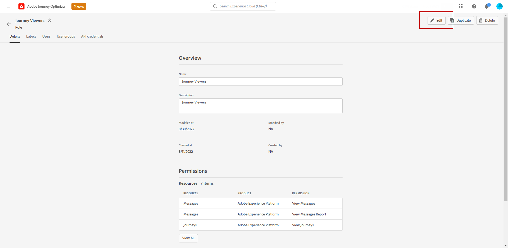

# Benutzer und Produktprofile verwalten {#manage-permissions}

>[!IMPORTANT]
>
> Jedes der folgenden Verfahren kann nur von einer **[!UICONTROL Product]** oder **[!UICONTROL System]** Administrator. Weitere Informationen hierzu finden Sie im Abschnitt [Dokumentation zur Admin Console](https://helpx.adobe.com/enterprise/admin-guide.html/enterprise/using/admin-roles.ug.html).

**[!UICONTROL Product profiles]** sind Benutzergruppen, die innerhalb Ihres Unternehmens dieselben Berechtigungen und Sandboxes haben.

Die [!DNL Journey Optimizer] -Produkt ermöglicht die Auswahl zwischen verschiedenen nativen **[!UICONTROL Product profiles]** mit unterschiedlichen Berechtigungsstufen, die Sie Ihren Benutzern zuweisen können. Weitere Informationen über **[!UICONTROL Product profiles]**, siehe hierzu [page](ootb-product-profiles.md).

Jeder Benutzer, der zu einer **[!UICONTROL Product profiles]** mit den im Produkt enthaltenen Adobe-Apps und -Services berechtigt ist.

Sie können auch Ihre eigenen **[!UICONTROL Product profiles]** , wenn Sie den Zugriff Ihrer Benutzer auf bestimmte Funktionen oder Objekte in der Benutzeroberfläche optimieren möchten.

## Zuweisen eines Produktprofils {#assigning-product-profile}

Sie können eine vordefinierte oder benutzerdefinierte **[!UICONTROL Product profile]** an Ihre Benutzer.

Die Liste aller nativen Produktprofile mit zugewiesenen Berechtigungen finden Sie im Abschnitt [Integrierte Produktprofile](ootb-product-profiles.md) Abschnitt.

So weisen Sie eine **[!UICONTROL Product profile]**:

1. Im [!DNL Admin Console]aus der **[!UICONTROL Products]** auswählen, wählen Sie die **[!UICONTROL Experience Cloud - Platform powered applications]** Produkt.

1. Wählen Sie eine **[!UICONTROL Product profile]**.

   

1. Aus dem **[!UICONTROL Users]** Registerkarte, klicken Sie auf **[!UICONTROL Add user]**.

   

1. Geben Sie den Namen oder die E-Mail-Adresse Ihres Benutzers ein und wählen Sie den Benutzer aus.

   Wenn der Benutzer zuvor nicht im [!DNL Admin Console], siehe [Dokumentation zu Benutzern hinzufügen](https://helpx.adobe.com/enterprise/admin-guide.html/enterprise/using/manage-users-individually.ug.html#add-users).

   

1. Führen Sie dieselben Schritte wie oben aus, um weitere Benutzer zu Ihrer **[!UICONTROL Product profile]**. Klicken Sie anschließend auf **[!UICONTROL Save]**.

Ihr Benutzer sollte dann eine E-Mail mit einer Umleitung zu Ihrer Instanz erhalten.

Weiterführende Informationen zur Benutzerverwaltung finden Sie im Abschnitt [Dokumentation zur Admin Console](https://helpx.adobe.com/enterprise/admin-guide.html/enterprise/using/manage-users-individually.ug.html).

Beim Zugriff auf die Instanz wird Ihrem Benutzer je nach den zugewiesenen Berechtigungen in der **[!UICONTROL Product profile]**. Wenn der Benutzer keinen Zugriff auf eine Funktion hat, wird die folgende Meldung angezeigt:

`You don't have permission to access this feature. Permission needed: XX.`

## Vorhandenes Produktprofil bearbeiten {#edit-product-profile}

Für native oder benutzerdefinierte **[!UICONTROL Product profiles]** können Sie jederzeit Berechtigungen hinzufügen oder löschen.

In diesem Beispiel möchten wir **[!UICONTROL Permissions]** im Zusammenhang mit **[!UICONTROL Journeys]** Funktion für Benutzer, die dem Journey-Viewer zugewiesen sind **[!UICONTROL Product profile]**. Die Benutzer können dann Journeys veröffentlichen.

Beachten Sie Folgendes: Wenn Sie eine vordefinierte oder benutzerdefinierte **[!UICONTROL Product profile]**, wirkt sich dies auf jeden Benutzer aus, der dieser **[!UICONTROL Product profile]**.

1. Im [!DNL Admin Console]aus der **[!UICONTROL Products]** auswählen, wählen Sie die **[!UICONTROL Experience Cloud - Platform powered applications]** Produkt.

1. Auswahl des Journey-Viewers **[!UICONTROL Product profile]**.

1. Wählen Sie die **[!UICONTROL Permissions]** Registerkarte.

   Die **[!UICONTROL Permissions]** zeigt die Liste der Funktionen an, die für die **[!UICONTROL Experience Cloud - Platform powered applications]** Produkt.

   

1. Wählen Sie die **[!UICONTROL Journeys]** Funktion.

   

1. Aus dem **[!UICONTROL Available Permission Items]** Liste auswählen, die Berechtigungen auswählen, die Sie **[!UICONTROL Product profile]** durch Klicken auf das Pluszeichen (+).

   Hier fügen wir die **[!UICONTROL Publish Journeys]** Berechtigung.

1. Bei Bedarf können Sie unter **[!UICONTROL Included Permission Items]** klicken Sie auf das X-Symbol neben, um Berechtigungen für Ihr Produktprofil zu entfernen.

1. Klicken Sie abschließend auf **[!UICONTROL Save]**.

Bei Bedarf können Sie auch ein neues Produktprofil mit bestimmten Berechtigungen erstellen. Weitere Informationen hierzu finden Sie unter [Produktprofil erstellen](#create-product-profile).

## Produktprofil erstellen {#create-product-profile}

[!DNL Journey Optimizer] ermöglicht es Ihnen, eigene **[!UICONTROL Product profiles]** und weisen Sie Ihren Benutzern eine Reihe von Berechtigungen und Sandboxes zu. Mit **[!UICONTROL Product profiles]** können Sie den Zugriff auf bestimmte Funktionen oder Objekte in der Benutzeroberfläche zulassen oder verweigern.

Weitere Informationen zum Erstellen und Verwalten von Sandboxes finden Sie unter [Dokumentation zu Adobe Experience Platform](https://experienceleague.adobe.com/docs/experience-platform/sandbox/ui/user-guide.html){target=&quot;_blank&quot;}.

In diesem Beispiel erstellen wir ein Produktprofil mit dem Namen **Journeys schreibgeschützt** wo wir Leseberechtigungen für die Journey-Funktion erteilen. Benutzer können nur auf Journeys zugreifen und diese anzeigen und nicht auf andere Funktionen wie **[!DNL  Decision management]** in [!DNL Journey Optimizer].

Erstellen Sie unsere **Journeys schreibgeschützt** **[!UICONTROL product profiles]**:

1. Zugriff auf [!DNL Admin Console].

1. Aus dem **[!UICONTROL Products]** auswählen, wählen Sie die **[!UICONTROL Experience Cloud - Platform powered applications]** Produkt.

1. Klicken **[!UICONTROL New Profile]**.

   

1. Hinzufügen einer **[!UICONTROL Product Profile Name]**, **[!UICONTROL Display Name]** und **[!UICONTROL Description]** für neue **[!UICONTROL product profiles]**.

   

1. Im **[!UICONTROL Notifications]** -Kategorie auswählen, ob Benutzer per E-Mail benachrichtigt werden, wenn sie diesem Produktprofil hinzugefügt oder daraus entfernt werden.

1. Klicken Sie abschließend auf **[!UICONTROL Save]** und wählen Sie die neu erstellte **[!UICONTROL product profiles]**.

1. Um Benutzern Berechtigungen für den Zugriff auf verschiedene Funktionen hinzuzufügen, wählen Sie die **[!UICONTROL Permissions]** Registerkarte.

1. Wählen Sie zwischen den verschiedenen Funktionen wie **[!DNL Journeys]**, **[!DNL Segments]** oder **[!DNL Decision management]** verfügbar unter [!DNL Journey Optimizer] im Menü auf der linken Seite.

   Hier wählen wir die **[!UICONTROL Journeys]** Funktion.

   

1. Aus dem **[!UICONTROL Available Permission Items]** Liste auswählen, die Berechtigungen auswählen, die Sie **[!UICONTROL Product profile]** durch Klicken auf das Pluszeichen (+).

   Hier wählen wir **[!DNL View journeys]** und **[!DNL View journeys event, data sources, actions]**.

   

1. Wählen Sie die **[!UICONTROL Sandbox access]** Funktion zur Auswahl der Sandboxes, die Sie Ihrer **[!UICONTROL Product profile]**.

   

1. under **[!UICONTROL Available Permissions Items]** klicken Sie auf das Pluszeichen (+), um Ihrem Profil Sandboxes zuzuweisen. [Weitere Informationen zu Sandboxes](sandboxes.md).

1. Klicken Sie abschließend auf **[!UICONTROL Save]**.

Ihre **[!UICONTROL Product profile]** wurde erstellt und konfiguriert. Jetzt müssen Sie sie Benutzern zuweisen.

Weiterführende Informationen zur Erstellung und Verwaltung von Produktprofilen finden Sie im Abschnitt [Dokumentation zur Admin Console](https://helpx.adobe.com/enterprise/admin-guide.html/enterprise/using/manage-product-profiles.ug.html).
