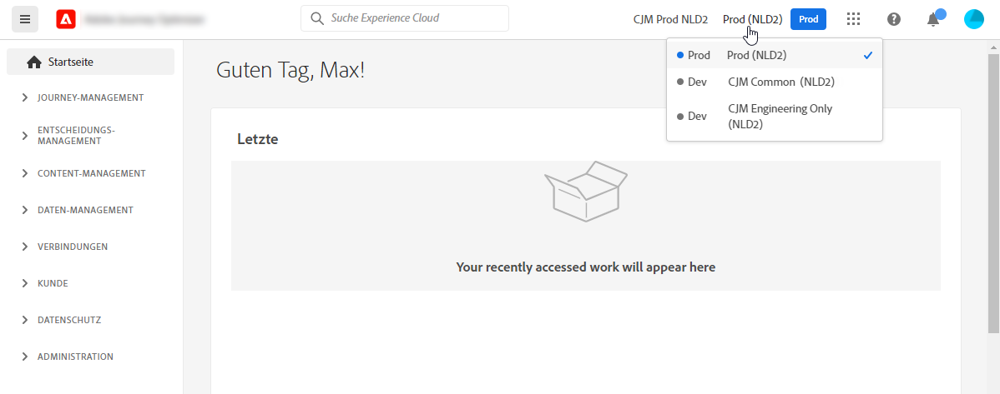
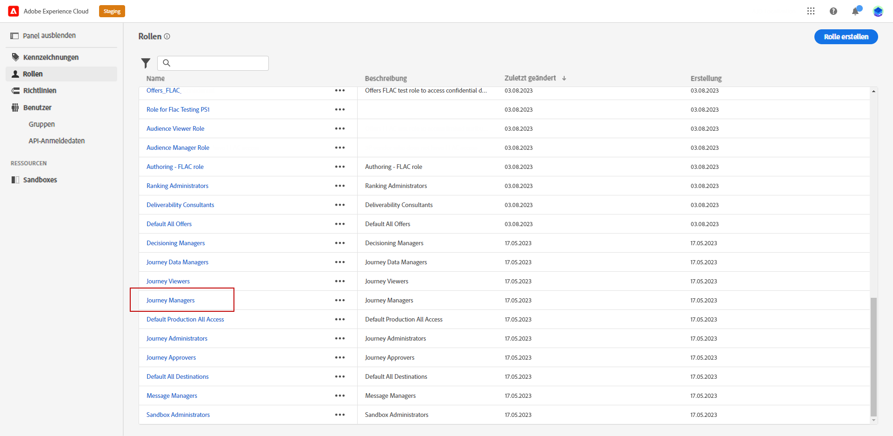
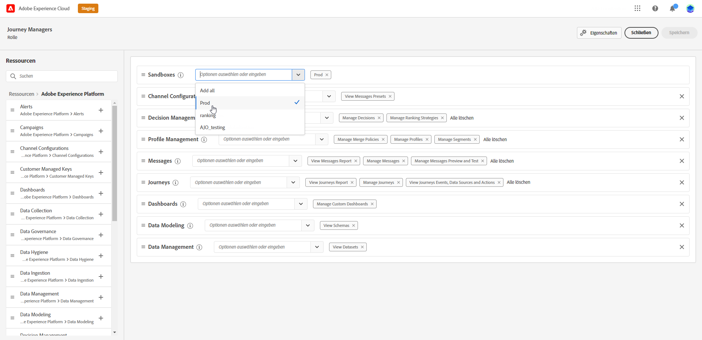

# Sandbox-Verwaltung {#sandboxes}

## Verwenden von Sandboxes {#using-sandbox}

[!DNL Journey Optimizer] ermöglicht es Ihnen, Ihre Instanz in separate virtuelle Umgebungen, so genannte Sandboxes, zu unterteilen.
Sandboxes werden über Rollen in Berechtigungen zugewiesen. [Erfahren Sie, wie Sie Sandboxes zuweisen](permissions.md#create-product-profile).

[!DNL Journey Optimizer] spiegelt die Adobe Experience Platform-Sandboxes wider, die für eine bestimmte Organisation erstellt wurden.
Adobe Experience Platform-Sandboxes können über Ihre Adobe Experience Platform-Instanz erstellt oder zurückgesetzt werden. [Weitere Informationen finden sich im Sandbox-Benutzerhandbuch](https://experienceleague.adobe.com/docs/experience-platform/sandbox/ui/user-guide.html?lang=de){target="_blank"}.

Das Steuerelement „Sandbox-Schalter“ finden Sie oben rechts auf Ihrem Bildschirm neben dem Namen Ihrer Organisation. Um von einer Sandbox zu einer anderen zu wechseln, klicken Sie im Schalter auf die derzeit aktive Sandbox und wählen Sie dann in der Dropdown-Liste eine andere Sandbox aus.

➡️ [Weitere Informationen zu Sandboxes finden Sie in diesem Video](#video)

## Zuweisen von Sandboxes {#assign-sandboxes}

>[!IMPORTANT]
>
> Die Sandbox-Verwaltung kann nur von einem **[!UICONTROL Produkt]**- oder **[!UICONTROL System]**-Administrator durchgeführt werden. Weiterführende Informationen dazu finden sich in der [Dokumentation zur Admin Console](https://helpx.adobe.com/de/enterprise/admin-guide.html/enterprise/using/admin-roles.ug.html){target="_blank"}.

Sie können vordefinierte oder benutzerdefinierte Sandboxes zuweisen **[!UICONTROL Rollen]**.

So weisen Sie Sandboxes zu:

1. In [!DNL Permissions]aus der **[!UICONTROL Rollen]** Registerkarte, wählen Sie eine **[!UICONTROL Rolle]**.

   

1. Klicken Sie auf **[!UICONTROL Bearbeiten]**.

1. Aus dem **[!UICONTROL Sandboxes]** Ressource aus, wählen Sie die Sandbox aus, die Ihrer Rolle zugewiesen wird.

   

1. Klicken Sie bei Bedarf auf das X-Symbol neben dem Entfernen des Sandbox-Zugriffs auf Ihre **[!UICONTROL Rolle]**.

   

1. Klicken Sie auf **[!UICONTROL Speichern]**.

## Zugriff auf Inhalte {#content-access}

Um die Zugänglichkeit Ihrer Inhalte zu konfigurieren, müssen Sie jeder Ihrer Sandboxes einen gemeinsamen Ordner für Inhalte zuweisen. Sie können den gemeinsamen Ordner auf der Registerkarte **[!UICONTROL Datenspeicherung]**, die unter [!DNL Admin Console] für Administratoren angezeigt wird, erstellen und konfigurieren. Wenn Sie als Systemadministrator Zugriff auf [!DNL Admin Console] haben, können Sie gemeinsame Ordner erstellen und Vertreter mit unterschiedlicher Zugriffsebene zu Ihren gemeinsamen Ordnern hinzufügen.

Beachten Sie, dass Sie für die Synchronisierung Ihres Inhalts mit der richtigen Sandbox dieselbe Syntax verwenden müssen wie die Sandbox, z. B. wenn Ihre Sandbox als „Entwicklung“ bezeichnet wird, sollte Ihr gemeinsamer Ordner denselben Namen haben.

[Verwalten gemeinsamer Ordner](https://helpx.adobe.com/de/enterprise/admin-guide.html/enterprise/using/manage-adobe-storage.ug.html){target="_blank"}.

## Anleitungsvideo{#video}

Erfahren Sie, was Sandboxes sind und wie Sie zwischen Entwicklungs- und Produktions-Sandboxes unterscheiden. Erfahren Sie, wie Sie Sandboxes erstellen, zurücksetzen und löschen.

>[!VIDEO](https://video.tv.adobe.com/v/334355?quality=12)
