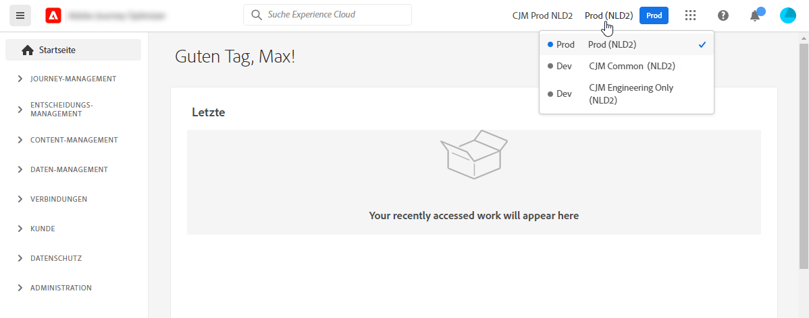
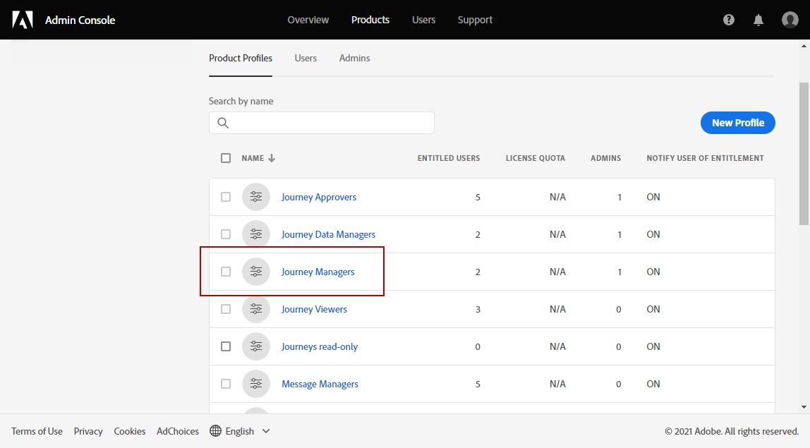
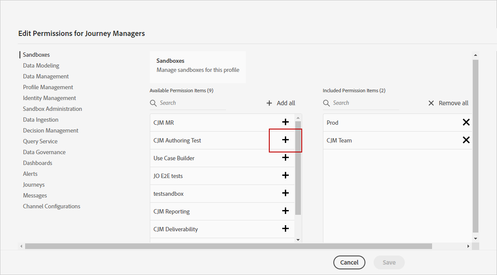
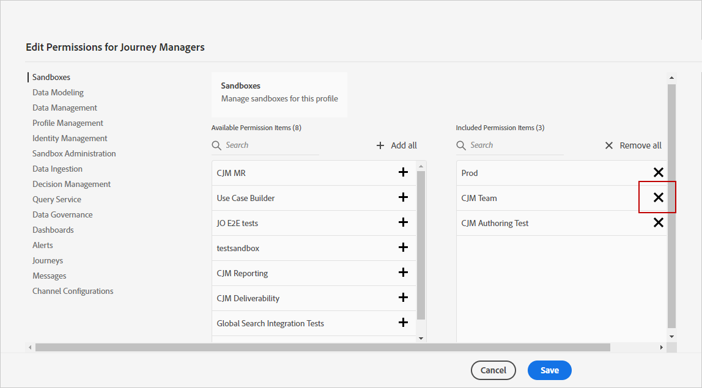
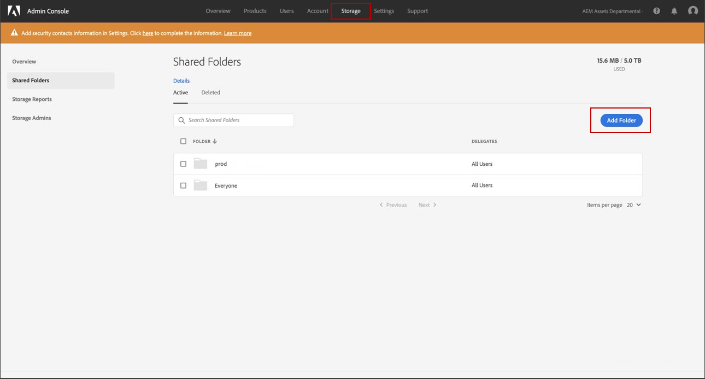

# Verwenden und Zuweisen von Sandboxes {#sandboxes}

>[!BEGINSHADEBOX]

**Auf dieser Seite** Verwenden und weisen Sie Sandboxes zu, um Ihre Adobe Journey Optimizer-Instanz in isolierte Umgebungen zu unterteilen, damit Sie in der Produktion entwickeln, testen und ausführen können, ohne andere Arbeiten zu beeinträchtigen.

>[!ENDSHADEBOX]

**Sandboxes** sind virtuelle Umgebungen, die Ihre Adobe Journey Optimizer-Instanz in separate, isolierte Workspaces für Entwicklung, Tests oder Produktion unterteilen. Die Sandbox-Verwaltung finden Sie unter **Administration** > **Kanäle** > **Verbinden Ihrer Systeme und Umgebungen** (oder über den Sandbox-Umschalter oben rechts in der Benutzeroberfläche). Sandboxes helfen Ihnen, sicher zu experimentieren, unterschiedliche Zugriffsrechte pro Rolle zuzuweisen und Inhalte zu organisieren. Auf dieser Seite wird beschrieben, wie Sie Sandboxes verwenden und zuweisen, den Inhaltszugriff konfigurieren und - im Artikel [Objekte in eine andere Sandbox exportieren](../configuration/copy-objects-to-sandbox.md) wie Sie Journey und Vorlagen zwischen Sandboxes kopieren.

## Verwenden von Sandboxes {#using-sandbox}

[!DNL Journey Optimizer] ermöglicht das Unterteilen von Instanzen in separate virtuelle Umgebungen, sogenannte Sandboxes. Sandboxes werden über Rollen unter „Berechtigungen“ zugewiesen. [Erfahren Sie, wie Sie Sandboxes zuweisen](permissions.md#create-product-profile).

[!DNL Journey Optimizer] spiegelt die Adobe Experience Platform-Sandboxes wider, die für eine bestimmte Organisation erstellt wurden. Adobe Experience Platform-Sandboxes können über Ihre Adobe Experience Platform-Instanz erstellt oder zurückgesetzt werden. [Weitere Informationen finden Sie im Sandbox-Benutzerhandbuch](https://experienceleague.adobe.com/docs/experience-platform/sandbox/ui/user-guide.html?lang=de){target="_blank"}.

Das Steuerelement zum Wechseln zwischen Sandboxes befindet sich oben rechts auf dem Bildschirm neben dem Namen der Organisation. Um von einer Sandbox zu einer anderen zu wechseln, klicken Sie im Schalter auf die derzeit aktive Sandbox und wählen Sie dann in der Dropdown-Liste eine andere Sandbox aus.

➡️ [Weitere Informationen zu Sandboxes sind in diesem Video verfügbar](#video)

## Zuweisen von Sandboxes {#assign-sandboxes}

>[!IMPORTANT]
>
> Die Sandbox-Verwaltung kann nur von **[!UICONTROL Produkt]**- oder **[!UICONTROL System]**-Administrierenden durchgeführt werden.

Sie können vorkonfigurierten oder benutzerdefinierten **[!UICONTROL Rollen]** verschiedene Sandboxes zuweisen.

So weisen Sie Sandboxes zu:

1. Wählen Sie unter [!DNL Permissions] auf der Registerkarte **[!UICONTROL Rollen]** eine **[!UICONTROL Rolle]** aus.

   

1. Klicken Sie auf **[!UICONTROL Bearbeiten]**.

1. Wählen Sie aus dem Ressourcen-Dropdown **[!UICONTROL Sandboxes]** die Sandbox aus, die Ihrer Rolle zugewiesen werden soll.

   

1. Klicken Sie bei Bedarf auf das X-Symbol daneben, um den Sandbox-Zugriff auf Ihre **[!UICONTROL Rolle]** zu entfernen.

   

1. Klicken Sie auf **[!UICONTROL Speichern]**.

## Zugriff auf Inhalte {#content-access}

Um die Barrierefreiheit von Inhalten zu konfigurieren, muss jeder Sandbox ein gemeinsamen Ordner für Inhalte zugewiesen werden. Der gemeinsame Ordner kann auf der Registerkarte **[!UICONTROL Datenspeicherung]**, die unter [!DNL Admin Console] für Administrierende angezeigt wird, erstellt und konfiguriert werden. Wenn Sie als Systemadmin Zugriff auf [!DNL Admin Console] haben, können Sie gemeinsame Ordner erstellen und Delegierte mit unterschiedlichen Zugriffsebenen zu den gemeinsamen Ordnern hinzugefügen.

Für die Synchronisierung des Inhalts mit der richtigen Sandbox muss dieselbe Syntax verwendet werden wie für die Sandbox. Wenn die Sandbox beispielsweise „Entwicklung“ heißt, sollte Ihr gemeinsamer Ordner denselben Namen haben.

[Erfahren Sie, wie Sie gemeinsame Ordner verwalten](https://helpx.adobe.com/de/enterprise/admin-guide.html/enterprise/using/manage-adobe-storage.ug.html){target="_blank"}.

## Anleitungsvideo{#video}

Erfahren Sie, was Sandboxes sind und wie Sie zwischen Entwicklungs- und Produktions-Sandboxes unterscheiden. Erfahren Sie, wie Sie Sandboxes erstellen, zurücksetzen und löschen.

>[!VIDEO](https://video.tv.adobe.com/v/334355?quality=12)

+++ KI-Wissensreferenz

Dieser Abschnitt enthält strukturiertes Wissen zur Unterstützung von Interpretation, Abrufen und Antworten auf Fragen zu diesem Thema.

Zum vollständigen Verständnis sollten diese Informationen mit der Dokumentation auf dieser Seite kombiniert werden. Keine der beiden Quellen ist für Einzelpersonen gedacht. Die Seite beschreibt die Funktion, während dieser Abschnitt zusätzlichen Kontext bietet, der dabei hilft, Begriffe, Absichten, Anwendbarkeit und Begrenzungen zu unterscheiden.

- **TL;DR:** Sandboxes unterteilen Ihre Journey Optimizer-Instanz in isolierte virtuelle Arbeitsbereiche für Entwicklung, Tests und Produktion. Sie werden Benutzenden über Rollen im Produkt „Berechtigungen“ zugewiesen und der Inhaltszugriff wird über freigegebene Ordner in Admin Console konfiguriert.

**intents:**

- Wechseln zwischen Sandboxes in der Journey Optimizer-Benutzeroberfläche mithilfe des Sandbox-Switchers
- Zuweisen von einer oder mehreren Sandboxes zu einer Rolle im Produkt „Berechtigungen“
- Entfernen des Sandbox-Zugriffs aus einer Rolle
- Konfigurieren des Inhaltszugriffs (freigegebene Ordner) für eine Sandbox
- Verstehen, wie Sandboxes mit Rollen und Berechtigungen zusammenhängen

**Glossar:**

- **Sandbox**: Eine virtuelle Umgebung, die die Journey Optimizer-Instanz in separate, isolierte Arbeitsbereiche für Entwicklung, Tests oder Produktionsverwendung unterteilt *(produktspezifisch)*
- **Sandbox-**: Das Steuerelement oben rechts in der Journey Optimizer-Benutzeroberfläche neben dem Organisationsnamen, das zum Wechseln zwischen Sandboxes verwendet wird *(produktspezifisch)*
- **Freigegebener Ordner**: Ein Speicherordner, der in Admin Console für eine Sandbox konfiguriert ist, die den Inhaltszugriff ermöglicht. Der Name muss mit dem Sandbox-Namen übereinstimmen, damit der Inhalt korrekt synchronisiert wird *(produktspezifisch)*

**Leitplanken:**

- Die Sandbox-Verwaltung kann nur von einem Produkt- oder Systemadministrator durchgeführt werden (eine feste Voraussetzung, wie im wichtigen Hinweis auf der Seite angegeben)
- Freigegebene Ordnernamen müssen derselben Syntax folgen wie der Sandbox-Name, damit die Inhalte mit der richtigen Sandbox synchronisiert werden (wie auf der Seite angegeben)

**Terminologie:**

- Verwechseln Sie nicht: „Verwenden einer Sandbox“ (Wechseln dazu über die Benutzeroberfläche mit dem Sandbox-Umschalter) ≠ „Zuweisen einer Sandbox“ (Hinzufügen einer Sandbox zu einer Rolle im Berechtigungsprodukt) ≠ „Erstellen einer Sandbox“ (erfolgt in Adobe Experience Platform, nicht in Journey Optimizer)
- Synonyme: „sandbox“ = „virtuelle Umgebung“ im Kontext dieser Seite
- Verwechseln Sie nicht: „Zuweisen von Sandboxes“ (Hinzufügen von Sandboxes zu einer Rolle in Berechtigungen) ≠ „Verwalten von Sandboxes“ (Erstellen, Zurücksetzen oder Löschen von Sandboxes - erfolgt in Adobe Experience Platform)

**FAQ:**

- **F: Wie kann ich in Journey Optimizer zwischen Sandboxes wechseln?** - Verwenden Sie den Sandbox-Umschalter oben rechts im Bildschirm neben dem Namen Ihrer Organisation. Klicken Sie auf die aktive Sandbox und wählen Sie eine andere Sandbox aus der Dropdown-Liste aus.
- **F: Wer kann Sandboxes Rollen zuweisen?** — Nur Produkt- oder Systemadministratoren.
- **F: Wie werden Sandboxes Benutzern zur Verfügung gestellt?** - Sandboxes werden über Rollen im Produkt „Berechtigungen“ zugewiesen.
- **F: Welche Namenskonvention muss für freigegebene Ordner gelten?** — Der freigegebene Ordner muss denselben Namen wie die Sandbox haben, mit der er verknüpft ist (wenn die Sandbox z. B. „Entwicklung“ heißt, muss der freigegebene Ordner auch „Entwicklung“ genannt werden).

+++
<!-- ai-accordion-version: 1 | source-hash: 0a5ada9b -->