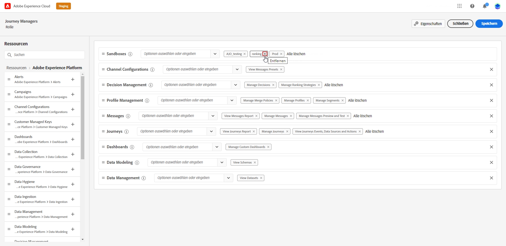

# Sandbox-Verwaltung {#sandboxes}

## Sandboxes verwenden {#using-sandbox}

[!DNL Journey Optimizer] ermöglicht es Ihnen, Ihre Instanz in separate virtuelle Umgebungen, so genannte Sandboxes, zu unterteilen.
Sandboxes werden über Produktprofile in der Admin Console zugewiesen. [Erfahren Sie, wie Sie Sandboxes zuweisen](permissions.md#create-product-profile).

[!DNL Journey Optimizer] spiegelt Adobe Experience Platform-Sandboxes wider, die für eine bestimmte Organisation erstellt wurden.
Adobe Experience Platform-Sandboxes können über Ihre Adobe Experience Platform-Instanz erstellt oder zurückgesetzt werden. [Weitere Informationen finden Sie im Sandbox-Benutzerhandbuch](https://experienceleague.adobe.com/docs/experience-platform/sandbox/ui/user-guide.html){target=&quot;_blank&quot;}.

Das Steuerelement Sandbox-Umschalter finden Sie oben rechts auf Ihrem Bildschirm neben dem Namen Ihres Unternehmens. Um von einer Sandbox zu einer anderen zu wechseln, klicken Sie im Umschalter auf die derzeit aktive Sandbox und wählen Sie in der Dropdownliste eine andere Sandbox aus.

➡️ [Weitere Informationen zu Sandboxes finden Sie in diesem Video](#video)

## Sandboxes zuweisen {#assign-sandboxes}

>[!IMPORTANT]
>
> Die Sandbox-Verwaltung kann nur von einer **[!UICONTROL Product]** oder **[!UICONTROL System]** Administrator. Weitere Informationen hierzu finden Sie im Abschnitt [Dokumentation zur Admin Console](https://helpx.adobe.com/enterprise/admin-guide.html/enterprise/using/admin-roles.ug.html){target=&quot;_blank&quot;}.

Sie können vordefinierte oder benutzerdefinierte Sandboxes zuweisen **[!UICONTROL Product profiles]**.

So weisen Sie Sandboxes zu:

1. Im [!DNL Admin Console]aus der **[!UICONTROL Products]** auswählen, wählen Sie die **[!UICONTROL Adobe Experience Platform Apps]** Produkt.

1. Wählen Sie eine **[!UICONTROL Product profile]**.

   

1. Wählen Sie die **[!UICONTROL Permissions]** Registerkarte.

1. Wählen Sie die **[!UICONTROL Sandboxes]** Funktion.

   

1. under **[!UICONTROL Available Permissions Items]** klicken Sie auf das Pluszeichen (+), um Ihrem Profil Sandboxes zuzuweisen. [Weitere Informationen zu Sandboxes](https://experienceleague.adobe.com/docs/experience-platform/sandbox/home.html){target=&quot;_blank&quot;}.

   

1. Bei Bedarf können Sie unter **[!UICONTROL Included Permission Items]** Klicken Sie auf das X-Symbol neben dem Entfernen des Sandbox-Zugriffs auf Ihre **[!UICONTROL Product profile]**.

   

1. Klicken **[!UICONTROL Save]**.

## Zugriff auf Inhalte {#content-access}

Um die Barrierefreiheit von Inhalten zu konfigurieren, müssen Sie jedem Ihrer Sandboxes einen freigegebenen Inhaltsordner zuweisen. Sie können Ihren freigegebenen Ordner im **[!UICONTROL Storage]** im [!DNL Admin Console] für Administratoren. Wenn Sie Zugriff auf die [!DNL Admin Console] Als Systemadministrator können Sie freigegebene Ordner erstellen und Ihren freigegebenen Ordnern Delegierte mit unterschiedlichem Zugriff hinzufügen.

Beachten Sie, dass Sie für die Synchronisierung Ihres Inhalts mit der richtigen Sandbox dieselbe Syntax verwenden müssen wie die Sandbox. Wenn Ihre Sandbox z. B. Entwicklung heißt, sollte Ihr freigegebener Ordner denselben Namen haben.

[Erfahren Sie, wie Sie freigegebene Ordner verwalten](https://helpx.adobe.com/enterprise/admin-guide.html/enterprise/using/manage-adobe-storage.ug.html){target=&quot;_blank&quot;}.

## Anleitungsvideo{#video}

Erfahren Sie, was Sandboxes sind und wie Sie zwischen Entwicklungs- und Produktions-Sandboxes unterscheiden. Erfahren Sie, wie Sie Sandboxes erstellen, zurücksetzen und löschen.

>[!VIDEO](https://video.tv.adobe.com/v/334355?quality=12)
