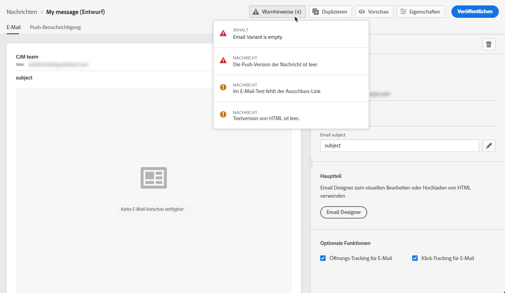

# Warnhinweise für Ihre Nachrichten {#publish-manage-messages}

## Prüfungen vor der Veröffentlichung {#message-alerting}

Während Sie Ihre Nachricht erstellen, werden Sie durch Warnhinweise informiert, wenn Sie wichtige Aktionen ausführen müssen, bevor Sie die Nachricht veröffentlichen.

Warnhinweise werden oben rechts im Bildschirm angezeigt, wie unten dargestellt:

>[!NOTE]
>
>Wenn dieser Button nicht angezeigt wird, wurde kein Warnhinweis erkannt.

Es können zwei Arten von Warnhinweisen auftreten:

* **Warnhinweise** geben auf Empfehlungen und zeigen Best Practices. Wenn beispielsweise der Ausschluss-Link fehlt, wird eine Meldung angezeigt.

* **Fehler** verhindern, dass Sie die Nachricht veröffentlichen, solange sie nicht behoben sind. Beispielsweise wird eine Meldung angezeigt, dass die Betreffzeile fehlt.

Alle möglichen Warnhinweise und Fehler sind [unten](#alerts-and-warnings) genauer beschrieben.

>[!CAUTION]
>
> Sie müssen alle **Fehler**-Warnungen vor der Veröffentlichung auflösen.

## Liste von Warnhinweisen und Fehlern {#alerts-and-warnings}

Die vom System geprüften Einstellungen und Elemente sind unten aufgeführt. Sie finden hier auch Informationen zur Anpassung Ihrer Konfiguration, um die entsprechenden Probleme zu lösen.

**Warnungen**:

* **[!UICONTROL Ausschluss-Link nicht im E-Mail-Text vorhanden]**: Es empfiehlt sich, einen Link zur Abmeldung in Ihren E-Mail-Textkörper einzufügen. In [diesem Abschnitt](consent.md) erfahren Sie, wie Sie das konfigurieren.

* **[!UICONTROL Textversion von HTML ist leer]**: Vergessen Sie nicht, eine Textversion Ihres E-Mail-Textkörpers zu definieren, da diese verwendet wird, wenn HTML-Inhalte nicht angezeigt werden können. In [diesem Abschnitt](create-email-content.md#generate-text-version) erfahren Sie, wie Sie die Textversion erstellen.

* **[!UICONTROL Leerer Link ist im E-Mail-Text vorhanden]**: Überprüfen Sie, ob alle Links in Ihrer E-Mail korrekt sind. In [diesem Abschnitt](create-email-content.md) erfahren Sie, wie Sie Inhalte und Links verwalten.

* **[!UICONTROL Die E-Mail-Größe überschreitet den Grenzwert von 100 KB]**: Stellen Sie sicher, dass die Größe Ihrer E-Mail 100 KB nicht überschreitet, um einen optimalen Versand zu erzielen. In [diesem Abschnitt](create-email-content.md) erfahren Sie, wie Sie E-Mail-Inhalte bearbeiten.

**Fehler**:

* **[!UICONTROL Betreffzeile nicht vorhanden]**: Betreffzeile der E-Mail ist obligatorisch. In [diesem Abschnitt ](create-email.md) erfahren Sie, wie Sie sie definieren und personalisieren.

   <!--HTML is empty when Amp HTML is present-->

* **[!UICONTROL Push-Benachrichtigungs-Variante ist leer]**: Dieser Fehler wird angezeigt, wenn der Text oder Titel der Push-Benachrichtigung fehlt. In [diesem Abschnitt](create-push.md) erfahren Sie, wie Sie Push-Benachrichtigungs-Inhalte definieren.

* **[!UICONTROL E-Mail-Variante ist leer]**: dieser Fehler wird angezeigt, wenn der E-Mail-Inhalt nicht konfiguriert wurde. In [diesem Abschnitt](design-emails.md) erfahren Sie, wie Sie E-Mail-Inhalte entwerfen.

* **[!UICONTROL Voreinstellung ist nicht vorhanden]**: Sie können Ihre Nachricht nicht veröffentlichen, wenn die gewählte Voreinstellung nach der Erstellung der Nachricht gelöscht wird. Wenn dieser Fehler auftritt, wählen Sie in den Nachrichten-**[!UICONTROL Eigenschaften]** eine andere Voreinstellung aus. Weitere Informationen zum Branding finden Sie in [diesem Abschnitt](configuration/about-subdomain-delegation.md).

* **[!UICONTROL Die Payload für Push-Benachrichtigungen an iOS-/Android überschreitet die Beschränkung von 4 KB]**: Die Größe der Push-Benachrichtigung darf 4 KB nicht überschreiten. Um diese Grenze zu beachten, versuchen Sie, die Verwendung von Bildern oder Emojis zu reduzieren. In [diesem Abschnitt](create-push.md) erfahren Sie, wie Sie Ihre Push-Benachrichtigungsinhalte verwalten.

>[!CAUTION]
>
> Um Ihre Nachricht veröffentlichen zu können, müssen Sie alle **Fehler**-Warnungen auflösen.

<!--Other issues can stop publication such as:
* The push notification title is empty-->
