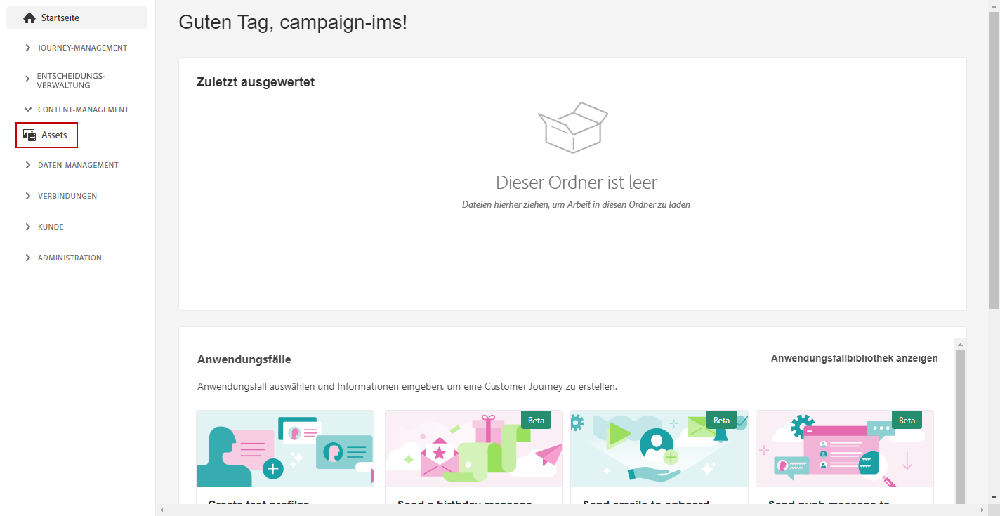
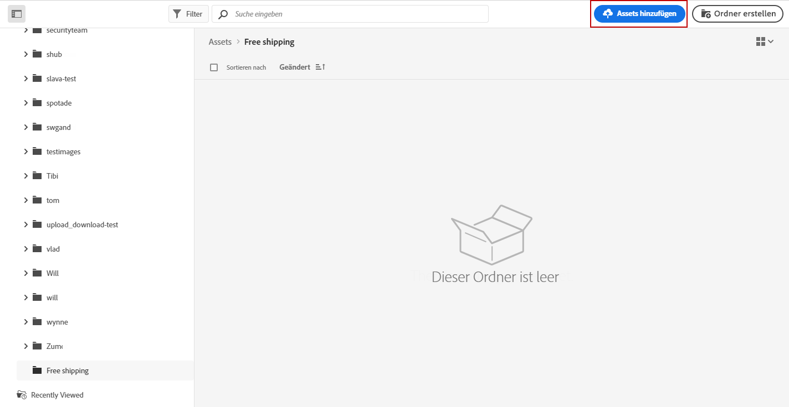
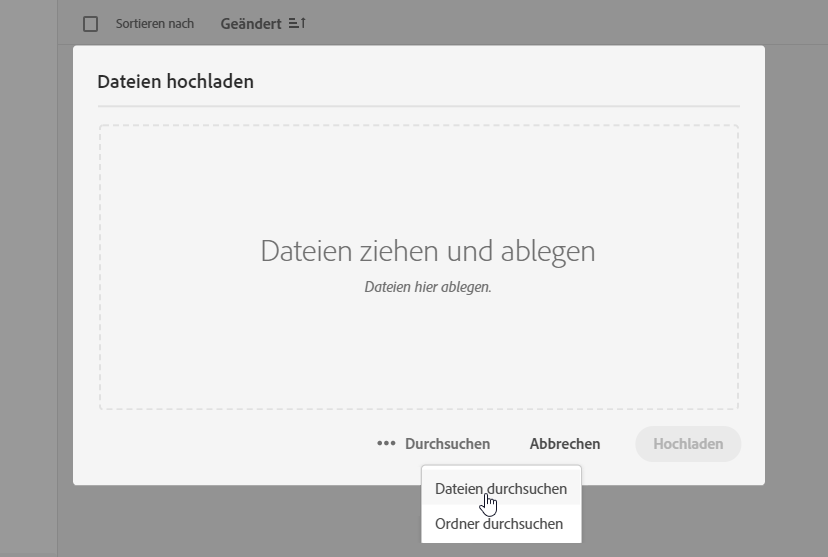
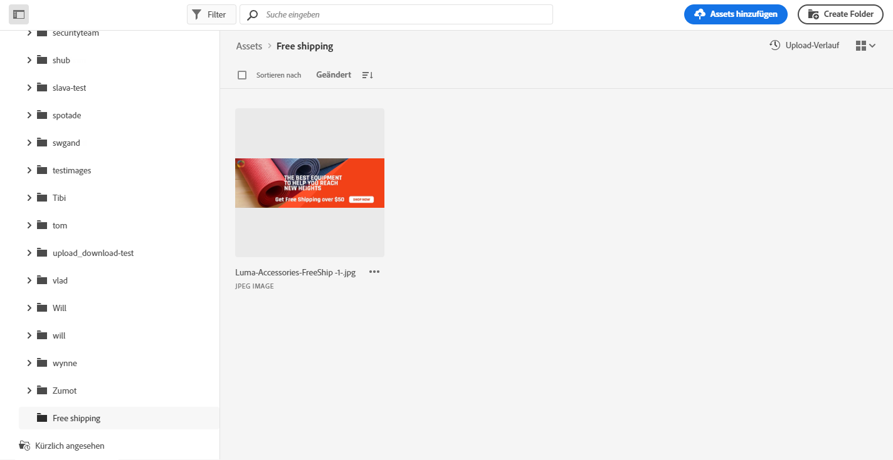
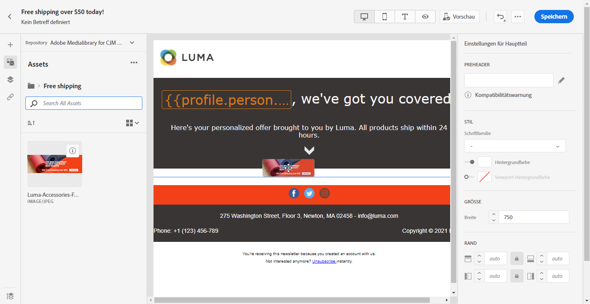
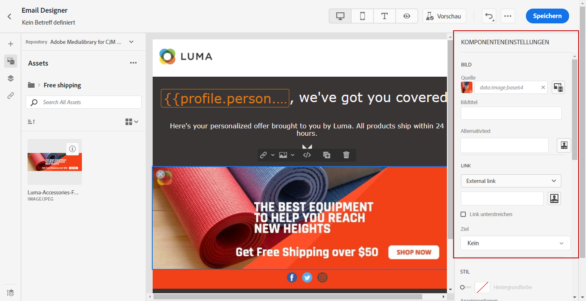

# Verwenden Sie [!DNL Adobe Experience Manager Assets Essentials] {#experience-manager-assets}

## Erste Schritte mit [!DNL Assets Essentials] {#get-started-assets-essentials}

>[!NOTE]
>
> Um mit [!DNL Adobe Experience Manager Assets Essentials] zu arbeiten, müssen Sie [!DNL Assets Essentials] für Ihr Unternehmen bereitstellen und sicherstellen, dass Benutzer, die Zugriff auf [!DNL Assets Essentials] benötigen, Teil der Produktprofile **Assets Essentials Consumer Users** bzw. **Assets Essentials Users** sind.   Weiterführende Informationen dazu finden Sie auf dieser [Seite](https://experienceleague.adobe.com/docs/experience-manager-assets-essentials/help/deploy-administer.html).

[!DNL Adobe Experience Manager Assets Essentials] bietet ein zentralisiertes Asset-Repository, mit dem Sie Ihre Nachrichten ausfüllen können. Sie können direkt von [!DNL Adobe Journey Optimizer] über den Abschnitt **[!UICONTROL Assets]** darauf zugreifen. Sie können beim Entwerfen eines E-Mail-Inhalts auch auf Assets und Ordner zugreifen. [Erfahren Sie mehr über das E-Mail-Design](design-emails.md).

Weitere Informationen zu [!DNL Assets Essentials] finden Sie in der [Adobe Experience Manager Assets Essentials-Dokumentation](https://experienceleague.adobe.com/docs/experience-manager-assets-essentials/help/introduction.html).

## Hochladen und Einfügen von Assets{#add-asset}

Um Dateien in [!DNL Assets Essentials] hochzuladen, müssen Sie zunächst den Ordner durchsuchen oder erstellen, in dem sie gespeichert werden. Sie können sie dann in Ihren E-Mail-Inhalt einfügen.

Weitere Informationen zum Hochladen von Assets finden Sie in der [Adobe Experience Manager Assets Essentials-Dokumentation](https://experienceleague.adobe.com/docs/experience-manager-assets-essentials/help/add-delete.html).

1. Wählen Sie auf der Startseite [!DNL Adobe Journey Optimizer] die Registerkarte **[!UICONTROL Assets]** unter dem Menü **[!UICONTROL Content Management]** aus, um auf [!DNL Assets Essentials] zuzugreifen.

   

1. Doppelklicken Sie auf einen Ordner im mittleren Bereich oder in der Baumansicht, um ihn zu öffnen.

   Sie können auch auf **[!UICONTROL Ordner erstellen]** klicken, um einen neuen Ordner zu erstellen.

   

1. Klicken Sie im ausgewählten oder erstellten Ordner auf **[!UICONTROL Assets hinzufügen]** , um ein neues Asset in Ihren Ordner hochzuladen.

   

1. Klicken Sie unter **[!UICONTROL Dateien hochladen]** auf **[!UICONTROL Durchsuchen]** und wählen Sie aus, ob Sie **[!UICONTROL Dateien durchsuchen]** oder **[!UICONTROL Ordner durchsuchen]** möchten.

   

1. Wählen Sie die Datei aus, die Sie hochladen möchten. Klicken Sie abschließend auf **[!UICONTROL Upload]**.

   Weiterführende Informationen zur Verwaltung Ihrer Assets finden Sie auf dieser [Seite](https://experienceleague.adobe.com/docs/experience-manager-assets-essentials/help/manage-organize.html?lang=en).

1. Nach dem Hochladen des Assets können Sie Ihre Assets jetzt über Email Designer in eine Ihrer Nachrichten einfügen.

   Ihr Asset kann auch mit dem Modus **Bearbeiten** von [!DNL Assets Essentials] weiter bearbeitet werden. [Weitere Informationen](https://experienceleague.adobe.com/docs/experience-manager-assets-essentials/help/edit-images.html).

   

1. Wählen Sie unter [!DNL Adobe Journey Optimizer] im linken Bereich des E-Mail-Designers **[!UICONTROL Asset-Auswahl]** aus.

   

1. Wählen Sie den Ordner Assets aus. Sie können auch in der Suchleiste nach Ihrem Asset oder Ordner suchen.

1. Ziehen Sie Ihr Asset in den E-Mail-Inhalt.

   

1. Sie können Ihre Assets weiter anpassen, z. B. indem Sie einen externen Link oder einen Text mit den **[!UICONTROL Komponenteneinstellungen]** hinzufügen. [Weitere Informationen zu Komponenteneinstellungen](content-components.md)

   
