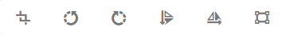

# Verwenden Sie [!DNL Adobe Experience Manager Assets Essentials]  {#experience-manager-assets}

## Erste Schritte mit [!DNL Assets Essentials] {#get-started-assets-essentials}

[!DNL Adobe Experience Manager Assets Essentials] bietet ein zentrales Repository mit Assets, mit dem Sie Ihre Nachrichten füllen können. Sie können direkt von [!DNL Adobe Journey Optimizer] über den Abschnitt **[!UICONTROL Assets]** aufgerufen werden. Sie können beim Entwerfen von E-Mail-Inhalten auch auf Assets und Ordner zugreifen. [Weitere Informationen zum E-Mail-Design](design-emails.md).

Sie benötigen spezielle Berechtigungen, um auf das [!DNL Adobe Experience Manager Assets Essentials] zuzugreifen. [Erfahren Sie mehr über die Berechtigungen für das Adobe Experience Manager Assets Essentials](permissions.md#assets-permissions).

## Hochladen von Assets{#add-asset}

Um Dateien im Ordner [!DNL Assets Essentials] hochzuladen, müssen Sie zunächst den Ordner durchsuchen oder erstellen, in dem sie gespeichert werden:

1. Wählen Sie in der Startseite [!DNL Adobe Journey Optimizer] die Registerkarte **[!UICONTROL Assets]** aus, um auf [!DNL Assets Essentials] zuzugreifen.

   

1. Klicken Sie mit der Dublette auf einen Ordner aus dem zentralen Bereich oder aus der Ansicht, um ihn zu öffnen.

   Sie können auch auf **[!UICONTROL Ordner]** erstellen klicken, um einen neuen Ordner zu erstellen.

   

1. Klicken Sie im ausgewählten oder erstellten Ordner auf **[!UICONTROL Hinzufügen Assets]**, um ein neues Asset in Ihren Ordner hochzuladen.

   

1. Klicken Sie unter **[!UICONTROL Dateien hochladen]** auf **[!UICONTROL Durchsuchen]** und wählen Sie **[!UICONTROL Durchsuchen-Dateien]** oder **[!UICONTROL Durchsuchen-Ordner]**.

   

1. Wählen Sie die Datei aus, die Sie hochladen möchten. Klicken Sie abschließend auf **[!UICONTROL Hochladen]**.

1. Nachdem Sie Ihr Asset hochgeladen haben, können Sie es mit verschiedenen Optionen verwalten, die in diesem [Abschnitt](#manage-asset) beschrieben sind. Ihr Asset kann auch mit dem **Bearbeiten**-Modus von [!DNL Assets Essentials] weiter bearbeitet werden. Weiterführende Informationen hierzu finden Sie auf dieser [Seite](#edit-assets).

   

## Verwalten von Assets{#manage-asset}

Sie können unter [!DNL Adobe Experience Manager Assets Essentials] verfügbare Assets verwalten. Klicken Sie auf das Asset, um weitere Optionen aufzurufen.

Folgende Aktionen sind in der Symbolleiste verfügbar:

* **[!UICONTROL Details]** zum Zugriff auf weitere Details zu Ihren Assets.
* **[!UICONTROL Downloads]** zum Beginn direkt vor Ort.
* **[!UICONTROL Löschen]** des Assets aus  [!DNL Assets Essentials].
* **[!UICONTROL Kopieren Sie]** das Asset in einen anderen Ordner.
* **[!UICONTROL Verschieben Sie]** das Asset in andere Ordner.

## Einfügen von Assets in Nachrichten {#use-assets}

Sie können Assets über den E-Mail-Designer in eine Ihrer Nachrichten einfügen. [Weitere Informationen zum E-Mail-Design](design-emails.md).

So fügen Sie ein Asset aus [!DNL Adobe Experience Manager Assets Essentials] ein:

1. Wählen Sie im E-Mail-Designer **[!UICONTROL Asset-Auswahl]** aus dem linken Bereich.

   

1. Wählen Sie den Asset-Ordner aus. Sie können auch in der Suchleiste nach Ihrem Asset oder Ihrem Ordner suchen.

1. Ziehen Sie das Asset per Drag &amp; Drop in eine **[!UICONTROL Strukturkomponente]**.

   

Sie können Ihre Assets weiter anpassen, beispielsweise einen externen Link oder einen Text mit den **[!UICONTROL Komponenteneinstellungen]** hinzufügen. [Weitere Informationen zu Komponenteneinstellungen](content-components.md)

<!--

## Edit and modify assets {#edit-assets}

Your assets can be edited through the **[!UICONTROL Edit mode]** in [!DNL Assets Essentials]. Through this mode, you can crop, resize and rotate your asset. Click the **[!UICONTROL Edit]** button to access the editing mode of your asset.

Following actions are available in the toolbar:

* **[!UICONTROL Start crop]** to focus on only the content you want in your asset.
* **[!UICONTROL Rotate left]** to rotate your asset counter-clockwise by 90 degrees.
* **[!UICONTROL Rotate right]** to rotate your asset clockwise by 90 degrees.
* **[!UICONTROL Flip vertically]** to vertically mirror your asset.
* **[!UICONTROL Flip horizontally]** to horizontally mirror your asset.
* **[!UICONTROL Launch map]** to insert an image map. For more on this, refer to the [Add image maps](https://experienceleague.adobe.com/docs/experience-manager-65/assets/using/image-maps.html?lang=en#using) documentation.

## Share assets {#share-assets}

When using the Media library, each asset is saved in folders or sub-folders. You can choose to share your folders and which level of access to assign.

For more information on how to share access to your folders, refer to this [page](permissions.md#assets-permissions).

-->
