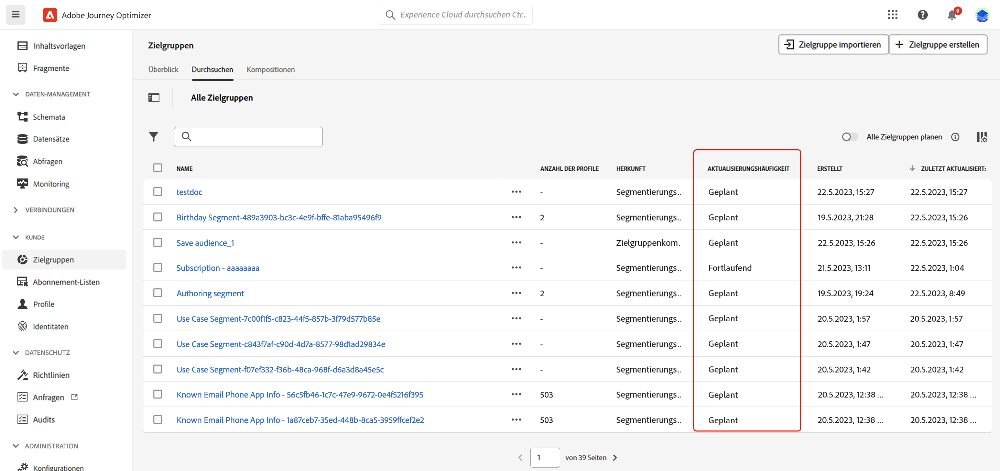

# Erste Schritte mit Adobe Experience Platform-Zielgruppen {#about-segments}

>[!CONTEXTUALHELP]
>id="ajo_campaigns_content_experiment_segment"
>title="Zielgruppe"
>abstract="Mithilfe von Echtzeit-Kundenprofildaten können Sie mit Adobe Experience Platform auf einfache Weise Segmentdefinitionen für genaue Zielgruppen erstellen, die das einzigartige Verhalten und die Vorlieben Ihrer Kundinnen und Kunden erfassen."

Über [!DNL Journey Optimizer] können Sie Adobe Experience Platform-Zielgruppen mithilfe von Echtzeit-Kundenprofildaten direkt im Menü **[!UICONTROL Zielgruppen]** erstellen sowie nutzen und diese Zielgruppen in Ihre Journeys oder Kampagnen einbinden.

Weitere Informationen finden Sie in der [Dokumentation zum Segmentierungs-Service in Adobe Experience Platform](https://experienceleague.adobe.com/docs/experience-platform/segmentation/home.html?lang=de).

## Verwenden von Zielgruppen in [!DNL Journey Optimizer] {#segments-in-journey-optimizer}

Sie können Zielgruppen in **[!DNL Journey Optimizer]** auf verschiedene Weise nutzen:

* Wählen Sie eine Zielgruppe für eine **Kampagne** aus, sodass die Nachricht an alle Personen gesendet wird, die zur ausgewählten Zielgruppe gehören. [Erfahren Sie, wie Sie die Zielgruppe einer Kampagne definieren](../campaigns/create-campaign.md#define-the-audience-audience).

* Verwenden Sie die Orchestrierungsaktivität **Zielgruppe lesen** in einer Journey, damit alle Personen der Zielgruppe in die Journey eintreten und die in Ihrer Journey enthaltenen Nachrichten empfangen.

  Angenommen, Sie verfügen über eine Zielgruppe für „Silber-Kundinnen und -Kunden“. Mit dieser Aktivität können Sie dafür sorgen, dass alle Silber-Kundinnen und -Kunden in eine Journey eintreten, und ihnen eine Reihe personalisierter Nachrichten senden. [Erfahren Sie, wie Sie eine Aktivität vom Typ „Zielgruppe lesen“ konfigurieren](../building-journeys/read-audience.md#configuring-segment-trigger-activity).

* Verwenden Sie die Ereignisaktivität **Zielgruppen-Qualifizierung**, um Personen auf der Grundlage von Adobe Experience Platform-Zielgruppeneintritten und -austritten zu veranlassen, in eine Journey einzutreten oder damit fortzufahren.

  So können Sie z. B. alle neuen Silber-Kundinnen und -Kunden in eine Journey eintreten lassen und ihnen Nachrichten senden. Weitere Informationen zum Verwenden dieser Aktivität finden Sie unter [Erfahren Sie, wie Sie eine Zielgruppen-Qualifizierungsaktivität konfigurieren](../building-journeys/audience-qualification-events.md).

* Verwenden Sie die Aktivität **Bedingung** in einer Journey, um Bedingungen zu erstellen, die auf der Zielgruppenzugehörigkeit basieren. [Erfahren Sie, wie Sie Zielgruppen in Bedingungen verwenden](../building-journeys/condition-activity.md#using-a-segment).

## Methoden zur Audience-Auswertung{#evaluation-method-in-journey-optimizer}

In Adobe Journey Optimizer werden Audiences aus Segmentdefinitionen mithilfe einer der folgenden Auswertungsmethoden generiert:

* **Streaming-Segmentierung**: Die Profilliste für die Zielgruppe wird in Echtzeit auf dem neuesten Stand gehalten, während neue Daten in das System fließen.

  Die Streaming-Segmentierung ist ein fortlaufender Datenauswahlprozess, der Ihre Zielgruppen infolge von Benutzeraktivität aktualisiert. Nachdem eine Segmentdefinition erstellt und die daraus resultierende Zielgruppe gespeichert wurde, wird die Segmentdefinition auf Daten angewendet, die in Journey Optimizer eingehen. Das bedeutet, dass Personen bei sich ändernden Profildaten zur Zielgruppe hinzugefügt oder daraus entfernt werden, sodass Ihre Zielgruppe immer relevant ist.

* **Batch-Segmentierung**: Die Profilliste für die Zielgruppe wird alle 24 Stunden ausgewertet.

  Die Batch-Segmentierung ist eine Alternative zur Streaming-Segmentierung, die alle Profildaten gleichzeitig über Segmentdefinitionen verarbeitet. Dadurch wird ein Schnappschuss der Audience erstellt, der gespeichert und zur Verwendung exportiert werden kann. Im Gegensatz zur Streaming-Segmentierung wird die Zielgruppenliste bei der Batch-Segmentierung jedoch nicht kontinuierlich in Echtzeit aktualisiert. Neue Daten, die nach dem Batch-Prozess eingehen, werden erst im nächsten Batch-Prozess in der Zielgruppe angezeigt.

Die Entscheidung zwischen Batch- und Streaming-Segmentierung wird vom System für jede Zielgruppe abhängig von der Komplexität und den Kosten für die Auswertung der Segmentdefinitionsregel getroffen. Sie können die Auswertungsmethode für jede Zielgruppe in der Spalte **[!UICONTROL Auswertungsmethode]** der Zielgruppenliste anzeigen.

>[!NOTE]
>
>Wenn die Variable **[!UICONTROL Auswertungsmethode]** nicht angezeigt wird, müssen Sie sie mithilfe der Konfigurationsschaltfläche oben rechts in der Liste hinzufügen.

Nachdem Sie eine Zielgruppe zum ersten Mal definiert haben, werden Profile zur Zielgruppe hinzugefügt, wenn sie sich dafür qualifizieren.

Das Auffüllen der Audience anhand früherer Daten kann bis zu 24 Stunden dauern. Nachdem die Audience aufgefüllt wurde, wird sie kontinuierlich aktuell gehalten und ist immer für die Zielgruppenbestimmung bereit.
