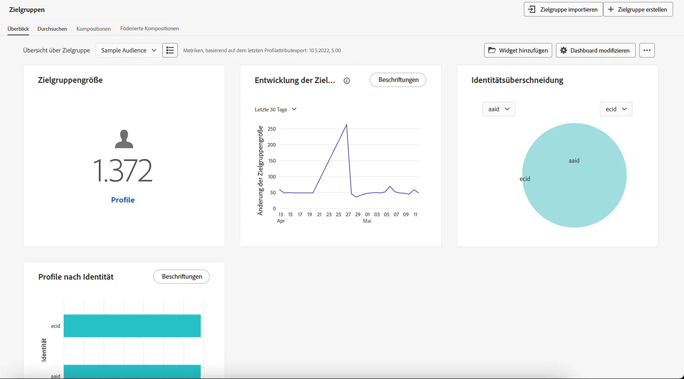

# Erste Schritte mit Zielgruppen {#about-segments}

>[!CONTEXTUALHELP]
>id="ajo_campaigns_content_experiment_segment"
>title="Zielgruppe"
>abstract="Mithilfe von Echtzeit-Kundenprofildaten können Sie mit Adobe Experience Platform auf einfache Weise Segmentdefinitionen für genaue Zielgruppen erstellen, die das einzigartige Verhalten und die Vorlieben Ihrer Kundinnen und Kunden erfassen."

>[!CONTEXTUALHELP]
>id="ajo_campaigns_audience"
>title="Auswählen der Kampagnenzielgruppe"
>abstract="Diese Liste zeigt alle verfügbaren Adobe Experience Platform-Zielgruppen an. Wählen Sie die Zielgruppe aus, die mit Ihrer Kampagne angesprochen werden soll. Die in der Kampagne konfigurierte Nachricht wird an alle Kontakte gesendet, die zur ausgewählten Zielgruppe gehören. [Weitere Informationen zu Zielgruppen](../audience/about-audiences.md)"

Bei einer Zielgruppe handelt es sich um eine Sammlung von Personen, die ähnliche Verhaltensweisen und/oder Merkmale aufweisen. Sie wird mithilfe des Segmentierungs-Services von Adobe Experience Platform zentral in Adobe Experience Platform konfiguriert und gepflegt und steht in Journey Optimizer zur Verfügung, um in Ihren Journeys und Kampagnen aktiviert zu werden.

Adobe Journey Optimizer bietet zuverlässige Tools zum Erstellen, Verwalten und Anreichern von Zielgruppen, um Ihre Marketing-Maßnahmen zu optimieren. In Verbindung mit Adobe Real-Time Customer Data Platform können Sie mit Journey Optimizer Zielgruppen für eine komplexere Segmentierung schichten und Zielgruppen bidirektional für andere Adobe Experience Cloud-Lösungen freigeben.

Beim Hochladen von Echtzeit-Datenströmen oder Batch-Vorgängen werden Datensätze aktualisiert, und Journey Optimizer verschiebt Personen dynamisch in Echtzeit in Zielgruppen und Journeys und wieder aus diesen heraus.

>[!BEGINSHADEBOX]

Diese Dokumentation enthält Informationen zum Arbeiten mit Zielgruppen in [!DNL Adobe Journey Optimizer]. Detaillierte Informationen zum Zielgruppenportal und zu Zielgruppen finden Sie in der Dokumentation zum Segmentierungs-Service in Adobe Experience Platform. Weitere Informationen finden Sie in diesen Abschnitten:

* [Handbuch zur Benutzeroberfläche des Segmentierungs-Service](https://experienceleague.adobe.com/de/docs/experience-platform/segmentation/ui/overview){target="_blank"}

* [Segmentierungs-Service – häufig gestellte Fragen](https://experienceleague.adobe.com/de/docs/experience-platform/segmentation/faq){target="_blank"}

>[!ENDSHADEBOX]

## Durchsuchen von Zielgruppen {#browse}

Sie können auf Zielgruppen über das Menü **[!UICONTROL Kunde]** > **[!UICONTROL Zielgruppen]** zugreifen.

Ein Dashboard zeigt Überschneidungen zwischen wichtigen Zielgruppen visuell an und unterstützt das Untersuchen wertvoller Zielgruppen-Trends. Änderungen der Zielgruppengröße über einen bestimmten Zeitraum oder plötzliche Spitzen bei Zielgruppen können beispielsweise Ereignisse oder Aktionen hervorheben, die zum Schrumpfen einer Zielgruppe geführt haben, aber auch solche, die ein Zielgruppenwachstum nach sich gezogen haben, etwa ein erfolgreiches Angebot.

Im Zielgruppenportal können Sie Zielgruppen mit standardisierten Labels, Governance-Steuerelementen, durchsuchbaren Ordnern und Tags einfach verwalten, suchen und erkunden.

Weitere Informationen zum Arbeiten mit Zielgruppen im Zielgruppenportal sind in der [Dokumentation zum Segmentierungs-Service in Adobe Experience Platform](https://experienceleague.adobe.com/docs/experience-platform/segmentation/home.html){target="_blank"} verfügbar.

## Zielgruppentypen {#types}

Zielgruppen können auf unterschiedliche Weise erstellt werden:

* **Segmentdefinitionen**: Erstellen Sie mithilfe des Adobe Experience Platform Segmentierungsdienstes eine neue Zielgruppendefinition. Zielgruppen werden aus Segmentdefinitionen generiert und je nach Auswertungstyp zu unterschiedlichen Zeiten aktualisiert:

   * Streaming-Segmentierung: Zielgruppen werden in Echtzeit aktualisiert, während neue Daten einfließen, wodurch eine kontinuierliche Relevanz basierend auf der Benutzeraktivität sichergestellt wird.
   * Batch-Segmentierung: Zielgruppen werden alle 24 Stunden aktualisiert und eine Momentaufnahme der Profile in einem festen Intervall erfasst. Bei Verwendung in Journey werden neu qualifizierte Segmentmitglieder möglicherweise erst beim nächsten Schnappschuss angezeigt. [Weitere Informationen zum Timing](../building-journeys/audience-qualification-events.md#timing-segment-membership).
   * Edge-Segmentierung: Zielgruppen werden sofort am Edge ausgewertet, was die Personalisierung in Echtzeit ermöglicht.

  [Weitere Informationen zum Erstellen von Segmentdefinitionen](creating-a-segment-definition.md)

* **Benutzerdefinierter Upload**: Importieren einer Zielgruppe mithilfe einer CSV-Datei. [Weitere Informationen zum Erstellen von Zielgruppen aus benutzerdefinierten Uploads](custom-upload.md)

* **Zielgruppenkomposition**: Erstellen Sie einen Kompositions-Workflow, um vorhandene Zielgruppen in einer visuellen Arbeitsfläche zu kombinieren und Aktionen wie Rang, Aufspaltung oder Zusammenführen anzuwenden, um neue Zielgruppen zu erstellen. [Weitere Informationen zum Arbeiten mit Zielgruppenkomposition](get-started-audience-orchestration.md)

* **Komposition föderierter Zielgruppen**: Führen Sie Datensätze direkt aus Ihrem bestehenden Data Warehouse zusammen, um in Adobe Experience Platform Zielgruppen und Attribute in einem System aufzubauen und anzureichern. [Weitere Informationen zum Arbeiten mit der Komposition föderierter Zielgruppen](federated-audience-composition.md).

## Ansprechen von Zielgruppen in Journeys und Kampagnen {#target-audiences}

Sobald Ihre Zielgruppen bereit sind, können Sie sie beim Erstellen von Journeys oder Kampagnen auswählen, sodass Sie die richtigen Personen zur richtigen Zeit mit relevanten Nachrichten erreichen. [Weitere Informationen zur Zielgruppenaktivierung in Journey Optimizer](target-audiences.md).

## Anleitungsvideo {#video}

Informationen über einheitliche Kundenprofile und Zielgruppen in Journey Optimizer.

>[!VIDEO](https://video.tv.adobe.com/v/3432671?quality=12)
