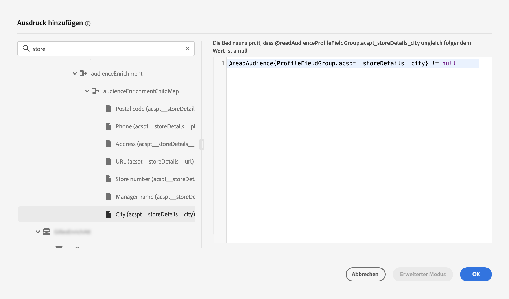

# Erste Schritte mit Adobe Experience Platform-Zielgruppen {#about-segments}

>[!CONTEXTUALHELP]
>id="ajo_campaigns_content_experiment_segment"
>title="Zielgruppe"
>abstract="Mithilfe von Echtzeit-Kundenprofildaten können Sie mit Adobe Experience Platform auf einfache Weise Segmentdefinitionen für genaue Zielgruppen erstellen, die das einzigartige Verhalten und die Vorlieben Ihrer Kundinnen und Kunden erfassen."

>[!CONTEXTUALHELP]
>id="ajo_campaigns_audience"
>title="Auswählen der Kampagnenzielgruppe"
>abstract="Diese Liste zeigt alle verfügbaren Adobe Experience Platform-Zielgruppen an. Wählen Sie die Zielgruppe aus, die mit Ihrer Kampagne angesprochen werden soll. Die in der Kampagne konfigurierte Nachricht wird an alle Kontakte gesendet, die zur ausgewählten Zielgruppe gehören. [Weitere Informationen zu Zielgruppen](../audience/about-audiences.md)"

Eine Zielgruppe ist eine Gruppe von Personen, die ähnliche Verhaltensweisen und/oder Merkmale aufweisen. Weitere Informationen zu Zielgruppen finden Sie in der [Dokumentation zum Segmentierungs-Service von Adobe Experience Platform](https://experienceleague.adobe.com/docs/experience-platform/segmentation/home.html?lang=de){target="_blank"}.

Über [!DNL Journey Optimizer] können Sie Adobe Experience Platform-Zielgruppen direkt im Menü **[!UICONTROL Zielgruppen]** erstellen und diese in Ihren Journeys oder Kampagnen verwenden.

Zielgruppen können auf unterschiedliche Weise erstellt werden:

* **Segmentdefinitionen**: Erstellen Sie mithilfe des Adobe Experience Platform Segmentierungsdienstes eine neue Zielgruppendefinition. [Weitere Informationen zum Erstellen von Segmentdefinitionen](creating-a-segment-definition.md)
* **Benutzerdefinierter Upload**: Import einer Audience mithilfe einer CSV-Datei. In der [Dokumentation zum Segmentierungsdienst](https://experienceleague.adobe.com/docs/experience-platform/segmentation/ui/overview.html?lang=de#import-audience){target="_blank"} erfahren Sie, wie Sie Zielgruppen in Adobe Experience Platform importieren.
* **Zielgruppenkomposition**: Erstellt einen Kompositions-Workflow, der vorhandene Adobe Experience Platform-Zielgruppen in einer visuellen Arbeitsfläche zusammenführt und verschiedene Aktivitäten (Teilen, Ausschließen …) zur Erstellung neuer Zielgruppen ausführt. [Erste Schritte mit der Zielgruppen-Komposition](get-started-audience-orchestration.md)

## Verwenden von Zielgruppen in [!DNL Journey Optimizer] {#segments-in-journey-optimizer}

Sie können in Kampagnen und Journey eine beliebige Zielgruppe auswählen, die mithilfe von Segmentdefinitionen, benutzerdefinierten Upload- oder Komprimierungs-Workflows generiert wurde.

>[!AVAILABILITY]
>
>Die Verwendung von Zielgruppen und Attributen aus der Zielgruppenkomposition und dem benutzerdefinierten Zielgruppen-Upload (CSV-Datei) ist derzeit nicht für Health Care Shield oder Privacy and Security Shield verfügbar. [Erfahren Sie, wie Sie Zielgruppen-Anreicherungsattribute in Journey Optimizer verwenden.](../audience/about-audiences.md#enrichment)

Sie können Zielgruppen in **[!DNL Journey Optimizer]** auf verschiedene Weise nutzen:

* Wählen Sie eine Zielgruppe für eine **Kampagne** aus, sodass die Nachricht an alle Personen gesendet wird, die zur ausgewählten Zielgruppe gehören. [Erfahren Sie, wie Sie die Zielgruppe einer Kampagne definieren](../campaigns/create-campaign.md#define-the-audience-audience).

* Verwenden Sie eine **Audience lesen** Orchestrierungsaktivität in einer Journey, um alle Personen in der Audience dazu zu bringen, in die Journey einzutreten und die in Ihrer Journey enthaltenen Nachrichten zu erhalten. Angenommen, Sie verfügen über eine Zielgruppe für „Silber-Kundinnen und -Kunden“. Mit dieser Aktivität können Sie dafür sorgen, dass alle Silber-Kundinnen und -Kunden in eine Journey eintreten, und ihnen eine Reihe personalisierter Nachrichten senden. [Erfahren Sie, wie Sie eine Aktivität vom Typ „Zielgruppe lesen“ konfigurieren](../building-journeys/read-audience.md#configuring-segment-trigger-activity).

* Verwenden Sie die Aktivität **Bedingung** in einer Journey, um Bedingungen zu erstellen, die auf der Zielgruppenzugehörigkeit basieren. [Erfahren Sie, wie Sie Zielgruppen in Bedingungen verwenden](../building-journeys/condition-activity.md#using-a-segment).

* Verwenden Sie die **Zielgruppenqualifikation** -Ereignisaktivität in einer Journey, um Einzelpersonen dazu zu bringen, je nach Eintritten und Austritten der Adobe Experience Platform-Zielgruppe in die Journey einzutreten oder in der Zukunft fortzufahren. So können Sie z. B. alle neuen Silber-Kundinnen und -Kunden in eine Journey eintreten lassen und ihnen Nachrichten senden. Weitere Informationen zum Verwenden dieser Aktivität finden Sie unter [Erfahren Sie, wie Sie eine Zielgruppen-Qualifizierungsaktivität konfigurieren](../building-journeys/audience-qualification-events.md).

  >[!NOTE]
  >
  >Aufgrund der Batch-Natur von Zielgruppen, die mithilfe von Kompositionsarbeitsabläufen und benutzerdefiniertem Upload erstellt wurden, können Sie diese Zielgruppen nicht in einer Aktivität &quot;Zielgruppenqualifikation&quot;auswählen. In dieser Aktivität können nur Zielgruppen genutzt werden, die mithilfe von Segmentdefinitionen erstellt wurden.

## Zielgruppen-Anreicherungsattribute verwenden {#enrichment}

Beim Targeting einer Zielgruppe, die mithilfe von Kompositions-Workflows generiert wurde, können Sie Anreicherungsattribute von diesen Zielgruppen nutzen, um Ihre Journey zu erstellen und Ihre Nachrichten zu personalisieren.

Um Anreicherungsattribute in einer Journey zu verwenden, stellen Sie sicher, dass sie in der ExperiencePlatform-Datenquelle zu einer Feldergruppe hinzugefügt werden.

+++ Erfahren Sie, wie Sie einer Feldergruppe Anreicherungsattribute hinzufügen.

1. Navigieren Sie zu &quot;Administration&quot;> &quot;Konfiguration&quot;> &quot;Data Sources&quot;.
1. Wählen Sie &quot;Experience Platform&quot;aus und erstellen oder bearbeiten Sie eine Feldergruppe.
1. Öffnen Sie die Feldauswahl, suchen Sie die Anreicherungsattribute, die Sie hinzufügen möchten, und aktivieren Sie das Kontrollkästchen neben ihnen.
1. Speichern Sie Ihre Änderungen.

Detaillierte Informationen zu Datenquellen finden Sie in den folgenden Abschnitten:

* [Arbeiten mit der Adobe Experience Platform-Datenquelle](../datasource/adobe-experience-platform-data-source.md)
* [Konfigurieren einer Datenquelle](../datasource/configure-data-sources.md)

+++

Nachdem einer Feldergruppe Anreicherungsattribute hinzugefügt wurden, können Sie sie an verschiedenen Stellen in Journey Optimizer nutzen:

* **Erstellen mehrerer Pfade in einer Journey** basierend auf Regeln, die die Anreicherungsattribute der Zielgruppe nutzen. Sprechen Sie dazu die Zielgruppe mithilfe einer Aktivität [Zielgruppe lesen](../building-journeys/read-audience.md) an und erstellen Sie dann Regeln in einer Aktivität [Bedingung](../building-journeys/condition-activity.md), die auf den Anreicherungsattributen der Zielgruppe basiert.

  {width="70%" zoomable="yes"}

* **Nachrichten personalisieren** in Journey oder Kampagnen durch Hinzufügen von Anreicherungsattributen aus der Zielgruppe im Ausdruckseditor. [Erfahren Sie, wie Sie mit dem Ausdruckseditor arbeiten.](../personalization/personalization-build-expressions.md)

  {width="70%" zoomable="yes"}

>[!AVAILABILITY]
>
>Benutzerdefinierte Upload-Anreicherungsattribute sind noch nicht zur Verwendung in Journey Optimizer verfügbar.

## Methoden zur Zielgruppenauswertung {#evaluation-method-in-journey-optimizer}

In Adobe Journey Optimizer werden Zielgruppen aus Segmentdefinitionen mithilfe einer der folgenden Auswertungsmethoden generiert.

+++ Streaming-Segmentierung 

Die Profilliste für die Zielgruppe wird in Echtzeit auf dem neuesten Stand gehalten, während neue Daten in das System fließen.

Die Streaming-Segmentierung ist ein fortlaufender Datenauswahlprozess, der Ihre Zielgruppen infolge von Benutzeraktivität aktualisiert. Nachdem eine Segmentdefinition erstellt und die daraus resultierende Zielgruppe gespeichert wurde, wird die Segmentdefinition auf Daten angewendet, die in Journey Optimizer eingehen. Das bedeutet, dass bei sich ändernden Profildaten Personen zur Zielgruppe hinzugefügt oder daraus entfernt werden, sodass Ihre Zielgruppe immer relevant ist. [Weitere Informationen](https://experienceleague.adobe.com/docs/experience-platform/segmentation/ui/streaming-segmentation.html?lang=de){target="_blank"}

>[!NOTE]
>
>Achten Sie darauf, dass Sie die richtigen Ereignisse als Kriterien für die Streaming-Segmentierung verwenden. [Weitere Informationen](#streaming-segmentation-events-guardrails)

+++

+++ Batch-Segmentierung

Die Profilliste für die Zielgruppe wird alle 24 Stunden ausgewertet.

Die Batch-Segmentierung ist eine Alternative zur Streaming-Segmentierung, die alle Profildaten gleichzeitig über Segmentdefinitionen verarbeitet. Dadurch wird ein Schnappschuss der Zielgruppe erstellt, der gespeichert und zur Verwendung exportiert werden kann. Im Gegensatz zur Streaming-Segmentierung wird die Zielgruppenliste bei der Batch-Segmentierung jedoch nicht kontinuierlich in Echtzeit aktualisiert. Neue Daten, die nach dem Batch-Prozess eingehen, werden erst im nächsten Batch-Prozess in der Zielgruppe angezeigt. [Weitere Informationen](https://experienceleague.adobe.com/docs/experience-platform/segmentation/home.html?lang=de#batch){target="_blank"}

+++

+++ Edge-Segmentierung

Edge-Segmentierung ist die Möglichkeit, Segmente in Adobe Experience Platform sofort [am Edge](https://experienceleague.adobe.com/docs/experience-platform/edge/home.html?lang=de) auszuwerten{target="_blank"}, enabling same-page and next-page personalization use cases. Currently only select query types can be evaluated with edge segmentation. [Learn more](https://experienceleague.adobe.com/docs/experience-platform/segmentation/ui/edge-segmentation.html?lang=de#query-types){target="_blank"}

+++

Wenn Sie wissen, welche Auswertungsmethode Sie verwenden möchten, wählen Sie diese in der Dropdown-Liste aus. Sie können auch auf das Ordnersymbol mit dem Vergrößerungsglas klicken, um eine Liste der verfügbaren Auswertungsmethoden für die Segmentdefinition anzuzeigen. [Weitere Informationen](https://experienceleague.adobe.com/docs/experience-platform/segmentation/ui/segment-builder.html?lang=de#segment-properties){target="_blank"}

<!--The determination between batch segmentation and streaming segmentation is made by the system for each audience, based on the complexity and the cost of evaluating the segment definition rule. You can view the evaluation method for each audience in the **[!UICONTROL Evaluation method]** column of the audience list.
    

>[!NOTE]
>
>If the **[!UICONTROL Evaluation method]** column does not display, you  need to add it using configuration button on the top right of the list.-->

Nachdem Sie eine Zielgruppe zum ersten Mal definiert haben, werden Profile zur Zielgruppe hinzugefügt, wenn sie sich dafür qualifizieren.

Das Auffüllen der Zielgruppe anhand früherer Daten kann bis zu 24 Stunden dauern. Nachdem die Audience aufgefüllt wurde, wird sie kontinuierlich aktuell gehalten und ist immer für die Zielgruppenbestimmung bereit.

### Ereignisnutzung mit Streaming-Segmentierung {#streaming-segmentation-events-guardrails}

Die Streaming-Segmentierung ist nützlich für die Echtzeit-Personalisierung bei hochwertigen Anwendungsfällen. Es ist jedoch wichtig, die richtigen [Ereignisse](https://experienceleague.adobe.com/docs/experience-platform/segmentation/ui/segment-builder.html?lang=de#events){target="_blank"} zu wählen, die als Segmentierungskriterien verwendet werden.

Um eine optimale Performance der Streaming-Segmentierung zu erreichen, sollten Sie daher die folgenden Ereignisse nicht verwenden:

* Interaktionsereignis des Typs **Nachricht geöffnet**

  Beim Aufbau Ihrer Zielgruppe ist die Verwendung des Interaktionsereignisses **Nachricht geöffnet** unzuverlässig geworden, da es kein tatsächlicher Indikator für die Nutzeraktivität ist und die Segmentierungs-Performance negativ beeinflussen kann. Hier erfahren Sie, warum [Adobe-Blogpost](https://blog.adobe.com/de/publish/2021/06/24/what-apples-mail-privacy-protection-means-for-email-marketers){target="_blank"}. Adobe empfiehlt daher, die Interaktionsereignisse des Typs **Nachricht geöffnet** nicht für die Streaming-Segmentierung zu verwenden. Verwenden Sie stattdessen echte Nutzeraktivitätssignale wie Klicks, Käufe oder Beacon-Daten.

* Feedback-Status-Ereignis **Nachricht gesendet**

  Das Feedback-Ereignis **Nachricht gesendet** wird häufig zur Überprüfung der Häufigkeit oder Unterdrückung vor dem Versand einer E-Mail verwendet. Adobe empfiehlt, dies zu vermeiden, da dies die Leistung beeinträchtigt und zu einer Verschlechterung des Systems führen kann. Verwenden Sie daher für die Häufigkeits- oder Unterdrückungslogik eher Geschäftsregeln als Feedback-Ereignisse des Typs **Nachricht gesendet**. Beachten Sie, dass bald tägliche Obergrenzen für die Häufigkeit einzelner Profile möglich sein werden, die den bestehenden monatlichen Rhythmus für Geschäftsregeln ergänzen.

>[!NOTE]
>
>Sie können Ereignisse des Typs **Nachricht geöffnet** und **Nachricht gesendet** in der Batch-Segmentierung ohne Performance-Probleme verwenden.

## Häufig gestellte Fragen zur Audience-Komposition und zum benutzerdefinierten Upload {#faq}

Im folgenden Abschnitt finden Sie häufig gestellte Fragen zur Verwendung von Zielgruppen in Journey Optimizer, die mit Kompositions-Workflows und benutzerdefinierten Uploads (CSV-Dateien) erstellt wurden.

+++ Wo kann ich Zielgruppen aus der Zielgruppenzusammensetzung und aus benutzerdefinierten Uploads in Journey Optimizer verwenden?

Zielgruppen aus der Zielgruppenzusammensetzung und dem benutzerdefinierten Upload können entweder über Kampagnen oder Journey als Ziel ausgewählt werden. [Erfahren Sie, wie Sie Zielgruppen in [!DNL Journey Optimizer]](#segments-in-journey-optimizer)

* In **Kampagnen** festgelegt ist, werden diese Zielgruppen in der Zielgruppenauswahl angezeigt, nachdem Sie auf die Schaltfläche &quot;Zielgruppe auswählen&quot;geklickt haben.

* In **Journey** können Sie diese Zielgruppen bei der Zielgruppenauswahl in der Aktivität &quot;Audience lesen&quot;und bei Prüfungen der Zielgruppenzugehörigkeit in der Aktivität &quot;Bedingung&quot;verwenden. Aufgrund ihrer Batch-Natur erscheinen diese Zielgruppen jedoch nicht in der Aktivität &quot;Zielgruppenqualifikation&quot;.

  >[!NOTE]
  >
  >Wenn bei benutzerdefinierten Upload-Zielgruppen &quot;Inkrementelle Lesbarkeit&quot;in einer wiederkehrenden Journey aktiviert ist, werden Profile nur bei der ersten Wiederholung abgerufen, da diese Zielgruppen korrigiert sind.

Darüber hinaus stehen diese Zielgruppen zur Verwendung im Ausdruckseditor zur Verfügung, um Ihre Nachrichten in Journey und Kampagnen zu personalisieren. [Erfahren Sie, wie Sie mit dem Ausdruckseditor arbeiten.](../personalization/personalization-build-expressions.md)

+++

+++ Was sind Anreicherungsattribute?

Anreicherungsattribute sind zusätzliche Attribute, die kontextuell und spezifisch für eine Zielgruppe sind. Sie sind nicht mit dem Profil verknüpft und werden normalerweise zu Personalisierungszwecken verwendet.

Anreicherungsattribute werden über eine [Anreichern](composition-canvas.md#enrich) Aktivität in der Zielgruppenzusammensetzung oder durch den benutzerdefinierten Upload-Prozess.

+++

+++ Wo kann ich Anreicherungsattribute in Journey Optimizer verwenden?

Anreicherungsattribute aus der Zielgruppenkomposition können in den folgenden Bereichen genutzt werden. [Erfahren Sie, wie Sie Zielgruppen-Anreicherungsattribute verwenden](#enrichment)

* Bedingungsaktivität (Journey)
* Benutzerdefinierte Aktionsattribute (Journey)
* Nachrichtenpersonalisierung (Journey und Kampagnen)

>[!AVAILABILITY]
>
>Benutzerdefinierte Upload-Anreicherungsattribute sind noch nicht zur Verwendung in Journey Optimizer verfügbar.

+++

+++ Wie aktiviere ich Anreicherungsattribute in Journey?

Um Anreicherungsattribute in einer Journey zu verwenden, stellen Sie sicher, dass sie in der ExperiencePlatform-Datenquelle zu einer Feldergruppe hinzugefügt werden. Informationen zum Hinzufügen von Anreicherungsattributen zu einer Feldergruppe finden Sie unter [diesem Abschnitt](#enrichment)

+++

+++ Wie bald kann ich eine Zielgruppe nach der Veröffentlichung aus der Zielgruppenzusammensetzung oder dem benutzerdefinierten Upload in Journey Optimizer verwenden?

* Zielgruppen aus **Zielgruppenzusammensetzung** täglich ausgeführt werden, sodass Sie bis zu 24 Stunden warten müssen, um sie in Journey Optimizer zu verwenden.
* Zielgruppen aus **benutzerdefinierter Upload** werden in Journey Optimizer ca. 2 Stunden nach der Veröffentlichung verfügbar.

+++

+++ Werden Anreicherungsattributwerte aktualisiert, nachdem ein Journey gestartet wurde?

Derzeit nicht. Selbst nach Warten- oder Ereignisknoten bleiben die Anreicherungsattributwerte dieselben wie zum Zeitpunkt des Journey.

+++

+++ Wie werden benutzerdefinierte Upload-Zielgruppen mit Profilen verknüpft?

Geben Sie während des benutzerdefinierten Upload-Prozesses das CSV-Attribut an, das als Identität und die Profilidentität verwendet werden soll, der es zugeordnet ist. Dadurch wird eine Verknüpfung zwischen den Zielgruppendaten und dem Profil hergestellt. Wenn die CSV-Datei einen Identitätswert enthält, der nicht im Profil gefunden wird, wird ein neues Profil mit diesem Identitätswert erstellt.

Detaillierte Informationen zum benutzerdefinierten Upload-Prozess finden Sie in Adobe Experience Platform . [Dokumentation zum Segmentierungsdienst](https://experienceleague.adobe.com/docs/experience-platform/segmentation/ui/overview.html?lang=de#import-audience){target="_blank"}.

+++

+++ Wie neu sind meine Daten in Journey Optimizer?

Daten in Zielgruppen aus der Zielgruppenkomposition und dem benutzerdefinierten Upload werden vom Audience Export Service (AES) ausgefüllt. AES liest Profilattribute und Zielgruppenzugehörigkeiten, die für diese Zielgruppen mit den folgenden Zeitleisten verfügbar sind:

* **Zielgruppenzusammensetzung**: Täglicher Export (~24 Stunden)
* **Benutzerdefinierter Upload**: Dedizierter Exportauftrag (~2 Stunden)

Jede Journey, die eine Zielgruppe aus der Zielgruppenzusammensetzung oder aus benutzerdefiniertem Upload in die Aktivität &quot;Zielgruppe lesen&quot;nutzt, verfügt über Profilattribute, die so frisch sind wie die letzte Batch-Auswertung. Dazu gehören Einwilligung/Unterdrückung im Journey.

Darüber hinaus sind angereicherte Attribute in Zielgruppen zur Zielgruppenkomposition so frisch wie die letzte Kompositionsausführung, die in der Vergangenheit bis zu 24 Stunden dauern kann.

+++

