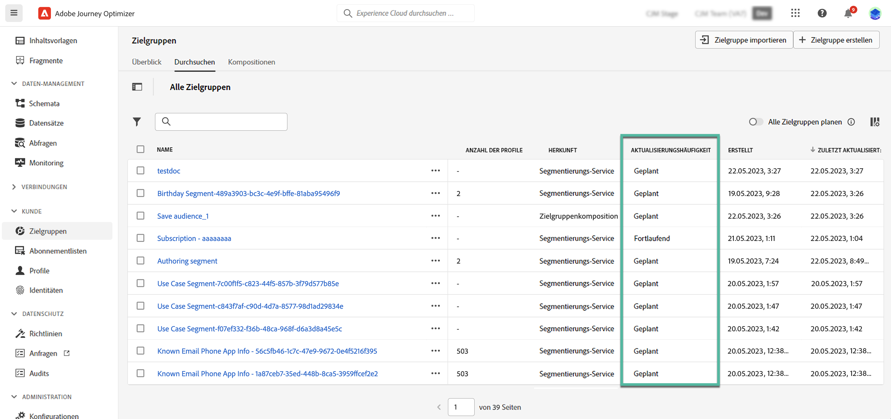

# Erste Schritte mit Adobe Experience Platform-Zielgruppen {#about-segments}

>[!CONTEXTUALHELP]
>id="ajo_campaigns_content_experiment_segment"
>title="Zielgruppe"
>abstract="Mithilfe von Echtzeit-Kundenprofildaten können Sie mit Adobe Experience Platform auf einfache Weise Segmentdefinitionen für genaue Zielgruppen erstellen, die das einzigartige Verhalten und die Vorlieben Ihrer Kundinnen und Kunden erfassen."

>[!CONTEXTUALHELP]
>id="ajo_campaigns_audience"
>title="Auswählen der Kampagnenzielgruppe"
>abstract="Diese Liste zeigt alle verfügbaren Adobe Experience Platform-Zielgruppen an. Wählen Sie die Zielgruppe aus, die mit Ihrer Kampagne angesprochen werden soll. Die in der Kampagne konfigurierte Nachricht wird an alle Kontakte gesendet, die zur ausgewählten Zielgruppe gehören. [Weitere Informationen zu Zielgruppen](../audience/about-audiences.md)"

Eine Zielgruppe ist eine Gruppe von Personen, die ähnliche Verhaltensweisen und/oder Merkmale aufweisen. Weitere Informationen zu Zielgruppen finden Sie in der [Dokumentation zum Segmentierungs-Service von Adobe Experience Platform](https://experienceleague.adobe.com/docs/experience-platform/segmentation/home.html?lang=de){target="_blank"}.

Über [!DNL Journey Optimizer] können Sie Adobe Experience Platform-Zielgruppen direkt im Menü **[!UICONTROL Zielgruppen]** erstellen und diese in Ihren Journeys oder Kampagnen verwenden.

Zielgruppen können auf unterschiedliche Weise erstellt werden:

* **Segmentdefinitionen**: Erstellen Sie eine neue Zielgruppendefinition mithilfe des Adobe Experience Platform Segmentation Service. [Weitere Informationen zum Erstellen von Segmentdefinitionen](creating-a-segment-definition.md)
* **CSV-Dateiimport**: Import einer Audience mithilfe einer CSV-Datei. Erfahren Sie, wie Sie Zielgruppen in Adobe Experience Platform importieren [Dokumentation zum Segmentierungsdienst](https://experienceleague.adobe.com/docs/experience-platform/segmentation/ui/overview.html?lang=de#import-audience){target="_blank"}.
* **Zielgruppenzusammensetzung**: Erstellen Sie einen Arbeitsablauf für die Komposition, um bestehende Adobe Experience Platform-Zielgruppen in einer visuellen Arbeitsfläche zu kombinieren und verschiedene Aktivitäten (Aufspaltung, Ausschluss..) zu nutzen, um neue Zielgruppen zu erstellen. [Erste Schritte mit der Zielgruppen-Komposition](get-started-audience-orchestration.md)

## Zielgruppen in [!DNL Journey Optimizer] {#segments-in-journey-optimizer}

Sie können in Kampagnen und Journeys eine beliebige Adobe Experience Platform-Zielgruppe auswählen, die mit [Segmentdefinitionen](../audience/creating-a-segment-definition.md) generiert wurde.

>[!NOTE]
>
>Derzeit resultieren Zielgruppen aus [Zielgruppenkompositionen](../audience/get-started-audience-orchestration.md) kann nur in Kampagnen als Ziel ausgewählt werden. Diese Funktion ist als private Beta-Version für Journey verfügbar.
>
>Verwendung von Zielgruppen [Hochladen aus einer CSV-Datei](https://experienceleague.adobe.com/docs/experience-platform/segmentation/ui/overview.html?lang=de#import-audience){target="_blank"} in Kampagnen und Journey ist derzeit als private Beta-Version verfügbar.
>
>Weitere Informationen erhalten Sie beim Adobe-Support.

Sie können Zielgruppen in **[!DNL Journey Optimizer]** auf verschiedene Weise nutzen:

* Wählen Sie eine Zielgruppe für eine **Kampagne** aus, sodass die Nachricht an alle Personen gesendet wird, die zur ausgewählten Zielgruppe gehören. [Erfahren Sie, wie Sie die Zielgruppe einer Kampagne definieren](../campaigns/create-campaign.md#define-the-audience-audience).

* Verwenden Sie die Orchestrierungsaktivität **Zielgruppe lesen** in einer Journey, damit alle Personen der Zielgruppe in die Journey eintreten und die in Ihrer Journey enthaltenen Nachrichten empfangen.

  Angenommen, Sie verfügen über eine Zielgruppe für „Silber-Kundinnen und -Kunden“. Mit dieser Aktivität können Sie dafür sorgen, dass alle Silber-Kundinnen und -Kunden in eine Journey eintreten, und ihnen eine Reihe personalisierter Nachrichten senden. [Erfahren Sie, wie Sie eine Aktivität vom Typ „Zielgruppe lesen“ konfigurieren](../building-journeys/read-audience.md#configuring-segment-trigger-activity).

* Verwenden Sie die Ereignisaktivität **Zielgruppen-Qualifizierung**, um Personen auf der Grundlage von Adobe Experience Platform-Zielgruppeneintritten und -austritten zu veranlassen, in eine Journey einzutreten oder damit fortzufahren.

  So können Sie z. B. alle neuen Silber-Kundinnen und -Kunden in eine Journey eintreten lassen und ihnen Nachrichten senden. Weitere Informationen zum Verwenden dieser Aktivität finden Sie unter [Erfahren Sie, wie Sie eine Zielgruppen-Qualifizierungsaktivität konfigurieren](../building-journeys/audience-qualification-events.md).

* Verwenden Sie die Aktivität **Bedingung** in einer Journey, um Bedingungen zu erstellen, die auf der Zielgruppenzugehörigkeit basieren. [Erfahren Sie, wie Sie Zielgruppen in Bedingungen verwenden](../building-journeys/condition-activity.md#using-a-segment).

## Methoden zur Zielgruppenauswertung {#evaluation-method-in-journey-optimizer}

In Adobe Journey Optimizer werden Zielgruppen aus Segmentdefinitionen mithilfe einer der folgenden Auswertungsmethoden generiert.

+++ Streaming-Segmentierung 

Die Profilliste für die Zielgruppe wird in Echtzeit auf dem neuesten Stand gehalten, während neue Daten in das System fließen.

Die Streaming-Segmentierung ist ein fortlaufender Datenauswahlprozess, der Ihre Zielgruppen infolge von Benutzeraktivität aktualisiert. Nachdem eine Segmentdefinition erstellt und die daraus resultierende Zielgruppe gespeichert wurde, wird die Segmentdefinition auf Daten angewendet, die in Journey Optimizer eingehen. Das bedeutet, dass bei sich ändernden Profildaten Personen zur Zielgruppe hinzugefügt oder daraus entfernt werden, sodass Ihre Zielgruppe immer relevant ist. [Weitere Informationen](https://experienceleague.adobe.com/docs/experience-platform/segmentation/ui/streaming-segmentation.html?lang=de){target="_blank"}

>[!NOTE]
>
>Achten Sie darauf, dass Sie die richtigen Ereignisse als Kriterien für die Streaming-Segmentierung verwenden. [Weitere Informationen](#streaming-segmentation-events-guardrails)

+++

+++ Batch-Segmentierung

Die Profilliste für die Zielgruppe wird alle 24 Stunden ausgewertet.

Die Batch-Segmentierung ist eine Alternative zur Streaming-Segmentierung, die alle Profildaten gleichzeitig über Segmentdefinitionen verarbeitet. Dadurch wird ein Schnappschuss der Zielgruppe erstellt, der gespeichert und zur Verwendung exportiert werden kann. Im Gegensatz zur Streaming-Segmentierung wird die Zielgruppenliste bei der Batch-Segmentierung jedoch nicht kontinuierlich in Echtzeit aktualisiert. Neue Daten, die nach dem Batch-Prozess eingehen, werden erst im nächsten Batch-Prozess in der Zielgruppe angezeigt. [Weitere Informationen](https://experienceleague.adobe.com/docs/experience-platform/segmentation/home.html?lang=de#batch){target="_blank"}

+++

+++ Edge-Segmentierung

Edge-Segmentierung ist die Möglichkeit, Segmente in Adobe Experience Platform sofort [am Edge](https://experienceleague.adobe.com/docs/experience-platform/edge/home.html?lang=de) auszuwerten{target="_blank"}, enabling same-page and next-page personalization use cases. Currently only select query types can be evaluated with edge segmentation. [Learn more](https://experienceleague.adobe.com/docs/experience-platform/segmentation/ui/edge-segmentation.html?lang=de#query-types){target="_blank"}

+++

Wenn Sie wissen, welche Auswertungsmethode Sie verwenden möchten, wählen Sie diese in der Dropdown-Liste aus. Sie können auch auf das Ordnersymbol mit dem Vergrößerungsglas klicken, um eine Liste der verfügbaren Auswertungsmethoden für die Segmentdefinition anzuzeigen. [Weitere Informationen](https://experienceleague.adobe.com/docs/experience-platform/segmentation/ui/segment-builder.html?lang=de#segment-properties){target="_blank"}

<!--The determination between batch segmentation and streaming segmentation is made by the system for each audience, based on the complexity and the cost of evaluating the segment definition rule. You can view the evaluation method for each audience in the **[!UICONTROL Evaluation method]** column of the audience list.
    

>[!NOTE]
>
>If the **[!UICONTROL Evaluation method]** column does not display, you  need to add it using configuration button on the top right of the list.-->

Nachdem Sie eine Zielgruppe zum ersten Mal definiert haben, werden Profile zur Zielgruppe hinzugefügt, wenn sie sich dafür qualifizieren.

Das Auffüllen der Zielgruppe anhand früherer Daten kann bis zu 24 Stunden dauern. Nachdem die Audience aufgefüllt wurde, wird sie kontinuierlich aktuell gehalten und ist immer für die Zielgruppenbestimmung bereit.

### Ereignisnutzung mit Streaming-Segmentierung {#streaming-segmentation-events-guardrails}

Die Streaming-Segmentierung ist nützlich für die Echtzeit-Personalisierung bei hochwertigen Anwendungsfällen. Es ist jedoch wichtig, die richtigen [Ereignisse](https://experienceleague.adobe.com/docs/experience-platform/segmentation/ui/segment-builder.html?lang=de#events){target="_blank"} zu wählen, die als Segmentierungskriterien verwendet werden.

Um eine optimale Leistung der Streaming-Segmentierung zu erreichen, sollten Sie daher die folgenden Ereignisse nicht verwenden:

* Interaktionsereignis des Typs **Nachricht geöffnet**

  Beim Aufbau Ihrer Zielgruppe ist die Verwendung des Interaktionsereignisses **Nachricht geöffnet** unzuverlässig geworden, da es kein tatsächlicher Indikator für die Nutzeraktivität ist und die Segmentierungsleistung negativ beeinflussen kann. Erfahren Sie in diesem [Blog-Beitrag von Adobe](https://blog.adobe.com/de/publish/2021/06/24/what-apples-mail-privacy-protection-means-for-email-marketers), warum dies so ist{target="_blank"}.

  Adobe empfiehlt daher, die Interaktionsereignisse des Typs **Nachricht geöffnet** nicht für die Streaming-Segmentierung zu verwenden. Verwenden Sie stattdessen echte Nutzeraktivitätssignale wie Klicks, Käufe oder Beacon-Daten.

* Feedback-Status-Ereignis **Nachricht gesendet**

  Das Feedback-Ereignis **Nachricht gesendet** wird häufig zur Überprüfung der Häufigkeit oder Unterdrückung vor dem Versand einer E-Mail verwendet. Adobe empfiehlt, dieses zu vermeiden, da es die Leistung belastet und zu einer Beeinträchtigung des Systems führen kann.

  Verwenden Sie daher für die Häufigkeits- oder Unterdrückungslogik eher Geschäftsregeln als Feedback-Ereignisse des Typs **Nachricht gesendet**. Beachten Sie, dass bald tägliche Obergrenzen für die Häufigkeit einzelner Profile möglich sein werden, die den bestehenden monatlichen Rhythmus für Geschäftsregeln ergänzen.

>[!NOTE]
>
>Sie können Ereignisse des Typs **Nachricht geöffnet** und **Nachricht gesendet** in der Batch-Segmentierung ohne Leistungsprobleme verwenden.
