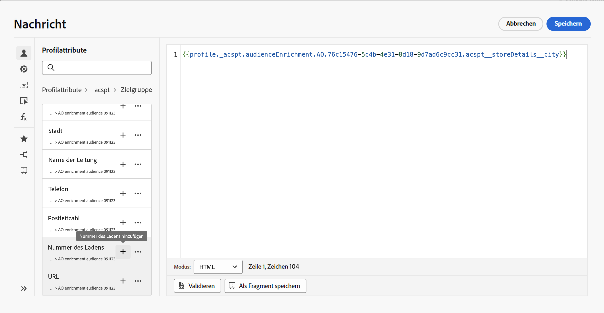

# Erste Schritte mit Adobe Experience Platform-Zielgruppen {#about-segments}

>[!CONTEXTUALHELP]
>id="ajo_campaigns_content_experiment_segment"
>title="Zielgruppe"
>abstract="Mithilfe von Echtzeit-Kundenprofildaten können Sie mit Adobe Experience Platform auf einfache Weise Segmentdefinitionen für genaue Zielgruppen erstellen, die das einzigartige Verhalten und die Vorlieben Ihrer Kundinnen und Kunden erfassen."

>[!CONTEXTUALHELP]
>id="ajo_campaigns_audience"
>title="Auswählen der Kampagnenzielgruppe"
>abstract="Diese Liste zeigt alle verfügbaren Adobe Experience Platform-Zielgruppen an. Wählen Sie die Zielgruppe aus, die mit Ihrer Kampagne angesprochen werden soll. Die in der Kampagne konfigurierte Nachricht wird an alle Kontakte gesendet, die zur ausgewählten Zielgruppe gehören. [Weitere Informationen zu Zielgruppen](../audience/about-audiences.md)"

Eine Zielgruppe ist eine Gruppe von Personen, die ähnliche Verhaltensweisen und/oder Merkmale aufweisen. Weitere Informationen zu Zielgruppen finden Sie in der [Dokumentation zum Segmentierungs-Service von Adobe Experience Platform](https://experienceleague.adobe.com/docs/experience-platform/segmentation/home.html?lang=de){target="_blank"}.

Über [!DNL Journey Optimizer] können Sie Adobe Experience Platform-Zielgruppen direkt im Menü **[!UICONTROL Zielgruppen]** erstellen und diese in Ihren Journeys oder Kampagnen verwenden.

Zielgruppen können auf unterschiedliche Weise erstellt werden:

* **Segmentdefinitionen**: Erstellen Sie mithilfe des Adobe Experience Platform Segmentierungsdienstes eine neue Zielgruppendefinition. [Weitere Informationen zum Erstellen von Segmentdefinitionen](creating-a-segment-definition.md)
* **Benutzerdefinierter Upload**: Importieren einer Zielgruppe mithilfe einer CSV-Datei. In der [Dokumentation zum Segmentierungsdienst](https://experienceleague.adobe.com/docs/experience-platform/segmentation/ui/overview.html?lang=de#import-audience){target="_blank"} erfahren Sie, wie Sie Zielgruppen in Adobe Experience Platform importieren.
* **Zielgruppenkomposition**: Erstellt einen Kompositions-Workflow, der vorhandene Adobe Experience Platform-Zielgruppen in einer visuellen Arbeitsfläche zusammenführt und verschiedene Aktivitäten (Teilen, Ausschließen …) zur Erstellung neuer Zielgruppen ausführt. [Erste Schritte mit der Zielgruppenkomposition](get-started-audience-orchestration.md)
* **Komposition föderierter Zielgruppen**: Führen Sie Datensätze direkt aus Ihrem bestehenden Data Warehouse zusammen, um Adobe Experience Platform Zielgruppen und Attribute in einem System aufzubauen und anzureichern. Lesen Sie das Handbuch zu [Komposition föderierter Zielgruppen](https://experienceleague.adobe.com/de/docs/federated-audience-composition/using/home).

  >[!AVAILABILITY]
  >
  >Die Komposition föderierter Zielgruppen ist derzeit nur für eine Reihe von Organisationen verfügbar (begrenzte Verfügbarkeit). Weitere Informationen erhalten Sie beim Adobe-Support.

## Ansprechen von Zielgruppen in [!DNL Journey Optimizer] {#segments-in-journey-optimizer}

Sie können in Kampagnen und Journeys eine beliebige Zielgruppe auswählen, die mithilfe von Segmentdefinitionen, einem benutzerdefinierten Upload oder Kompositions-Workflows generiert wurde.

>[!AVAILABILITY]
>
>Die Verwendung von Zielgruppen und Attributen aus der Zielgruppenkomposition ist derzeit nicht für die Verwendung mit dem Gesundheitsschild oder dem Datenschutz- und Sicherheitsschild verfügbar. [Erfahren Sie, wie Sie Zielgruppen-Anreicherungsattribute in Journey Optimizer verwenden.](../audience/about-audiences.md#enrichment)

Sie können Zielgruppen in **[!DNL Journey Optimizer]** auf verschiedene Weise nutzen:

* Wählen Sie eine Zielgruppe für eine **Kampagne** aus, sodass die Nachricht an alle Personen gesendet wird, die zur ausgewählten Zielgruppe gehören. [Erfahren Sie, wie Sie die Zielgruppe einer Kampagne definieren](../campaigns/create-campaign.md#define-the-audience-audience).

* Verwenden Sie die Orchestrierungsaktivität **Zielgruppe lesen** in einer Journey, damit alle Personen der Zielgruppe in die Journey eintreten und die in Ihrer Journey enthaltenen Nachrichten empfangen. Angenommen, Sie verfügen über eine Zielgruppe für „Silber-Kundinnen und -Kunden“. Mit dieser Aktivität können Sie dafür sorgen, dass alle Silber-Kundinnen und -Kunden in eine Journey eintreten, und ihnen eine Reihe personalisierter Nachrichten senden. [Erfahren Sie, wie Sie eine Aktivität vom Typ „Zielgruppe lesen“ konfigurieren](../building-journeys/read-audience.md#configuring-segment-trigger-activity).

* Verwenden Sie die Aktivität **Bedingung** in einer Journey, um Bedingungen zu erstellen, die auf der Zielgruppenzugehörigkeit basieren. [Erfahren Sie, wie Sie Zielgruppen in Bedingungen verwenden](../building-journeys/condition-activity.md#using-a-segment).

* Verwenden Sie die Ereignisaktivität **Zielgruppen-Qualifizierung**, um Personen auf der Grundlage von Adobe Experience Platform-Zielgruppeneintritten und -austritten zu veranlassen, in eine Journey einzutreten oder damit fortzufahren. So können Sie z. B. alle neuen Silber-Kundinnen und -Kunden in eine Journey eintreten lassen und ihnen Nachrichten senden. Weitere Informationen zum Verwenden dieser Aktivität finden Sie unter [Erfahren Sie, wie Sie eine Zielgruppen-Qualifizierungsaktivität konfigurieren](../building-journeys/audience-qualification-events.md).

  >[!NOTE]
  >
  >Aufgrund der Batch-Natur von Zielgruppen, die mithilfe von Kompositions-Workflows und benutzerdefiniertem Upload erstellt wurden, können Sie diese Zielgruppen nicht in einer Aktivität „Zielgruppen-Qualifizierung“ auswählen. In dieser Aktivität können nur Zielgruppen genutzt werden, die mithilfe von Segmentdefinitionen erstellt wurden.

## Verwenden von Zielgruppen-Anreicherungsattributen {#enrichment}

Beim Targeting einer Audience, die mithilfe von Komposition-Workflows oder einer benutzerdefinierten Audience (CSV-Datei) erstellt wurde, können Sie Anreicherungsattribute dieser Audiences nutzen, um Ihre Journey zu erstellen und Ihre Nachrichten zu personalisieren.

>[!NOTE]
>
>Zielgruppen, die vor dem 1. Oktober 2024 über den benutzerdefinierten Upload einer CSV-Datei erstellt wurden, können nicht personalisiert werden. Um Attribute aus diesen Zielgruppen zu verwenden und die Vorteile dieser Funktion voll auszuschöpfen, erstellen Sie eine externe CSV-Zielgruppe, die vor diesem Datum importiert wurde, und laden Sie sie erneut hoch.
>
>Einverständnisrichtlinien unterstützen keine Anreicherungsattribute. Daher sollten Regeln für Einwilligungsrichtlinien nur auf Attributen basieren, die im Profil gefunden werden.

Im Folgenden finden Sie die Aktionen, die Sie mit den Anreicherungsattributen von Zielgruppen ausführen können:

* **Erstellen Sie in einer Journey mehrere Pfade** basierend auf Regeln, die die Anreicherungsattribute der Zielgruppe nutzen. Sprechen Sie dazu die Zielgruppe mithilfe einer Aktivität [Zielgruppe lesen](../building-journeys/read-audience.md) an und erstellen Sie dann Regeln in einer Aktivität [Bedingung](../building-journeys/condition-activity.md), die auf den Anreicherungsattributen der Zielgruppe basiert.

  {width="70%" zoomable="yes"}

* **Personalisieren Sie Ihre Nachrichten** in Journeys oder Kampagnen, indem Sie im Personalisierungseditor Anreicherungsattribute aus der Zielgruppe hinzufügen. [Erfahren Sie, wie Sie mit dem Personalisierungseditor arbeiten](../personalization/personalization-build-expressions.md)

  {width="70%" zoomable="yes"}

>[!IMPORTANT]
>
>Um Anreicherungsattribute aus Zielgruppen zu verwenden, die mithilfe von Komprimierungs-Workflows erstellt wurden, stellen Sie sicher, dass sie einer Feldergruppe in der Data Source von &quot;Experience Platform&quot;hinzugefügt werden.
>
+++ Erfahren Sie, wie Sie Anreicherungsattribute zu einer Feldergruppe hinzufügen.>
>
1. Navigieren Sie zu „Administration“ > „Konfiguration“ > „Datenquellen“.
1. Wählen Sie „Experience Platform“ aus und erstellen oder bearbeiten Sie eine Feldergruppe.
1. Wählen Sie in der Schemaauswahl das entsprechende Schema aus. Der Name des Schemas weist folgendes Format auf: &#39;Schema for audienceId:&#39; + die Kennung der Audience. Die Kennung der Zielgruppe finden Sie auf dem Bildschirm mit den Zielgruppendetails im Zielgruppeninventar.
1. Öffnen Sie die Feldauswahl, suchen Sie nach den Anreicherungsattributen, die Sie hinzufügen möchten, und wählen Sie das Kontrollkästchen neben ihnen aus.
1. Speichern Sie Ihre Änderungen.
1. Nachdem einer Feldergruppe Anreicherungsattribute hinzugefügt wurden, können Sie sie in Journey Optimizer an den oben aufgeführten Speicherorten nutzen.
>
Detaillierte Informationen zu Datenquellen finden Sie in diesen Abschnitten:
>
* [Arbeiten mit der Adobe Experience Platform-Datenquelle](../datasource/adobe-experience-platform-data-source.md)
* [Konfigurieren einer Datenquelle](../datasource/configure-data-sources.md)
>
+++

## Benutzerdefinierte Upload-Zielgruppen (CSV-Datei) {#csv}

Dieser Abschnitt enthält wichtige Informationen, die Sie beim Arbeiten mit benutzerdefinierten Upload-Zielgruppen (CSV-Dateien) beachten sollten:

* **Vorschau- und Testversandunterstützung für CSV-Zielgruppen:** Derzeit werden Vorschau und Testversand für Zielgruppen, die mit CSV-Upload erstellt wurden, nicht unterstützt. Beachten Sie dies bei der Planung Ihrer Kampagnen.

* **Schnelle Aktivierungs- und Identitätszusammenfügungsverzögerungen:** Die Adobe Experience Platform-Architektur verzögert die Identitätszuordnung, um benutzerdefinierte Upload-Zielgruppen sofort für die Aktivierung in Journey Optimizer verfügbar zu machen, mit folgenden Auswirkungen:

   * Zielgruppen können direkt nach Abschluss der Erfassung in Journey Optimizer verwendet werden. Dies erfolgt normalerweise innerhalb einer Stunde, kann jedoch variabel sein.
   * Die Anzahl der aktivierten Datensätze kann von der Anzahl der Profile nach der Identitätszusammenfügung abweichen.
   * Jeder Datensatz in der CSV-Datei wird aktiviert, einschließlich aller Duplikate. Beim nächsten UPS-Profilexport durchlaufen diese Datensätze die Identitätszuordnung.

* **Targeting neuer Profile aus CSV-Uploads:** Wenn zwischen einem CSV-Datensatz und einem UPS-Profil keine Übereinstimmung gefunden wird, wird ein neues leeres Profil erstellt. Dieses Profil ist mit den Anreicherungsattributen verknüpft, die im Data Lake gespeichert sind. Da dieses neue Profil leer ist, sind die in Journey Optimizer normalerweise verwendeten Zielgruppenfelder (z. B. personalEmail.address, mobilePhone.number) leer und können daher nicht für das Targeting verwendet werden.

  Um dies zu beheben, können Sie in der Kanalkonfiguration das &quot;Ausführungsfeld&quot;(oder je nach Kanal &quot;Ausführungsadresse&quot;) als &quot;identityMap&quot;(identityMap) angeben. Dadurch wird sichergestellt, dass das beim Hochladen von CSV-Dateien als Identität ausgewählte Attribut für das Targeting in Journey Optimizer verwendet wird.

## Methoden zur Zielgruppenauswertung {#evaluation-method-in-journey-optimizer}

In Adobe Journey Optimizer werden Zielgruppen aus Segmentdefinitionen mithilfe einer der folgenden Auswertungsmethoden generiert.

+++ Streaming-Segmentierung 

Die Profilliste für die Zielgruppe wird in Echtzeit auf dem neuesten Stand gehalten, während neue Daten in das System fließen.

Die Streaming-Segmentierung ist ein fortlaufender Datenauswahlprozess, der Ihre Zielgruppen infolge von Benutzeraktivität aktualisiert. Nachdem eine Segmentdefinition erstellt und die daraus resultierende Zielgruppe gespeichert wurde, wird die Segmentdefinition auf Daten angewendet, die in Journey Optimizer eingehen. Das bedeutet, dass bei sich ändernden Profildaten Personen zur Zielgruppe hinzugefügt oder daraus entfernt werden, sodass Ihre Zielgruppe immer relevant ist. [Weitere Informationen](https://experienceleague.adobe.com/docs/experience-platform/segmentation/ui/streaming-segmentation.html?lang=de){target="_blank"}

>[!NOTE]
>
Achten Sie darauf, dass Sie die richtigen Ereignisse als Kriterien für die Streaming-Segmentierung verwenden. [Weitere Informationen](#streaming-segmentation-events-guardrails)

+++

+++ Batch-Segmentierung

Die Profilliste für die Zielgruppe wird alle 24 Stunden ausgewertet.

Die Batch-Segmentierung ist eine Alternative zur Streaming-Segmentierung, die alle Profildaten gleichzeitig über Segmentdefinitionen verarbeitet. Dadurch wird ein Schnappschuss der Zielgruppe erstellt, der gespeichert und zur Verwendung exportiert werden kann. Im Gegensatz zur Streaming-Segmentierung wird die Zielgruppenliste bei der Batch-Segmentierung jedoch nicht kontinuierlich in Echtzeit aktualisiert. Neue Daten, die nach dem Batch-Prozess eingehen, werden erst im nächsten Batch-Prozess in der Zielgruppe angezeigt. [Weitere Informationen](https://experienceleague.adobe.com/docs/experience-platform/segmentation/home.html?lang=de#batch){target="_blank"}

+++

+++ Edge-Segmentierung

Bei der Edge-Segmentierung werden Segmente in Adobe Experience Platform sofort [am Edge](https://experienceleague.adobe.com/docs/experience-platform/edge/home.html?lang=de){target="_blank"} ausgewertet, was Anwendungsfälle mit Personalisierung auf derselben Seite und auf der nächsten Seite ermöglicht.  Derzeit können nur ausgewählte Abfragetypen mithilfe der Edge-Segmentierung ausgewertet werden. [Weitere Informationen](https://experienceleague.adobe.com/docs/experience-platform/segmentation/ui/edge-segmentation.html?lang=de#query-types){target="_blank"}

+++

Wenn Sie wissen, welche Auswertungsmethode Sie verwenden möchten, wählen Sie diese in der Dropdown-Liste aus. Sie können auch auf das Ordnersymbol mit dem Vergrößerungsglas klicken, um eine Liste der verfügbaren Auswertungsmethoden für die Segmentdefinition anzuzeigen. [Weitere Informationen](https://experienceleague.adobe.com/docs/experience-platform/segmentation/ui/segment-builder.html?lang=de#segment-properties){target="_blank"}

<!--The determination between batch segmentation and streaming segmentation is made by the system for each audience, based on the complexity and the cost of evaluating the segment definition rule. You can view the evaluation method for each audience in the **[!UICONTROL Evaluation method]** column of the audience list.
    

>[!NOTE]
>
>If the **[!UICONTROL Evaluation method]** column does not display, you  need to add it using configuration button on the top right of the list.-->

Nachdem Sie eine Zielgruppe zum ersten Mal definiert haben, werden Profile zur Zielgruppe hinzugefügt, wenn sie sich dafür qualifizieren.

Das Auffüllen der Zielgruppe anhand früherer Daten kann bis zu 24 Stunden dauern. Nachdem die Audience aufgefüllt wurde, wird sie kontinuierlich aktuell gehalten und ist immer für die Zielgruppenbestimmung bereit.

### Ereignisnutzung mit Streaming-Segmentierung {#streaming-segmentation-events-guardrails}

Die Streaming-Segmentierung ist nützlich für die Echtzeit-Personalisierung bei hochwertigen Anwendungsfällen. Es ist jedoch wichtig, die richtigen [Ereignisse](https://experienceleague.adobe.com/docs/experience-platform/segmentation/ui/segment-builder.html?lang=de#events){target="_blank"} zu wählen, die als Segmentierungskriterien verwendet werden.

Um eine optimale Performance der Streaming-Segmentierung zu erreichen, sollten Sie daher die folgenden Ereignisse nicht verwenden:

* Interaktionsereignis des Typs **Nachricht geöffnet**

  Beim Aufbau Ihrer Zielgruppe ist die Verwendung des Interaktionsereignisses **Nachricht geöffnet** unzuverlässig geworden, da es kein tatsächlicher Indikator für die Nutzeraktivität ist und die Segmentierungs-Performance negativ beeinflussen kann. Erfahren Sie in diesem [Blog-Beitrag von Adobe](https://blog.adobe.com/de/publish/2021/06/24/what-apples-mail-privacy-protection-means-for-email-marketers){target="_blank"}, warum dies so ist.  Adobe empfiehlt daher, die Interaktionsereignisse des Typs **Nachricht geöffnet** nicht für die Streaming-Segmentierung zu verwenden. Verwenden Sie stattdessen echte Nutzeraktivitätssignale wie Klicks, Käufe oder Beacon-Daten.

* Feedback-Status-Ereignis **Nachricht gesendet**

  Das Feedback-Ereignis **Nachricht gesendet** wird häufig zur Überprüfung der Häufigkeit oder Unterdrückung vor dem Versand einer E-Mail verwendet. Adobe empfiehlt, dieses zu vermeiden, da es die Leistung belastet und zu einer Beeinträchtigung des Systems führen kann. Verwenden Sie daher für die Häufigkeits- oder Unterdrückungslogik eher Geschäftsregeln als Feedback-Ereignisse des Typs **Nachricht gesendet**. Beachten Sie, dass bald tägliche Obergrenzen für die Häufigkeit einzelner Profile möglich sein werden, die den bestehenden monatlichen Rhythmus für Geschäftsregeln ergänzen.

>[!NOTE]
>
Sie können Ereignisse des Typs **Nachricht geöffnet** und **Nachricht gesendet** in der Batch-Segmentierung ohne Performance-Probleme verwenden.

## Häufig gestellte Fragen zur Zielgruppenkomposition und zum benutzerdefinierten Upload {#faq}

Der folgende Abschnitt enthält häufig gestellte Fragen zur Verwendung von Zielgruppen in Journey Optimizer, die mit Kompositions-Workflows und benutzerdefinierten Uploads (CSV-Dateien) erstellt wurden.

+++ Wo kann ich Zielgruppen aus einer Zielgruppenkomposition und einem benutzerdefinierten Upload in Journey Optimizer verwenden?

Zielgruppen aus einer Zielgruppenkomposition und einem benutzerdefinierten Upload können über Kampagnen und Journeys als Ziel ausgewählt werden. [Erfahren Sie, wie Sie Zielgruppen in  [!DNL Journey Optimizer]](#segments-in-journey-optimizer) ansprechen

* In **Kampagnen** werden diese Zielgruppen in der Zielgruppenauswahl angezeigt, nachdem Sie auf die Schaltfläche „Zielgruppe auswählen“ geklickt haben.

* In **Journeys** können Sie diese Zielgruppen bei der Zielgruppenauswahl in der Aktivität „Zielgruppe lesen“ und bei Prüfungen der Zielgruppenzugehörigkeit in einer Aktivität „Bedingung“ verwenden. Aufgrund ihrer Batch-Natur erscheinen diese Zielgruppen jedoch nicht in der Aktivität „Zielgruppen-Qualifizierung“.

  >[!NOTE]
  >
  Wenn bei benutzerdefinierten Upload-Zielgruppen „Inkrementelles Lesen“ in einer wiederkehrenden Journey aktiviert ist, werden Profile nur bei der ersten Wiederholung abgerufen, da diese Zielgruppen fest sind.

Darüber hinaus stehen diese Zielgruppen für die Verwendung im Personalisierungseditor zur Verfügung, um Ihre Nachrichten in Journeys und Kampagnen zu personalisieren. [Erfahren Sie, wie Sie mit dem Personalisierungseditor arbeiten.](../personalization/personalization-build-expressions.md)

+++

+++ Was sind Anreicherungsattribute?

Anreicherungsattribute sind zusätzliche Attribute, die kontextuell und spezifisch für eine Zielgruppe sind. Sie sind nicht mit dem Profil verknüpft und werden normalerweise zu Personalisierungszwecken verwendet.

Anreicherungsattribute werden über eine [Anreichern](composition-canvas.md#enrich)-Aktivität in der Zielgruppenkomposition oder durch den benutzerdefinierten Upload-Prozess mit einer Zielgruppe verknüpft.

+++

+++ Wo kann ich Anreicherungsattribute in Journey Optimizer verwenden?

Anreicherungsattribute aus der Zielgruppenkomposition können in den folgenden Bereichen genutzt werden. [Erfahren Sie, wie Sie Zielgruppenanreicherungsattribute verwenden](#enrichment)

* Bedingungsaktivität (Journeys)
* Benutzerdefinierte Aktionsattribute (Journeys)
* Nachrichtenpersonalisierung (Journeys und Kampagnen)

+++

+++ Wie aktiviere ich Anreicherungsattribute in Journeys?

Um Anreicherungsattribute aus Zielgruppen zu verwenden, die mithilfe von Komprimierungs-Workflows erstellt wurden, stellen Sie sicher, dass sie einer Feldergruppe in der Data Source &quot;Experience Platform&quot;hinzugefügt werden. Informationen zum Hinzufügen von Anreicherungsattributen zu einer Feldgruppe finden Sie in [diesem Abschnitt](#enrichment)

+++

+++ Wie schnell kann ich eine Zielgruppe nach der Veröffentlichung aus der Zielgruppenkomposition oder dem benutzerdefinierten Upload in Journey Optimizer verwenden?

* Zielgruppen aus der **Zielgruppenkomposition** werden täglich ausgeführt, sodass Sie bis zu 24 Stunden warten müssen, um sie in Journey Optimizer zu verwenden.
* Zielgruppen aus einem **benutzerdefinierten Upload** werden in Journey Optimizer ca. 2 Stunden nach der Veröffentlichung verfügbar.

+++

+++ Werden Anreicherungsattributwerte aktualisiert, nachdem eine Journey gestartet wurde?

Derzeit nicht. Selbst nach Warten- oder Ereignisknoten bleiben die Anreicherungsattributwerte dieselben wie zum Startzeitpunkt der Journey.

+++

+++ Wie werden benutzerdefinierte Upload-Zielgruppen mit Profilen verknüpft?

Geben Sie während des benutzerdefinierten Upload-Prozesses das CSV-Attribut, das als Identität verwendet werden soll, sowie die Profilidentität an, der es zugeordnet ist. Dadurch wird eine Verknüpfung zwischen den Zielgruppendaten und dem Profil hergestellt. Wenn die CSV-Datei einen Identitätswert enthält, der nicht im Profil gefunden wird, wird ein neues Profil mit diesem Identitätswert erstellt.

Detaillierte Informationen zum benutzerdefinierten Upload-Prozess finden Sie in der [Dokumentation zum Adobe Experience Platform-Segmentierungs-Service](https://experienceleague.adobe.com/docs/experience-platform/segmentation/ui/overview.html?lang=de#import-audience){target="_blank"}.

+++

+++ Wie aktuell sind meine Daten in Journey Optimizer?

Daten in Zielgruppen aus der Zielgruppenkomposition und dem benutzerdefinierten Upload werden vom Audience Export Service (AES) ausgefüllt. Der AES liest Profilattribute und Zielgruppenzugehörigkeiten, die für diese Zielgruppen mit den folgenden Zeitleisten verfügbar sind:

* **Zielgruppenkomposition**: Täglicher Export (~24 Stunden)
* **Benutzerdefinierter Upload**: Dedizierter Exportvorgang (~2 Stunden)

Jede Journey, die eine Zielgruppe aus der Zielgruppenkomposition oder dem benutzerdefinierten Upload in der Aktivität „Zielgruppe lesen“ nutzt, verfügt über Profilattribute, die so aktuell sind wie die letzte Batch-Auswertung. Dazu gehören Einverständnis/Unterdrückungen in der Journey.

Darüber hinaus sind angereicherte Attribute in Zielgruppen aus der Zielgruppenkomposition so aktuell wie die letzte Kompositionsausführung, die bis zu 24 Stunden in der Vergangenheit liegen kann.

+++

