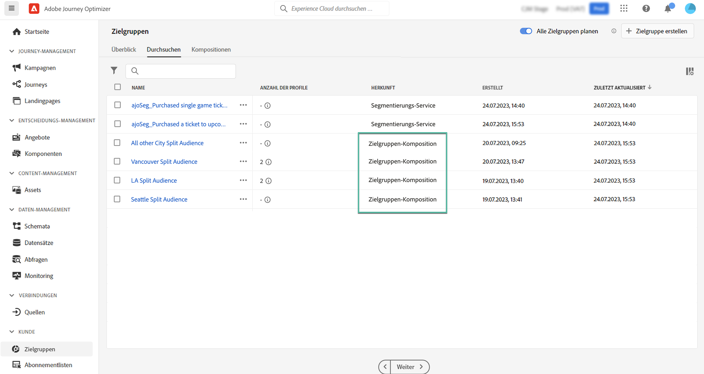

# Zugreifen auf und Verwalten von Audiences {#access-manage-audiences}

>[!BEGINSHADEBOX]

Diese Dokumentation enthält detaillierte Informationen zum Arbeiten mit der Zielgruppenzusammensetzung in Adobe Journey Optimizer. Wenn Sie Adobe Journey Optimizer nicht verwenden, [Hier klicken](https://experienceleague.adobe.com/docs/experience-platform/segmentation/ui/audience-composition.html)

>[!ENDSHADEBOX]

Auf aus der Zielgruppenzusammensetzung resultierende Zielgruppen kann über die **[!UICONTROL Durchsuchen]** im **[!UICONTROL Zielgruppen]** Menü.

Auf dieser Registerkarte werden alle in Adobe Experience Platform gespeicherten Audiences aufgelistet. Audiences, die mithilfe von Audience-Kompositionen erstellt wurden, sind an der Herkunft **[!UICONTROL Audience-Komposition]** erkennbar.

>[!NOTE]
>
>Weitere Informationen zu anderen in Adobe Experience Platform verfügbaren Typen von Audiences finden Sie in der [Dokumentation zum Segmentierungs-Service](https://experienceleague.adobe.com/docs/experience-platform/segmentation/ui/overview.html?lang=de).

Die Spalte **[!UICONTROL Profilanzahl]** gibt Auskunft über die Anzahl der in einer Audience enthaltenen Profile. Klicken Sie auf die Schaltfläche „i“, um weitere Informationen über das Datum zu erhalten, an dem diese Informationen berechnet wurden.

Um einer Audience benutzerdefinierte oder Core-Bezeichnungen für die Datennutzung zuzuweisen, klicken Sie auf die Schaltfläche mit den Auslassungszeichen und wählen Sie **[!UICONTROL Zugriff verwalten]**. [Weitere Informationen zur Zugriffssteuerung auf Objektebene (OLA)](../administration/object-based-access.md)

<!--
-edit an audience?
-->
