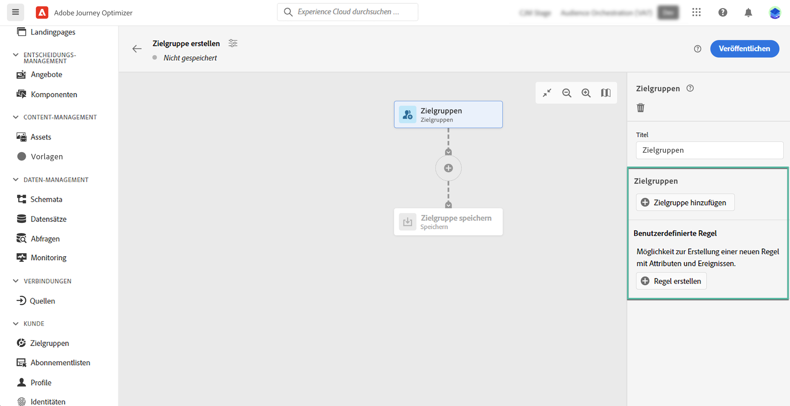
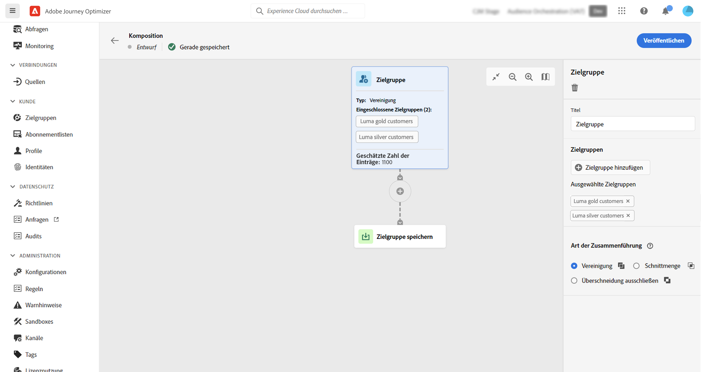
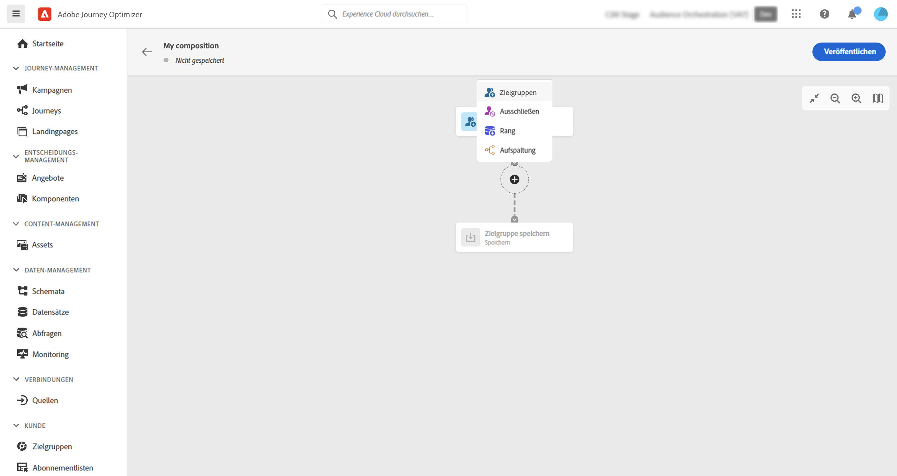
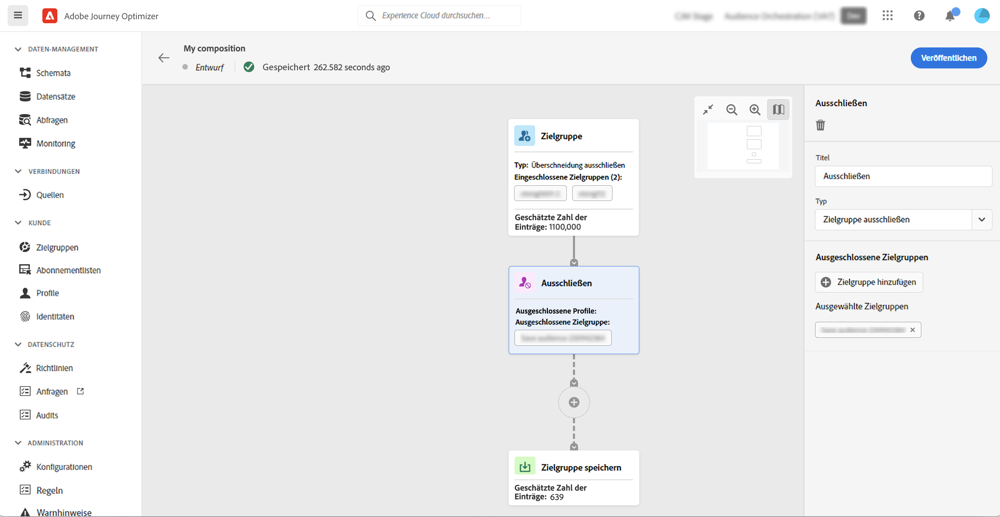
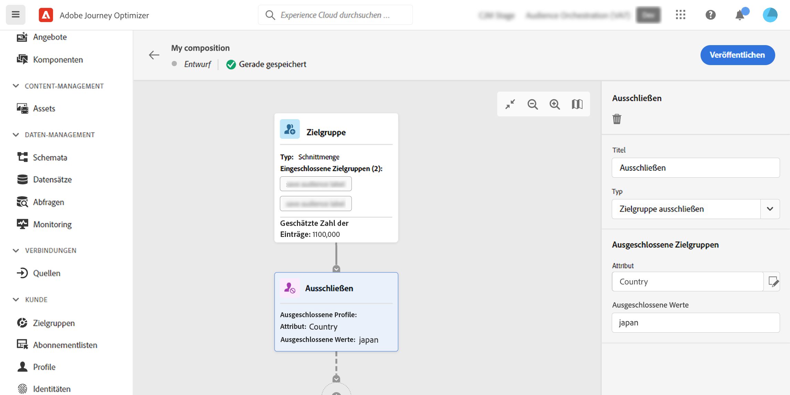
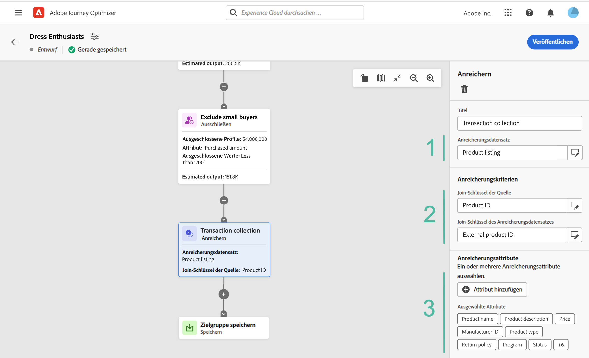
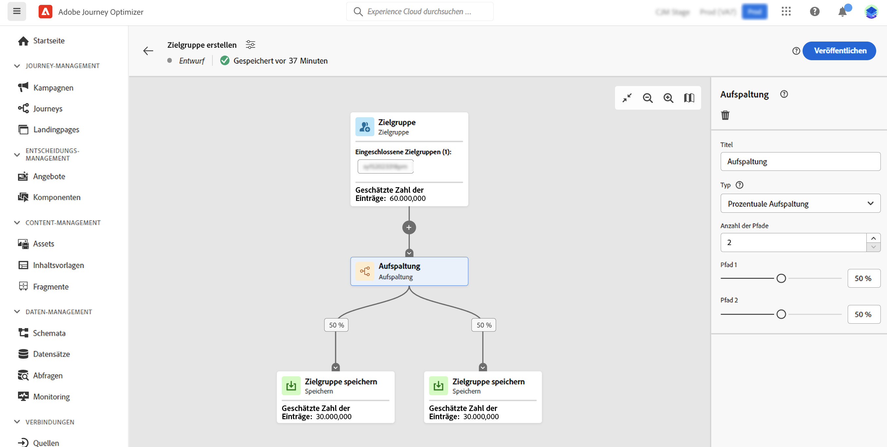
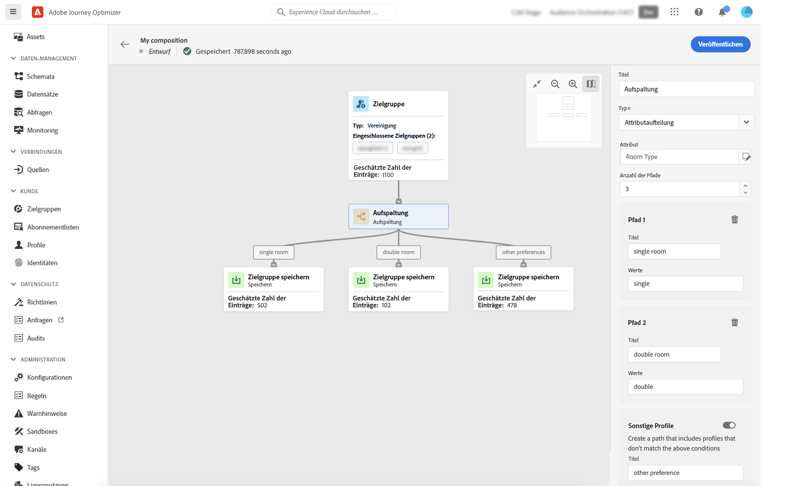
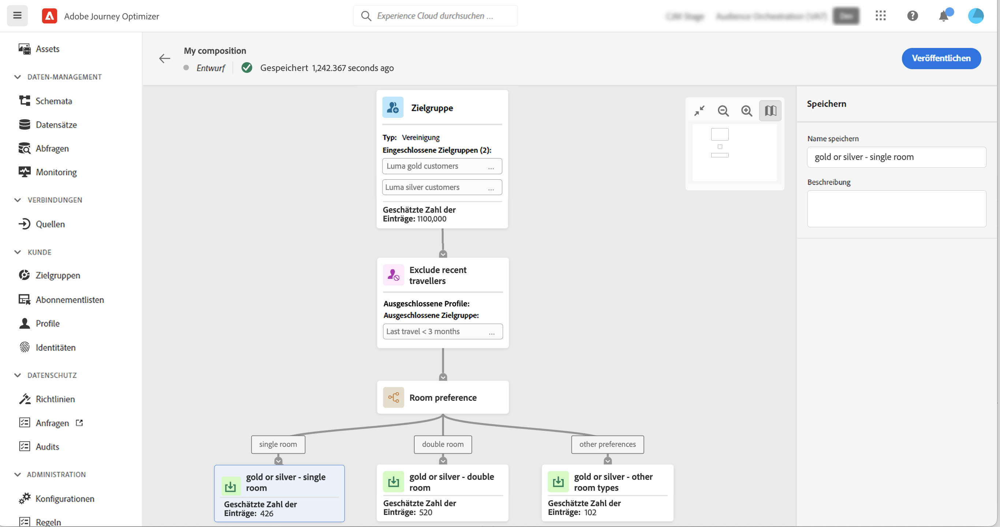

# Arbeiten mit der Arbeitsfläche für Kompositionen {#composition-canvas}

>[!BEGINSHADEBOX]

Diese Dokumentation enthält ausführliche Informationen zum Arbeiten mit der Zielgruppenkomposition in Adobe Journey Optimizer. Wenn Sie Adobe Journey Optimizer nicht verwenden, [klicken Sie hier](https://experienceleague.adobe.com/docs/experience-platform/segmentation/ui/audience-composition.html?lang=de).{target="_blank"}.

>[!ENDSHADEBOX]

Die Zielgruppen-Komposition bietet eine visuelle Arbeitsfläche, mit der Sie Zielgruppen erstellen und verschiedene Aktivitäten (Aufspaltung, Anreicherung usw.) verwenden können.

Gehen Sie wie folgt vor, um eine Zielgruppe auf der Arbeitsfläche zu erstellen:

1. [Definieren Sie Ihre Start-Zielgruppe(n)](#starting-audience)
1. [Fügen Sie eine oder mehrere Aktivitäten hinzu](#action-activities)
1. [Speichern Sie die Ergebnisse in einer neuen Zielgruppe](#save)

## Wählen Sie die Start-Zielgruppe aus {#starting-audience}

Der erste Schritt bei der Erstellung einer Komposition besteht darin, eine oder mehrere vorhandene Zielgruppen als Grundlage für Ihre Komposition auszuwählen.

1. Wählen Sie die Aktivität **[!UICONTROL Zielgruppe]** und geben Sie einen Titel für die Aktivität an.

1. Wählen Sie die anzusprechende Zielgruppe:

   * Klicken Sie auf die Schaltfläche **[!UICONTROL Zielgruppe hinzufügen]**, um eine oder mehrere bestehende Zielgruppen auszuwählen,
   * Klicken Sie auf die Schaltfläche **[!UICONTROL Regel erstellen]**, um mithilfe des [Segmentierungs-Service](https://experienceleague.adobe.com/docs/experience-platform/segmentation/ui/overview.html?lang=de) eine neue Zielgruppendefinition zu erstellen.

   

1. Wenn mehrere Zielgruppen ausgewählt sind, legen Sie fest, wie die Profile dieser Zielgruppen zusammengeführt werden sollen:

* **[!UICONTROL Vereinigung]**: Schließt alle Profile der ausgewählten Zielgruppen ein,
* **[!UICONTROL Schnittmenge]**: Schließt Profile ein, die allen ausgewählten Zielgruppen gemeinsam sind,
* **[!UICONTROL Überschneidung ausschließen]**: Schließt Profile ein, die nur zu einer der Zielgruppen gehören. Profile, die zu mehr als einer Zielgruppe gehören, werden nicht einbezogen.

In diesem Beispiel möchten wir alle Profile ansprechen, die zu den Zielgruppen Gold und Silber gehören.

Nach Auswahl der Zielgruppen wird die geschätzte Anzahl der Profile am unteren Ende der Aktivität angezeigt.

## Hinzufügen von Aktivitäten {#action-activities}

Fügen Sie Aktivitäten hinzu, nachdem Sie Ihre Start-Zielgruppe ausgewählt haben, um Ihre Auswahl zu verfeinern.

Klicken Sie dazu auf die Schaltfläche „+“ im Kompositionspfad und wählen Sie dann die gewünschte Aktivität aus. Es öffnet sich der rechte Bereich, in dem Sie die neu hinzugefügte Aktivität konfigurieren können.

Verfügbare Aktivitäten sind:

* [Zielgruppe](#audience): Schließt zusätzliche Profile ein, die zu einer oder mehreren bestehenden Zielgruppen gehören,
* [Ausschließen](#exclude): Schließt Profile aus, die zu einer bestehenden Zielgruppe gehören, oder schließt Profile auf der Grundlage bestimmter Attribute aus,
* [Anreichern](#enrich): Anreicherung Ihrer Zielgruppe mit zusätzlichen Attributen aus Adobe Experience Platform-Datensätzen,
* [Rang](#rank): Sortiert Profile nach einem bestimmten Attribut, gibt die Anzahl der Profile an, die beibehalten werden sollen, und fügt sie in Ihre Komposition ein,
* [Aufspaltung](#split): Teilt Ihre Komposition in mehrere Pfade, die auf zufälligen Prozentsätzen oder auf Attributen basieren.

Sie können so viele **[!UICONTROL Zielgruppen]** und **[!UICONTROL Ausschließen]**-Aktivitäten hinzufügen, wie Sie in Ihrer Komposition benötigen. Nach den Aktivitäten **[!UICONTROL Rang]** und **[!UICONTROL Aufspaltung]** kann jedoch keine weitere Aktivität hinzugefügt werden.

Sie können eine Aktivität jederzeit aus der Arbeitsfläche entfernen, indem Sie im rechten Bereich auf die Schaltfläche „Löschen“ klicken.  Wenn die zu löschende Aktivität eine übergeordnete Aktivität in der Komposition ist, wird eine Nachricht angezeigt, in der Sie angeben können, ob Sie nur die ausgewählte Aktivität oder alle ihre untergeordneten Aktivitäten löschen möchten.

### Zielgruppen-Aktivität {#audience}

>[!CONTEXTUALHELP]
>id="ajo_ao_audience"
>title="Zielgruppen-Aktivität"
>abstract="Mit der Zielgruppen-Aktivität können Sie zusätzliche Profile, die zu einer bestehenden Zielgruppe gehören, in Ihre Komposition einbeziehen."

>[!CONTEXTUALHELP]
>id="ajo_ao_merge_types"
>title="Fusionieren von Typen"
>abstract="Geben Sie an, wie die Profile der ausgewählten Zielgruppen zusammengeführt werden sollen."

Mit der **[!UICONTROL Zielgruppen]**-Aktivität können Sie zusätzliche Profile, die zu einer bestehenden Zielgruppe gehören, in Ihre Komposition aufnehmen.

Die Konfiguration dieser Aktivität ist identisch mit der anfänglichen [Zielgruppen-Aktivität](#starting-audience).

### Aktivität „Ausschließen“ {#exclude}

>[!CONTEXTUALHELP]
>id="ajo_ao_exclude_type"
>title="Typ des Ausschließens"
>abstract="Verwenden Sie den Typ „Zielgruppe ausschließen“, um Profile auszuschließen, die zu einer bestehenden Zielgruppe gehören. Mit dem Typ „Mit Attribut ausschließen“ können Sie Profile auf der Grundlage eines bestimmten Attributs ausschließen."

>[!CONTEXTUALHELP]
>id="ajo_ao_exclude"
>title="Aktivität „Ausschließen“"
>abstract="Mit der Aktivität „Ausschließen“ können Sie Profile aus Ihrer Komposition ausschließen, indem Sie eine vorhandene Zielgruppe auswählen oder eine Regel verwenden."

Mit der Aktivität **[!UICONTROL Ausschließen]** können Sie Profile aus Ihrer Komposition ausschließen. Es stehen zwei Arten von Ausschlüssen zur Verfügung:

* **[!UICONTROL Zielgruppe ausschließen]**: Schließt Profile aus, die zu einer bestehenden Zielgruppe gehören.

  Klicken Sie auf die Schaltfläche **[!UICONTROL Zielgruppe hinzufügen]** und wählen Sie die auszuschließende Zielgruppe aus.

  

* **[!UICONTROL Mit Attribut ausschließen]**: Schließt Profile auf der Grundlage eines bestimmten Attributs aus.

  Wählen Sie das zu suchende Attribut aus und geben Sie dann den auszuschließenden Wert an. In diesem Beispiel schließen wir Profile mit einer Wohnadresse in Japan von der Komposition aus.

  >[!NOTE]
  >
  >Es kann nur ein Ausschlusswert angegeben werden.

  

### Aktivität „Anreichern“ {#enrich}

>[!CONTEXTUALHELP]
>id="ajo_ao_enrich"
>title="Aktivität „Anreichern“"
>abstract="Mit der Aktivität „Anreichern“ können Sie Ihre Zielgruppe mit zusätzlichen Attributen aus Adobe Experience Platform-Datensätzen anreichern. Sie können beispielsweise Informationen zum gekauften Produkt wie Namen, Preis oder Hersteller-ID hinzufügen und diese Informationen nutzen, um die an die Zielgruppe gesendeten Sendungen zu personalisieren."

>[!CONTEXTUALHELP]
>id="ajo_ao_enrich_dataset"
>title="Anreicherungsdatensatz"
>abstract="Wählen Sie den Anreicherungsdatensatz mit den Daten aus, die Sie mit der Zielgruppe verknüpfen möchten."

>[!CONTEXTUALHELP]
>id="ajo_ao_enrich_criteria"
>title="Anreicherungskriterien"
>abstract="Wählen Sie die Felder aus, die als Abstimmschlüssel zwischen dem Quelldatensatz, d. h. der Zielgruppe, und dem Anreicherungsdatensatz verwendet werden sollen."

>[!CONTEXTUALHELP]
>id="ajo_ao_enrich_attributes"
>title="Anreicherungsattribute"
>abstract="Wählen Sie ein oder mehrere Attribute aus dem Anreicherungsdatensatz aus, die mit der Zielgruppe verknüpft werden sollen. Nach der Veröffentlichung der Komposition werden diese Attribute mit der Zielgruppe verknüpft und können in Journey Optimizer zur Personalisierung von Sendungen genutzt werden."

Mit der Aktivität **[!UICONTROL Anreichern]** können Sie Ihre Zielgruppe mit zusätzlichen Attributen aus Adobe Experience Platform-Datensätzen anreichern. Sie können beispielsweise Informationen zum gekauften Produkt wie Namen, Preis oder Hersteller-ID hinzufügen und diese Informationen nutzen, um die an die Zielgruppe gesendeten Sendungen zu personalisieren.

Beachten Sie die folgenden Einschränkungen bei der Aktivität **[!UICONTROL Anreichern]**:

* **Datensätze** für die Anreicherung müssen vom Eintragstyp (und nicht vom Ereignistyp) sein. Sie dürfen weder Systemdatensätze sein noch für ein Profil markiert sein. Sie müssen kleiner sein als 1 GB.
* **Die Anreicherung unterstützt 1:1-Joins**. Wenn es für die Join-Schlüssel mehr als eine Übereinstimmung im Anreicherungsdatensatz gibt, wählt das System eine Übereinstimmung aus und verwendet diese für den 1:1-Join.
* **Zielgruppen können in RTCDP-Zielen aktiviert werden**, aber für ihre Anreicherungsattribute, sofern vorhanden, ist dies nicht möglich.

Gehen Sie wie folgt vor, um die Aktivität zu konfigurieren:

1. Wählen Sie den **[!UICONTROL Anreicherungsdatensatz]** aus, der die Daten enthält, die Sie mit der Zielgruppe verknüpfen möchten.

1. Im Abschnitt **[!UICONTROL Anreicherungskriterien]** wählen Sie die Felder aus, die als Abstimmschlüssel zwischen dem Quelldatensatz, d. h. der Zielgruppe, und dem Anreicherungsdatensatz verwendet werden sollen. In diesem Beispiel verwenden wir die Kennung des gekauften Produkts als Abstimmschlüssel.

1. Klicken Sie auf **[!UICONTROL Attribute hinzufügen]** und wählen Sie dann aus dem Anreicherungsdatensatz ein oder mehrere Attribute aus, die mit der Zielgruppe verknüpft werden sollen.

   

Nach der Veröffentlichung der Komposition werden die ausgewählten Attribute mit der Zielgruppe verknüpft und können in Kampagnen zur Personalisierung von Sendungen genutzt werden.

### Rang-Aktivität {#rank}

>[!CONTEXTUALHELP]
>id="ajo_ao_ranking"
>title="Rang-Aktivität"
>abstract="Mithilfe der Rang-Aktivität können Sie Profile nach einem bestimmten Attribut ordnen und in Ihre Komposition einfügen. Schließen Sie beispielsweise die 50 Profile mit der größten Anzahl an Treuepunkten ein."

>[!CONTEXTUALHELP]
>id="ajo_ao_rank_profilelimit_text"
>title="Profil-Limit hinzufügen"
>abstract="Schalten Sie diese Option ein, um eine maximale Anzahl von Profilen anzugeben, die in die Komposition aufgenommen werden sollen."

Die **[!UICONTROL Rank]**-Aktivität ermöglicht es Ihnen, Profile nach einem bestimmten Attribut zu ordnen und in Ihre Komposition einzuschließen. Sie können beispielsweise die 50 Profile mit der größten Anzahl an Treuepunkten einbeziehen.

1. Wählen Sie das Attribut aus, das Sie nachschlagen möchten, und geben Sie eine Rangfolge an (auf- oder absteigend).

   >[!NOTE]
   >
   >Sie können Attribute mit den folgenden Datentypen auswählen: Ganzzahl, Zahlen, kurze Ganzzahl <!--(other?)-->

1. Schalten Sie die Option **[!UICONTROL Profil-Limit hinzufügen]** ein und geben Sie eine maximale Anzahl von Profilen an, die in die Komposition aufgenommen werden sollen.

   

### Split-Aktivität {#split}

<!-- [!CONTEXTUALHELP]
>id="ajo_ao_control_group_text"
>title="Control Group"
>abstract="Use control groups to isolate a portion of the profiles. This allows you to measure the impact of a marketing activity and make a comparison with the behavior of the rest of the population."-->

>[!CONTEXTUALHELP]
>id="ajo_ao_split"
>title="Split-Aktivität"
>abstract="Die Split-Aktivität ermöglicht es Ihnen, Ihre Komposition in mehrere Pfade zu unterteilen. Beim Veröffentlichen der Komposition wird für jeden Pfad eine Zielgruppe in Adobe Experience Platform gespeichert."

>[!CONTEXTUALHELP]
>id="ajo_ao_split_type"
>title="Split-Typ"
>abstract="Verwenden Sie den Split-Typ „Prozent“, um Profile nach dem Zufallsprinzip in mehrere Pfade aufzuteilen. Mit dem Split-Typ „Attribut“ können Sie Profile anhand eines bestimmten Attributs aufteilen."

>[!CONTEXTUALHELP]
>id="ajo_ao_split_otherprofiles_text"
>title="Andere Profile"
>abstract="Schalten Sie diese Option ein, um einen zusätzlichen Pfad mit den verbleibenden Profilen zu erstellen, die keiner der in den anderen Pfaden angegebenen Bedingungen entsprechen."

Die **[!UICONTROL Split]**-Aktivität ermöglicht es Ihnen, Ihre Komposition in mehrere Pfade zu unterteilen.

Durch diese Operation wird automatisch eine **[!UICONTROL Speichern]**-Aktivität am Ende jedes Pfades hinzugefügt. Beim Veröffentlichen der Komposition wird für jeden Pfad eine Zielgruppe in Adobe Experience Platform gespeichert.

Es stehen zwei Arten von Split-Operationen zur Verfügung:

* **[!UICONTROL Prozent-Split]**: Profile nach dem Zufallsprinzip in zwei oder mehr Pfade aufteilen. Sie können die Profile beispielsweise in zwei verschiedene Pfade von jeweils 50 % aufteilen. <!--and add an additional path for control group.-->

  

* **[!UICONTROL Attribut-Split]**: Profile anhand eines bestimmten Attributs aufteilen. In diesem Beispiel teilen wir Profile anhand ihrer bevorzugten Zimmertypen auf.

  

  Gehen Sie wie folgt vor, um eine attributbasierte Aufteilungsaktivität einzurichten:

   1. Klicken Sie auf die Schaltfläche neben dem Feld **[!UICONTROL Attribut]**, um das Attribut auszuwählen, das Sie als Aufteilungskriterium verwenden möchten.
   1. Fügen Sie so viele Pfade wie nötig hinzu.  Geben Sie für jeden Pfad einen Titel an und geben Sie den Wert an, der verwendet wird, um zu bestimmen, welche Profile in diesen Pfad aufgenommen werden sollen.

      >[!NOTE]
      >
      >Für jeden Pfad kann nur ein Wert angegeben werden.

   1. Schalten Sie die Option **[!UICONTROL Andere Profile]** ein, um einen zusätzlichen Pfad mit den verbleibenden Profilen zu erstellen, die keiner der in den anderen Pfaden angegebenen Bedingungen entsprechen.

## Speichern Ihrer Zielgruppen {#save}

Konfigurieren Sie die resultierenden Zielgruppen, die in Adobe Experience Platform gespeichert werden.

Wählen Sie dazu die Aktivität **[!UICONTROL Zielgruppen speichern]** am Ende jedes Pfads und geben Sie dann den Namen der neuen Zielgruppe an, die erstellt werden soll.

Sobald Ihre Komposition fertig ist, können Sie diese veröffentlichen. [Informationen zur Erstellung von Kompositionen](create-compositions.md)
